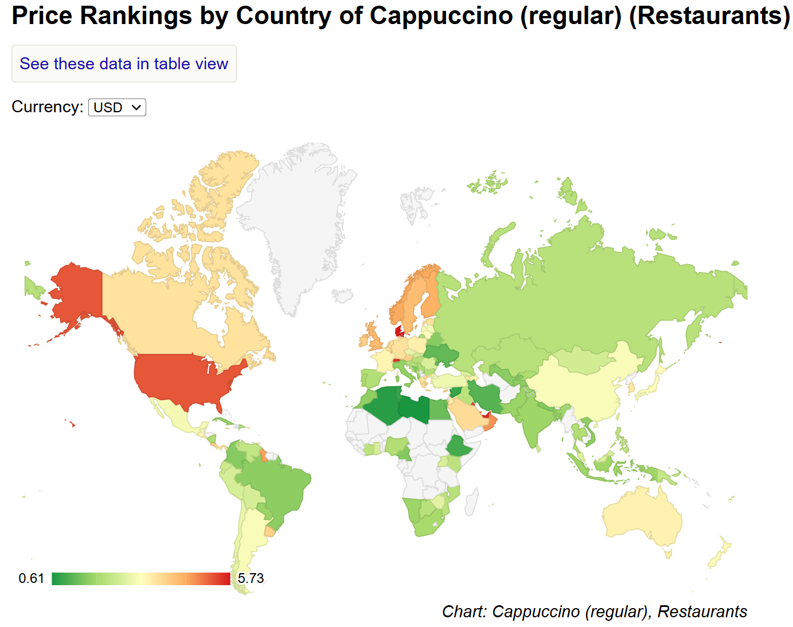

<style>
@media print{
  body, html, .remark-slides-area, .remark-notes-area {
    height: 100% !important;
    width: 100% !important;
    overflow: visible;
    display: inline-block;
    }
</style>

<style type="text/css">
.remark-slide-content {
    font-size: 34px;
    padding: 1em 4em 1em 4em;
}
</style>

<style type="text/css">
.my-one-page-font {
  font-size: 28px;
}
</style>

</style>

<style type="text/css">
.my-one-page-font-table {
  font-size: 24px;
}
</style>


```{r setup, include = FALSE}
library(tidyverse)
library(knitr)

opts_chunk$set(fig.width = 10, 
               message = FALSE, 
               warning = FALSE,
               echo = FALSE)
```

```{r xaringan-themer, include=FALSE, warning=FALSE}
#install.packages("xaringanthemer")
library(xaringanthemer)
style_mono_accent(
  base_color = "#135978", # #1c5253 #135978
  header_font_google = google_font("Josefin Sans"),
  text_font_google   = google_font("Montserrat", "500", "550i"),
  code_font_google   = google_font("Fira Mono"),
  colors = c(
  red = "#f34213",
  purple = "#3e2f5b",
  orange = "#ff8811",
  green = "#136f63",
  white = "#FFFFFF"
)
)
```

# Quick Icebreaker

## Why does a cup of coffee cost $0.60 in one country and $5 in another?


<div>
.center[]

<div style="font-size: 12px; text-align: center; margin-top: 20px;">
Source: [**NUMBEO**](https://www.numbeo.com/cost-of-living/country_price_rankings?itemId=114)
</div>


---

# Possible reasons

- **Cost of production**: labor, rent, utilities, etc.

- **Demand**: local preferences, income levels, etc.

- **Competition**: number of suppliers, market structure, etc.

- **Regulations**: import/export restrictions, quality standards, etc.

- **Cultural factors**: coffee traditions, social norms, etc.

- **Purchasing power**: A $1 in Korea buys much more than in Sweden due to differences in living costs and wages.

- **Exchange rates**: currency value, inflation, etc.

???
Central Bank Influence

Interest rates, inflation control, and monetary policy shape price levels and currency values. 
Central banks play a key role in managing these factors to ensure price stability and economic growth.

---

# Agenda

1. Introduction

2. Course Overview

3. Why Central Banking?

---


class: inverse, center, middle

# 1. Introduction

---

## Course Information

- **Course Title**: Central Banking

- **Course Credit**: 3

- **Designed for**: MA students

- **Course Prerequisites**: .red[None]

- **Semester**: Spring 2025 

- **Meeting Venue and Time**: J520 | Wed. | 15:00-17:45 | two 10-min breaks

- **Office Hours**: J721, W10-12, Thu10-12, F15-17 or by appointment


---

## Introductions


- Let's start with a little introduction:

  - What's your preferred name?

  - Where are you from?

  - Any fun fact to share (e.g. hobbies or interests, favorite quote, e.t.c.)?

  - A brief *expectation survey*: [.red[link]](https://forms.gle/sv3t4vprphEuFGas5)

---

# Our TA

*Name*: Tran Thuy Van Khang (Ms Ivy)

*Email*: tranthuyvankhang2812000@gmail.com

*Office hours*: none

---

## About me

.pull-left[
Hello! My name is **.green[Iegor]**.

- Assistant Professor [(link)](https://elic.sogang.ac.kr/lic.en/lic_en_01_04_05.html), Sogang University

- Ph.D. (Public Policy), KDIS (ROK, 2022)

- M.A. (Public Policy), KDIS (ROK, 2014)

- M.A. (International Economics), KNEU (Ukraine, 2009)

- B.A. (International Economics and Management), KNEU (Ukraine, 2008)

- Background: International banking & central banking

- Roles: Financial Analyst, Team-lead, Project manager 

]


.pull-right[
Some Info:

- email: ievysh@sogang.ac.kr

- office: J721

- [Google Scholar](https://scholar.google.com/citations?hl=en&user=4Kcp5WoAAAAJ)

- [Linkedin](https://www.linkedin.com/in/iegor-vyshnevskyi-b9743b51/)

- [ResearchGate](https://www.researchgate.net/profile/Iegor-Vyshnevskyi)

- [GitHub](https://github.com/Iegor-Vyshnevskyi)

- [My page](https://iegor-vyshnevskyi.github.io/)

- *Research interests*: central banking, computational data science

- *Hobbies*: research, martial arts, cycling, etc.
]

---

# Disclaimer

- This is my first course with Sogang, so I will likely be making changes as we go

- Please check the course website regularly for updates

---

class: inverse, center, middle

# 2. Course Overview

---

# Course Description:

- *Examines* central bank objectives, policy tools, and impact on financial stability and economic growth.

- *Covers* monetary policy, macroprudential regulation, and crisis management.

- *Focuses* on climate-related financial risks, green finance, and sustainability.

- *Explores* AI, machine learning, and CBDCs in central banking.

- *Analyzes* real-world policies from major central banks (Fed, ECB, BoJ).

---

# Course Objectives:

- *Understand central banking* – Explain its role in price stability, financial stability, and economic growth.

- *Analyze policy tools* – Evaluate monetary and macroprudential policies, including crisis management.

- *Assess climate risks* – Examine central banks’ role in green finance and sustainability.

- *Explore digital transformation* – Understand AI, machine learning, and CBDCs in central banking.

- *Evaluate financial markets* – Analyze central bank decisions’ impact on interest rates and asset prices.

- *Engage in policy analysis* – Assess real-world central banking strategies and forecast policy shifts.

---

# Course Learning Outcomes:

By the end of this course, students will be able to:  

- *Understand central banking* – Define its objectives, functions, and policy tools.

- *Analyze monetary policy* – Assess interest rates, inflation targeting, and crisis management.

- *Evaluate financial stability* – Examine macroprudential regulation and systemic risk.

- *Assess climate risks* – Analyze central banks' role in green finance.

- *Understand digital innovation* – Explore AI, machine learning, and CBDCs in policy.

- *Interpret market reactions* – Assess the impact of central bank decisions on financial markets.


---

# The course in a nutshell

This course provides a *comprehensive understanding of central banking*, focusing on monetary policy, financial stability, and economic growth. It explores the evolving role of central banks in climate risk management, digital finance, and AI-driven policy decisions.

Students will:
  - Analyze monetary and macroprudential policies, financial market interactions, and crisis management.
  - Examine the impact of climate risks, AI, and central bank digital currencies (CBDCs).
  - Engage in discussions, case studies, debates, and simulations to apply real-world policy analysis.

By the end, students will develop critical skills to assess and forecast central bank strategies in an evolving financial landscape.

- *Supportive Environment* – A safe space to ask questions, discuss, and learn from mistakes. 

- *Beyond the Classroom* – Adjust to school life, understand Korean culture, and connect with classmates, seniors, and professors.  
---

# Broad coverage

.pull-left[
- **Formal/core curriculum**:
   + Concepts
   
   + Understanding
   
   + Real-life cases
   
   + Problem-solving
   
   + Application
]

.pull-right[
- **Hidden curriculum**:
   + Values

   + Standards

   + Communication
   
   + Cooperation
   
   + Discussions
   
]

---

# Teaching method

This course follows a **flipped classroom approach**, where students are expected to complete assigned readings before class. Each session is usually structured as follows:  
- *Hour 1*: Brief Lecture – A concise overview of key concepts from the readings.  
- *Hour 2*: Practical Application – Hands-on exercises, case studies, and data analysis.  
- *Hour 3*: Interactive Activities – Debates, discussions, simulations, and policy analysis.  

This format fosters active learning, critical thinking, and engagement with current issues in the field.

On national or university’s holidays (March 28 and June 6), recorded lecture/materials/assignments will be provided on the course website. Students should complete that by the end of the week.


---

# Course materials:

- **Lecture slides**

- I give *additional reading assignments* if/when necessary.

## Good reference

- Mishkin, **The Economics of Money, Banking and Financial Markets**, 12th Edition, Pearson, 2019. 


---

# GRADING

- *Class Participation*: 20%

- *Presentation*: 20%

- *Midterm Examination (Week 8)*: 25%

- *Final Examination (Week 16)*: 35%

- **Total**: 100%

More details on each item you will get down the road.

*Remember*, I'm not giving you grades; you're earning them.

---

# Course Policies

- **Academic Integrity**: The University’s Honor Code and Academic integrity will be strictly reflected. Plagiarism results in zero credit and an F-grade for the course.  

- **Class Policy**: No photos or videos allowed; lecture slides are provided before class.  

- **Communication**: Use LMS for discussions and Q&A. Engage early to benefit from collective knowledge. Private questions are allowed. Details will be provided in the first class.


---

class: my-one-page-font-table

# Course Roadmap

| **Week**        | **Topic**                                                                                                                             |
|----------------|----------------------------------------------------------------------------------------------------------------------------------------|
| **Week&nbsp;1**  | Course Introduction: Introduction to Central Banking                                                                 |
| **Week&nbsp;2**  | History of Central Banking.                                                                        |
| **Week&nbsp;3**  | Monetary Policy Frameworks and Unconventional Monetary Policy. |
| **Week&nbsp;4**  | Central Banking and Financial Stability.                                    |
| **Week&nbsp;5**  | Economic Growth and Central Banks.                                               |
| **Week&nbsp;6**  | Exchange Rate Regimes and Currency Stability.                                                |
| **Week&nbsp;7**  | Central Bank Communication and Transparency / Data Analysis.                                                                                              |
| **Week&nbsp;8**  | **Mid-term**                                                                                                                           |
| **Week&nbsp;9**  | Financial Markets and Central Bank Policy.                                                       |
| **Week&nbsp;10** | Climate Change and Central Banking.                                                                      |
| **Week&nbsp;11** | Central Bank Digital Currencies (CBDCs).                  |
| **Week&nbsp;12** | ML/AI and Big Data in Central Banking.                                                                         |
| **Week&nbsp;13** | Global Coordination and Central Banking.                                              |
| **Week&nbsp;14** | Future Challenges for Central Banks.                                       |
| **Week&nbsp;15** | Current Issues on Central Banking. *Student presentations*                                                              |
| **Week&nbsp;16** | **Final Exam**                                                                                                                         |

Tentative schedule. It may be adjusted based on class background and progress.  

**Guest speakers** may be invited to share insights on specific topics.

---


# General things

- **Our Goals**:
   - to learn the basics of CB
   - to apply the knowledge in real-life scenarios
   - see that *central banking* is .green[fun] :-)

- **Our Principle**: 
   - learning by doing
   - mutual respect
   - put one's efforts

- **My role**: to guide you through the course, i.e. **mentoring and facilitating ** 

- Your suggestions are welcomed (through KSS survey, etc.): [**.orange[KSS]**](https://forms.gle/7XJ2ZTdFvhtPuaVe7)
 

---

# Our communication

- Check the website regularly for materials and messages

- Feel free to approach me before or after our class

- **Office hours**: J721, W10-12, Thu10-12, F3-5  or by appointment. You are welcome to discuss course-related issues and questions, career plans, etc.

- Check / use **LMS** (incl. messages in-there)

- **Emailing policy**: email me to set up a one-to-one meeting or in the case of some urgent issues.
   - Please indicate the course name in the subject line and the issue (e.g., *[Central Banking]* Meeting request)
   
   - Please write at least two times when you would like to meet and a brief description (1-2 sentence) why you want to meet up with me
   
   - Sorry, I may not reply on time (so email me in advance)


---

# Course Overview

## Questions?

- Any questions about the course?

- Any questions about the syllabus?

---

# Study Suggestions 

1. Reading materials before class 

2. Participate (20% of your grade) and ask questions.

3. Be active in class (don't miss and do in-class activities)

4. "The best way to learn ... is to stay on top of it as you go along. The worst way is to cram the night before exams." (c)

---

# Common Challenges Students Face

1. Lack of Interest .footnote[Based on Gaston Sanchez' [.orange[lectures]](https://github.com/gastonstat/relic-math13/blob/master/lectures/01-course-introduction.md)]

2. Language Barrier

3. Personal Challenges

4. Math / Economics Anxiety / PTSD

---

# 1. Lack of Interest

- Great indifference 

- Missing lectures

- Coming/leaving late/early

- No in-class activities

- Doing something else in class

- Cheating / free riding


**.red[DROP IT]**

---

# 2. Language Barrier

- Trouble with listening/reading comprehension 

- Poor vocabulary

- Hard time with new terminology


**.blue[It's okay, just push harder]**

No worries; it's not a language class.

Please use some online speech/voice translation tools to help you like [Online Voice Translator](https://screenapp.io/features/audio-translator) or any others.

---

# 3. Personal Challenges

- Health 

- Family

- Job

- Universe against you


**.red[Come talk to me ASAP]**

---

# 4. Math / Economics Anxiety / PTSD

- Traumatic math / econ experiences

- Can't operate numbers

- Don't see econ linkages


**.orange[Just patience & work harder, give it a try]**

---

class: inverse, center, middle

# 3. Why Central Banking?

---

# Introduction

- The origins of central banks vary, leading to different roles and functions.

  - Some started as government banks issuing banknotes.

  - Others were large commercial banks later granted monopoly rights.

  - Most modern central banks were created in the 20th century for policy functions.

---

# Defining Central Banks

- A central bank conducts **monetary policy** and provides the **means of settlement**.

- The exact functions differ across countries.

- Modern central banks are increasingly defined by **objectives rather than functions**.

---

# Objectives vs. Functions

- Central banks have historically been understood in terms of **functions** rather than **objectives**.

- Some core functions lack clear objectives.
  - Example: **Financial stability** objectives are often less well-defined than monetary policy objectives.

- Over time, more central banks have shifted towards **explicitly stated objectives**.
  - Example: **Inflation targeting** is a common objective.

---

# Specifying Objectives

- A trend towards defining **monetary policy objectives** has emerged.

- Price stability is now the **primary monetary objective** in most countries.
  - Few central banks operate without an explicit price stability goal.

**Assignment:**  
- Identify a central bank that does **not** explicitly mention price stability in its objectives.

---

# Monetary Policy Objectives - Price Stability

- Price stability is the **dominant monetary policy objective** in legislation.

  - It is often a **singular objective** or prioritized over other macroeconomic goals.

- **Inflation targeting** is the most common approach to price stability.

---

# Potential Conflicts in Policy Objectives

- **Conflicts arise when multiple policy goals exist.**
  - Example: Price stability vs. employment goals.

- The **Phillips Curve** debate:
  - Short-term trade-offs exist between inflation and unemployment.
  - Over the long term, inflation targeting dominates.


*Phillips Curve*: It shows a trade-off between inflation and unemployment. 

---

# Central Bank Independence

- Monetary policy autonomy is greater when central banks focus on a **single** macroeconomic objective.

- Countries with independent central banks (e.g., UK, Canada) typically follow **inflation targeting**.

---

# Financial Stability Objectives

- Most central banks assume responsibility for **financial stability**, but many lack **explicit legal mandates**.

- **BIS findings:**  
  - Less than half of central bank laws mention **financial stability** as a core objective.

---

# Financial Stability: Challenges

- Financial stability is **not an absolute objective**.
  - The degree of acceptable risk and flexibility varies.

- No universally accepted **financial stability metric**.
  - Makes accountability and policy effectiveness harder to measure.

---

# The Functions of a Modern Central Bank

1. **Monetary stability** – Setting interest rates, controlling inflation.  

2. **Financial stability** – Supervising banks, managing systemic risks.  

3. **Foreign exchange policy** – Currency interventions, FX reserves.  

4. **Infrastructure provision** – Issuing currency, maintaining payment systems.  

5. **Other roles** – Asset management, economic research.

---

# Case Study: Bank of Korea

**Bank of Korea Act** (Article 1)  
1. The central bank pursues **price stability** to support economic development.  

2. It also considers **financial stability** in policy decisions.

---

# Case Study: Federal Reserve (U.S.)

**Federal Reserve Act (Section 2A):**  
- The Fed aims to maintain **long-run monetary growth** aligned with economic output.  

- Its primary goals:  
  - **Maximum employment**  
  - **Stable prices**  
  - **Moderate long-term interest rates**

---

# The Fed’s Monetary Policy Strategy

- The Fed commits to **inflation targeting** at 2%.  

- Seeks to achieve **inflation averaging 2% over time**.  

- After periods of low inflation, it may **allow inflation to rise slightly above 2%** (Averaged Targeting).

---

# Market Reactions and Policy Misinterpretation

- December 2023:  
  - Fed Chair **Jay Powell** emphasized high rates until inflation is controlled.  
  - Markets still expect **rate cuts** due to falling inflation.

- **Key takeaway:**  
  - Market expectations don’t always align with central bank intentions.

---

# Summary  

- **Price stability** is the core objective of most central banks.

- **Financial stability** remains an evolving objective.

- Central bank policies adapt to **economic changes and market expectations**.

- Emerging topics: **Climate risk, digital currencies, AI in monetary policy**.

---

class: inverse, center, middle

# Any QUESTIONS?

## Thank You!  

---

# Next Class

- (Mar 12) History of Central Banking


???

# Taylor Rule for Monetary Policy

\[
i_t = \pi_t + r^*_t + a_{\pi} (\pi_t - \pi^*_t) + a_y (y_t - \bar{y}_t)
\]

- Links interest rates to inflation and output gaps.


1. To print pdf slides
https://stackoverflow.com/questions/54968311/xaringan-export-slides-to-pdf-while-preserving-formatting

pagedown::chrome_print("W1_ME.html") # but not all pictures are visible

2. Option: https://stackoverflow.com/questions/54968311/xaringan-export-slides-to-pdf-while-preserving-formatting

install.packages("remotes")
remotes::install_github("jhelvy/xaringanBuilder")
remotes::install_github("jhelvy/renderthis@v0.0.9")

library(xaringanBuilder)
build_pdf("DVC.html")

3. Option
writeBin(as.raw(c()), "favicon.ico") # create an empty favicon.ico file
install.packages("renderthis")
remotes::install_github('rstudio/chromote')
library(renderthis)

renderthis::to_pdf("W1_CB.html")

getwd()
setwd("C:/Users/Iegor/OneDrive - kdis.ac.kr/Documents/GitHub/Sogang/2025/Spring/Central Banking/Week 1")
