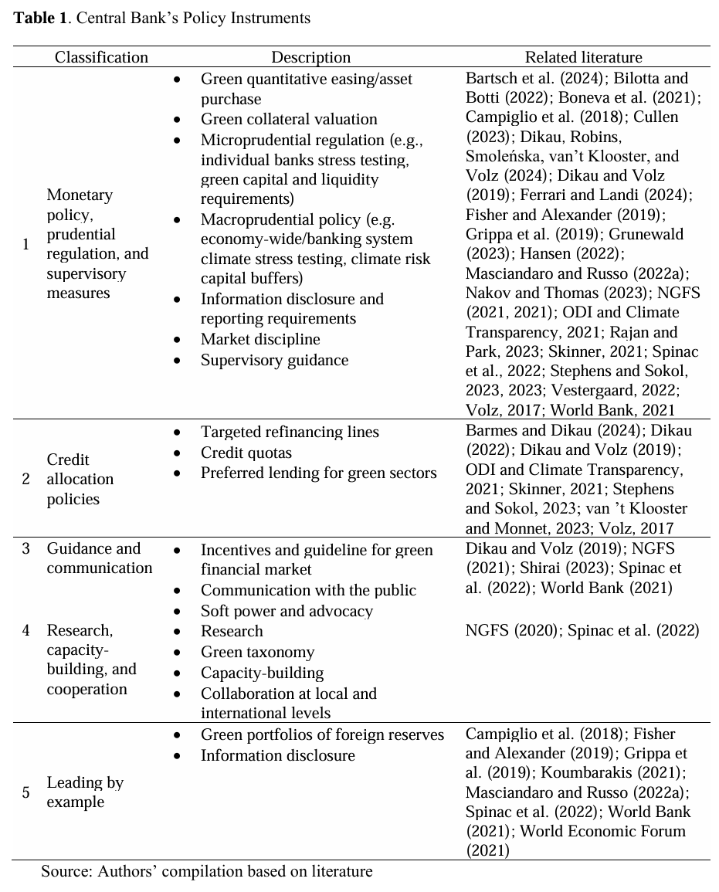

<style>
@media print{
  body, html, .remark-slides-area, .remark-notes-area {
    height: 100% !important;
    width: 100% !important;
    overflow: visible;
    display: inline-block;
    }
</style>

<style type="text/css">
.remark-slide-content {
    font-size: 38px;
    padding: 1em 4em 1em 4em;
}
</style>

<style type="text/css">
.my-one-page-font {
  font-size: 32px;
}
</style>

</style>

<style type="text/css">
.my-one-page-font-table {
  font-size: 28px;
}
</style>


```{r setup, include = FALSE}
library(tidyverse)
library(knitr)

opts_chunk$set(fig.width = 10, 
               message = FALSE, 
               warning = FALSE,
               echo = FALSE)
```

```{r xaringan-themer, include=FALSE, warning=FALSE}
#install.packages("xaringanthemer")
library(xaringanthemer)
style_mono_accent(
  base_color = "#135978", # #1c5253 #135978
  header_font_google = google_font("Josefin Sans"),
  text_font_google   = google_font("Montserrat", "500", "550i"),
  code_font_google   = google_font("Fira Mono"),
  colors = c(
  red = "#f34213",
  purple = "#3e2f5b",
  orange = "#ff8811",
  green = "#136f63",
  white = "#FFFFFF"
)
)
```


# Introduction

- Climate change increasingly affects macroeconomic stability and financial markets.

- Central banks are integrating climate-related risks into their mandates and policy frameworks.

- Key questions today:
  - Should central banks intervene?
  - How do climate risks affect monetary and financial stability?
  - What tools can central banks use?

---

class: inverse, center, middle

# 1. Climate Change and Central Banking

---

# Climate Change: It's Getting Warmer

<div>
.center[]
</div>

<span style="font-size: 60%;">(Source: Met Office Climate Dashboard)</span>

- Global temperature anomalies are rising.
- Climate change is no longer a distant risk — it's a present reality.

---

# The Cost of Climate Disasters

<div>
.center[]
</div>

<span style="font-size: 60%;">(Source: Our World in Data based on EM-DAT)</span>

- Disasters impose significant and rising economic costs relative to GDP.
- Wildfires, floods, and storms cause both direct and indirect damage.

---

# Financial System's Contribution

<div>
.center[]
</div>

<span style="font-size: 60%;">(Source: Banking on Climate Chaos Report 2023)</span>

- Banks continue to finance fossil fuels.
- $5.5 trillion invested since the Paris Agreement.

---

# Why Should Central Banks Care?

- Price stability: Climate shocks disrupt supply chains → inflation.

- Financial stability: Asset devaluation, stranded assets.

- Sustainable economic growth: Transition risks affect employment and investment.

> Climate change directly impacts **core mandates**.

---

# Channels of Climate Risk Transmission

<div>
.center[]
</div>

<span style="font-size: 60%;">(Source: BIS Green Swan Report, 2020)</span>

- Physical risks: Damages from weather events.
- Transition risks: Regulatory and technological shifts.
- Liability risks: Legal actions against firms.

---

# Climate and Financial Stability

- Physical risk events → Bank losses → Credit crunch.

- Transition risk mispricing → Asset bubbles or sudden collapses.

- Systemic risks amplify macroeconomic shocks.

---

# Mandates Across Countries

- 70/135 central banks have some sustainability-related mandate.

- Only 16 (12%) have explicit green mandates.

- Developing countries: Broader mandates including development goals.

<span style="font-size: 60%;">(Source: Dikau & Volz, 2021)</span>

---

# CB Instruments for Climate Action

**Monetary Policy**
- Green collateral frameworks.
- Preferential interest rates.

**Supervision**
- Climate stress testing.
- Disclosure requirements.

**Market Development**
- Promote green bonds.

**Communication**
- Raising awareness and signaling priorities.

---

# CB Instruments for Climate Action (Cont'd)

<div>
.center[]
</div>

---

# Skepticism and Challenges

- Weak, indirect impact tools.

- Risk of politicizing central banking.

- Difficulty in measuring climate exposures.

- Long time horizons vs. short policy cycles.

---

class: my-one-page-font

# Case Studies

### ECB Case Study

- 2021: ECB included climate considerations in monetary policy strategy.
- 2022: Integrated climate risk in corporate bond purchases.
- Strengthened supervisory expectations for banks.

### BoE Case Study

- Early mover among advanced economies.
- 2015: First climate-related supervisory guidance.
- 2021: Incorporated net-zero support in monetary policy remit.
- Green corporate bond purchase programs.

### Fed Case Study

- More cautious approach.
- 2020: Recognized climate as financial stability risk.
- 2021: Created Supervision Climate Committee (SCC).
- Legal constraints limit direct action.

---

# Case Studies (Cont'd)

<div>
.center[]
</div>

---

# Developed vs. Developing Economies

- Developed: Careful integration, narrow mandates.

- Developing: Broader tools, but limited technical capacity.

- Examples: Bangladesh Bank (green lending); Brazil (environmental risk-weighted regulation).

---

# G20 Green Central Banking Scorecard

<div>
.center[]
</div>

- Most economies score poorly.
- France is the top performer.
- Large gaps between rhetoric and action.

---

# To-Do List for Central Banks

- Enhance climate risk assessment.

- Integrate climate considerations into collateral and reserves policies.

- Promote green finance markets.

- Strengthen supervisory practices.

- Collaborate globally.

---

# Summary

- Climate change is macro-critical.

- Central banks are moving, but cautiously and unevenly.

- Coordination with fiscal authorities is crucial.

- Communication and transparency will determine credibility.

---

# Discussion Points

1. Should price stability remain the absolute priority even under climate threats?

2. How can central banks maintain independence while tackling green finance issues?

3. What is the "optimal" pace for integrating climate risks into monetary policy?

---

class: inverse, center, middle

# 2. In-class Group Activity

---

class: inverse, center, middle

# Any QUESTIONS?

**Let’s build a central bank that serves growth, stability & people.**

## Thank You!  


---

# Next Class

-(May 14) ML/AI and Big Data in Central Banking 
      - Guest Speaker: Dr. Cory Baird
      - The readings will be posted on the Cyber Campus website.

???

1. To print pdf slides
https://stackoverflow.com/questions/54968311/xaringan-export-slides-to-pdf-while-preserving-formatting

pagedown::chrome_print("W1_ME.html") # but not all pictures are visible

2. Option: https://stackoverflow.com/questions/54968311/xaringan-export-slides-to-pdf-while-preserving-formatting

install.packages("remotes")
remotes::install_github("jhelvy/xaringanBuilder")
remotes::install_github("jhelvy/renderthis@v0.0.9")

library(xaringanBuilder)
build_pdf("DVC.html")

3. Option
writeBin(as.raw(c()), "favicon.ico") # create an empty favicon.ico file
install.packages("renderthis")
remotes::install_github('rstudio/chromote')
library(renderthis)

renderthis::to_pdf("W10_CB.html")

getwd()
setwd("C:/Users/Iegor/OneDrive - kdis.ac.kr/Documents/GitHub/Sogang/2025/Spring/Central Banking/Week 10")
