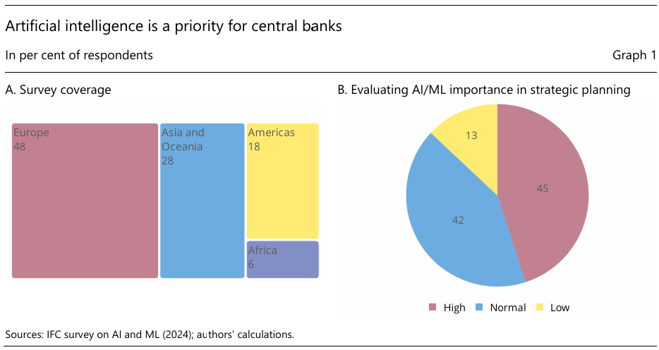
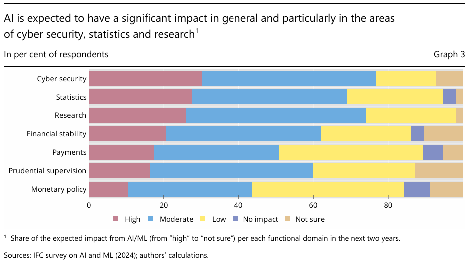
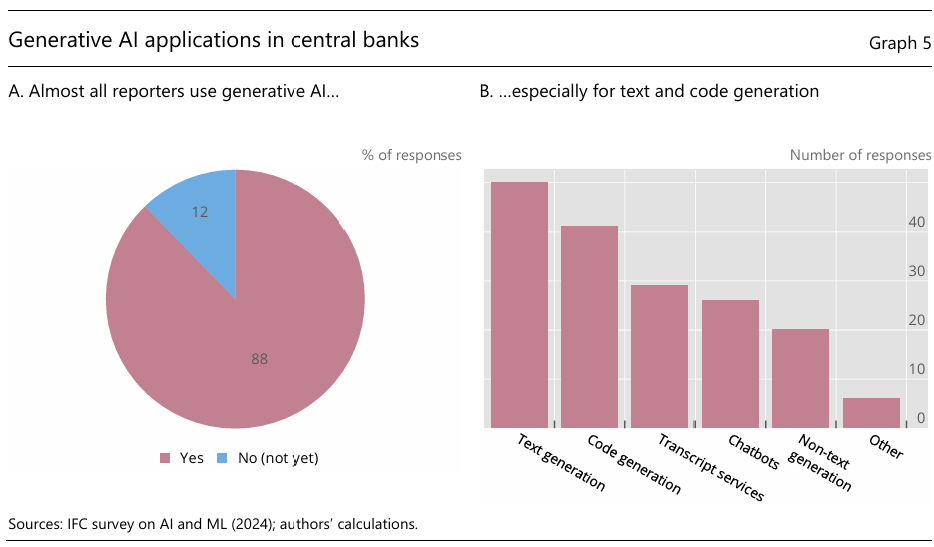
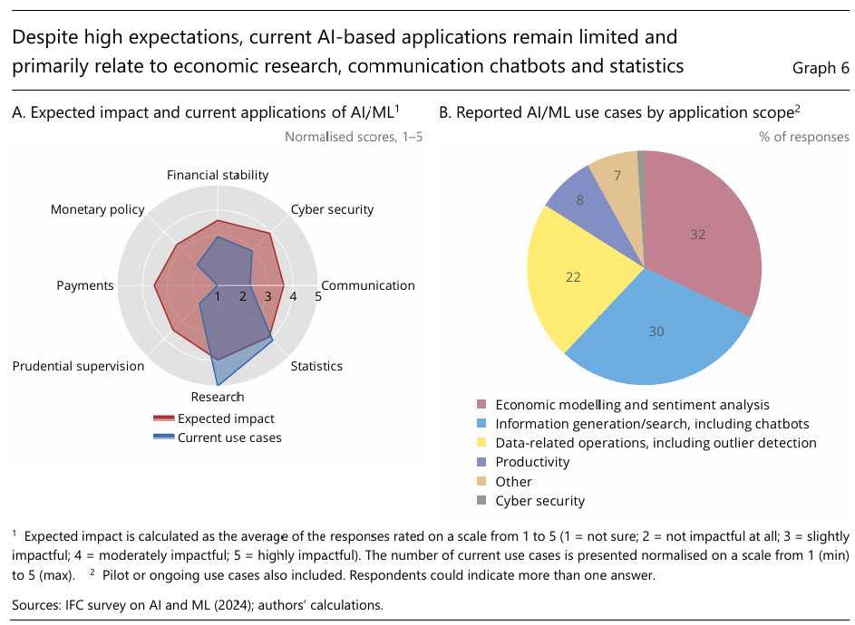
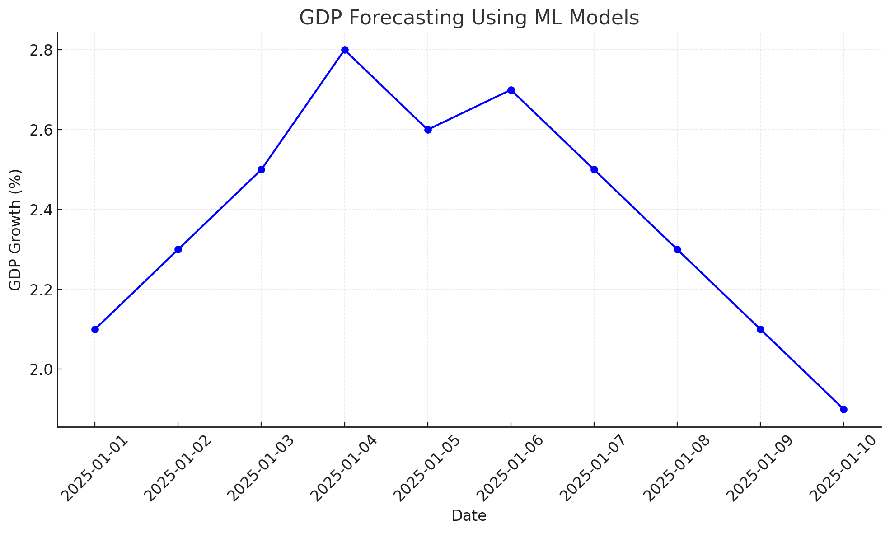
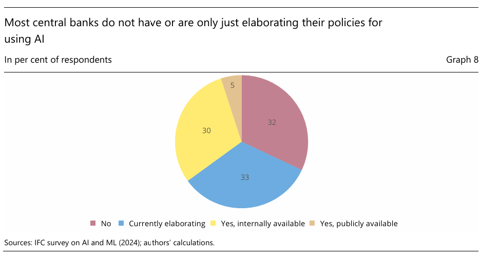
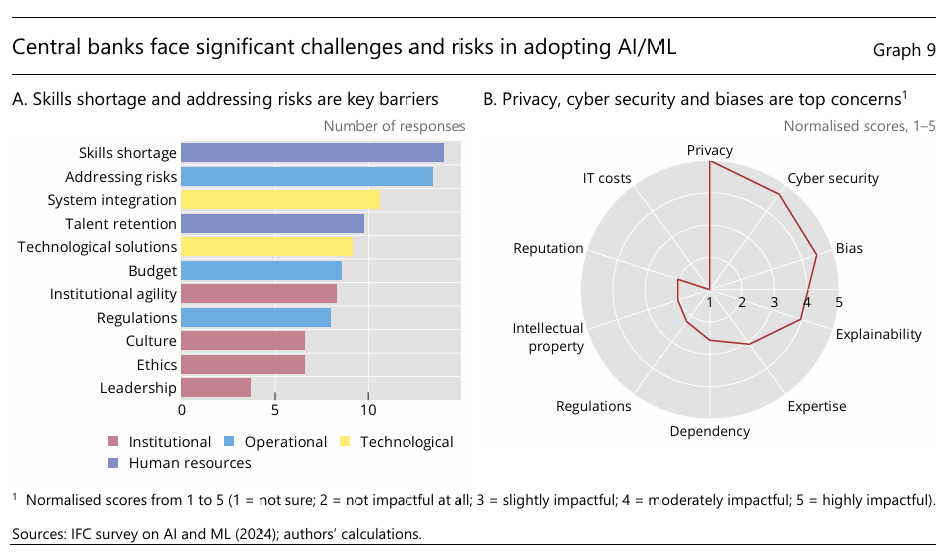

<style>
@media print{
  body, html, .remark-slides-area, .remark-notes-area {
    height: 100% !important;
    width: 100% !important;
    overflow: visible;
    display: inline-block;
    }
</style>

<style type="text/css">
.remark-slide-content {
    font-size: 38px;
    padding: 1em 4em 1em 4em;
}
</style>

<style type="text/css">
.my-one-page-font {
  font-size: 32px;
}
</style>

</style>

<style type="text/css">
.my-one-page-font-table {
  font-size: 28px;
}
</style>


```{r setup, include = FALSE}
library(tidyverse)
library(knitr)

opts_chunk$set(fig.width = 10, 
               message = FALSE, 
               warning = FALSE,
               echo = FALSE)
```

```{r xaringan-themer, include=FALSE, warning=FALSE}
#install.packages("xaringanthemer")
library(xaringanthemer)
style_mono_accent(
  base_color = "#135978", # #1c5253 #135978
  header_font_google = google_font("Josefin Sans"),
  text_font_google   = google_font("Montserrat", "500", "550i"),
  code_font_google   = google_font("Fira Mono"),
  colors = c(
  red = "#f34213",
  purple = "#3e2f5b",
  orange = "#ff8811",
  green = "#136f63",
  white = "#FFFFFF"
)
)
```

# Agenda  

1. ML/AI and Big Data in Central Banking (Intro)

2. Guest Speaker: Dr. Cory Baird

3. Class Activity

---

class: inverse, center, middle

# 1. ML/AI and Big Data in Central Banking

---

# Introduction

- Central banks are increasingly adopting ML/AI and big data to enhance decision-making, operational efficiency, and risk management.

- This lecture will cover:
  - Key use cases of ML/AI in central banking.
  - Potential risks and governance challenges.
  - Frameworks and guidelines for responsible AI adoption.
  - Real-world examples and case studies.

---

# Why ML/AI in Central Banking?

- Data-intensive industry with massive datasets.

- Need for rapid, accurate analysis in policy decisions.

- Predictive analytics for economic forecasting, fraud detection, and risk management.

- Enhanced supervision and regulatory compliance.

---

# Applications of ML/AI in Central Banks

- **Economic Forecasting:** Predicting GDP, inflation, and financial stability indicators.

- **Fraud Detection:** Identifying suspicious transactions and anomalies.

- **Risk Management:** Stress testing, scenario analysis.

- **Communication Analysis:** Sentiment analysis on policy announcements.

- **Data Quality Management:** Detecting data inconsistencies and outliers.

---

class: my-one-page-font

# Generative AI in Central Banking

- **What is Generative AI?**
  - AI systems that create content, such as text, images, or simulations based on data.

- **Applications in Central Banking:**
  - Automated report generation for economic forecasts and policy analysis.
  - Sentiment analysis of news and social media to assess financial stability.
  - Simulating economic scenarios for stress testing and policy planning.

- **Risks and Considerations:**
  - Accuracy vs. misinformation risk.
  - Ethical concerns: Data privacy, bias in generated content.
  - Dependence on AI-generated outputs may reduce analytical depth.

- **Example:**
  - ECB’s use of generative AI to draft initial economic assessment reports before human review.

---

<div>
.center[]
</div>

<span style="font-size: 60%;">(Source: IFC (2025) Governance and implementation of AI in CBs)</span>

---

<div>
.center[]
</div>

<span style="font-size: 60%;">(Source: IFC (2025) Governance and implementation of AI in CBs)</span>

---

<div>
.center[]
</div>

<span style="font-size: 60%;">(Source: IFC (2025) Governance and implementation of AI in CBs)</span>

---

<div>
.center[]
</div>

<span style="font-size: 60%;">(Source: IFC (2025) Governance and implementation of AI in CBs)</span>

---

# Use Case: Economic Forecasting

- Central banks utilize ML models to:
  
  - Nowcast GDP using high-frequency data (e.g., retail sales, electricity consumption).
  
  - Forecast inflation through sentiment analysis of news articles.

- Example: The ECB's application of NLP for sentiment analysis to predict macroeconomic trends.

---

# Visualization: Forecasting GDP with ML Models

<div>
.center[]
</div>


- The plot illustrates a predicted trajectory of GDP growth (%) over a 10-day period in January 2025, using a machine learning model.

- The line chart connects each data point to show the trend in GDP growth predictions over time.

---

# Governance and Risks in AI Adoption

- Potential Risks:
  - Data security and privacy concerns.
  - Model interpretability and transparency.
  - Algorithmic bias and fairness.
  - Operational risks from over-reliance on automated systems.

- Proposed Governance Framework (BIS 2025):
  - Establish interdisciplinary AI committees.
  - Implement robust data governance policies.
  - Conduct regular AI audits and risk assessments.

---

<div>
.center[]
</div>

<span style="font-size: 60%;">(Source: IFC (2025) Governance and implementation of AI in CBs)</span>

---

# Case Study: AI Governance in Central Banks

- **BIS 2025 Report on AI Governance:**
  - Highlights the importance of adaptive governance frameworks.
  - Recommends integrating AI oversight into existing risk management systems.
  - Emphasis on transparency, accountability, and compliance.

---

# AI and Data Management in Central Banks

- Data quality is crucial for effective AI applications.

- Key challenges:
  - Data integration across departments.
  - Data privacy and security.
  - Real-time data processing.

---

# Case Study: Federal Reserve's Use of Big Data

- The Federal Reserve leverages big data for:
  - Monitoring financial stability.
  - Detecting systemic risks.
  - Enhancing economic forecasting accuracy.

---

# Risks and Ethical Considerations

- Risks:
  - Potential biases in ML models.
  - Cybersecurity threats.
  - Model drift over time.

- Ethical Considerations:
  - Ensuring fair and unbiased outcomes.
  - Maintaining data privacy and confidentiality.

---

<div>
.center[]
</div>

<span style="font-size: 60%;">(Source: IFC (2025) Governance and implementation of AI in CBs)</span>

---

# Discussion

- How can central banks balance AI adoption with data privacy and security?

- What governance structures can mitigate AI risks?

- How can ML models improve economic forecasting accuracy?

---

# Summary and Key Takeaways

- ML/AI offers transformative potential for central banking but introduces significant risks.

- Robust governance frameworks are essential for responsible AI adoption.

- Ongoing training and interdisciplinary collaboration are key for successful AI implementation.

---

class: inverse, center, middle

# 2. Guest Speaker: Dr. Cory Baird

---

class: my-one-page-font

# Dr. Cory Baird

.pull-left[
.left[]
] 

.pull-right[

.bottom[
- Senior Analyst, GeoQuant (Fitch Group)
- Visiting Professor, University of Tokyo
- LinkedIn: [Cory Baird](https://www.linkedin.com/in/cory-baird-mn/)
]
]

### Academic Background

- **PhD in Public Policy, University of Maryland**  
  - Focus: ML & NLP for Central Bank Communication Analysis
- **Master's in Public Policy, University of Tokyo**  
  - Focus: Asian Financial Markets & FX Reserve Management

### Professional Expertise

- Develops **NLP systems and MLOps/LLMOps infrastructure** at GeoQuant.
- Analyzes the intersection of **monetary policy and financial markets** using ML models.
- Combines **academic research with industry applications**, enhancing data-driven decision-making.


---

class: inverse, center, middle

# 2. In-class Group Activity

---

# Your Takeaways from the Guest Speaker:

- What are the key insights from Dr. Baird's presentation?

- How can you apply these insights to your own research or work in central banking?


---

class: inverse, center, middle

# Any QUESTIONS?

**Let’s build a central bank that serves growth, stability & people.**

## Thank You!  


---

# Next Class

-(May 21) Central Bank Digital Currencies (CBDCs)  
      - The readings will be posted on the Cyber Campus website.

???

1. To print pdf slides
https://stackoverflow.com/questions/54968311/xaringan-export-slides-to-pdf-while-preserving-formatting

pagedown::chrome_print("W1_ME.html") # but not all pictures are visible

2. Option: https://stackoverflow.com/questions/54968311/xaringan-export-slides-to-pdf-while-preserving-formatting

install.packages("remotes")
remotes::install_github("jhelvy/xaringanBuilder")
remotes::install_github("jhelvy/renderthis@v0.0.9")

library(xaringanBuilder)
build_pdf("DVC.html")

3. Option
writeBin(as.raw(c()), "favicon.ico") # create an empty favicon.ico file
install.packages("renderthis")
remotes::install_github('rstudio/chromote')
library(renderthis)

renderthis::to_pdf("W11_CB.html")

getwd()
setwd("C:/Users/Iegor/OneDrive - kdis.ac.kr/Documents/GitHub/Sogang/2025/Spring/Central Banking/Week 11")
