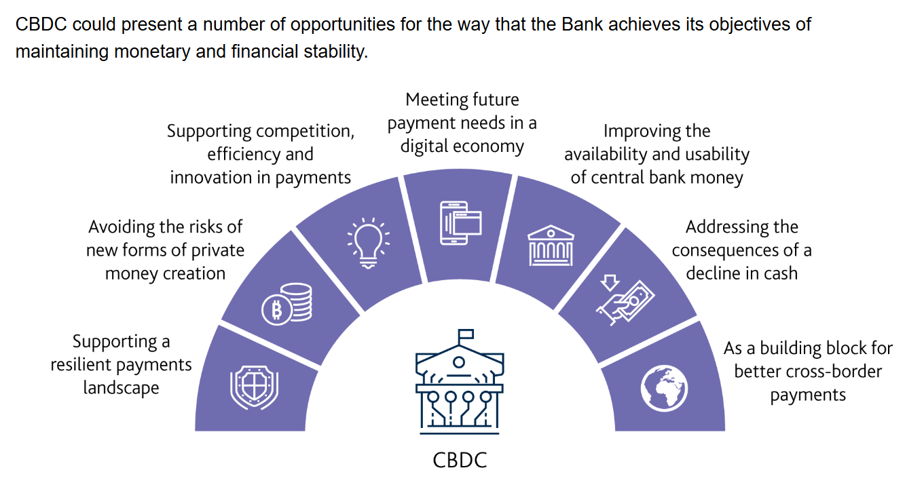
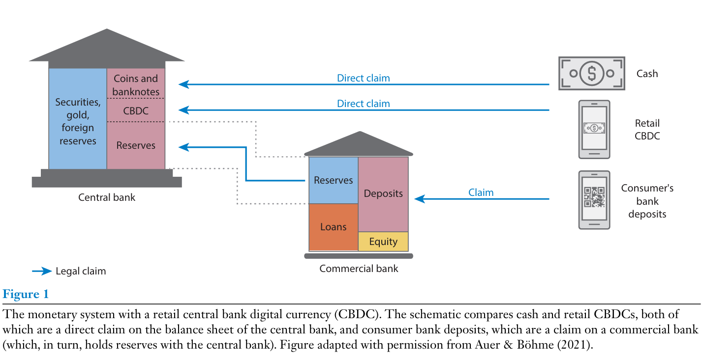
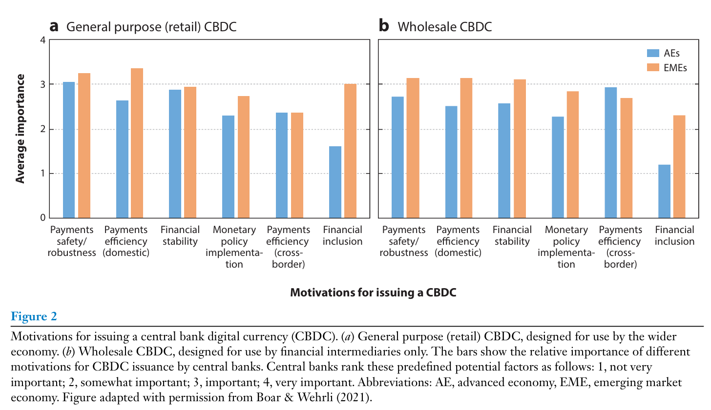
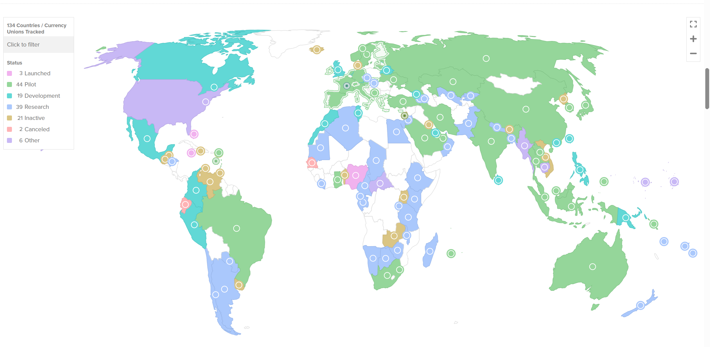

<style>
@media print{
  body, html, .remark-slides-area, .remark-notes-area {
    height: 100% !important;
    width: 100% !important;
    overflow: visible;
    display: inline-block;
    }
</style>

<style type="text/css">
.remark-slide-content {
    font-size: 38px;
    padding: 1em 4em 1em 4em;
}
</style>

<style type="text/css">
.my-one-page-font {
  font-size: 32px;
}
</style>

</style>

<style type="text/css">
.my-one-page-font-table {
  font-size: 28px;
}
</style>


```{r setup, include = FALSE}
library(tidyverse)
library(knitr)

opts_chunk$set(fig.width = 10, 
               message = FALSE, 
               warning = FALSE,
               echo = FALSE)
```

```{r xaringan-themer, include=FALSE, warning=FALSE}
#install.packages("xaringanthemer")
library(xaringanthemer)
style_mono_accent(
  base_color = "#135978", # #1c5253 #135978
  header_font_google = google_font("Josefin Sans"),
  text_font_google   = google_font("Montserrat", "500", "550i"),
  code_font_google   = google_font("Fira Mono"),
  colors = c(
  red = "#f34213",
  purple = "#3e2f5b",
  orange = "#ff8811",
  green = "#136f63",
  white = "#FFFFFF"
)
)
```

# Agenda  

1. Central Bank Digital Currencies (CBDCs)

2. Class Activity

---

class: inverse, center, middle

# 1. Central Bank Digital Currencies (CBDCs)

---

# Introduction

- Central Bank Digital Currencies (CBDCs) are digital forms of a nation's fiat currency issued by the central bank.

- The emergence of CBDCs is driven by the rise of cryptocurrencies and the need for more efficient payment systems.

- This lecture will cover:
  - The concept and design of CBDCs.
  - The motivations and implications for central banks.
  - Case studies of CBDC implementation globally.
  - Challenges and risks associated with CBDCs.

---

# What is a CBDC?

- A digital form of a central bank-issued currency.

- Can be account-based or token-based.

- Unlike cryptocurrencies, CBDCs are state-backed and represent legal tender.

---

class: my-one-page-font

# Key Features of CBDCs

- **Legal Tender:** Recognized as a valid form of payment.

- **Central Bank Backing:** Issued and regulated by the central bank.

- **Digital Nature:** Exists only in digital form, not physical cash.

- **Programmability:** Potential for smart contracts and programmable money.

- **Interoperability:** Ability to work across different payment systems and platforms.

- **Privacy and Security:** Balancing user privacy with transaction traceability.

- **Accessibility:** Ensuring that all citizens can access and use the CBDC.

- **Resilience:** Robust against cyber threats and operational risks.

- **Monetary Policy Tool:** Potential to enhance monetary policy transmission and financial stability.

- **Cross-Border Payments:** Facilitating international transactions and remittances.

---

# Motivations for CBDCs

- Increase financial inclusion.

- Improve payment systems.

- Enhance monetary policy transmission.

- Counteract private digital currencies.

- Strengthen financial stability.

---

# Example: Opportunities for the BoE objectives

<div>
.center[]
</div>

<span style="font-size: 40%;">(Source: [BoE](https://www.bankofengland.co.uk/paper/2020/central-bank-digital-currency-opportunities-challenges-and-design-discussion-paper))</span>


---

# Renewed monetary system


<div>
.center[]
</div>

<span style="font-size: 40%;">(Source: Auer, Raphael, et al. "Central bank digital currencies: motives, economic implications, and the research frontier." Annual review of economics 14.1 (2022): 697-721.)</span>


---

# Motivations for CBDCs 


<div>
.center[]
</div>

<span style="font-size: 40%;">(Source: Auer, Raphael, et al. "Central bank digital currencies: motives, economic implications, and the research frontier." Annual review of economics 14.1 (2022): 697-721.)</span>

---

# Adaptation progress of CBDCs

<div>
.center[]
</div>

<span style="font-size: 40%;">(Source: [CBDC tracker](https://www.atlanticcouncil.org/cbdctracker/))</span>

---

# CBDC Design Models

- **Account-Based:**
  - Linked to user identity.
  - Similar to bank accounts but managed by central banks.

- **Token-Based:**
  - Digital tokens serve as the medium of exchange.
  - Anonymity and offline transactions possible.

- **Hybrid Model:**
  - Combines features of both account-based and token-based systems.
  - Users can hold accounts with the central bank and also use digital tokens.

---

# Case Study: China's Digital Yuan

- Pioneering CBDC project globally.

- Launched to counteract the dominance of private cryptocurrencies.

- Focus on domestic retail payments.

- Emphasizes controlled data privacy and transaction tracking.

- Pilot programs in major cities.

---

# Digital Yuan: Current Status in 2025

- The Digital Yuan has been rolled out in **29 cities**, shifting from pilot testing to full-scale implementation.

- Despite significant state backing, adoption remains limited due to the dominance of **Alipay and WeChat Pay**.

- Payment volumes have increased but still constitute only **0.16% of total monetary volume**:
  - 2023 H1: **$250 billion in transactions**
  - 2024: Cumulative transactions reached **$7.3 trillion**, with 180 million e-CNY wallets created.

- **Hong Kong** has also begun accepting the e-CNY, with state media promoting its use.

---

# Risks and Challenges of CBDCs

- Cybersecurity threats and data privacy.

- Financial disintermediation and impact on banking sector.

- Operational risks and technology implementation.

- Cross-border implications and international coordination.

---

# Example: eNaira in Nigeria

- Implemented by the Central Bank of Nigeria (Ozili, 2023).

- Aimed to promote financial inclusion and reduce reliance on cash.

- Key challenges:
  - Digital literacy.
  - Security concerns.
  - Public trust in digital currency.

---

# CBDC and Monetary Policy

- Potential to enhance monetary policy transmission.

- Direct control over digital currency issuance.

- Faster policy implementation through programmable money.

---

# Conclusion

- CBDCs represent a significant evolution in monetary policy and financial stability.

- While they offer potential benefits, they also present unique risks and operational challenges.

- The future of CBDCs will depend on effective governance, technology infrastructure, and international coordination.

---

class: inverse, center, middle

# 2. In-class Group Activity

---

class: inverse, center, middle

# Any QUESTIONS?

**Let’s build central banks that serves growth, stability & people.**

## Thank You!  


---

# Next Class

-(May 28) Global Coordination and Central Banking  
      - The readings will be posted on the Cyber Campus website.

???

1. To print pdf slides
https://stackoverflow.com/questions/54968311/xaringan-export-slides-to-pdf-while-preserving-formatting

pagedown::chrome_print("W1_ME.html") # but not all pictures are visible

2. Option: https://stackoverflow.com/questions/54968311/xaringan-export-slides-to-pdf-while-preserving-formatting

install.packages("remotes")
remotes::install_github("jhelvy/xaringanBuilder")
remotes::install_github("jhelvy/renderthis@v0.0.9")

library(xaringanBuilder)
build_pdf("DVC.html")

3. Option
writeBin(as.raw(c()), "favicon.ico") # create an empty favicon.ico file
install.packages("renderthis")
remotes::install_github('rstudio/chromote')
library(renderthis)

renderthis::to_pdf("W12_CB.html")

getwd()
setwd("C:/Users/Iegor/OneDrive - kdis.ac.kr/Documents/GitHub/Sogang/2025/Spring/Central Banking/Week 12")
