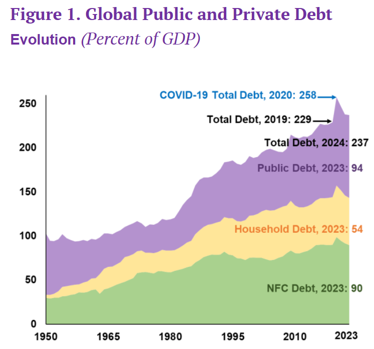
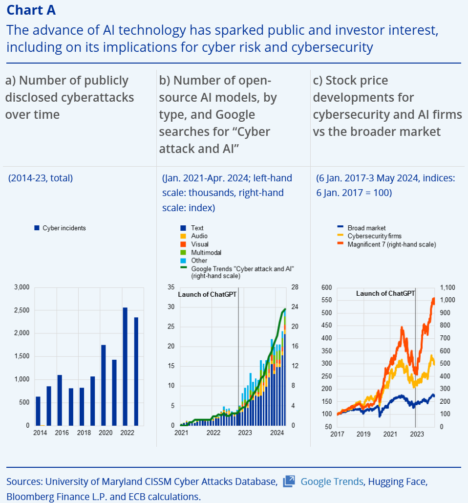
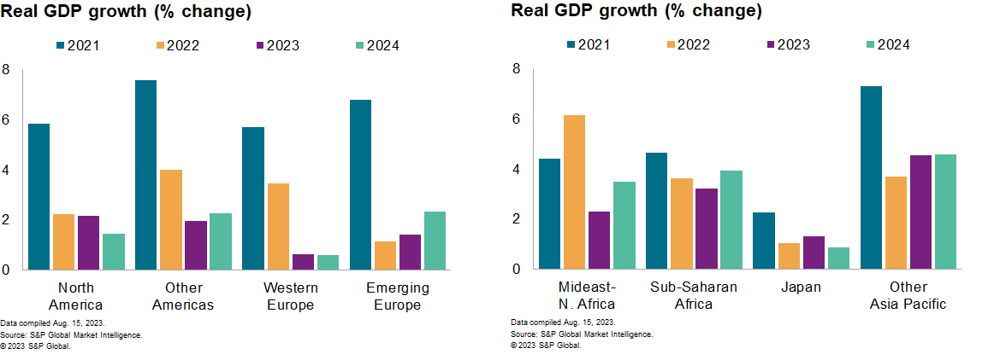
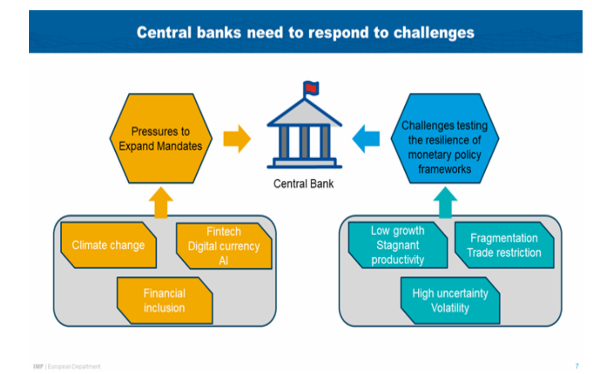
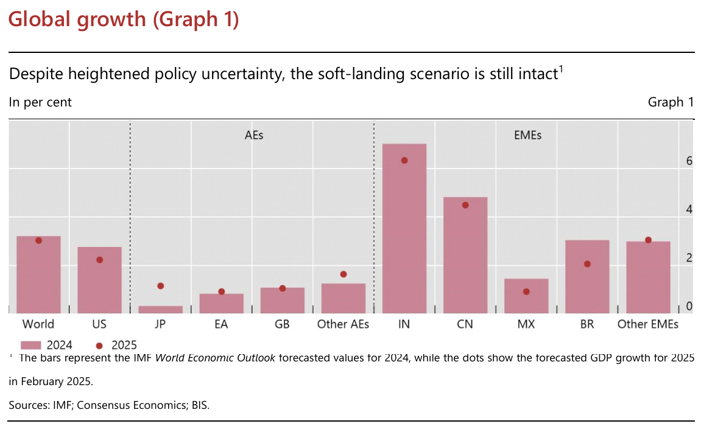
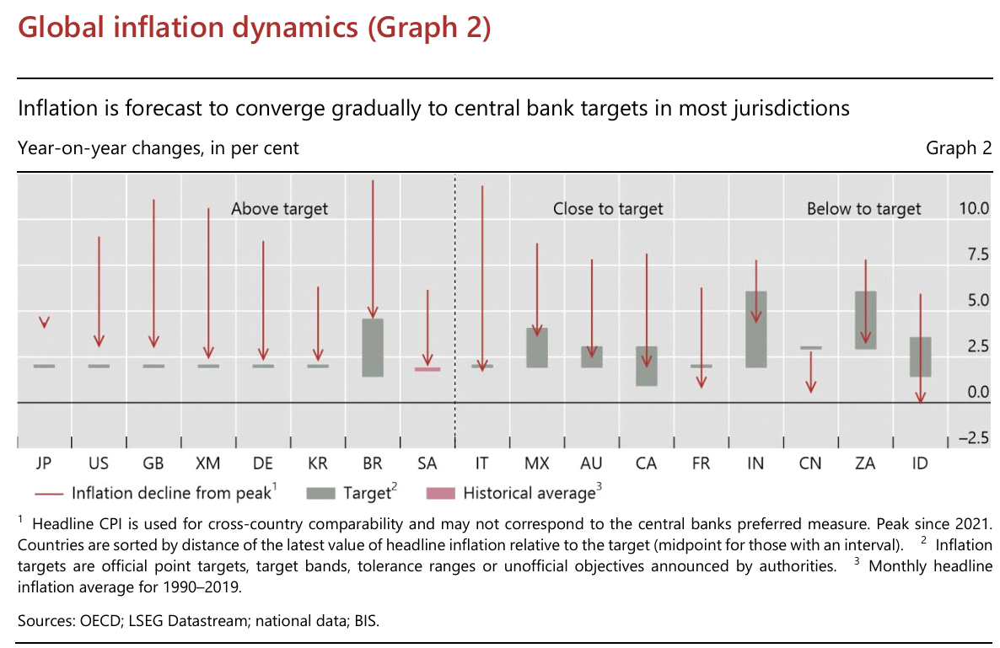

<style>
@media print{
  body, html, .remark-slides-area, .remark-notes-area {
    height: 100% !important;
    width: 100% !important;
    overflow: visible;
    display: inline-block;
    }
</style>

<style type="text/css">
.remark-slide-content {
    font-size: 38px;
    padding: 1em 4em 1em 4em;
}
</style>

<style type="text/css">
.my-one-page-font {
  font-size: 32px;
}
</style>

</style>

<style type="text/css">
.my-one-page-font-table {
  font-size: 28px;
}
</style>


```{r setup, include = FALSE}
library(tidyverse)
library(knitr)

opts_chunk$set(fig.width = 10, 
               message = FALSE, 
               warning = FALSE,
               echo = FALSE)
```

```{r xaringan-themer, include=FALSE, warning=FALSE}
#install.packages("xaringanthemer")
library(xaringanthemer)
style_mono_accent(
  base_color = "#135978", # #1c5253 #135978
  header_font_google = google_font("Josefin Sans"),
  text_font_google   = google_font("Montserrat", "500", "550i"),
  code_font_google   = google_font("Fira Mono"),
  colors = c(
  red = "#f34213",
  purple = "#3e2f5b",
  orange = "#ff8811",
  green = "#136f63",
  white = "#FFFFFF"
)
)
```

# Agenda  

1. Future Challenges for Central Banks

2. Guest Speaker: Vasyl Boryshchuk, National Bank of Ukraine

3. Class Activity

---

class: inverse, center, middle

# 1. Future Challenges for Central Banks

---
# Introduction

- The world economy is becoming increasingly complex, uncertain, and interdependent.

- Central banks must evolve to meet new challenges, from AI to climate change, from high debt levels to fragile financial markets.

- In this lecture, we will explore:
  - The macroeconomic and structural pressures confronting central banks
  - Technological, fiscal, geopolitical, and demographic factors driving complexity
  - The role of innovation, data, and collaboration in shaping the central bank of the future

---

# Structural Shifts Affecting Central Banks

- **Persistent High Debt Levels**: Constrains monetary policy space.

- **Ageing Populations**: Alters savings-investment dynamics.

- **Climate Change**: Increases exposure to shocks and transition risk.

- **Low Productivity Growth**: Sustains low equilibrium interest rates.

- **Digitalization**: Alters monetary transmission mechanisms.

---
class: my-one-page-font

# Global Public and Private Debt Trends

.pull-left[
<div>
.center[]
</div>

<span style="font-size: 40%;">(Source: IMF 2024 Global Debt Monitor)</span>
]

.pull-right[
- Global debt levels surged during the COVID-19 crisis, peaking at **258% of GDP in 2020**.

- In 2024, debt remains elevated at **237% of global GDP**, showing only partial unwinding.

- The composition of debt in 2023:
  - **Public debt**: 94% of GDP
  - **Non-financial corporate (NFC) debt**: 90%
  - **Household debt**: 54%

- High debt levels limit central banks’ policy space and pose risks to financial stability.

- Fiscal and monetary coordination is becoming increasingly critical.
]

---

# Technological Disruption

- Rise of AI and big data introduces new analytical possibilities and operational tools.

- Machine learning is now used for:
  - Forecasting inflation and output
  - Early warning systems for financial instability
  - Real-time policy evaluation

- Central banks must build digital skills and governance frameworks.

---
class: my-one-page-font

# AI, Cyber Risk, and Market Signals

.pull-left[
<div>
.center[]
</div>

<span style="font-size: 40%;">(Source: ECB Financial Stability Review 2024)</span>
]

.pull-right[
- **Panel A**: The number of disclosed cyberattacks has grown steadily since 2014, with steep increases in recent years.

- **Panel B**: A surge in open-source AI models and public interest in “Cyber attack and AI” followed the launch of ChatGPT.

- **Panel C**: Stock prices of cybersecurity and AI firms outperformed the broader market, highlighting investor confidence.

- These dynamics reflect the growing centrality of AI and cybersecurity in financial market expectations and regulatory focus.
]


---

# Climate Change and Central Banks

- Physical and transition risks impact financial stability and inflation.

- Growing use of climate stress testing in financial supervision.

- Some central banks integrating green objectives via disclosure rules, asset purchases, or collateral policies.

- Balancing mandates remains a key challenge.

---

# Global Uncertainty and Monetary Policy

- Volatile financial markets, trade fragmentation, and geopolitical tensions cloud forecasts.

- Uncertainty discourages investment and dampens transmission of policy signals.

- Communication strategies are more important than ever to anchor expectations.

---

# Monetary Policy Divergence

.pull-left[
<div>
.center[]
</div>

<span style="font-size: 40%;">(Source: [S&P Global](https://www.spglobal.com/market-intelligence/en/news-insights/research/divergence-in-monetary-policy-becoming-more-apparent-globally) )</span>
]

.pull-right[
- **US Federal Reserve**: Likely to raise rates by 25 bps in November; September hike also possible due to strong activity and tight labor market.

- **European Central Bank**: Likely done with hikes; focus shifting to balance sheet reduction.

- **Advanced Economies**: Rate cuts expected mid-2024.

- **Emerging Economies**: Some already cutting rates as anticipated.
]

---

# Governance and Mandates

- Expanding roles risk overburdening central banks and blurring accountability.

- Need for clarity on primary vs. secondary objectives (e.g. price stability vs. climate support).

- Institutional reforms needed to align mandates with capacities.

---

# Pressures and Framework Challenges

.pull-left[
<div>
.center[]
</div>

<span style="font-size: 40%;">(Source: Kammer (2024))</span>
]

.pull-right[
- Central banks today face **dual challenges**:
  - **Mandate Expansion Pressures**: Rising expectations to address climate, fintech, financial inclusion, and digital currency.
  - **Framework Resilience Tests**: Responding to a world of low growth, fragmentation, and extreme uncertainty.

- This complex policy environment calls for a strategic rethinking of tools, objectives, and institutional design.
]

---

# Global Growth Outlook (2024–2025)

.pull-left[
<div>
.center[]
</div>

<span style="font-size: 40%;">(Source: Zhang (2025))</span>
]

.pull-right[
- Global growth shows resilience despite uncertainty, with AEs led by the US and UK, and strong EME growth in India and China.

- Central banks face challenges from uneven recoveries and policy coordination.

]

---

# Global Inflation Dynamics (2025)

.pull-left[
<div>
.center[]
</div>

<span style="font-size: 40%;">(Source: Zhang (2025))</span>
]

.pull-right[
- Most countries have seen significant declines from peak inflation levels.

- While many advanced economies are **still above target**, they are showing convergence.

- Some emerging markets are closer to or even **below their targets**, raising different challenges.

- The forecast indicates **gradual return to targets**, but monetary policy must remain vigilant.

]

---

# Conclusion: The Future of Central Banking

- Central banks must remain agile in a world of rapid change.

- Investing in data, digital infrastructure, and human capital is crucial.

- Clear communication, robust governance, and international cooperation will shape resilience.

- The future is complex, but with the right tools and mindset, central banks can remain anchors of stability.

---

class: inverse, center, middle

# 2. Guest Speaker: Vasyl Boryshchuk

---

class: my-one-page-font

# Guest Profile: Vasyl Boryshchuk {.smaller}

.pull-left[
### Vasyl Boryshchuk
**National Bank of Ukraine**  
Financial Stability Division

- Over **15 years of experience** at the NBU

- Former **Deputy Head of Department**

- Instrumental in establishing the **Financial Stability Function**
]

.pull-right[
- Developed key CB tools & regulations:
  - **Bank stress testing frameworks**
  - **Large exposure stress testing**
  - **Business registry and data integration tools**

- Career foundation in **banking supervision**

- Strong advocate for macroprudential innovation and systemic resilience
]

---


class: inverse, center, middle

# 3. In-class Group Activity

---

# Your Takeaways from the Guest Speaker:

- What are the key insights from Vasyl's presentation?

- How can you apply these insights to your own research or work in central banking?

---

class: inverse, center, middle

# Any QUESTIONS?

**Let’s build central banks that serves growth, stability & people.**

## Thank You!  


---

# Next Class

-(June 11) Current Issues on Central Banking  
      - Students' presentations on current issues in central banking.
      - Please be well-prepared for your presentations.


???

1. To print pdf slides
https://stackoverflow.com/questions/54968311/xaringan-export-slides-to-pdf-while-preserving-formatting

pagedown::chrome_print("W1_ME.html") # but not all pictures are visible

2. Option: https://stackoverflow.com/questions/54968311/xaringan-export-slides-to-pdf-while-preserving-formatting

install.packages("remotes")
remotes::install_github("jhelvy/xaringanBuilder")
remotes::install_github("jhelvy/renderthis@v0.0.9")

library(xaringanBuilder)
build_pdf("DVC.html")

3. Option
writeBin(as.raw(c()), "favicon.ico") # create an empty favicon.ico file
install.packages("renderthis")
remotes::install_github('rstudio/chromote')
library(renderthis)

renderthis::to_pdf("W14_CB.html")

getwd()
setwd("C:/Users/Iegor/OneDrive - kdis.ac.kr/Documents/GitHub/Sogang/2025/Spring/Central Banking/Week 14")
