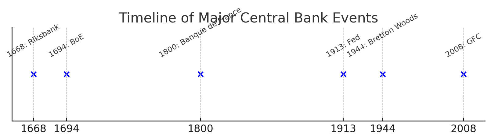
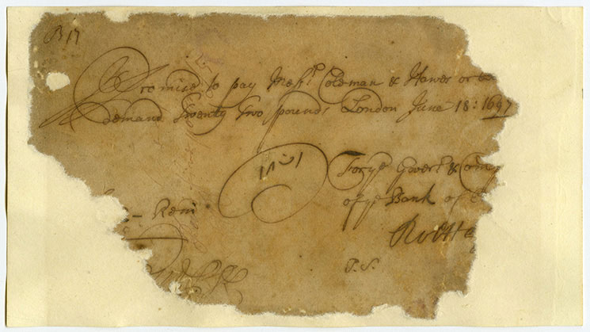
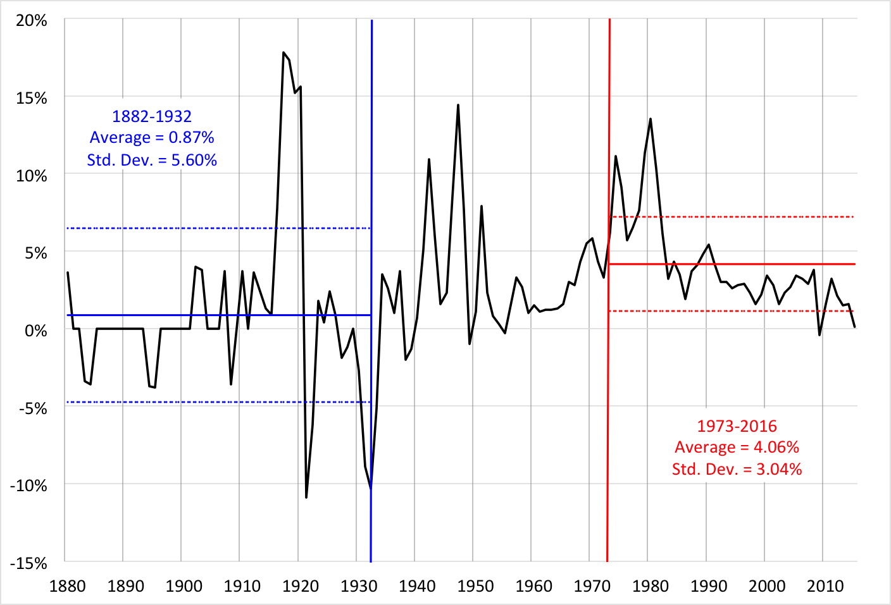
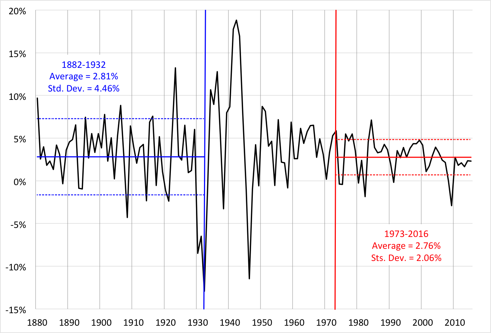
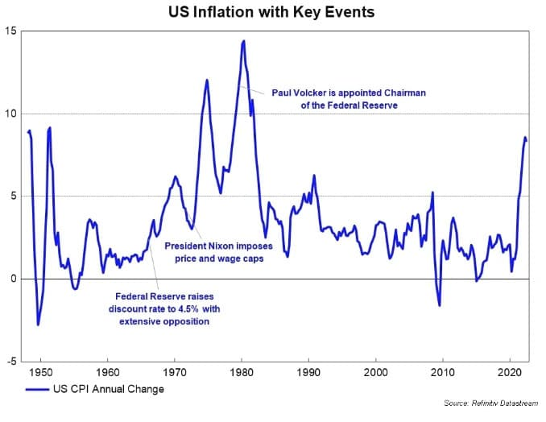
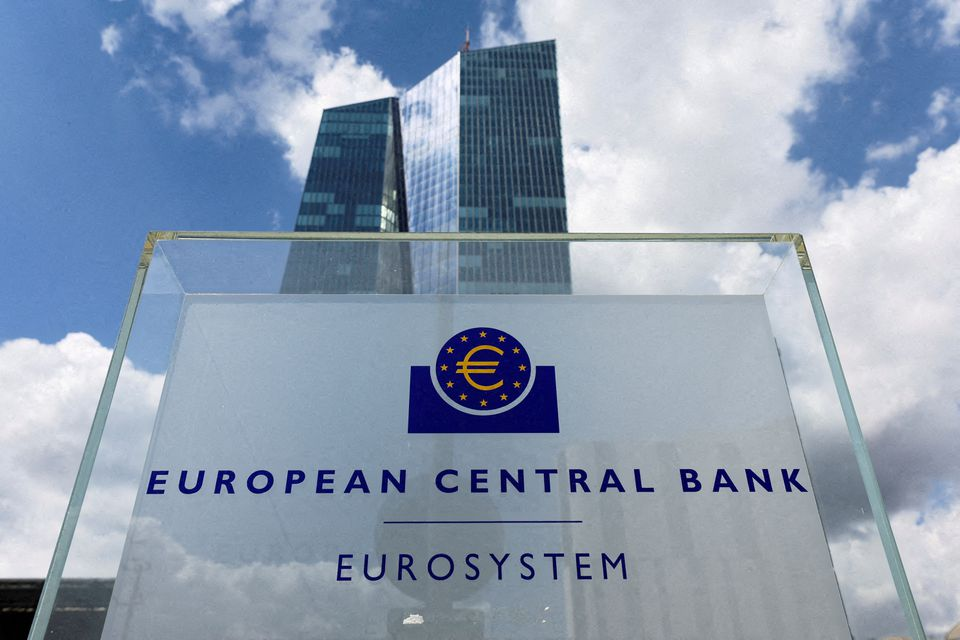
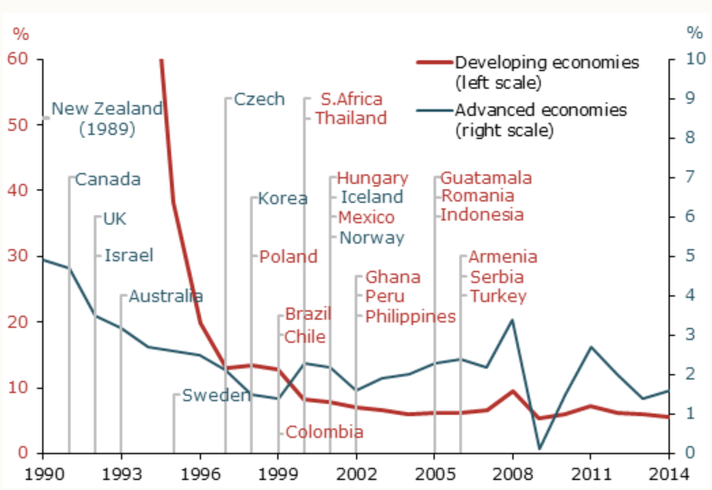
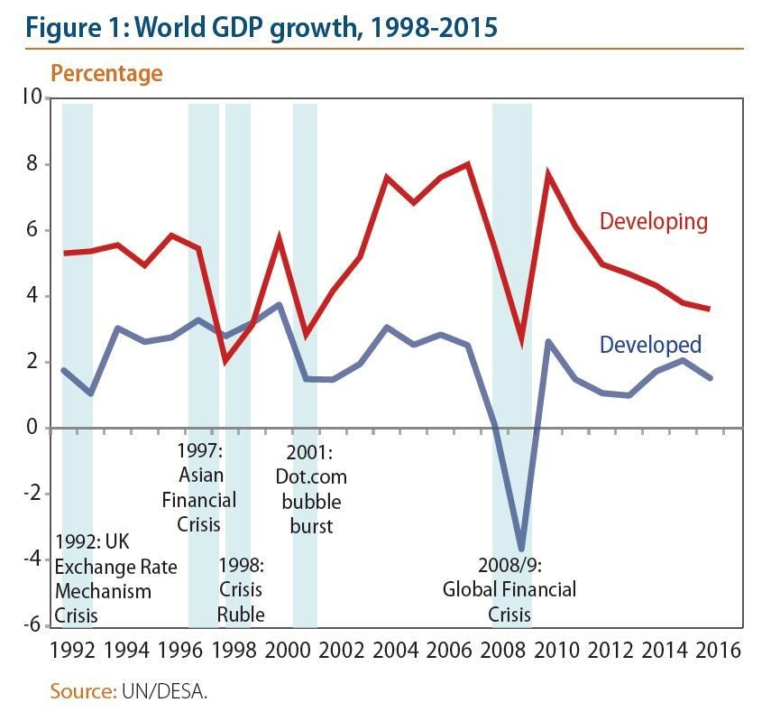
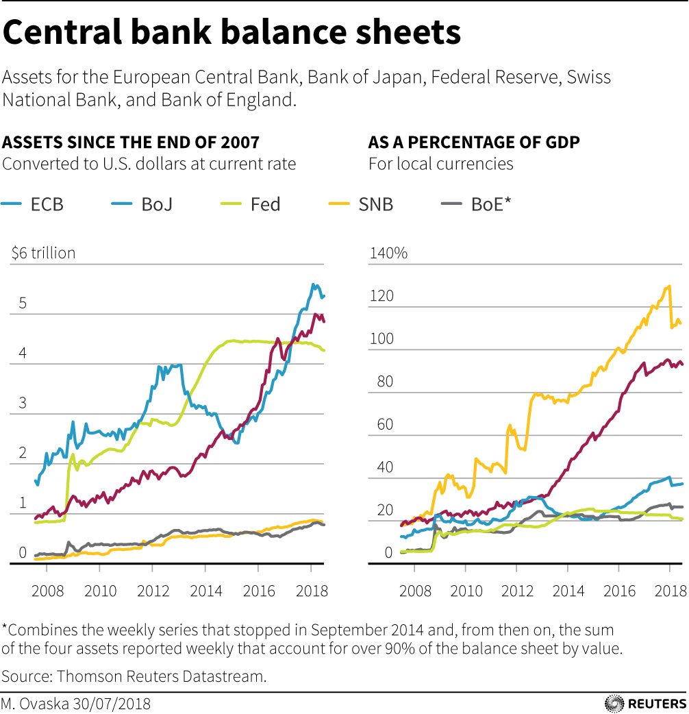
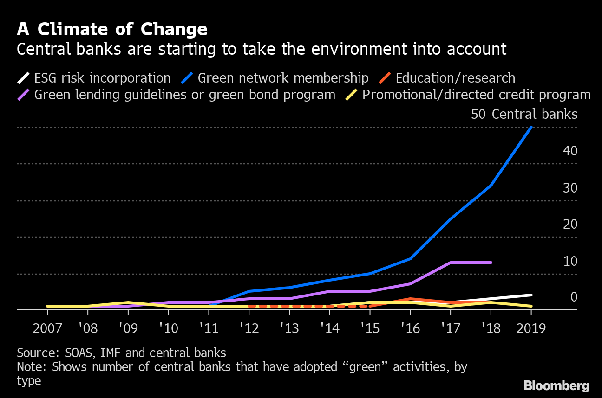

<style>
@media print{
  body, html, .remark-slides-area, .remark-notes-area {
    height: 100% !important;
    width: 100% !important;
    overflow: visible;
    display: inline-block;
    }
</style>

<style type="text/css">
.remark-slide-content {
    font-size: 38px;
    padding: 1em 4em 1em 4em;
}
</style>

<style type="text/css">
.my-one-page-font {
  font-size: 32px;
}
</style>

</style>

<style type="text/css">
.my-one-page-font-table {
  font-size: 28px;
}
</style>


```{r setup, include = FALSE}
library(tidyverse)
library(knitr)

opts_chunk$set(fig.width = 10, 
               message = FALSE, 
               warning = FALSE,
               echo = FALSE)
```

```{r xaringan-themer, include=FALSE, warning=FALSE}
#install.packages("xaringanthemer")
library(xaringanthemer)
style_mono_accent(
  base_color = "#135978", # #1c5253 #135978
  header_font_google = google_font("Josefin Sans"),
  text_font_google   = google_font("Montserrat", "500", "550i"),
  code_font_google   = google_font("Fira Mono"),
  colors = c(
  red = "#f34213",
  purple = "#3e2f5b",
  orange = "#ff8811",
  green = "#136f63",
  white = "#FFFFFF"
)
)
```

# **Introduction: Why Study Central Banking History?**
- Central banks are the **backbone of financial stability**.
- They shape economic **stability and monetary policy**.
- Their historical evolution explains **modern monetary policy and financial systems**.
- Lessons from past crises help predict **future policy challenges**.


#### **Visual:** Timeline of Major Central Bank Events

<div>
.center[]

<div style="font-size: 12px; text-align: center; margin-top: 20px;">
</div>

---

# **Early Central Banks (17th-19th Century)**

- **Swedish Riksbank (1668):** The world's first central bank.
- **Bank of England (1694):** Created to finance wars and issue standardized banknotes.
- **Banque de France (1800):** Established by Napoleon to stabilize the French franc.
- **Role:** Early banks combined **public policy** & **private financial services**.

#### **Visual:** Image of early banknotes *(Bank of England first notes)*

<div>
.center[]

<div style="font-size: 12px; text-align: center; margin-top: 20px;">
</div>
Source: [BoE](https://www.bankofengland.co.uk/museum/online-collections/banknotes/early-banknotes)

---

# **Case Study: The Bank of England (1694)**
- Founded to fund England’s war against France.

- First to issue standardized **banknotes**.

- Became the **lender of last resort** by the 19th century.

- Set **modern central banking precedents**.

#### **Table: Early Central Banks and Their Functions**

| Bank                | Year Founded | Key Function       |
|--------------------|-------------|-------------------|
| Swedish Riksbank  | 1668        | Currency Issuance |
| Bank of England   | 1694        | Debt Management   |
| Banque de France  | 1800        | Currency Stability |

---

# **The Gold Standard and Central Banking (19th-20th Century)**

- **Gold Standard (1870s-1914):** Currencies pegged to **gold reserves**.

- Provided **long-term price stability** but restricted monetary flexibility.

- Central banks had to maintain **gold convertibility**.

- Collapsed during **WWI** due to war-time spending needs.


#### But, consider a crude measure of financial stability: the frequency of banking crises. 
- From 1880 to 1933, there were at least 5 full-fledged banking panics: 1893, 1907, 1930, 1931, and 1933. 

- Including the savings and loan crisis of the 1980s, in the past half century, there have been two.

---

# **The Gold Standard and Central Banking (19th-20th Century)** (cont'd)

#### **Visual:** Graph of Gold Standard Stability *(inflation volatility vs. fiat era)*

<div style="display: flex; justify-content: center; align-items: center;">

  <div style="flex: 1; text-align: center;">
    
    <div style="font-size: 12px; text-align: center; margin-top: 10px;">
      Annual Consumer Price Inflation, 1880 to 2016
    </div>
  </div>

  <div style="flex: 1; text-align: center;">
    
    <div style="font-size: 12px; text-align: center; margin-top: 10px;">
      Annual GNP (i.e., econ) Growth, 1880-2016
    </div>
  </div>

</div>

Source: [Why a gold standard is a very bad idea](https://www.moneyandbanking.com/commentary/2016/12/14/why-a-gold-standard-is-a-very-bad-idea)


???

In his 2012 lecture Origins and Mission of the Federal Reserve, then-Federal Reserve Board Chair Ben Bernanke identifies four fundamental problems with the gold standard:

When the central bank fixes the dollar price of gold, rather than the price of goods we consume, fluctuations in the dollar price of goods replace fluctuations in the market price of gold.
Since prices are tied to the amount of money in the economy, which is linked to the supply of gold, inflation depends on the rate that gold is mined.
When the gold standard is used at home and abroad, it is an exchange rate policy in which international transactions must be settled in gold.
Digging gold out of one hole in the ground (a mine) to put it into another hole in the ground (a vault) wastes resources.

---

# **The Federal Reserve System (1913)**
- U.S. lacked a **central bank** for most of the 19th century.
- **Panic of 1907** → Showed need for a lender of last resort.
- **Federal Reserve Act (1913)** → Created the Federal Reserve System.
- Initially focused on **banking stability**, later expanded to **monetary policy**.

#### Fed special features:
- **Decentralized structure** with 12 regional branches.
- **Dual mandate:** Price stability and full employment.
- **Independence** from political influence.
- **'Hybrid ownership'** by states' member banks and Federal Government.

---

# **The Federal Reserve System (1913)** (cont'd)


#### **Visual:** Federal Reserve districts map *(showing its regional branches)*

<div>
.center[]

<div style="font-size: 12px; text-align: center; margin-top: 20px;">
</div>
Source: [Richmond Fed](https://www.richmondfed.org/research/national_economy/macro_minute/2024/which_fed_districts_look_like_us_20240416)

---

# **The Interwar Period (1919-1939)**
- Attempted return to **Gold Standard** failed.
- **The Great Depression (1929)** → Exposed policy weaknesses.
- Central banks lacked tools to prevent **economic downturns**.
- Lesson: Need for **active monetary policy and counter-cyclic measures**.

#### **Table: Central Bank Responses to the Great Depression**

| Country         | Policy Response       | Outcome        |
|----------------|----------------------|---------------|
| USA (Fed)      | Maintained tight money | Worsened Depression |
| UK (BoE)      | Abandoned Gold Standard | Stimulated recovery |
| France (BdF)  | Delayed action         | Prolonged recession |

---

# **The Bretton Woods System (1944-1971)**
- Post-WWII **fixed exchange rate system**.
- Currencies pegged to the **U.S. dollar**, which was convertible to **gold**.
- Created **IMF and World Bank** for global financial stability.
- **Collapsed in 1971** when the U.S. abandoned gold convertibility.

#### **Visual:** Image of Bretton Woods Conference

<div>
.center[]

<div style="font-size: 12px; text-align: center; margin-top: 20px;">
</div>
Source: [World Bank](https://www.worldbank.org/en/about/archives/history/exhibits/bretton-woods-monetary-conference.print)

---

# **Post-War Central Banking (1950s-1980s)**
- Shift from **fixed exchange rates** to **monetary targeting**.
- **1970s: Stagflation** (high inflation + unemployment).
- **The Volcker Shock (1979-82)** – Aggressive rate hikes to curb inflation.
- Central banks adopted **inflation-targeting strategies**.

#### **Graph:** Inflation Trends in the 1970s *(showing Fed rate hikes)*

<div>
.center[]

<div style="font-size: 12px; text-align: center; margin-top: 20px;">
</div>
Source: [Three Lessons From the 70s’ Great Inflation](https://www.fixedincomenews.com.au/three-lessons-from-the-70s-great-inflation/)

---

# **The European Central Bank and the Single Supervisory Mechanism**
- **European Central Bank (ECB) founded in 1998** as part of the Economic and Monetary Union.

- Mandate includes **monetary policy for the Eurozone** and **financial stability**.
    - The ECB coordinates Eurozone monetary policy, including setting target interest rates and controlling the supply of the euro common currency. 

- **Single Supervisory Mechanism (SSM) (2014):** Ensures consistent banking supervision across the Eurozone.

- Unique features:
  - Direct supervision of **significant banks**.
  - Works in coordination with national supervisory authorities.
  - Part of the **Banking Union**, along with the Single Resolution Mechanism.

???
#### **Visual:** ECB.

<div>
.center[]

<div style="font-size: 12px; text-align: center; margin-top: 20px;">
</div>
Source: [europas](http://www.europas.irtea.gr/?page_id=2474)

---

# **Inflation Targeting and Central Bank Independence**

- **Inflation targeting introduced in the 1990s** as a response to economic instability.

- Key principles:
  - Setting explicit inflation targets (e.g., 2% annual inflation).
  - Central banks adjust interest rates to achieve targets.

- **Central Bank Independence:**
  - Allows policy decisions free from political pressure.
  - Proven to enhance economic stability and credibility.

- **Transparency and Accountability:**
  - Regular policy announcements.
  - Clear communication with markets and the public.

---
# **Inflation Targeting and Central Bank Independence** (cont'd)

#### **Visual:** Chart of Inflation Targeting Adoption Worldwide (2014)

<div>
.center[]

<div style="font-size: 12px; text-align: center; margin-top: 20px;">
</div>
Source: [San Francisco FED](https://www.frbsf.org/research-and-insights/publications/economic-letter/2015/05/inflation-targeting-advanced-developing-countries/)

---

# **The 2008 Global Financial Crisis**
- Central banks **intervened aggressively** to prevent collapse.
- Fed, ECB, and BoE used **quantitative easing** (QE).
- Focus shifted to **financial stability & macroprudential regulation**.
- The role of central banks **expanded beyond traditional monetary policy**.

<div>
.center[]

<div style="font-size: 12px; text-align: center; margin-top: 20px;">
</div>
Source: [WEF](https://www.weforum.org/stories/2018/11/the-next-economic-crisis-could-cause-a-global-conflict-heres-why/)

---
# **The 2008 Global Financial Crisis** (cont'd)

#### **Central Banks balance sheets dynamics**

<div>
.center[]

<div style="font-size: 12px; text-align: center; margin-top: 20px;">
</div>
Source: [Reuters](https://www.reuters.com/markets/europe/bank-england-review-may-raise-bar-future-qe-2022-08-12/)


---
# **The 2008 Global Financial Crisis** (cont'd)

#### **Table: Global Central Bank Responses to 2008 Crisis**

| Central Bank  | Policy Action         | Effect        |
|--------------|----------------------|-------------|
| Federal Reserve | QE & Near-zero rates | Stabilized banks |
| ECB          | Liquidity injections  | Eased credit crunch |
| Bank of Japan | Bond-buying programs  | Boosted markets |

---

# **Central Banks and Climate Change**

- **Climate change as a financial stability risk:**
  - Physical risks (natural disasters, extreme weather events).
  - Transition risks (policy shifts, carbon taxes, stranded assets).
  - Liability risks (litigation, reputational damage).

- **Central banks’ role in climate mitigation:**
  - Stress testing financial institutions for climate-related risks.
  - Encouraging green finance and sustainable investments.
  - Research on the macroeconomic impact of climate change.

- **Network for Greening the Financial System (NGFS):**
  - A global coalition of central banks promoting sustainable finance.

---
# **Central Banks and Climate Change** (cont'd)


#### **Visual:** Diagram of Climate-Related Financial Risks vs Central Banks

<div>
.center[]

<div style="font-size: 12px; text-align: center; margin-top: 20px;">
</div>
Source: [WEF](https://www.weforum.org/stories/2021/05/central-banks-tackling-climate-change-risks/)

---

# **Central Banks and New Technologies**
- **Artificial Intelligence (AI) in Central Banking:**
  - AI-driven forecasting models for monetary policy decisions.
  - Automated regulatory compliance and fraud detection.

- **Digital Currencies and Central Bank Digital Currencies (CBDCs):**
  - Growing interest in **CBDCs** as a secure alternative to private digital assets.
  - Potential impact on **monetary policy transmission and financial inclusion**.
  - Cybersecurity challenges and regulatory concerns.

- **Fintech, Payment Innovations, Regtech and SupTech:**
  - Rise of decentralized finance (**DeFi**) and its implications.
  - Instant payment systems and cross-border transactions.
  - Regulatory technology for compliance and risk management.
  - Supervisory technology for monitoring financial institutions.  

---


# **Discussion Questions**
1. How did central banking evolve from **early financial institutions**?
2. Why did the **gold standard fail**? What were its benefits?
3. How did the **Great Depression** change central banks’ role?
4. What **lessons from past crises** apply to modern central banking?
5. How does the ECB differ from national central banks in monetary policy and supervision?
6. Why is **central bank independence** important for inflation control?
7. How should central banks address **climate-related financial risks**?
8. What are the key challenges of **AI and digital currencies** in central banking?

#### **Activity:** Small-group discussion + case study analysis.

---

# **Conclusion and Key Takeaways**
- Central banks evolved from **debt managers** to **monetary policymakers**.

- Historical events shaped **modern financial functions**.

- Financial crises **expanded central banks’ responsibilities**.

- Today, they focus on **inflation, stability, climate risks, and technological advancements**.

- The future of central banking will be shaped by **AI, digital currencies, and tech innovations**.

---

class: inverse, center, middle

# Any QUESTIONS?

## Thank You!  

---

# Next Class

- (Mar 19) Monetary Policy Frameworks and Unconventional Monetary Policy 
      - The readings will be posted on the course website.

# We expect to have a guest speaker from the Reserve Bank of Malawi.


???

# Taylor Rule for Monetary Policy

\[
i_t = \pi_t + r^*_t + a_{\pi} (\pi_t - \pi^*_t) + a_y (y_t - \bar{y}_t)
\]

- Links interest rates to inflation and output gaps.


1. To print pdf slides
https://stackoverflow.com/questions/54968311/xaringan-export-slides-to-pdf-while-preserving-formatting

pagedown::chrome_print("W1_ME.html") # but not all pictures are visible

2. Option: https://stackoverflow.com/questions/54968311/xaringan-export-slides-to-pdf-while-preserving-formatting

install.packages("remotes")
remotes::install_github("jhelvy/xaringanBuilder")
remotes::install_github("jhelvy/renderthis@v0.0.9")

library(xaringanBuilder)
build_pdf("DVC.html")

3. Option
writeBin(as.raw(c()), "favicon.ico") # create an empty favicon.ico file
install.packages("renderthis")
remotes::install_github('rstudio/chromote')
library(renderthis)

renderthis::to_pdf("W2_CB.html")

getwd()
setwd("C:/Users/Iegor/OneDrive - kdis.ac.kr/Documents/GitHub/Sogang/2025/Spring/Central Banking/Week 2")
