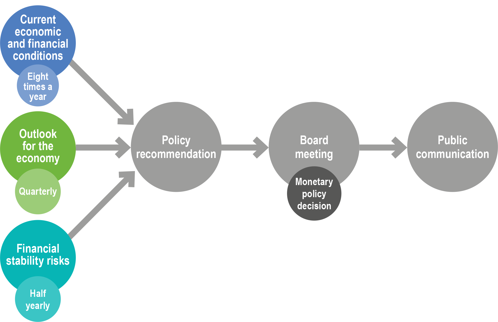
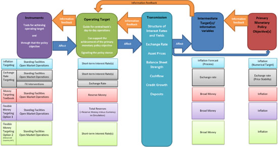
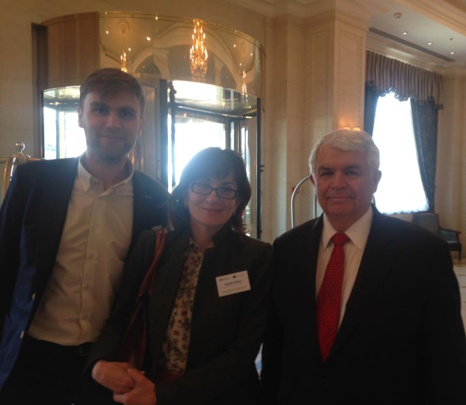
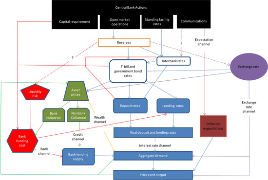
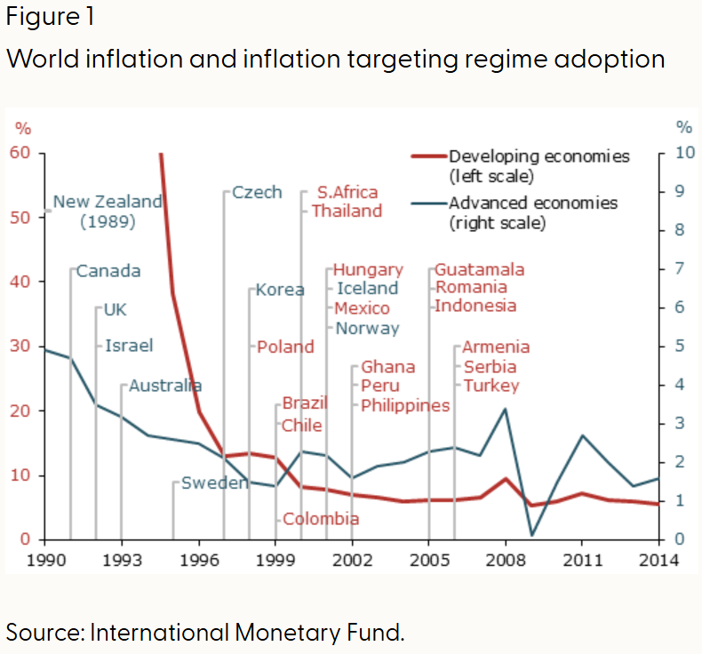
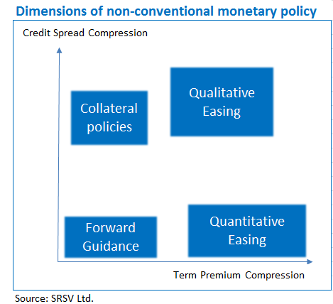
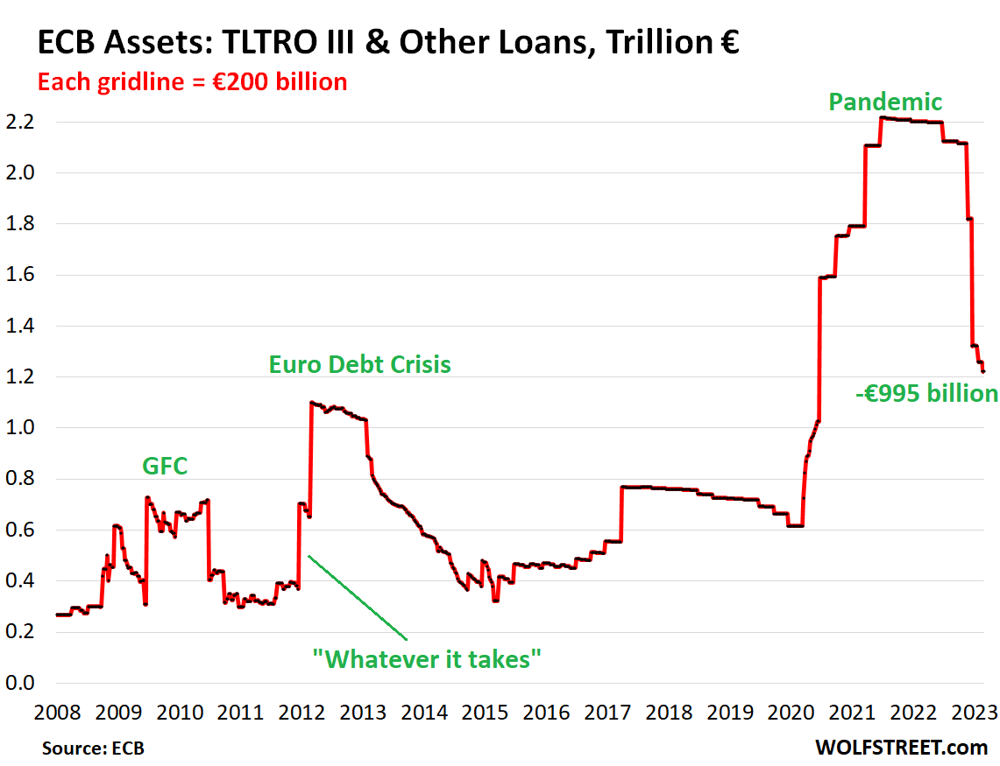
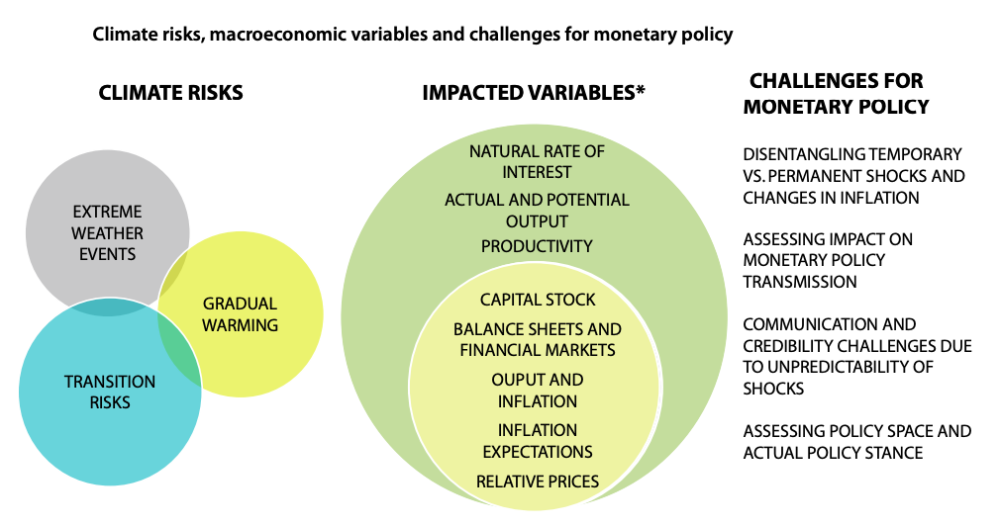

<style>
@media print{
  body, html, .remark-slides-area, .remark-notes-area {
    height: 100% !important;
    width: 100% !important;
    overflow: visible;
    display: inline-block;
    }
</style>

<style type="text/css">
.remark-slide-content {
    font-size: 38px;
    padding: 1em 4em 1em 4em;
}
</style>

<style type="text/css">
.my-one-page-font {
  font-size: 32px;
}
</style>

</style>

<style type="text/css">
.my-one-page-font-table {
  font-size: 28px;
}
</style>


```{r setup, include = FALSE}
library(tidyverse)
library(knitr)

opts_chunk$set(fig.width = 10, 
               message = FALSE, 
               warning = FALSE,
               echo = FALSE)
```

```{r xaringan-themer, include=FALSE, warning=FALSE}
#install.packages("xaringanthemer")
library(xaringanthemer)
style_mono_accent(
  base_color = "#135978", # #1c5253 #135978
  header_font_google = google_font("Josefin Sans"),
  text_font_google   = google_font("Montserrat", "500", "550i"),
  code_font_google   = google_font("Fira Mono"),
  colors = c(
  red = "#f34213",
  purple = "#3e2f5b",
  orange = "#ff8811",
  green = "#136f63",
  white = "#FFFFFF"
)
)
```

### **Agenda for Today**

1. **Monetary policy deep dive**
2. **Guest speaker from the Reserve Bank of Malawi**
3. **In-class group activity**

---

class: inverse, center, middle

# 1. Monetary policy deep dive
---

# What is Monetary Policy?

- **Definition:** Central bank actions to manage money supply, interest rates, and inflation.
- **Objectives:** Price stability, full employment, economic growth.
- **Instruments:** Interest rates, open market operations, reserve requirements.

<div>
.center[]
</div>
Source: [RBA](https://www.rba.gov.au/education/resources/explainers/what-is-monetary-policy.html)


---

# **What is Monetary Policy Framework?**

- **What is a monetary policy framework?**
  - Defines how central banks achieve **price stability and economic growth**.
  - **Core elements:** Objectives, instruments, transparency, and credibility.

- **Why is this important?**
  - A well-designed framework ensures **stable inflation, financial stability, and effective crisis management**.
---

# **Evolution of Monetary Policy Frameworks**

| Year   | Monetary Policy Framework                | Key Features & Developments                                      |
|--------|-----------------------------------------|------------------------------------------------------------------|
| Pre-1940s | **Gold Standard**                   | Currencies fully backed by gold; limited monetary policy flexibility |
| 1944-1971 | **Bretton Woods System**            | Fixed exchange rates pegged to USD; USD convertible to gold       |
| 1970s-1980s | **Monetary Aggregates Targeting** | Central banks control money supply to curb inflation              |
| 1990s-Present | **Inflation Targeting**         | Explicit inflation targets; central bank independence emphasized  |
| 2008-Present | **Unconventional Monetary Policy (UMP)** | QE, negative rates, forward guidance after financial crisis |
| 2010s-Present | **Macroprudential Policy**      | Strengthening financial regulation to ensure system stability     |
| 2020s-Present | **Climate & AI in Monetary Policy** | Addressing climate risks, integrating AI for decision-making    |

---

# **The Monetary Policy Framework: Instruments, Targets, and Objectives**

- **Instruments:** Tools central banks use to influence the economy.
  - **Interest rates, open market operations, reserve requirements**.

- **Targets:** Goals central banks aim to achieve.
  - **Inflation targets, employment targets, financial stability**.

- **Objectives:** Broader economic outcomes central banks seek.
  - **Price stability, full employment, economic growth**.

---

#### Monetary Policy Framework Components

<div>
.center[]
</div>
Source: [IMF](https://www.elibrary.imf.org/view/journals/001/2020/026/article-A001-en.xml)

---

# **Policy Rules vs. Discretion in Monetary Policy**

- **Policy Rules:** Clear guidelines for policy decisions.
  - **Example:** Taylor Rule links interest rates to inflation and output gaps.
- **Discretion:** Central banks adjust policy based on current conditions.
  - **Example:** Responding to unexpected economic shocks.

- Policy **should not be mechanical** but systematic.
- Challenges in implementing rules:
  - Measuring **output gap** is difficult.
  - Equilibrium policy rate fluctuates.
  - Handling negative interest rates.

---

# Taylor Rule
$$ r = p + 0.5y + 0.5(p-2) + 2 $$
- \( r \): Policy rate, \( p \): Inflation rate, \( y \): GDP deviation.
- Policy rate rises when inflation **exceeds** 2% or GDP is **above trend**.
- Reflects actual central bank decisions over recent years.

<div>
.center[]
</div>
<span style="font-size: 20px;">*Note*: with two great people Natalia Zaderey and John B. Taylor</span>

---

# **Monetary Policy Transmission Channels**
- **How does monetary policy affect the economy?**

- **Key channels:**
  - **Interest rates:** Influence borrowing, spending, and investment.
  - **Exchange rates:** Impact trade competitiveness and capital flows.
  - **Asset prices:** Affect wealth, consumption, and investment decisions.
  - **Expectations:** Shape consumer and investor behavior.

---

#### Monetary Policy Transmission Channels

<div>
.center[]
</div>
Source: [IMF](https://www.elibrary.imf.org/view/journals/001/2020/026/article-A001-en.xml)

---

# **Inflation Targeting: A Key Policy Framework**
- Introduced in **New Zealand (1990)**, widely adopted.

- **Core idea:** Maintain inflation within a specified range (e.g., 2% target).
-
 **Key characteristics:**
  - Numerical / explicit **inflation target** (e.g., 2%).
  - **Forecast targeting** based on economic indicators / Forward-looking approach.
  - High **transparency and accountability**, strong central bank **independence**

- **Effectiveness:** Helps anchor expectations, reduces inflation volatility.

---

#### Inflation trends before and after adopting inflation targeting.

<div>
.center[]
</div>
Source: [San Francisco Fed](https://www.frbsf.org/research-and-insights/publications/economic-letter/2015/05/inflation-targeting-advanced-developing-countries/)

---

# **Central Bank Independence & Transparency**
- **Independence:** Critical for credibility and avoiding political influence.
- **Transparency:** Enhances policy effectiveness by shaping expectations.
- **Examples:**
  - European Central Bank (ECB): High independence, formalized communication.
  - Federal Reserve (Fed): Dual mandate (price stability & employment).
  - Bank of Japan (BoJ): Abenomics era influence on policy autonomy.

#### **Table:** Central Bank Independence Across Countries

| Central Bank  | Independence Level | Transparency Score |
|--------------|------------------|-------------------|
| ECB          | High             | Strong          |
| Fed          | Medium           | Moderate       |
| BoJ          | Medium           | Strong         |

---

# **Unconventional Monetary Policy (UMP): Why It Emerged**
- **Traditional tools failed post-2008 financial crisis**:
  - **Interest rates hit zero (Zero Lower Bound - ZLB)**.
  - Financial markets **froze**, disrupting policy transmission.
- **Central banks needed new tools to stimulate the economy**.

#### Dimensions of Unconventional Monetary Policy

<div>
.center[]
</div>
Source: [Macrosynergy](https://macrosynergy.com/research/non-conventional-monetary-policy/
)


---

# **Types of Unconventional Monetary Policy (UMP)**
1. **Negative Interest Rate Policies (NIRP)**:
   - Encourages lending/spending but challenges banks’ profitability.
   - Used by ECB, BoJ, Swiss National Bank.
2. **Large-Scale Asset Purchases (Quantitative Easing, QE)**:
   - Central banks buy government & corporate bonds.
   - Reduces long-term interest rates and boosts liquidity.
3. **Forward Guidance**:
   - Central banks signal future policy direction to shape market expectations.
4. **Targeted Lending Programs**:
   - Direct lending support to banks & businesses.

#### **Table:** Countries Using Unconventional Policies

| Tool         | US Fed  | ECB    | BoJ   |
|-------------|--------|--------|------|
| QE          | ✅      | ✅      | ✅    |
| NIRP        | ❌      | ✅      | ✅    |
| Forward Guidance | ✅  | ✅      | ✅    |

---

# **Case Study: ECB’s Unconventional Tools**
- **Post-2008:** QE program **(Expanded Asset Purchase Programme - APP)**.
- **2014-present:** Negative interest rates on deposits.
- **Pandemic Response:** Pandemic Emergency Purchase Programme (PEPP).

#### ECB Balance Sheet Expansion

<div>
.center[]
</div>
Source: [San Wolf Street](https://wolfstreet.com/2023/03/07/ecbs-balance-sheet-drops-by-e1-trillion-from-peak-qt-milestone/)


---

# **Effectiveness and Challenges of UMP**
✅ **Successes:**
   - Lowered borrowing costs.
   - Prevented deeper recessions.
   - Stabilized inflation expectations.
   
❌ **Challenges:**
   - Side effects on bank profitability (NIRP).
   - Risk-taking behavior in financial markets.
   - Exit strategy and long-term impact.

---

### **Monetary Policy and Climate Change**

<div>
.center[]
</div>
Source: [Forumias](https://forumias.com/blog/impact-of-climate-change-on-monetary-policy/)

---

# AI, Digital Currencies & Monetary Policy
- **Artificial Intelligence (AI):**
  - Enhancing monetary policy decision-making through data-driven analysis.
  - Improving financial market supervision and fraud detection.

- **Central Bank Digital Currencies (CBDCs):**
  - Transforming payment systems and monetary transmission mechanisms.
  - Example: China’s **e-CNY**, ECB’s **digital euro**.
  - Potential risks: Disintermediation of commercial banks, data privacy concerns.

---

# **Discussion Questions**
1. How does **inflation targeting** help stabilize the economy?
2. What are the main **advantages and risks** of unconventional monetary policies?
3. Should central banks consider **climate change** in their monetary policy decisions?
4. Will **AI and digital currencies** change the role of central banks?
5. How should central banks **exit from UMP** without destabilizing markets?

#### **Activity:** Small-group discussion + case study analysis.

---

# **Conclusion & Key Takeaways**
- **Monetary policy frameworks evolved** to address modern economic challenges.
- **Unconventional policies were necessary**, but present risks.
- **Climate change & technology** will shape future central banking strategies.
- **Monetary policy remains a critical tool** for economic stability.

---

class: inverse, center, middle

# Any QUESTIONS?

## Thank You!  

---

# Next Class

- (Mar 26) Central Banking and Financial Stability 
      - The readings will be posted on the course website.

# We expect to have a guest speaker from the National bank of Ukraine.

???

1. To print pdf slides
https://stackoverflow.com/questions/54968311/xaringan-export-slides-to-pdf-while-preserving-formatting

pagedown::chrome_print("W1_ME.html") # but not all pictures are visible

2. Option: https://stackoverflow.com/questions/54968311/xaringan-export-slides-to-pdf-while-preserving-formatting

install.packages("remotes")
remotes::install_github("jhelvy/xaringanBuilder")
remotes::install_github("jhelvy/renderthis@v0.0.9")

library(xaringanBuilder)
build_pdf("DVC.html")

3. Option
writeBin(as.raw(c()), "favicon.ico") # create an empty favicon.ico file
install.packages("renderthis")
remotes::install_github('rstudio/chromote')
library(renderthis)

renderthis::to_pdf("W3_CB.html")

getwd()
setwd("C:/Users/Iegor/OneDrive - kdis.ac.kr/Documents/GitHub/Sogang/2025/Spring/Central Banking/Week 3")
