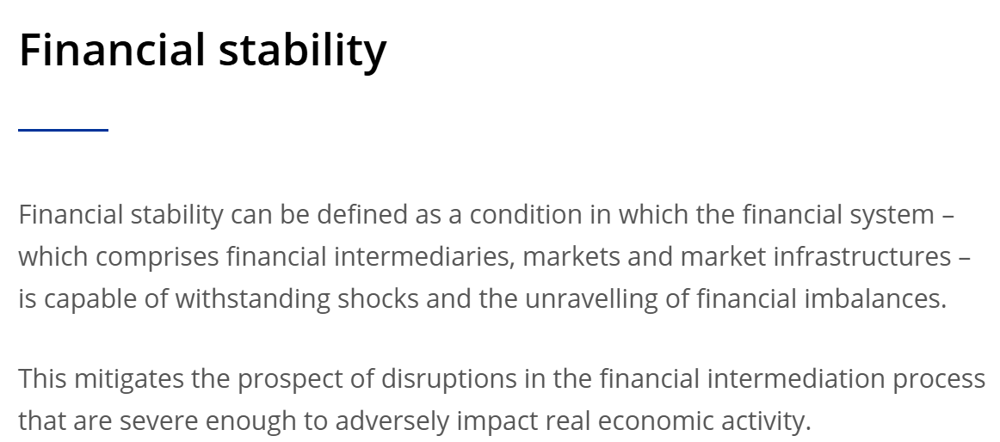

<style>
@media print{
  body, html, .remark-slides-area, .remark-notes-area {
    height: 100% !important;
    width: 100% !important;
    overflow: visible;
    display: inline-block;
    }
</style>

<style type="text/css">
.remark-slide-content {
    font-size: 38px;
    padding: 1em 4em 1em 4em;
}
</style>

<style type="text/css">
.my-one-page-font {
  font-size: 32px;
}
</style>

</style>

<style type="text/css">
.my-one-page-font-table {
  font-size: 28px;
}
</style>


```{r setup, include = FALSE}
library(tidyverse)
library(knitr)

opts_chunk$set(fig.width = 10, 
               message = FALSE, 
               warning = FALSE,
               echo = FALSE)
```

```{r xaringan-themer, include=FALSE, warning=FALSE}
#install.packages("xaringanthemer")
library(xaringanthemer)
style_mono_accent(
  base_color = "#135978", # #1c5253 #135978
  header_font_google = google_font("Josefin Sans"),
  text_font_google   = google_font("Montserrat", "500", "550i"),
  code_font_google   = google_font("Fira Mono"),
  colors = c(
  red = "#f34213",
  purple = "#3e2f5b",
  orange = "#ff8811",
  green = "#136f63",
  white = "#FFFFFF"
)
)
```

# Introduction

- The Global Financial Crisis (GFC) highlighted the need for **macroprudential** surveillance

- Central banks play a key role in **system-wide risk monitoring** and **financial regulation**

- Today’s topic: How central banks contribute to **financial stability**, with a focus on **Asian economies**

---

# **Agenda for Today**

1. **Central Banking and Financial Stability**

2. **Guest speaker from the National Bank of Ukraine**

3. **In-class group activity**

---

class: inverse, center, middle

# 1. Central Banking and Financial Stability

---

# What is Financial Stability?

- **Financial stability** refers to a **stable financial system** that can withstand economic shocks.

- **Key components:**
  - **Resilience:** Ability to withstand / absorb shocks without disruption.
  - **Robustness:** Soundness of financial institutions and markets.
  - **Smooth functioning:** Efficient allocation of resources.
  - **Sustainability:** Long-term stability and growth.


<div>
.center[]
</div>
<span style="font-size: 18px;">Source: [ECB](https://www.ecb.europa.eu/paym/financial-stability/html/index.en.html)</span>

- **Why is financial stability important?**


---

# You can picture financial stability as a **three-legged stool**:

<div>
.center[]
</div>

---

# Systemic Risk & Macroprudential Policy

- **Systemic Risk**: Disruption to financial services causing serious harm to the economy

- **Macroprudential Policy** aims to:
  - Limit procyclicality
  - Address interconnectedness
  - Increase system-wide resilience

---

# Why is This Relevant in Asia?

- Asia’s emerging markets:
  - Vulnerable to **volatile capital flows**
  - Still developing institutional capacity
  - History of **1997 Asian crisis** & **2008 GFC**

---

# Central Banks & Financial Stability

## Traditional vs Financial Stability Mandates

| Mandate | Description |
|--------|-------------|
| Price Stability | Control inflation (e.g. CPI targets) |
| Financial Stability | Prevent asset bubbles, systemic failures |
| Dual Mandate | Balance price and financial stability |
| Multiple Mandates | Include growth, employment, etc. |

**Key challenge**: **Trade-offs** between mandates

- Debate: Do the two goals conflict?

---

# Tools of Central Banks for Financial Stability

## Macroprudential Policy and Tools


- **Macroprudential policy** - regulation of the financial system as a whole to prevent systemic risk and stabilize the economy / the financial system.

- Examples:
  - **Capital requirements** (e.g., Basel III) to ensure banks have enough capital to absorb losses 
  - **Leverage ratios** to limit excessive borrowing
  - **Liquidity requirements** (e.g., LCR and NSFR) to ensure banks can meet obligations
  - **Stress tests** to assess resilience to shocks
  - **Countercyclical buffers** to build up capital in good times
  - **Loan-to-value ratios** (LTV) to limit excessive lending
  - **Loan-to-income ratios** (LTI) to limit excessive borrowing
  - **Debt-service-to-income ratios** (DTI, aka DSTI) to limit excessive borrowing

---

# Asia’s Experience

## Examples of Macroprudential Tools

| Country | Tool |
|--------|------|
| Korea | LTV cap, FX derivative limits |
| China | LTV + DTI ratios |
| Thailand | Reserve requirements, capital controls |

---

# Institutional Architecture

## Options for Financial Stability Regulation

1. Central bank-led (e.g., Bank of England)

2. Financial stability council (e.g., US FSOC)

3. Hybrid model (e.g., Japan, Korea)

> **Key requirement**: coordination across agencies

---

# Regional Cooperation

- Volatile capital flows call for cross-border dialogue

- **Asian Financial Stability Dialogue (AFSD)** proposed
- Potential roles:
  - Risk surveillance
  - Coordinated responses
  - Sharing resolution frameworks

---

# Financial Stability and Climate Change

- Climate change poses **physical**, **transition** and **liquidity risks** to the financial system

- Central banks integrate climate into:
  - **Macroprudential stress testing**
  - **Capital requirements** (under consideration)
  - **Capital buffers** (under consideration)
  - Disclosure standards (e.g., TCFD)
  - Supporting green finance and sustainable investment
  - **Network for Greening the Financial System (NGFS)**

- Asian central banks (e.g., MAS, BoK, PBoC) increasingly participate in **NGFS**

---

# Financial Stability and New Technologies

- **FinTech**: Innovation in payments, lending, and digital assets
  - Potential for faster services, but increased cyber and operational risk

- **AI/ML**: Enhancing credit assessment, fraud detection, but may amplify biases or risk clustering

- **RegTech**: Automates compliance, improves data transparency

- **SupTech**: Supervisory tech used by regulators to monitor risk in real time

- Challenge: Regulate innovation without stifling it; **sandbox environments** are key

---

# Current Challenges to Financial Stability

- **Geopolitical risks**: Conflicts, trade tensions, and sanctions affecting capital flows

- **High debt levels**: Public and private sector leverage post-COVID

- **Inflation shocks**: Tightening cycles exposing vulnerabilities in debt markets

- **Financial market volatility**: Repricing of risk due to interest rate hikes

- **Shadow banking**: Growth of non-bank financial intermediaries

- **Cybersecurity threats**: Increasing digitalization exposes system to operational risks

- **Climate-related shocks**: More frequent natural disasters and transitional financial risks

---

# Discussion

- Should central banks target asset prices?

- Is “leaning against the wind” always preferable to “cleaning” after?

- What tools are more effective: macroprudential or monetary?

- How can climate and digital finance be incorporated into regulation?

---

# Summary

- Financial stability is essential for long-term macroeconomic health

- Central banks need flexible tools and clear mandates

- Asia’s experience offers valuable lessons for EMEs globally

- New risks from climate and technology must be integrated into frameworks

---


# References

- Kawai, M. & Morgan, P. (2012). *Central Banking for Financial Stability in Asia*

- BIS (2011), ECB (2012), IMF Reports

---

class: inverse, center, middle

# Any QUESTIONS?

## Thank You!  

---

# Next Class

-(April 2) Economic Growth and Central Banks 
      - The readings will be posted on the course website.

???

1. To print pdf slides
https://stackoverflow.com/questions/54968311/xaringan-export-slides-to-pdf-while-preserving-formatting

pagedown::chrome_print("W1_ME.html") # but not all pictures are visible

2. Option: https://stackoverflow.com/questions/54968311/xaringan-export-slides-to-pdf-while-preserving-formatting

install.packages("remotes")
remotes::install_github("jhelvy/xaringanBuilder")
remotes::install_github("jhelvy/renderthis@v0.0.9")

library(xaringanBuilder)
build_pdf("DVC.html")

3. Option
writeBin(as.raw(c()), "favicon.ico") # create an empty favicon.ico file
install.packages("renderthis")
remotes::install_github('rstudio/chromote')
library(renderthis)

renderthis::to_pdf("W4_CB.html")

getwd()
setwd("C:/Users/Iegor/OneDrive - kdis.ac.kr/Documents/GitHub/Sogang/2025/Spring/Central Banking/Week 4")
