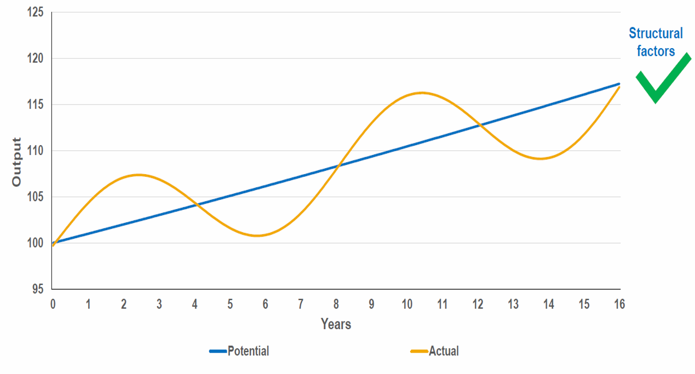

<style>
@media print{
  body, html, .remark-slides-area, .remark-notes-area {
    height: 100% !important;
    width: 100% !important;
    overflow: visible;
    display: inline-block;
    }
</style>

<style type="text/css">
.remark-slide-content {
    font-size: 38px;
    padding: 1em 4em 1em 4em;
}
</style>

<style type="text/css">
.my-one-page-font {
  font-size: 32px;
}
</style>

</style>

<style type="text/css">
.my-one-page-font-table {
  font-size: 28px;
}
</style>


```{r setup, include = FALSE}
library(tidyverse)
library(knitr)

opts_chunk$set(fig.width = 10, 
               message = FALSE, 
               warning = FALSE,
               echo = FALSE)
```

```{r xaringan-themer, include=FALSE, warning=FALSE}
#install.packages("xaringanthemer")
library(xaringanthemer)
style_mono_accent(
  base_color = "#135978", # #1c5253 #135978
  header_font_google = google_font("Josefin Sans"),
  text_font_google   = google_font("Montserrat", "500", "550i"),
  code_font_google   = google_font("Fira Mono"),
  colors = c(
  red = "#f34213",
  purple = "#3e2f5b",
  orange = "#ff8811",
  green = "#136f63",
  white = "#FFFFFF"
)
)
```

# Introduction

## Why Talk About Growth & Central Banks?

- Central banks aren't just inflation-fighters.

- They can actively **promote economic development**.

- Today’s dominant model is **inflation targeting + independence**.

- But historically? Far more **developmental** in purpose.

- Debates on **central bank independence** and **developmental mandates** are ongoing.
- **Key question**: Can central banks balance **price stability** and **economic growth**?

---

# Actual and Potential Output

<div>
.center[]
</div>

Remember : Trend level of output  is determined by structural factors e.g. labor, capital, technology, and not MP.

But the actual level of output is determined by the level of demand in the economy. And that demands can be influenced by the central bank.

---

# **Agenda for Today**

1. **Economic Growth and Central Banks**

2. **Presentation Assignment Intro**

3. **In-class group activity**

---

class: inverse, center, middle

# 1. Economic Growth and Central Banks

---

# Historical Context

- **Pre-1980s**: Central banks financed governments, guided credit to key sectors.
  - Used direct tools (credit ceilings, directed lending)
  - Supported industrial policy, infrastructure, and housing
  - Examples: Bank of Korea, Bank of Japan

- **Post-1980s**: Shift to neo-liberal model:
  - Anti-inflation focus
  - Reduced credit allocation
  - Support for financial liberalization
  - Central banks became more independent

- **Post-Covid**: Renewed interest in developmental roles
  - Climate change, digital finance, and inclusive growth are new priorities
  - Central banks are re-evaluating their roles

---

# What Is Developmental Central Banking?

- Uses monetary tools to **support productive sectors**
  - Example: agriculture, SMEs, green finance

- Allocates credit toward **long-term investment**
  - Example: infrastructure, housing, education

- Aims to **create financial institutions and deepen markets**
  - Example: microfinance, fintech

- Often works **closely with government planning**
  - Example: industrial policy, public investment
---

# Historical Examples: Central Banks Funding Development

- **Bank of France** (post-WWII): Directed credit to industry, housing

- **Bank of Japan**: Supported long-term industrial investment

- **US Fed**: Helped savings and loan associations in housing policy

- **Brazil's BNDES**: Long-standing role in infrastructure and industrial development

- **India’s RBI**: Provided concessional finance to agriculture and SMEs

Central banks have often acted as **developmental agencies** in nation-building phases

---

# Case: Bank of France (Post-WWII)

- Used **credit ceilings**, **preferential rates**

- Supported industrial policy through planning

- Helped **targeted lending** to exports, housing, manufacturing

- Was key to France’s modernization

---

# Case: Bank of Japan (1950s–80s)

- Worked with MITI to direct capital to **strategic industries**

- Fostered growth of steel, autos, electronics

- Supported **long-term financing**

**Tools**: Low-interest rediscounting, directed loans, moral suasion

Note: MITI = Ministry of International Trade and Industry
- Japan’s model of **coordinated capitalism**
- Focused on **industrial policy** and **export-led growth**
- Central bank played a key role in financing this model

---

# Case: Federal Reserve and NYC Banks (Early 20th C)

- Created to **support NY’s global financial role**

- Promoted dollar as reserve currency

- Facilitated US entry into global finance

Industrial policy for finance sector!
- Used **discount window** to support banks in crisis
- Provided liquidity to **savings and loan associations** for housing finance
- Helped create **Fannie Mae** and **Freddie Mac** for mortgage markets
- Supported **New Deal** programs for economic recovery

---

# Central Banks in Developing Countries

- In many emerging and low-income countries, CBs have **broader mandates**:
  - Promote **credit access** for underserved sectors
  - Finance **infrastructure and industry**
  - Support **financial inclusion** and **employment**
- Examples:
  - **Bangladesh Bank**: Green refinancing, SME support
  - **South Africa Reserve Bank**: Supports inclusive growth
  - **Nigeria’s CBN**: Agriculture finance, FX support
  - **RBI (India)**: Directed lending to priority sectors

These CBs often use **developmental mandates** alongside price stability


---

# Central Bank Independence: Friend or Foe to Growth?

- Pros of independence:
  - Reduces political pressure to overspend
  - Anchors inflation expectations

- Cons:
  - May restrict credit to strategic sectors
  - Less alignment with national development goals

Should mandates in developing countries be more flexible?

---

# The Rise of Green & Inclusive Mandates

## Sustainable growth is a priority

- Some CBs are now embracing **secondary mandates**:
  - ECB: Climate as a price stability concern
  - BoE: Climate stress testing
  - PBoC: Green credit and bonds support

Sustainability is becoming part of financial stability—and growth!

---

# Risks of Developmental CBs

- Potential for:
  - Political capture
  - Inflationary pressure
  - Resource misallocation

- Requires strong **governance**, **transparency**, and **clear goals**

Developmental does not mean discretionary!

---

# Rebalancing the Mandate

- Modern CBs must walk a fine line:
  - Ensure **stability** and **credibility**
  - But also respond to structural development needs
  - Leverage fintech, climate tools, and inclusive finance

- A dynamic, well-governed central bank can **support transformation**

---

# Direct vs Indirect Tools

| Type         | Tools                                        |
|--------------|----------------------------------------------|
| **Direct**   | Credit ceilings, sector quotas, state banks  |
| **Indirect** | Interest rates, open market operations       |

Direct tools = more effective for structural transformation (esp. in EMs)

---

# Modern Tensions: Inflation Targeting vs Growth

- **Neo-liberal model** says:
  - Central banks must *not* finance gov’t
  - Should avoid “picking winners” (no sectoral credit)

- But:
  - Low-income countries need **infrastructure**, **jobs**, **industrial policy**
  - Central banks might be only ones with institutional capacity

---

# Climate, Inclusion & Green Development

- Should CBs support:
  - Green bonds?
  - Climate stress testing?
  - Green investment refinancing?

**Green developmental policy** = modern version of older sectoral roles

---

# Central Bank Structures Matter

| Type                     | Features                                  |
|--------------------------|-------------------------------------------|
| Independent CBs          | Less responsive to fiscal needs           |
| Gov-Linked CBs           | More coordination with industrial policy  |
| Developmental CBs        | Mix of tools, targets growth + stability  |

**Balance required** – too much autonomy may limit development support

---

# Key Takeaways

- Historically, central banks:
  - Financed gov’t
  - Supported sectors
  - Used direct tools

- Today:
  - Growing tension between stability and inclusive growth
  - Green finance, SME credit, and digital inclusion raise new questions

---


# References

- Epstein, Gerald A. (2006). "Central Banks as Agents of Economic Development."   Working Paper, WIDER Research Paper, No. 2006/54.

---


class: inverse, center, middle

# 2. Presentation Assignment Intro

---

# Presentation Assignment

- According to the course syllabus, this **individual presentation assignment** accounts for **20% of your final grade**.

- Each student will give a **15-minute presentation** followed by a **5-minute Q&A session**.

- **Presentation Date:** Week 15 (June 11)

- **Topic:** *Current Issues in Central Banking*

**Tip:** Choose a topic that you find genuinely interesting — this will make your research, preparation, and presentation more engaging and insightful!


---
class: my-one-page-font


## Instructions & Requirements

### Topic Selection
- Choose a topic from the **List of Suggested Topics** below.
- **No duplicate topics** will be allowed — topics are assigned on a **first come, first served** basis.
- You may also propose a custom topic (subject to instructor approval).

### Suggested Topics
- International comparison of monetary policy frameworks
- International comparison of central bank governance structures
- A country study of monetary policy goals, operating targets, tools, and operations
- Regime changes in monetary policy and the economy
- Studies on monetary policy statements and transparency
- Central banks and financial stability objectives
- The role of communication as a monetary policy tool
- Monetary policy in normal versus crisis times
- Climate-related financial risks and the role of central banks
- Green monetary policy and central bank support for sustainable finance
- Central bank digital currencies (CBDCs): design, risks, and implications
- The role of artificial intelligence (AI) and machine learning in monetary policy or supervision
- Central banks and financial innovation: regulating fintech and digital assets
- Others at your proposal (requires prior approval by the instructor)

---

class: my-one-page-font

## Instructions & Requirements (cont'd)

### Presentation Delivery
- You must **submit the final version of your presentation slides** via Cyber Campus by **June 10 at 12:00 PM (noon)**.
- Prepare a presentation of **12–15 slides** (PowerPoint, PDF, or equivalent).
- You will have **15 minutes to present**, followed by a **5-minute Q&A**.
- **Active participation during other students’ Q&A sessions** is encouraged and will contribute to your grade.
- **Full credit** will be awarded only if you both **present** and **engage in Q&A discussions**.

### Summary Submission
- Submit a **1-page written summary** of your presentation.
- **Due date:** by class time on **June 4** via Cyber Campus.
- Format:
  - **Font:** 12 pt, **Spacing:** 1.5 lines
  - **Length:** maximum 1 page
  - **Content should include:**
    - Brief overview of your topic
    - Your key arguments and main findings
    - At least **3 academic references** (journal articles, policy papers, working papers)
    - **Citations and references** must follow **APA style**

---

## Grading Criteria (20%)
- Topic clarity and structure (4%)

- Quality of analysis and arguments (6%)

- Slide design and presentation delivery (4%)

- Summary paper (3%)

- Engagement in Q&A sessions (3%)


---


class: inverse, center, middle

# 3. In-class Group Activity

---

class: inverse, center, middle

# Any QUESTIONS?

**Let’s build a central bank that serves growth, stability & people.**

## Thank You!  


---

# Next Class

-(April 9) Exchange Rate Regimes and Currency Stability 
      - The readings will be posted on the Cyber Campus website.

???

1. To print pdf slides
https://stackoverflow.com/questions/54968311/xaringan-export-slides-to-pdf-while-preserving-formatting

pagedown::chrome_print("W1_ME.html") # but not all pictures are visible

2. Option: https://stackoverflow.com/questions/54968311/xaringan-export-slides-to-pdf-while-preserving-formatting

install.packages("remotes")
remotes::install_github("jhelvy/xaringanBuilder")
remotes::install_github("jhelvy/renderthis@v0.0.9")

library(xaringanBuilder)
build_pdf("DVC.html")

3. Option
writeBin(as.raw(c()), "favicon.ico") # create an empty favicon.ico file
install.packages("renderthis")
remotes::install_github('rstudio/chromote')
library(renderthis)

renderthis::to_pdf("W5_CB.html")

getwd()
setwd("C:/Users/Iegor/OneDrive - kdis.ac.kr/Documents/GitHub/Sogang/2025/Spring/Central Banking/Week 5")
