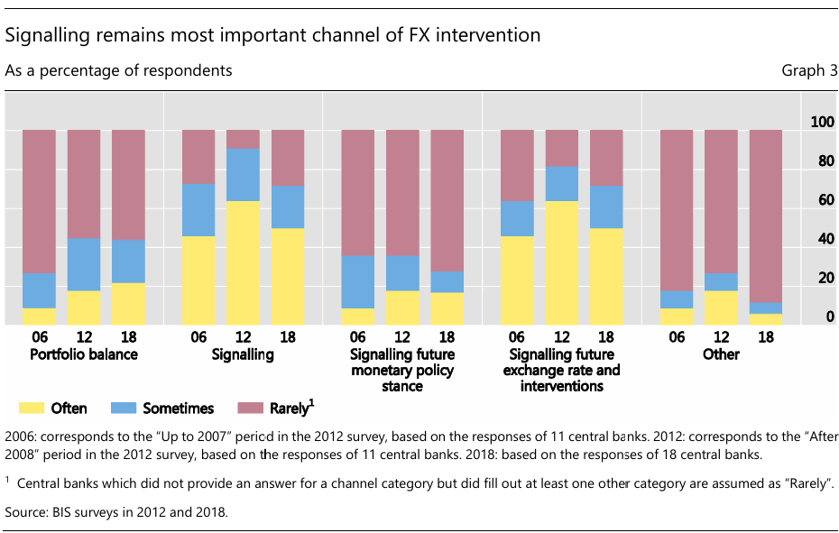
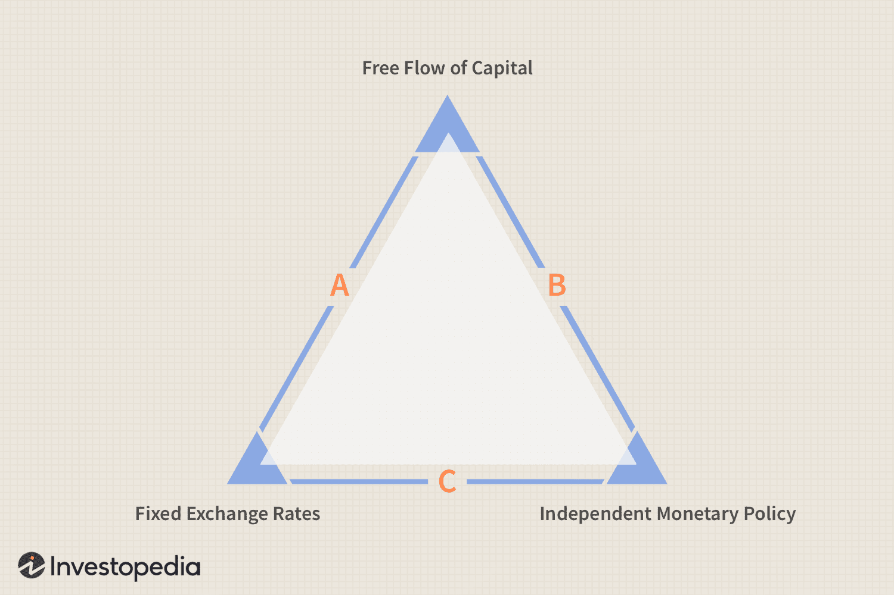

<style>
@media print{
  body, html, .remark-slides-area, .remark-notes-area {
    height: 100% !important;
    width: 100% !important;
    overflow: visible;
    display: inline-block;
    }
</style>

<style type="text/css">
.remark-slide-content {
    font-size: 38px;
    padding: 1em 4em 1em 4em;
}
</style>

<style type="text/css">
.my-one-page-font {
  font-size: 32px;
}
</style>

</style>

<style type="text/css">
.my-one-page-font-table {
  font-size: 28px;
}
</style>


```{r setup, include = FALSE}
library(tidyverse)
library(knitr)

opts_chunk$set(fig.width = 10, 
               message = FALSE, 
               warning = FALSE,
               echo = FALSE)
```

```{r xaringan-themer, include=FALSE, warning=FALSE}
#install.packages("xaringanthemer")
library(xaringanthemer)
style_mono_accent(
  base_color = "#135978", # #1c5253 #135978
  header_font_google = google_font("Josefin Sans"),
  text_font_google   = google_font("Montserrat", "500", "550i"),
  code_font_google   = google_font("Fira Mono"),
  colors = c(
  red = "#f34213",
  purple = "#3e2f5b",
  orange = "#ff8811",
  green = "#136f63",
  white = "#FFFFFF"
)
)
```

# Introduction

- Welcome to today's lecture on **Exchange Rate Regimes and Currency Stability** — an essential topic in understanding the broader role of central banks. 

- Exchange rates impact inflation, trade competitiveness, financial stability, and capital flows — all of which shape a country’s macroeconomic environment.

- Today we’ll explore how central banks intervene in foreign exchange markets, the rationale behind their actions, and how they design strategies and choose instruments to maintain currency stability. 

- This lecture draws on the BIS Paper by Patel & Cavallino (2019) and incorporates real-world practices from advanced and emerging market economies.

---

# Why Exchange Rate Stability Matters

- Vital for price stability, financial stability, external balance

- Especially important for **emerging market economies (EMEs)**

- Volatile capital flows and terms of trade create policy tension

---

# Objectives

- Understand exchange rate regimes

- Explore FX intervention goals and strategies

- Evaluate effectiveness and transmission channels

- Discuss central banks' tactics and tools

- Reflect on modern challenges and policy trade-offs

---

# **Agenda for Today**

1. **Exchange Rate Regimes and Currency Stability**

3. **In-class group activity**

---

class: inverse, center, middle

# 1. Exchange Rate Regimes and Currency Stability

---


# Are Exchange Rates Within the Realm of Central Banks?

**Question for Discussion:**

- To what extent should central banks influence or control exchange rates?

**Considerations:**

- Central banks' mandates often include price stability, full employment, and economic growth.

- Exchange rate stability can impact inflation, trade balances, and financial stability.

---

# Historical Example – The Bank of England and Black Wednesday (1992)

**Context:**

- In 1992, the UK was part of the European Exchange Rate Mechanism (ERM), aiming to maintain currency stability among European nations.

**Central Bank Action:**

- The Bank of England intervened by spending billions of pounds in an attempt to prop up the depreciating pound and keep it within the ERM limits.

**Outcome:**

- Despite the intervention, the pound couldn't be maintained within the ERM bands, leading to the UK's exit from the mechanism on September 16, 1992, known as "Black Wednesday."

---

# Historical Example – Swiss National Bank's Currency Cap (2011–2015)

**Context:**

- Post-2008 financial crisis, the Swiss franc appreciated significantly due to its safe-haven status.

**Central Bank Action:**

- In 2011, the Swiss National Bank (SNB) set a minimum exchange rate of 1.20 CHF per euro to curb the franc's overvaluation and protect the economy.

**Outcome:**

- The SNB maintained this cap until 2015, when it was abruptly removed, leading to a sharp appreciation of the franc.

---

# Current Example – Bank of Japan's Interest Rate Policies (2024)

**Context:**

- In response to prolonged low inflation and economic stagnation, the Bank of Japan (BOJ) maintained low-interest rates.

**Central Bank Action:**

- In July 2024, the BOJ raised interest rates to 0.25%, aiming to strengthen the yen and control inflation.

**Outcome:**

- The yen strengthened sharply in subsequent days, illustrating the impact of central bank policies on exchange rates.

---

# Current Example – Central Bank of Brazil's Dollar Intervention (December 2024)

**Context:**

- Facing significant currency depreciation pressures, Brazil's central bank intervened in the foreign exchange market.

**Central Bank Action:**

- In December 2024, the Central Bank of Brazil sold $21.57 billion in the spot market, marking its largest monthly intervention since adopting a floating exchange rate in 1999.

**Outcome:**

- The intervention aimed to stabilize the Brazilian real amidst substantial dollar outflows.

---

# Conclusion

- Central banks play a pivotal role in influencing exchange rates through various interventions and policy decisions.

- Historical and current examples illustrate the complexities and impacts of such actions on national and global economies.

---

# Types of Exchange Rate Regimes

| Regime Type         | Example         | Central Bank Role        |
|---------------------|------------------|---------------------------|
| Fixed / Pegged      | Hong Kong, Saudi Arabia | Maintain parity using reserves |
| Managed Float       | India, Indonesia | Intervene as needed       |
| Free Float          | US, Eurozone     | Market-determined         |

---

# Central Bank Goals for FX Intervention

- **Price Stability**

- **Curb Speculation**

- **Build Reserves**

- **Smooth Capital Flows**

- **Financial Stability**

- **External Competitiveness**

> _More than half of EM central banks intervene to support price stability_  
— Patel & Cavallino (2019)

---

# Intermediate Objectives

- Limit **exchange rate volatility**

- Provide **liquidity** in thin FX markets

- Influence **trend path** of exchange rates

- Smooth **capital flow pressures**

---

# Effectiveness of FX Intervention

- Mostly short-term (under 1 month)

- Medium-term effects if repeated

- Long-term effectiveness is limited

> FX intervention affects expectations via **signaling** and **portfolio balance** channels.

---

# Transmission Channels

.pull-left[
### Portfolio Balance
- Assets not perfect substitutes  

- Reserve changes shift demand

### Signaling
- Interventions signal future policy  

- Impact expectations and behavior
]

.pull-right[
<div>
.center[]
</div>
]

---

# Instruments of Intervention

- Spot market (most common)

- FX **swaps**, **forwards**, **options**

- Onshore vs offshore

### Recent trends:
- Greater use of derivatives

- Preference for discretion over rules

---

# Sterilization Techniques

- Central bank securities (most common)

- Reserve requirements (less frequent)

- Government deposits

> Market-based tools are also seen as aiding **market development**

---

# Communication Strategies

- Most interventions are **not pre-announced**

- Latin America more transparent than Asia

- Some interventions use **rules**, but most are discretionary

---

# Central Banks’ Strategic Choices

- **Timing**: reactive vs preemptive

- **Transparency**: signal vs surprise

- **Objectives**: reserves, stability, signaling, liquidity

---

# Trade-offs in Exchange Rate Policy

.pull-left[
## Stability vs Flexibility
- Intervening too much can distort markets

- Too little can allow volatility to damage stability

## Growth vs Inflation
- FX moves can impact both
]

.pull-right[
<div>
.center[]
</div>
*The "Impossible Trinity" or Trilemma*
]

---

# Mini Case: Bank Indonesia (2018)

- Tight global financial conditions

- Rupiah depreciation pressure

- Used FX intervention to stabilize markets

- Conducted NDFs to deepen local hedging market

---

# Discussion Points

- Should FX interventions always be sterilized?

- What is the role of communication in FX interventions?

- How can central banks judge the **right** time to intervene?

---

# Key Takeaways

- Exchange rate regimes shape CB behavior

- FX interventions serve **multiple goals**

- Effectiveness is often **short-term**

- Tools and transparency matter

- Trade-offs must be managed wisely

---

# References

- Patel, N. & Cavallino, P. (2019). *FX intervention: goals, strategies and tactics*. BIS Papers No. 104.
- Sarno & Taylor (2001), *Official FX Intervention*
- Fratzscher et al. (2019), *Effectiveness of FX Intervention*
- Bank of England and Black Wednesday
- Swiss National Bank's Currency Cap
- Bank of Japan's Interest Rate Policies
- Central Bank of Brazil's Dollar Intervention

---


class: inverse, center, middle

# 2. In-class Group Activity

---

class: inverse, center, middle

# Any QUESTIONS?

**Let’s build a central bank that serves growth, stability & people.**

## Thank You!  


---

# Next Class

-(April 16) Central Bank Communication and Transparency / Data Analysis 
      - The readings will be posted on the Cyber Campus website.

???

1. To print pdf slides
https://stackoverflow.com/questions/54968311/xaringan-export-slides-to-pdf-while-preserving-formatting

pagedown::chrome_print("W1_ME.html") # but not all pictures are visible

2. Option: https://stackoverflow.com/questions/54968311/xaringan-export-slides-to-pdf-while-preserving-formatting

install.packages("remotes")
remotes::install_github("jhelvy/xaringanBuilder")
remotes::install_github("jhelvy/renderthis@v0.0.9")

library(xaringanBuilder)
build_pdf("DVC.html")

3. Option
writeBin(as.raw(c()), "favicon.ico") # create an empty favicon.ico file
install.packages("renderthis")
remotes::install_github('rstudio/chromote')
library(renderthis)

renderthis::to_pdf("W6_CB.html")

getwd()
setwd("C:/Users/Iegor/OneDrive - kdis.ac.kr/Documents/GitHub/Sogang/2025/Spring/Central Banking/Week 6")
