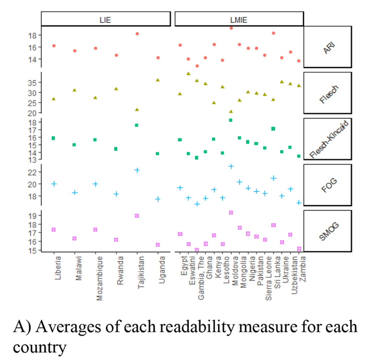
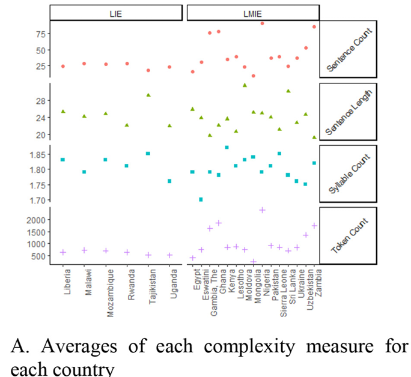
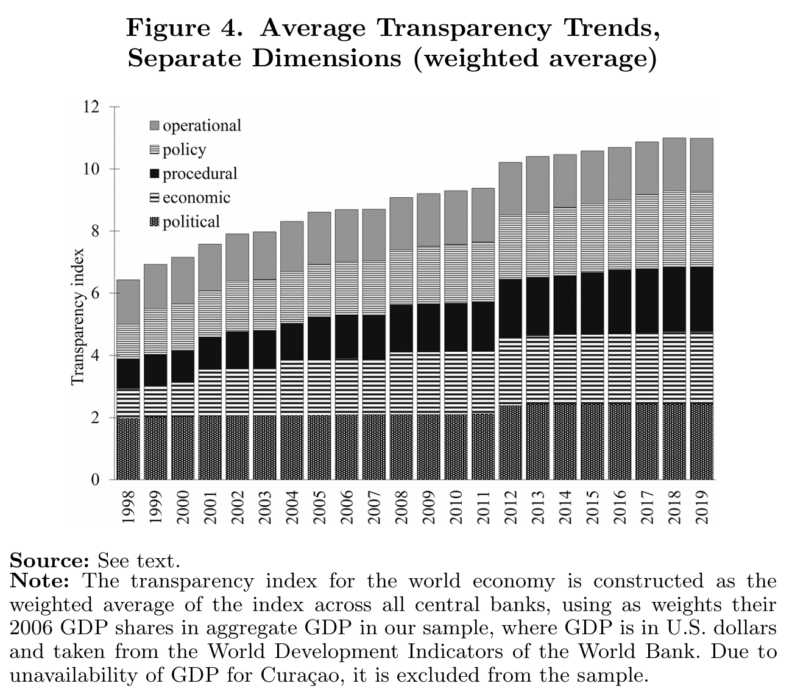
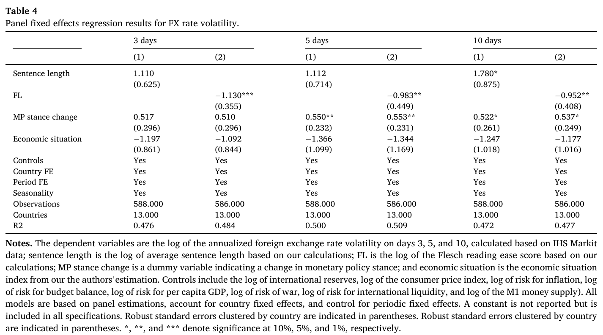

<style>
@media print{
  body, html, .remark-slides-area, .remark-notes-area {
    height: 100% !important;
    width: 100% !important;
    overflow: visible;
    display: inline-block;
    }
</style>

<style type="text/css">
.remark-slide-content {
    font-size: 38px;
    padding: 1em 4em 1em 4em;
}
</style>

<style type="text/css">
.my-one-page-font {
  font-size: 32px;
}
</style>

</style>

<style type="text/css">
.my-one-page-font-table {
  font-size: 28px;
}
</style>


```{r setup, include = FALSE}
library(tidyverse)
library(knitr)

opts_chunk$set(fig.width = 10, 
               message = FALSE, 
               warning = FALSE,
               echo = FALSE)
```

```{r xaringan-themer, include=FALSE, warning=FALSE}
#install.packages("xaringanthemer")
library(xaringanthemer)
style_mono_accent(
  base_color = "#135978", # #1c5253 #135978
  header_font_google = google_font("Josefin Sans"),
  text_font_google   = google_font("Montserrat", "500", "550i"),
  code_font_google   = google_font("Fira Mono"),
  colors = c(
  red = "#f34213",
  purple = "#3e2f5b",
  orange = "#ff8811",
  green = "#136f63",
  white = "#FFFFFF"
)
)
```


# Introduction

- Why did central banks move from secrecy to transparency?

- What is the role of communication in modern monetary policy?

- How does clarity affect financial markets?

---

# Historic Evolution of CB Communication

- Before 1990s: **Opaque** & secretive policy

- 1990s–2008: Rise of **transparency** & inflation targeting

- 2008–now: Communication during **crises & unconventional policy**

- Shift from **mystique** to **message clarity**

_Quotes:_
> “Never explain, never excuse” – Montagu Norman, BoE (1920s)  
> “98% talk and 2% action” – Ben Bernanke

---

# Why Communication Matters

- Anchors **inflation expectations**

- Shapes **market reactions** to policy

- Enhances **credibility** and **accountability**

- Crucial under **forward guidance** & **unconventional policies**

> “Monetary policy is the management of expectations.” – Draghi

---

# Forms and Channels of Communication

- **Formal tools**: Policy statements, inflation reports, speeches

- **Forward guidance**: Path of future policy

- **Target audience**:
  - Markets
  - Households & firms
  - Media & legislature

---

# Measuring Communication: Readability & Complexity

- Text analysis tools help measure clarity:
  - **Flesch-Kincaid** index (grade-level readability)
  - **Fog Index**, **SMOG**, **ARI**

- Example from Vyshnevskyi et al. (2024):
  - Clearer communication = **lower FX volatility** in EMs

---

# Readability measures across countries

<div>
.center[]
</div>

<div style="font-size: 14px;">
Notes. FK, Flesch–Kincaid readability score; Flesch, Flesch reading ease score; ARI, Automated Readability Index; FOG, Gunning Fog index; SMOG, 
Simple Measure of Gobbledygook. LIE: Low-income economies; LMIE - Lower-middle-income economies. The color scale legend in Panel B indicates 
that the correlation goes from 0 to 1, as reflected by the spectrum from mild red to very dark red, and from 0 to +1, as reflected by the spectrum 
from mild blue to very dark blue. 
</div>

---

# Complexity measures across countries

<div>
.center[]
</div>

<div style="font-size: 14px;">
Notes. Sentence count is the average number of sentences per statement for a given country; sentence length is the average sentence length per 
statement for a given country; syllable count is the average syllable number per word in a statement for a given country; and token count is the 
average number of tokens per statement for a given country. LIE: Low-income economies; LMIE: Lower-middle-income economies. 
</div>

---


# Global Trends in Transparency

- Dincer et al. (2022): Transparency index improved globally
- Driven by:
  - **Inflation targeting**
  - **Policy rule-based frameworks**
  - **Demand for accountability**

<div>
.center[]
</div>

---

# Research Highlights: Sohn & Vyshnevskyi (2023)

- Identified **strategic shifts** in CB communication

- Moved beyond markets to **broader audiences**

- CBs now employ multiple channels:
  - Infographics, social media, websites

> “Silence no longer guarantees independence.”

---

# Communication & Financial Markets

- Clear communication reduces uncertainty:
  - Lower **FX rate volatility**
  - Better **bond market reactions**

- Forward guidance shapes **yield curve**

- Empirical support from: BoE, ECB, Fed, RBNZ

---

# Case Study: Readability & FX Volatility

- Vyshnevskyi et al. (2024):
  - Sample: 21 developing countries, 2010–2021
  - Found **negative link** between clarity and FX volatility

<div>
.center[]
</div>

---

# Limits of Communication

- **Interpretation bias** across audiences

- High complexity → **less understanding**

- Overcommunication → **noise** or **confusion**

- Clarity does not guarantee **credibility**

---

# Emerging Tools: NLP & Data Science

- Text mining in central banking:
  - Topic modeling
  - Sentiment analysis
  - Clarity metrics

- Research frontier: **AI-powered transparency tools**

---

# Discussion Questions

1. Should central banks target simplicity over precision?

2. Can communication replace action in uncertain times?

3. What are the risks of 'too much' transparency?

4. How should CBs communicate with **non-expert** audiences?

---

# Wrap-Up

- Communication is now a **core policy tool**

- Transparency builds **trust**, anchors **expectations**

- Modern central banking ≠ only actions → also **words**

- Clarity matters — especially in **developing economies**

---

# References

- Dincer, N. N., & Eichengreen, B. (2022). Central Bank Transparency: A Global Perspective. Journal of International Money and Finance, 121, 102537.

- Sohn, W., & Vyshnevskyi, I. (2023). The Evolution of Central Bank Communication: From Secrecy to Transparency. Journal of Financial Stability, 60, 100-120.

- Vyshnevskyi, I., & Sohn, W. (2024). The Impact of Central Bank Communication on Financial Markets: Evidence from Emerging Economies. Journal of International Money and Finance, 120, 102-120.

---


class: inverse, center, middle

# 2. In-class Group Activity

---

class: inverse, center, middle

# Any QUESTIONS?

**Let’s build a central bank that serves growth, stability & people.**

## Thank You!  


---

# Next Class

-(April 23) Midterm Exam (15:02-17:15) 
      - Please review slides for conceptual based questions.
      - Please review in-class activities for practical/case based questions.

???

1. To print pdf slides
https://stackoverflow.com/questions/54968311/xaringan-export-slides-to-pdf-while-preserving-formatting

pagedown::chrome_print("W1_ME.html") # but not all pictures are visible

2. Option: https://stackoverflow.com/questions/54968311/xaringan-export-slides-to-pdf-while-preserving-formatting

install.packages("remotes")
remotes::install_github("jhelvy/xaringanBuilder")
remotes::install_github("jhelvy/renderthis@v0.0.9")

library(xaringanBuilder)
build_pdf("DVC.html")

3. Option
writeBin(as.raw(c()), "favicon.ico") # create an empty favicon.ico file
install.packages("renderthis")
remotes::install_github('rstudio/chromote')
library(renderthis)

renderthis::to_pdf("W7_CB.html")

getwd()
setwd("C:/Users/Iegor/OneDrive - kdis.ac.kr/Documents/GitHub/Sogang/2025/Spring/Central Banking/Week 7")
