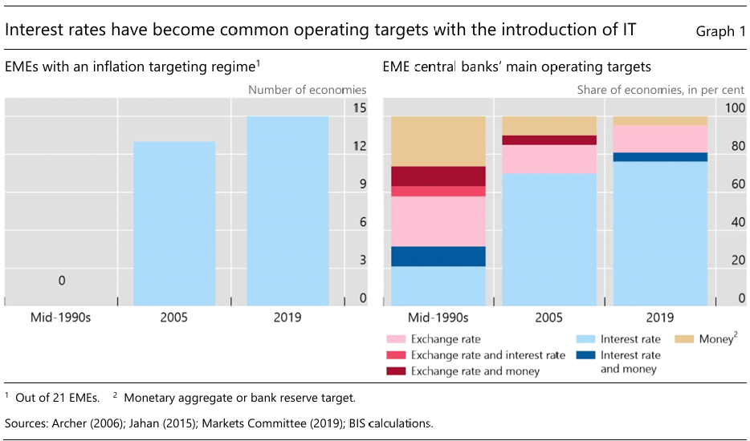
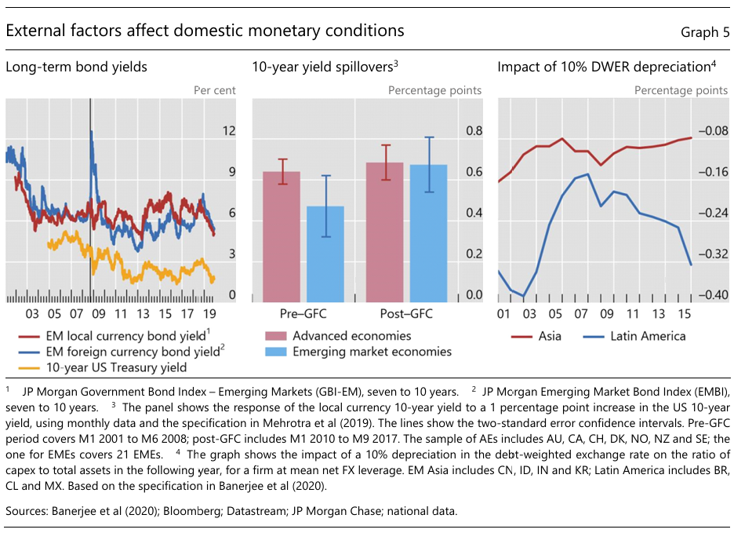
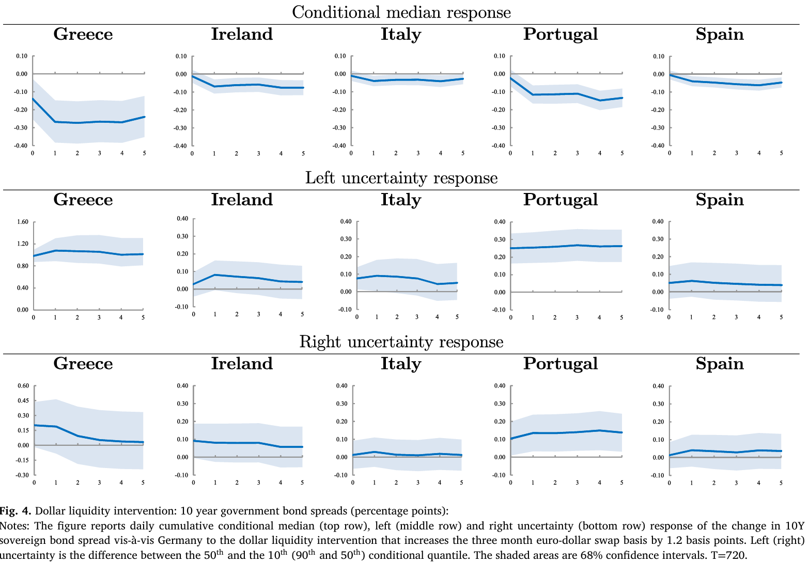

<style>
@media print{
  body, html, .remark-slides-area, .remark-notes-area {
    height: 100% !important;
    width: 100% !important;
    overflow: visible;
    display: inline-block;
    }
</style>

<style type="text/css">
.remark-slide-content {
    font-size: 38px;
    padding: 1em 4em 1em 4em;
}
</style>

<style type="text/css">
.my-one-page-font {
  font-size: 32px;
}
</style>

</style>

<style type="text/css">
.my-one-page-font-table {
  font-size: 28px;
}
</style>


```{r setup, include = FALSE}
library(tidyverse)
library(knitr)

opts_chunk$set(fig.width = 10, 
               message = FALSE, 
               warning = FALSE,
               echo = FALSE)
```

```{r xaringan-themer, include=FALSE, warning=FALSE}
#install.packages("xaringanthemer")
library(xaringanthemer)
style_mono_accent(
  base_color = "#135978", # #1c5253 #135978
  header_font_google = google_font("Josefin Sans"),
  text_font_google   = google_font("Montserrat", "500", "550i"),
  code_font_google   = google_font("Fira Mono"),
  colors = c(
  red = "#f34213",
  purple = "#3e2f5b",
  orange = "#ff8811",
  green = "#136f63",
  white = "#FFFFFF"
)
)
```


# Introduction

- Financial markets are essential to the implementation and transmission of central bank policy.

- Central banks influence market conditions through interest rates, asset purchases, liquidity tools, and forward guidance.

- In return, financial market responses inform central banks' assessments and strategies.

- This lecture explores:
  - How developed markets enhance monetary effectiveness
  - How market expectations react to different policy tools
  - Key lessons from emerging markets and the euro area crisis

---

class: inverse, center, middle

# 1. Financial Markets and Central Bank Policy

---

# Price Stability & Financial Markets

**Price stability** is the primary mandate of most central banks — low and predictable inflation.

### Why It Matters for Markets:

- Anchors **inflation expectations** → stabilizes long-term interest rates
- Enhances **asset valuation certainty** (esp. bonds, equities)
- Reduces **risk premiums** across markets

---
# Price Stability & Financial Markets (cont'd)

.pull-left[
### When Price Stability Holds:
- Bond markets: Lower volatility in yields
- FX markets: Currency more stable → lower hedging costs
- Credit markets: Predictable inflation boosts lending
]

.pull-right[
### When It Breaks:
- Inflation surge → real returns fall → sell-offs
- Unanchored expectations → yield curve steepens
- Capital flight in EMEs → FX & equity shocks
]

> "Stable prices are a precondition for deep and efficient financial markets."

---

# Financial Stability & Financial Markets

- **Financial stability mandate** emerged as a core function post-2008.

- Stability depends on **resilient financial markets** — well-capitalized banks, liquid bond markets, functional repo & FX markets.

---

# Financial Stability & Financial Markets (cont'd)

.pull-left[
#### Key Instruments:
- Macroprudential tools:
  - Countercyclical capital buffers
  - Loan-to-value (LTV) ratios
  - Debt service-to-income limits
- Market-wide surveillance:
  - Stress tests
  - Asset price monitoring
]

.pull-right[
#### Financial Market Role:
- Signal systemic stress (e.g., credit spreads, repo rates)
- Amplify or absorb shocks
- Transmit policy signals or distort them (e.g., herding)
]

---

# Financial Stability & Financial Markets (cont'd)

#### Trade-off:

- **Liquidity support** vs. **moral hazard**

- **Market correction** vs. **disorderly unwinding**

> “Modern central banks must act pre-emptively and communicate clearly to maintain trust.”

---

# Central Banks as Supervisors & Financial Markets

Central banks often serve as **prudential supervisors** of banks and financial institutions.

### Why This Matters for Markets:

- **Supervisory oversight** affects investor confidence.

- Markets watch **central bank reports, stress tests, and regulatory actions** for signals.

---

# Central Banks as Supervisors & Financial Markets (cont'd)

.pull-left[
### Supervisory Roles:
- Ensure solvency of major institutions
- Monitor systemic risk and contagion channels
- Oversee liquidity and capital buffers
- Implement Basel III / macroprudential rules
]

.pull-right[
### Impact on Markets:
- Positive: Transparency boosts investor trust
- Negative: Supervisory lapses → crises (e.g., SVB 2023)
- Surprise interventions can move equity/bond markets
]

> "Effective supervision reduces market uncertainty and enhances financial stability."

---


# Financial Market Development (FMD)

- FMD improves monetary policy transmission.

- Deeper repo, bond, and interbank markets => better interest rate pass-through.

- FMD includes:
  - Repo market growth
  - Local bond markets deepening
  - Shift from money targeting → interest rate targeting

---

# Financial Market Development (FMD) (cont'd)


**Figure:**  
Interest rate as main monetary target  
<div>
.center[]
</div>

**Key Source:** Mehrotra & Schanz (2020)


---

# Policy Implementation and Market Development

- Central banks in EMEs used their tools not only to steer the economy but also to foster financial markets.

- **Key tools**:
  - Liquidity management (e.g., repos, reverse repos)
  - Asset purchases (e.g., government bonds, corporate bonds)
  - Forward guidance

- Instruments like repos or central bank securities helped develop:
  - Yield curves
  - Liquidity benchmarks
  - Collateralized funding options

---

# Monetary Transmission Channels

1. **Interest Rate Channel**: Stronger when bond markets are deep.

2. **Expectations Channel**: Enhanced by liquid and transparent markets.

3. **Balance Sheet Channel**: More effective when households/firms are indebted.

4. **Financial Accelerator**: Risk-taking and credit access amplify policy effects.

---

# Global Financial Integration

- FMD leads to **greater sensitivity to global interest rates**.

- Spillover from U.S. yields to EMEs:
  - Pre-GFC: ~0.47
  - Post-GFC: ~0.67

<div>
.center[]
</div>

---

# Case: Euro Crisis – ECB and Market Reactions

.pull-left[
- ECB deployed varied tools: SMP (Securities Markets Programme), LTRO (Long-Term Refinancing Operations), OMT (Outright Monetary Transactions).

- **Only OMT** had strong expansionary effects.

- Euro liquidity (e.g., LTRO) had limited impact.
]

.pull-right[
<div>
.center[]
</div>
]

_Source: Mody & Nedeljkovic (2024)_

???
 Provision of dollar liquidity reduced the median spreads of all five 
bonds (Fig. 4, top row). The contemporaneous and first day reactions 
are the strongest in magnitude and are mostly statistically significant; 
the responses tend to die out thereafter. Importantly, we do not observe 
any reversion to pre-intervention levels as the cumulative responses 
remain statistically significant. The absolute size of daily reactions is 
also economically significant. While the median spreads’ daily change 
ranges from 0.2 basis points for Italy to 3 basis points for Greece, the 
estimated maximum daily median reductions in spreads vary from 2.9 
basis points (Italy) to 14 basis points (Greece) in response to the dollar 
liquidity intervention that shrinks the dollar basis by 1.2 basis points.

 Moreover, the likelihood of large spread declines (left uncertainty) 
increases. This higher likelihood of spread decrease is primarily instan
taneous and statistically significant for Greek, Portuguese, and Italian 
bonds. The likelihood of large spread increases (right uncertainty) does 
not change in a statistically significant manner for other bonds, except 
for Portugal, for which the change is smaller relative to left uncertainty. 
Overall, therefore, dollar liquidity injections had a sizeable and consis
tent calming effect on the eurozone sovereign bond markets.

---

# Lessons from ECB Policy

- Markets prefer **unambiguous policy**.

- SMP & LTRO: Increased uncertainty.

- OMT: Reduced risk premiums, improved equity performance.

*Clear communication matters as much as the policy itself.*

---

# Central Bank Policy and Equity Markets

- QE, forward guidance, and liquidity programs influence:
  - Credit spreads
  - Corporate bond pricing
  - Stock indices

Example:
- ECB bond purchases lowered periphery yields.
- But only OMT improved equity returns significantly.

---

# FMD and Market-Based Indicators

- With FMD, CBs can extract info from:
  - Bond yields
  - Breakeven inflation
  - FX swaps and repo spreads

But beware of:
- Liquidity premiums
- Self-reinforcing signaling

---

# Summary of Key Takeaways

- Developed financial markets are critical for effective monetary policy.
  - Financial market depth and structure strongly influence how monetary policy transmits through the economy.

- Financial markets react asymmetrically to central bank tools.
  - Market expectations can amplify or weaken the impact of central bank interventions.
  - Clarity, credibility, and consistency are critical in maintaining stable market expectations.

- Clear, consistent communication enhances effectiveness.
  - Central banks must adapt their tools and communication depending on market maturity and context.

- Euro crisis shows: **Ambiguity leads to volatility**, **clarity restores credibility**.

---

# Discussion Questions

1. Why do some central bank tools (e.g., OMT) have stronger market effects than others (e.g., SMP or LTRO)?

2. How can central banks balance the need to act quickly in crises with the need to maintain clear, transparent communication?

3. In developing countries with shallow markets, what strategies can central banks use to improve monetary transmission?

4. How can central banks ensure their signals are clearly understood by markets?

5. What risks come from relying too much on financial market signals for policymaking?

---

# References

- Mehrotra, A., & Schanz, J. (2020). *Financial market development and monetary policy*. BIS Papers No 113.
- Mody, A., & Nedeljkovic, M. (2024). *Central bank policies and financial markets: Lessons from the euro crisis*. Journal of Banking & Finance.


---

class: inverse, center, middle

# 2. In-class Group Activity

---

class: inverse, center, middle

# Any QUESTIONS?

**Let’s build a central bank that serves growth, stability & people.**

## Thank You!  


---

# Next Class

-(May 7) Climate Change and Central Banking  
      - The readings will be posted on the Cyber Campus website.

???

1. To print pdf slides
https://stackoverflow.com/questions/54968311/xaringan-export-slides-to-pdf-while-preserving-formatting

pagedown::chrome_print("W1_ME.html") # but not all pictures are visible

2. Option: https://stackoverflow.com/questions/54968311/xaringan-export-slides-to-pdf-while-preserving-formatting

install.packages("remotes")
remotes::install_github("jhelvy/xaringanBuilder")
remotes::install_github("jhelvy/renderthis@v0.0.9")

library(xaringanBuilder)
build_pdf("DVC.html")

3. Option
writeBin(as.raw(c()), "favicon.ico") # create an empty favicon.ico file
install.packages("renderthis")
remotes::install_github('rstudio/chromote')
library(renderthis)

renderthis::to_pdf("W9_CB.html")

getwd()
setwd("C:/Users/Iegor/OneDrive - kdis.ac.kr/Documents/GitHub/Sogang/2025/Spring/Central Banking/Week 9")
