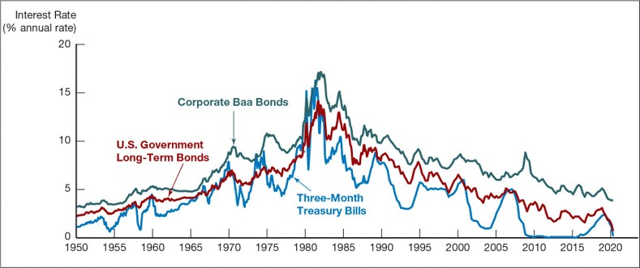
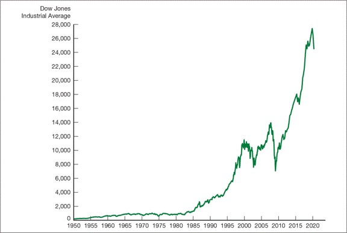
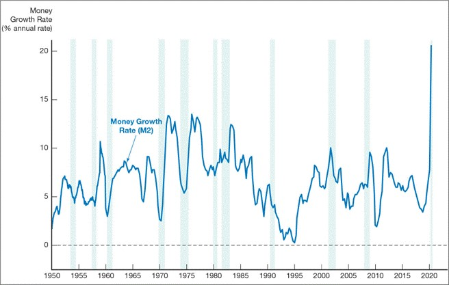
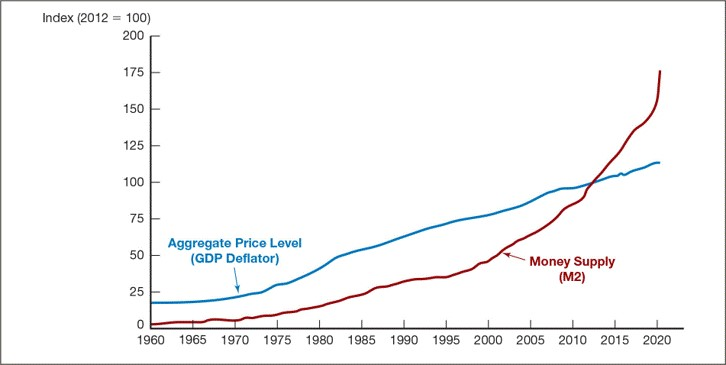
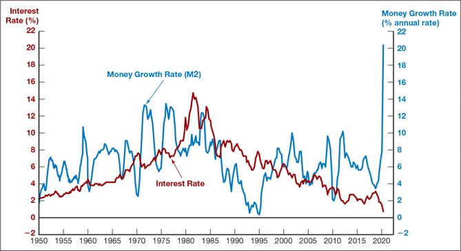
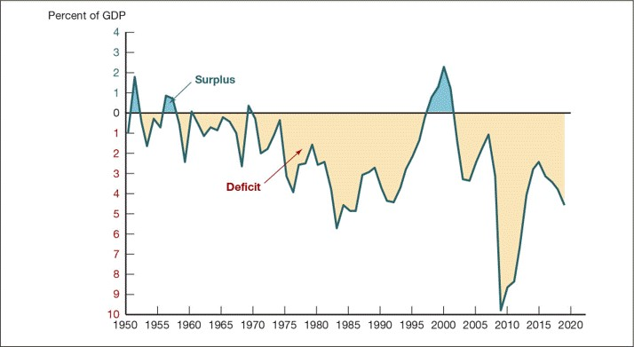
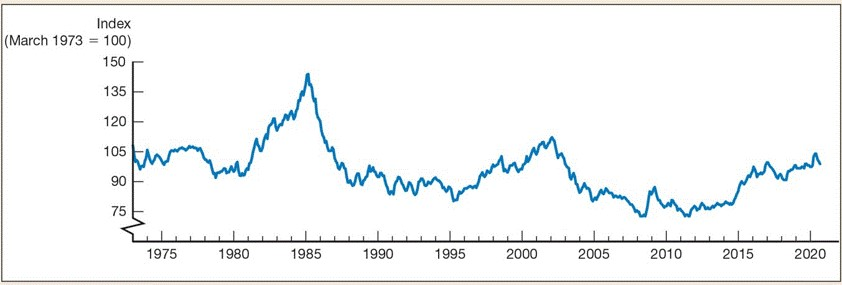

<style>
@media print{
  body, html, .remark-slides-area, .remark-notes-area {
    height: 100% !important;
    width: 100% !important;
    overflow: visible;
    display: inline-block;
    }
</style>

<style type="text/css">
.remark-slide-content {
    font-size: 34px;
    padding: 1em 4em 1em 4em;
}
</style>

<style type="text/css">
.my-one-page-font {
  font-size: 28px;
}
</style>

</style>

<style type="text/css">
.my-one-page-font-table {
  font-size: 24px;
}
</style>


```{r setup, include = FALSE}
library(tidyverse)
library(knitr)

opts_chunk$set(fig.width = 10, 
               message = FALSE, 
               warning = FALSE,
               echo = FALSE)
```

```{r xaringan-themer, include=FALSE, warning=FALSE}
#install.packages("xaringanthemer")
library(xaringanthemer)
style_mono_accent(
  base_color = "#135978", # #1c5253
  header_font_google = google_font("Josefin Sans"),
  text_font_google   = google_font("Montserrat", "500", "550i"),
  code_font_google   = google_font("Fira Mono"),
  colors = c(
  red = "#f34213",
  purple = "#3e2f5b",
  orange = "#ff8811",
  green = "#136f63",
  white = "#FFFFFF"
)
)
```


# Agenda

1. Introduction

2. Course Overview

3. Why Financial Institutions and System?

---


class: inverse, center, middle

# 1. Introduction

---

## Course Information

- **Course Title**: Financial Institutions and System

- **Course Credit**: 3

- **Designed for**: MA students

- **Course Prerequisites**: .red[None]

- **Semester**: Spring 2025 

- **Meeting Venue and Time**: UPD | Fri. | 9:30-12:15 

- **Office Hours**: W10-12, Thu10-12, F2-4 or by appointment


---

## Introductions


- Let's start with a little introduction:

  - What's your preferred name?

  - Where are you from?

  - Any fun fact to share (e.g. hobbies or interests, favorite quote, e.t.c.)?

  - A brief *expectation survey*: [.red[link]](https://forms.gle/giSndm4th4V4LeEe6)

---

## About me

.pull-left[
Hello! My name is **.green[Iegor]**.

- Assistant Professor [(link)](TBU), Sogang University

- Ph.D. (Public Policy), KDIS (ROK, 2022)

- M.A. (Public Policy), KDIS (ROK, 2014)

- M.A. (International Economics), KNEU (Ukraine, 2009)

- B.A. (International Economics and Management), KNEU (Ukraine, 2008)

- Background: International banking & central banking

- Roles: Financial Analyst, Team-lead, Project manager 

]


.pull-right[
Some Info:

- email: ievysh@sogang.ac.kr

- office: TBU

- [Google Scholar](https://scholar.google.com/citations?hl=en&user=4Kcp5WoAAAAJ)

- [Linkedin](https://www.linkedin.com/in/iegor-vyshnevskyi-b9743b51/)

- [ResearchGate](https://www.researchgate.net/profile/Iegor-Vyshnevskyi)

- [GitHub](https://github.com/Iegor-Vyshnevskyi)

- *Research interests*: central banking, computational data science

- *Hobbies*: research, martial arts, cycling, etc.
]

---

# Our TA

*Name*: Tran Thuy Van Khang (Ms Ivy)

*Email*: tranthuyvankhang2812000@gmail.com

*Office hours*: TBU

---

class: inverse, center, middle

# 2. Course Overview

---

# Course Description:

- *Understanding Financial Institutions* – Covers commercial banks, investment banks, insurance, and non-bank financial institutions.

- *Regulatory and Policy Impact* – Examines financial regulations, monetary policy, and systemic risks.

- *Market Interactions* – Analyzes how financial markets and institutions shape economic conditions.

- *Case Studies & Contemporary Issues* – Includes financial crises, regulatory responses, FinTech, and sustainable finance.

- *Learning Approach* – Combines lectures, discussions, and applied research with a group presentation on financial institutions and policies.

- *Foundation for Advanced Study* – Prepares students for topics like central banking, risk management, and investment analysis.

---

# Course Objectives:

- *Understand* financial institutions and markets and their role in the economy.

- *Analyze* financial instruments and risks across various sectors.

- *Evaluate* monetary policy and regulation in shaping financial stability.

- *Examine* financial crises and policy responses with real-world applications.

- *Explore* emerging trends like FinTech and sustainable finance.

- *Develop* critical thinking and communication skills through research and discussions.

---

# Course Learning Outcomes:

By the end of this course, students will be able to:  

1. **Understand Financial Institutions & Markets** – Explain their roles and functions in the economy.  

2. **Analyze Financial Instruments & Risks** – Assess key products like bonds, equities, and derivatives.  

3. **Evaluate Monetary Policy & Regulations** – Examine their impact on financial stability.  

4. **Assess Financial System Challenges** – Identify crises, systemic risks, and financial innovations.  

5. **Engage with Emerging Trends** – Analyze FinTech, sustainable finance, and digital currencies.  

6. **Apply Knowledge to Real Cases** – Research and present on financial institutions and policies.  

7. **Develop Critical Thinking & Communication** – Interpret financial data and articulate insights effectively.

---

# The course in a nutshell

1. This course provides a deep dive into the structure and functions of financial institutions, the role of financial markets, and the impact of monetary policy and regulation on economic stability.

2. Through lectures, discussions, and case studies, they will analyze real-world financial issues and policy responses.

---

# Broad coverage

.pull-left[
- **Formal/core curriculum**:
   + Concepts
   
   + Understanding
   
   + Real-life cases
   
   + Problem-solving
   
   + Application
]

.pull-right[
- **Hidden curriculum**:
   + Values

   + Standards

   + Communication
   
   + Cooperation
   
   + Discussions
   
]

---

# Teaching method

This course follows a **flipped classroom approach**, where students are expected to complete assigned readings before class. Each session is usually structured as follows:  
- *Hour 1*: Brief Lecture – A concise overview of key concepts from the readings.  
- *Hour 2*: Practical Application – Hands-on exercises, case studies, and data analysis.  
- *Hour 3*: Interactive Activities – Debates, discussions, simulations, and policy analysis.  

This format fosters active learning, critical thinking, and engagement with current issues in the field.

On national or university’s holidays (March 28 and June 6), recorded lecture/materials/assignments will be provided on the course website. Students should complete that by the end of the week.


---

# Course materials:

- **Lecture slides**

- Mishkin, **The Economics of Money, Banking and Financial Markets**, 12th Edition, Pearson, 2019. 

- I give *additional reading assignments* if/when necessary.

---

# GRADING

- *Class Participation*: 20%

- *Presentation*: 20%

- *Midterm Examination (Week 8)*: 25%

- *Final Examination (Week 16)*: 35%

- **Total**: 100%

More details on each item you will get down the road.

*Remember*, I'm not giving you grades; you're earning them.

---

# Course Policies

- **Academic Integrity**: The University’s Honor Code and Academic integrity will be strictly reflected. Plagiarism results in zero credit and an F-grade for the course.  

- **Class Policy**: No photos or videos allowed; lecture slides are provided before class.  

---

class: my-one-page-font-table

# Course Roadmap

| **Week**        | **Topic**                                                                                                                             |
|----------------|----------------------------------------------------------------------------------------------------------------------------------------|
| **Week&nbsp;1**  | Course Introduction: Why Study Money, Banking, and Financial Markets?                                                                 |
| **Week&nbsp;2**  | The Meaning of Interest Rates. The Behavior of Interest Rates.                                                                        |
| **Week&nbsp;3**  | The Risk and Term Structure of Interest Rates. The Stock Market, the Theory of Rational Expectations, and the Efficient Market Hypothesis. |
| **Week&nbsp;4**  | An Economic Analysis of Financial Structure. Banking and the Management of Financial Institutions.                                    |
| **Week&nbsp;5**  | Economic Analysis of Financial Regulation. Banking Industry: Structure and Competition.                                               |
| **Week&nbsp;6**  | Financial Crises in Advanced Economies. Financial Crises in Emerging Market Economies.                                                |
| **Week&nbsp;7**  | Central Banks. The Money Supply Process.                                                                                              |
| **Week&nbsp;8**  | **Mid-term**                                                                                                                           |
| **Week&nbsp;9**  | Tools of Monetary Policy. The Conduct of Monetary Policy: Strategy and Tactics.                                                       |
| **Week&nbsp;10** | The Foreign Exchange Market. The International Financial System.                                                                      |
| **Week&nbsp;11** | Quantity Theory, Inflation, and the Demand for Money. The IS Curve. The Monetary Policy and Aggregate Demand Curves.                  |
| **Week&nbsp;12** | Aggregate Demand and Supply Analysis. Monetary Policy Theory.                                                                         |
| **Week&nbsp;13** | The Role of Expectations in Monetary Policy. Transmission Mechanisms of Monetary Policy.                                              |
| **Week&nbsp;14** | ESG and Sustainable Finance: The Role of Financial Institutions in Promoting Sustainability.                                       |
| **Week&nbsp;15** | Current Issues on Challenges and Risks in the Modern Financial System. *Student presentations*                                        |
| **Week&nbsp;16** | **Final Exam**                                                                                                                         |

Tentative schedule. It may be adjusted based on class background and progress.  

**Guest speakers** may be invited to share insights on specific topics.

---


# General things

- **Our Goals**:
   - to learn the basics of FIS
   - to apply the knowledge in real-life scenarios
   - see that *Finance* is .green[fun] :-)

- **Our Principle**: 
   - learning by doing
   - mutual respect
   - put one's efforts

- **My role**: to guide you through the course, i.e. **mentoring and facilitating ** 

- Your suggestions are welcomed (through KSS survey, etc.): [**.orange[KSS]**](https://forms.gle/WAf3KyE9wetrBTHt7)
 

---

# Our communication

- Check the website regularly for materials and messages

- Feel free to approach me before or after our class

- **Office hours**: W10-12, Thu10-12, F2-4  or by appointment. You are welcome to discuss course-related issues and questions, career plans, etc.

- **Emailing policy**: email me to set up a one-to-one meeting or in the case of some urgent issues.
   - Please indicate the course name in the subject line and the issue (e.g., *[Financial Institutions and System]* Meeting request)
   
   - Please write at least two times when you would like to meet and a brief description (1-2 sentence) why you want to meet up with me
   
   - Sorry, I may not reply on time (so email me in advance)


---

# Disclaimer

- This is my first course with Sogang, so I will likely be making changes as we go

- Please check the course website regularly for updates

---

# Course Overview

## Questions?

- Any questions about the course?

- Any questions about the syllabus?

---

# Study Suggestions 

1. Reading materials before class 

2. Participate (20% of your grade) and ask questions.

3. Be active in class (don't miss and do in-class activities)

4. "The best way to learn ... is to stay on top of it as you go along. The worst way is to cram the night before exams." (c)

---

# Common Challenges Students Face

1. Lack of Interest .footnote[Based on Gaston Sanchez' [.orange[lectures]](https://github.com/gastonstat/relic-math13/blob/master/lectures/01-course-introduction.md)]

2. Language Barrier

3. Personal Challenges

4. Math / Economics Anxiety / PTSD

---

# 1. Lack of Interest

- Great indifference 

- Missing lectures

- Coming/leaving late/early

- No in-class activities

- Doing something else in class

- Cheating / free riding


**.red[DROP IT]**

---

# 2. Language Barrier

- Trouble with listening/reading comprehension 

- Poor vocabulary

- Hard time with new terminology


**.blue[It's okay, just push harder]**

No worries; it's not a language class.

Please use some online speech/voice translation tools to help you like [Online Voice Translator](https://screenapp.io/features/audio-translator) or any others.

---

# 3. Personal Challenges

- Health 

- Family

- Job

- Universe against you


**.red[Come talk to me ASAP]**

---

# 4. Math / Economics Anxiety / PTSD

- Traumatic math / econ experiences

- Can't operate numbers

- Don't see econ linkages


**.orange[Just patience & work harder, give it a try]**

---

class: inverse, center, middle

# 3. Why Financial Institutions and System?

---

# Why Study Financial Markets?

**Financial markets** transfer funds from those with excess funds to those in need.  

- Examples: **bond and stock markets**  

- Promote economic efficiency by channeling funds to productive uses  

- Well-functioning financial markets drive **economic growth**  

## Impact on Personal Wealth  
- Financial crises, such as **2007-2009** and the **COVID-19 pandemic**, have had profound effects worldwide  

---

# The Bond Market and Interest Rates

- A **security (financial instrument)** is a claim on the issuer’s future income or assets.  

- A **bond** is a debt security that promises periodic payments over time.  

## Importance of Bond Markets  
- Enable corporations and governments to **borrow funds**  

- Play a key role in **determining interest rates**  

---

# Interest Rates and Economic Impact

An **interest rate** is the cost of borrowing or the price of money.  

## Why Interest Rates Matter  
- **Personal finance:** High rates deter borrowing for homes or cars.  

- **Economic impact:** Influence investment decisions and economic growth.  

---

# Interest Rates on Selected Bonds, 1950–2020

<div>
.center[]

---

# The Stock Market  

- **Common stock** represents **ownership** in a corporation.  

- Investors claim a share of residual earnings and assets.  

- Corporations raise funds by **issuing stock to the public**.  

- Stock prices significantly impact business investments.  

## Why Study the Stock Market?  
- Potential for quick wealth or losses  

- Determines corporate fundraising ability  

---

# Stock Prices as Measured by the Dow Jones Industrial Average, 1950–2020

<div>
.center[]

---

# Why Study Financial Institutions and Banking?  

**Financial intermediaries**: institutions that borrow from savers and lend to borrowers.  

- **Banks:** Accept deposits, make loans (commercial banks, credit unions, etc.)  

- **Other institutions:** Insurance companies, pension funds, investment firms  

## Financial Innovation  
- Development of new financial products  

- **E-finance:** Electronic financial services  

---

# Financial Crises  

**Financial crises** involve major market disruptions, sharp asset price declines, and firm failures.  


<div>
.center[]

---

# Why Study Money and Monetary Policy?

- **Money** facilitates transactions and influences **business cycles**.  

- **Recessions & expansions** affect employment and economic well-being.  

## Role of Monetary Policy  
- Ties money supply changes to **economic activity and inflation**  

---

# Money, Business Cycles, and Inflation  

- **Aggregate price level:** The average price of goods/services.  

- **Inflation:** Sustained rise in prices affecting all economic players.  

- **Money supply growth** strongly correlates with inflation.  

---

# Money Growth (M2 Annual Rate) and the Business Cycle, 1950–2020

<div>
.center[]

---

# Aggregate Price Level and Money Supply, 1960–2020

<div>
.center[]

---

# Data Work  

1. Find **M2 and GDP deflator** data and compare via plots.  

2. **Correlation vs. Causation** analysis.  

---

# Money and Interest Rates  

- Interest rates **reflect the price of money**. 

- Before 1980, **money growth and interest rates** moved closely together.  

- The relationship has weakened but remains influential.  

---

# Money Growth (M2 Annual Rate) and Interest Rates, 1950–2020

<div>
.center[]

---

# Fiscal and Monetary Policy  

## Monetary Policy  
- Managed by **central banks** (e.g., Federal Reserve in the U.S.)  

- Controls **money supply and interest rates**  

## Fiscal Policy  
- Deals with **government spending and taxation**  

- **Budget deficit:** Expenditures exceed revenue  

- **Budget surplus:** Revenue exceeds expenditures  

---

# Government Budget Surplus/Deficit as a % of GDP, 1950–2019

<div>
.center[]

---

# The Foreign Exchange Market  

- **Foreign exchange market** converts currencies.  

- **Exchange rate**: The price of one currency in terms of another.  

- Exchange rate fluctuations affect:  
  - **Consumers** (cost of imports)  

  - **Businesses** (foreign goods pricing)  

---

# Why Study International Finance?

- Financial markets are increasingly **globalized**.  

- The international financial system affects domestic economies.  

Key Questions:  
- How do exchange rate policies impact **monetary policy**?  

- How do **capital controls** affect financial systems?  

---

# Exchange Rate of the U.S. Dollar, 1973–2020

<div>
.center[]

---

# Money, Banking, and Your Career  

- Financial institutions are among the **largest employers**.  

- Understanding **monetary policy** helps in predicting interest rate changes.  

- **Banking knowledge** helps in investment and loan decisions.  

---

# Summary  

- Financial markets **allocate resources and manage risk**.  

- Interest rates influence **borrowing, investment, and growth**.  

- Financial institutions are **critical to economic stability**.  

- Monetary policy impacts **inflation, business cycles, and economic performance**.  

- The global financial system **shapes domestic economies**.  


---

class: inverse, center, middle

# Any QUESTIONS?

## Thank You!  

---

# Next Class

- (Mar 14) Chap 4. The Meaning of Interest Rates; Chap 5. The Behavior of Interest Rates


???
1. To print pdf slides
https://stackoverflow.com/questions/54968311/xaringan-export-slides-to-pdf-while-preserving-formatting

pagedown::chrome_print("W1_ME.html") # but not all pictures are visible

2. Option: https://stackoverflow.com/questions/54968311/xaringan-export-slides-to-pdf-while-preserving-formatting

install.packages("remotes")
remotes::install_github("jhelvy/xaringanBuilder")
remotes::install_github("jhelvy/renderthis@v0.0.9")

library(xaringanBuilder)
build_pdf("DVC.html")

3. Option
writeBin(as.raw(c()), "favicon.ico") # create an empty favicon.ico file
install.packages("renderthis")
remotes::install_github('rstudio/chromote')
library(renderthis)

renderthis::to_pdf("W1_FIS.html")

getwd()
setwd("C:/Users/Iegor/OneDrive - kdis.ac.kr/Documents/GitHub/Sogang/2025/Spring/Financial Institutions and System/Week 1")
