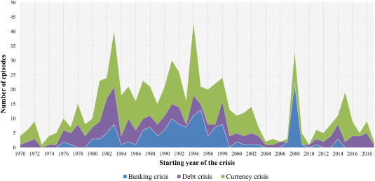

<style>
@media print{
  body, html, .remark-slides-area, .remark-notes-area {
    height: 100% !important;
    width: 100% !important;
    overflow: visible;
    display: inline-block;
    }
</style>

<style type="text/css">
.remark-slide-content {
    font-size: 38px;
    padding: 1em 4em 1em 4em;
}
</style>

<style type="text/css">
.my-one-page-font {
  font-size: 32px;
}
</style>

</style>

<style type="text/css">
.my-one-page-font-table {
  font-size: 28px;
}
</style>


```{r setup, include = FALSE}
library(tidyverse)
library(knitr)

opts_chunk$set(fig.width = 10, 
               message = FALSE, 
               warning = FALSE,
               echo = FALSE)
```

```{r xaringan-themer, include=FALSE, warning=FALSE}
#install.packages("xaringanthemer")
library(xaringanthemer)
style_mono_accent(
  base_color = "#135978", # #1c5253
  header_font_google = google_font("Josefin Sans"),
  text_font_google   = google_font("Montserrat", "500", "550i"),
  code_font_google   = google_font("Fira Mono"),
  colors = c(
  red = "#f34213",
  purple = "#3e2f5b",
  orange = "#ff8811",
  green = "#136f63",
  white = "#FFFFFF"
)
)
```

# Agenda  

1. Financial Crises in Advanced & Emerging Market Economies 

2. Class Activity

---

class: inverse, center, middle

# 1. Financial Crises in Advanced & Emerging Market Economies 

---

# What Is a Financial Crisis?

- A **financial crisis** occurs when there is a large disruption to information flows in financial markets. 

- As a result, financial frictions (asymmetric information problems) increase sharply, leading to a breakdown in the efficient allocation of capital.

- This can result in a **sharp decline in asset prices**, a **collapse of financial institutions**, and a **severe contraction in economic activity**.

- Financial crises can be triggered by various factors, including **macroeconomic shocks**, **financial innovations**, and **regulatory failures**.

---

# Types of Financial Crises
- **Banking Crises**: Failures of financial institutions due to insolvency or liquidity issues.
    
      - Example: 2008 Global Financial Crisis

- **Currency Crises**: Sudden devaluation of a country's currency, often due to loss of confidence in its value.
  
    - Example: 1997 Asian Financial Crisis


- **Sovereign Debt Crises**: Governments defaulting on their debt obligations, leading to loss of access to international capital markets.
  
    - Example: 2010 European Sovereign Debt Crisis  


- **Stock Market Crashes**: Sudden and severe declines in stock prices, often driven by panic selling or loss of investor confidence.
    
      - Example: 1929 Great Depression Crash

---

# Timeline of Banking Crises
.center[]
- Significant surge in banking crises during late 1980s–1990s and again in 2007–2009.
- Major cluster in 2008 reflects the Global Financial Crisis.

.small[Source: Nguyen, T. C., Castro, V., & Wood, J. (2022). *Economic Modelling*, 108.]

---

# Timeline of Currency Crises
.center[]
- Currency crises were frequent in the 1980s–1990s.
- Peaks coincide with emerging market volatility and global shifts.

.small[Source: Nguyen, T. C., Castro, V., & Wood, J. (2022). *Economic Modelling*, 108.]

---

# Timeline of Debt Crises
.center[]
- Most pronounced during early 1980s Latin American debt crisis.
- Post-2010 uptick linked to sovereign debt risks in Europe and others.

.small[Source: Nguyen, T. C., Castro, V., & Wood, J. (2022). *Economic Modelling*, 108.]

---

# Geographic Distribution of Crisis Episodes
.center[]
- Most affected regions: Latin America, Sub-Saharan Africa, parts of Asia.
- Developed economies experience fewer but often more globally impactful crises.

.small[Source: Nguyen, T. C., Castro, V., & Wood, J. (2022). *Economic Modelling*, 108.]

---

# Combined Crisis Timeline
.center[]
- Shows overlapping banking, debt, and currency crises.
- Clusters around early 1980s, late 1990s, and 2008.

.small[Source: Nguyen, T. C., Castro, V., & Wood, J. (2022). *Economic Modelling*, 108.]

---

# Crisis Type Intersections
.center[]
- Currency crises are most common and overlap significantly with banking and debt crises.
- 7 cases involved all three types simultaneously.

.small[Source: Nguyen, T. C., Castro, V., & Wood, J. (2022). *Economic Modelling*, 108.]

---

# Dynamics of Financial Crises

## Stage One: Initiation of a Financial Crisis

- **Credit Boom and Bust**:
  - Financial innovation or liberalization often precedes crises.
  - Initially promotes development but leads to **credit booms**.
  - Excessive risk-taking due to lack of proper screening/monitoring.
  - When loans fail → **capital falls** → **deleveraging** → credit freeze.
  - Investment declines → economic activity contracts.

## Credit Boom and Deleveraging (continued)

- Losses on loans reduce FI capital → cut lending.
- Lender-savers pull funds out.
- Asymmetric information problems worsen.
- Productive investment dries up → downturn begins.

---
# Dynamics of Financial Crises (continued)

## Asset-Price Boom and Bust

- Prices driven by sentiment above fundamentals → **bubble**.
- Often fueled by credit booms.
- Bursting of bubble:
  - Net worth & collateral ↓
  - Moral hazard ↑
  - Lending tightens → deleveraging → recession deepens

## Increase in Uncertainty

- Triggered by: recessions, stock crashes, major bank failures.

- Uncertainty limits flow of credit → weakens economic activity.

---

# Dynamics of Financial Crises (continued)

# Stage Two: Banking Crisis

- Poor loan performance & tougher conditions → insolvency.
- **Bank panic**: contagion from asymmetric info.
- Depositors can’t assess bank quality → mass withdrawals.
- Fire sales → asset values collapse → more insolvencies.
- Creditworthiness info vanishes → severe adverse selection.
- Lending halts → productive firms fail.
- Authorities liquidate insolvent banks.
- Frictions ease → recovery possible.

---

# Dynamics of Financial Crises (continued)

# Stage Three: Debt Deflation

- If prices fall sharply → **debt deflation** begins:
  - Real value of liabilities ↑ but assets do not.
  - Net worth ↓ → adverse selection/moral hazard ↑
  - Lending declines → deep, prolonged recession

---

.center[]

**Figure**: Sequence of events in financial crises  
Source: Mishkin (2022)

---

# The Great Depression: A Historical Example

- **Stock market crash**:
  - Speculation led Fed to tighten policy in 1928–29.
  - Crash followed in Oct 1929 (↓40%).
- **Global contagion** → global asset price declines.

- **Bank failures**:
  - Currency depreciation and market crashes hit bank B/S.
  - Major panics: US (1930–33), Germany, Austria, Italy.
- **Debt deflation**:
  - Collapse in lending & spending.
  - Germany: 25% unemployment in 1932.

---

.center[]

**Figure**: Stock Prices During the Great Depression

---

.center[]

**Figure**: Credit Spreads During the Great Depression

---

# The Global Financial Crisis (2007–2009)

## Causes:
- **Subprime mortgage securitization** via SPVs, MBS, CDOs.
- Tranches created structured risk.
- Investors poorly understood actual risk exposure.

## CDO Tranches:
- Super Senior: Paid first, lowest risk
- Senior: Moderate risk
- Mezzanine: Higher yield/risk
- Equity: First to lose when defaults occur

**Problem**: As complexity ↑, transparency ↓ → asymmetric info ↑

---

# The Global Financial Crisis (2007–2009) (continued)


## Agency Problems:
- Mortgage brokers & banks passed off risk quickly.
- Misaligned incentives: principal-agent issue.
- Adverse selection: risk-lovers seek loans


## Credit-Rating Agencies:
- Rated and advised on same products.
- Inflated ratings enabled risky securities to proliferate.

---
# The Global Financial Crisis (2007–2009)

# Housing Bubble and Collapse

- Easy credit + low rates → housing demand ↑
- Prices soared → standards dropped
- Bubble burst → defaults ↑
- Subprime MBS collapsed in value

---

## Balance Sheet Deterioration

- FI net worth ↓ → deleveraging
- Credit supply shrinks → activity contracts

## Shadow Banking Crisis

- Fire sales and rising haircuts
- Asset values ↓ → liquidity scramble → more deleveraging

## Failures of Major Institutions

- Bear Stearns, Lehman Brothers, Merrill Lynch
- Fannie Mae & Freddie Mac rescued
- AIG bailed out by Fed

---

.center[]

**Figure**: Housing Prices and the Crisis

---

.center[]

**Figure**: Stock Prices Collapse

---

# The Global Financial Crisis (2007–2009)

# Peak of the Crisis

- 2008: Bailout rejected then passed
- Stock market saw worst weekly loss in history
- Baa–Treasury spreads ↑ to >5.5%

---
# The Global Financial Crisis (2007–2009)

## Economic Impact

- Borrowing cost ↑ → investment & consumption ↓
- Unemployment rose above 10% in 2009 → **Great Recession**

.center[]

---
# The Global Financial Crisis (2007–2009)

# Government Response

- **Short-term**: emergency stimulus, bailouts, liquidity
- **Result**: less severe than the Great Depression

---

# Long-term Global Reforms

- Global coordination essential
- Macroprudential oversight added
- National & international reforms promoted:
  - Legal frameworks
  - Risk-based supervision
  - Financial consumer protection

## Macro- vs Microprudential Regulation

- Micro: focus on individual FI risk
- Macro: focus on systemic risk
- Before 2007 → emphasis on micro only
- Post-crisis → macro became essential

---
# The Global Financial Crisis (2007–2009)

# International Coordination

- Voluntary cooperation often insufficient
- Creation of **Financial Stability Board (FSB)**:
  - Info sharing, enforcement, cross-border regulation

# Debate: Was the Fed to Blame?

- Taylor: Low Fed funds rate → low mortgages → bubble
- Bernanke: Blamed lax standards, new products, global inflows
- **Debate remains unresolved.**

---

# European Sovereign Debt Crisis

- Post-2009 deficits → rising yields
- Crisis spread from Greece → Portugal, Italy, Spain
- Eurozone sustainability questioned

# Could COVID Have Triggered a Crisis?

- In 2020, all typical crisis triggers appeared:
  - Crash, uncertainty, unemployment spike
- Fed & U.S. gov’t acted fast → spreads narrowed

---

# Dynamics of Financial Crisis in Emerging Market Economies

- The dynamics of financial crises in emerging market economies (EMEs) resemble those in advanced economies, with key differences.
- **Stage One: Initial Phase**
  - **Path A**: Mismanagement of financial liberalization and globalization → credit boom and bust
    - Seen in Mexico (1994) and many East Asian countries (1997)
    - Financial globalization makes EMEs more vulnerable to shocks due to less developed systems

---

class: my-one-page-font

# Dynamics of Financial Crisis in Emerging Market Economies (continued)

## Path A (cont’d): Credit Boom and Bust

- EMEs may begin with solid fiscal policy (e.g., Mexico, East Asia)
- Weak screening/monitoring of borrowers and loose supervision of banks
- Risky lending practices create massive future losses
- Financial globalization allows domestic banks to borrow abroad
  - High interest rates → capital inflows
  - Often fixed exchange rates attract even more capital
- End of the Lending Boom
  - Risky lending → major losses → weak bank balance sheets
  - In EMEs, the absence of developed securities markets exacerbates crises
  - Fewer alternatives exist to resolve information problems compared to advanced economies
- Principal-Agent Problem
  - Regulation is weak due to powerful domestic business interests
  - Supervisors may act in business interests, not public interest
  - Political ties → weakened oversight

---
# Dynamics of Financial Crisis in Emerging Market Economies (continued)

## Path B: Severe Fiscal Imbalances

- Inappropriate financing of government spending (e.g., Argentina, Russia)
- Governments pressure banks to hold public debt
- Loss of confidence → fall in bond prices → banking losses
- May trigger bank panic and worsen asymmetric info problems

## Additional Triggers

- Rising global interest rates
- Falling asset prices
- Political instability or recession
- Collapse of large firms

---
# Dynamics of Financial Crisis in Emerging Market Economies (continued)

# Stage Two: Currency Crisis

- Fixed exchange rate regimes face speculative attacks
- Deteriorating bank BS prevents interest rate hikes → loss of confidence
- Governments abandon pegs under pressure
- **Fiscal Imbalances**: Investors sell domestic currency fearing sovereign default
- **Speculation**: Safe bet against fixed currency leads to collapse

---
# Dynamics of Financial Crisis in Emerging Market Economies (continued)

# Stage Three: Full-Fledged Financial Crisis

- EMEs often have debt in foreign currencies (currency mismatch)
- Depreciation increases debt burden, reduces firm net worth
- Inflation rises from import prices
- High interest rates → worsened info frictions and investment collapse
- Banks face:
  - Declining asset values
  - Increasing liabilities (foreign debt)
- Defaults surge, liquidity worsens

---

## .center[]

**Figure**: Sequence of events in EM crises

---

# Application: South Korea 1997–98

- Prior to crisis: strong fundamentals, rapid growth
- Financial liberalization → lending boom
- Banks borrowed short-term foreign capital → invested in chaebols
- Weak regulation → mounting losses

## Role of Chaebols

- Dominant, politically protected conglomerates
- High leverage, low returns
- Accessed capital via merchant banks
- Merchant banks funneled funds into unproductive projects

---
class: my-one-page-font

# Application: South Korea 1997–98 (continued)

## Stock Decline and Failures

- Major chaebol bankruptcies (e.g., Hanbo) created panic
- Uncertainty surged → stock market fell >50%

## Crisis Escalates

- Speculators attacked the won
- Sharp depreciation → foreign currency debt doubled
- Investment froze → output fell >6%
- Interest rates >20%, inflation nearly 10%

## Government Response

- Guaranteed deposits, began reforms
- Confidence slowly returned
- Recovery followed

---

# Application: Argentina 2001–02

- Chronic fiscal deficits from provincial overspending
- Recession → declining tax revenues
- Banks forced to hold sovereign debt

## Collapse Triggers

- Public lost confidence in debt repayment
- Corralito imposed: weekly cash withdrawal limits
- Currency board abandoned in Jan 2002

---
# Application: Argentina 2001–02 (continued)

## Full-Blown Crisis

- Peso collapsed: \$1 → \$0.30
- High % of debt in USD → massive balance sheet destruction
- Inflation reached 40%
- Output fell >15%, unemployment >20%

## Recovery

- Commodity boom helped GDP rebound
- Debt restructuring began (2005)
- Argentina returned to bond markets in 2016

---

# Iceland: AE Behaves Like an EME

- 2003: banks privatized, borrowed short-term in foreign currency
- Used funds for risky investments → stock market 250% of GDP
- Lehman collapse shut down funding
- Krona collapsed → debt burden surged → crisis

---

# Preventing Future EM Crises

### Strengthen Supervision
- Capital requirements
- Risk management
- Ban commercial ownership
- Supervisor independence

### Encourage Market Discipline
- More transparency
- Incentivize prudent lending

### Limit Currency Mismatch
- Discourage foreign-denominated debt
- Move to flexible FX regimes

### Sequence Liberalization
- Liberalize after institutional capacity built

---

# Summary

- Financial crises can be triggered by various factors, including macroeconomic shocks, financial innovations, and regulatory failures.

- The dynamics of financial crises in advanced economies and emerging market economies share similarities but also have key differences.

- The 2007–2009 Global Financial Crisis was driven by subprime mortgage securitization, agency problems, and credit-rating agency failures.

- The European Sovereign Debt Crisis highlighted the vulnerabilities of the Eurozone and the need for coordinated responses.

- Emerging market economies face unique challenges, including currency mismatches and reliance on foreign capital, which can exacerbate crises.

- Historical examples, such as the 1997–98 South Korean crisis and the 2001–02 Argentine crisis, illustrate the dynamics of financial crises in different contexts.

- Preventing future crises requires strengthening supervision, encouraging market discipline, limiting currency mismatches, and sequencing financial liberalization.

---

class: inverse, center, middle

# 2. Class Activity

---

class: inverse, center, middle

# Any QUESTIONS?

## Thank You!  

---

# Next Class

- (May 09) 
  - **Chap 18.** The Foreign Exchange Market    
  - **Chap 19.** The International Financial System 


???
1. To print pdf slides
https://stackoverflow.com/questions/54968311/xaringan-export-slides-to-pdf-while-preserving-formatting

pagedown::chrome_print("W1_ME.html") # but not all pictures are visible

2. Option: https://stackoverflow.com/questions/54968311/xaringan-export-slides-to-pdf-while-preserving-formatting

install.packages("remotes")
remotes::install_github("jhelvy/xaringanBuilder")
remotes::install_github("jhelvy/renderthis@v0.0.9")

library(xaringanBuilder)
build_pdf("DVC.html")

3. Option
writeBin(as.raw(c()), "favicon.ico") # create an empty favicon.ico file
install.packages("renderthis")
remotes::install_github('rstudio/chromote')
library(renderthis)

renderthis::to_pdf("W10_FIS.html")

getwd()
setwd("C:/Users/Iegor/OneDrive - kdis.ac.kr/Documents/GitHub/Sogang/2025/Spring/Financial Institutions and System/Week 10")
