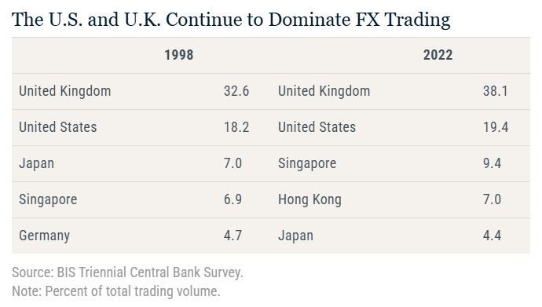

<style>
@media print{
  body, html, .remark-slides-area, .remark-notes-area {
    height: 100% !important;
    width: 100% !important;
    overflow: visible;
    display: inline-block;
    }
</style>

<style type="text/css">
.remark-slide-content {
    font-size: 38px;
    padding: 1em 4em 1em 4em;
}
</style>

<style type="text/css">
.my-one-page-font {
  font-size: 32px;
}
</style>

</style>

<style type="text/css">
.my-one-page-font-table {
  font-size: 28px;
}
</style>


```{r setup, include = FALSE}
library(tidyverse)
library(knitr)

opts_chunk$set(fig.width = 10, 
               message = FALSE, 
               warning = FALSE,
               echo = FALSE)
```

```{r xaringan-themer, include=FALSE, warning=FALSE}
#install.packages("xaringanthemer")
library(xaringanthemer)
style_mono_accent(
  base_color = "#135978", # #1c5253
  header_font_google = google_font("Josefin Sans"),
  text_font_google   = google_font("Montserrat", "500", "550i"),
  code_font_google   = google_font("Fira Mono"),
  colors = c(
  red = "#f34213",
  purple = "#3e2f5b",
  orange = "#ff8811",
  green = "#136f63",
  white = "#FFFFFF"
)
)
```

# Agenda  

1. The Foreign Exchange Market    

2. The International Financial System 

3. Class Activity

---

class: inverse, center, middle

# 1. The Foreign Exchange Market

---

# Introduction

**Welcome to the Foreign Exchange Market!**

- How does the exchange rate affect international trade?

- What determines exchange rates in the long run and short run?

- What role do interest rates play in exchange rate movements?

---

# Definition and Importance

.center[
**What is the Foreign Exchange Market?**
]

- A market where different currencies are traded.

- Composed of banks, corporations, governments, and traders.

- Major transactions include:
  - Spot transactions: Immediate exchange of currencies.
  - Forward transactions: Agreement to exchange currencies at a future date.

- Facilitates international trade and investment by allowing for currency exchange.
- Influences import/export prices, financial flows, and investment decisions.
- Affects inflation, interest rates, and economic growth.

---

class: my-one-page-font

# Size and composition of the FX Market

.center[]
- Average daily turnover increased from $1.5 to $7.5 trillion between 1998 and 2022, with the increase occurring across both FX spot and FX derivatives. [link](https://libertystreeteconomics.newyorkfed.org/2024/01/towards-increasing-complexity-the-evolution-of-the-fx-market/) 

.small[Source: Liberty Street Economics]


---
class: my-one-page-font

# USD dominance in the FX Market

.center[]
- The U.S. dollar (USD) is the most traded currency, accounting for 88% of all FX transactions. [link](https://libertystreeteconomics.newyorkfed.org/2024/01/towards-increasing-complexity-the-evolution-of-the-fx-market/) 

.small[Source: Liberty Street Economics]

---

# UK and US dominance in the FX Market
.center[]
- The UK and US are the two largest FX trading centers, accounting for 38% and 19% of global FX turnover, respectively. [link](https://libertystreeteconomics.newyorkfed.org/2024/01/towards-increasing-complexity-the-evolution-of-the-fx-market/)
[link](https://libertystreeteconomics.newyorkfed.org/2024/01/towards-increasing-complexity-the-evolution-of-the-fx-market/) 
.small[Source: Liberty Street Economics]


---

# Participants in the FX Market

- Retail Traders

- Commercial Banks

- Central Banks

- Corporations

- Governments

- Investment Banks

- Hedge Funds

.center[
**Who benefits the most and why?**
]

---

# Key Terminologies

- **Exchange Rate (E):** The price of one currency in terms of another.

- **Spot Exchange Rate:** Rate for immediate exchange.

- **Forward Exchange Rate:** Rate for future exchange.

- **Effective Exchange Rate Index:** Weighted average of exchange rates with major trading partners.

---

# Spot vs. Forward Exchange Rates

.center[]

- The dynamic of the spot and forward exchange rates is determined by the interest rate differential between the two currencies involved in the transaction.


---

# Types of FX Transactions

- **Spot Transactions:** Immediate exchange of currencies at the current rate.

- **Forward Transactions:** Agreement to exchange currencies at a future date.

- **Swaps:** Exchange of currencies and interest rates between two parties.

- **Options:** Contracts granting the right to buy/sell at a specific rate.

.center[
**Why might a firm prefer a forward over a spot transaction?**
]

---
# Real vs. Nominal Exchange Rates

**Nominal Exchange Rate (E):** The price of one currency in terms of another.

**Real Exchange Rate (Er):** Adjusts the nominal rate for price level differences.

$$E_r = \frac{E \times P_{HC}}{P_{ROW}}$$

Where:
- $E$ = Nominal Exchange Rate
- $P_{HC}$ = Price level in Home Country
- $P_{ROW}$ = Price level in Rest of the World

---

# Example: Real Exchange Rate Calculation

- HC: USA, ROW: Japan
- Exchange Rate (E): 1.5 yen/USD
- Price of U.S. wheat: 2 USD per bushel
- Price of Japanese wheat: 4 yen per bushel

$$ E_r = \frac{1.5 \times 2}{4} = 0.75 $$

Interpretation: 1 bushel of U.S. wheat costs 0.75 bushels of Japanese wheat.

---

# Purchasing Power Parity (PPP)

- PPP states that identical goods should cost the same in different countries when expressed in a common currency.

$$E \times P = P_{ROW}$$

Example: Big Mac Index

- If a Big Mac costs $5 in the USA and 500 yen in Japan, the implied PPP exchange rate is 500 / 5 = 100 yen/USD.

---

# Interest Rate Parity (IRP)

- **Interest Parity:** The relationship between interest rates and exchange rates.

- IRP states that the difference in interest rates between two countries is equal to the expected change in exchange rates.

- It ensures that arbitrage opportunities are eliminated.

- IRP connects exchange rates and interest rates across countries.

$$i_{HC} - i_{ROW} = \frac{E(T+1) - E(T)}{E(T)}$$

- If domestic interest rates rise, the currency is expected to appreciate.

---

# Wrap-Up and Discussion

- What determines exchange rates in the short run and long run?

- How do interest rates and inflation impact exchange rates?

- How can businesses hedge against exchange rate risks?


---

# Closing and Q&A

- Key Takeaways:
  - FX markets are essential for global trade and investment.
  - Exchange rates are influenced by interest rates, inflation, and market expectations.
  - PPP and interest parity provide frameworks but have limitations.


.center[
**Questions?**
]

---
class: inverse, center, middle

# 2. The International Financial System

---

# Introduction to the International Financial System

- Overview of National Income and Product Accounting in an Open Economy

- Understanding the Balance of Payments

- Role of the International Monetary Fund (IMF)

---

# National Income and Product Accounting for an Open Economy

- Distinguish between GNP and GDP:

  - **GNP**: Total value of final goods/services produced using HC-owned factors of production.
  - **GDP**: Total value of final goods/services produced within the borders of the HC.

- Key Formula:
  
  `GNP(T) = GDP(T) + NFP(T)`

  - **NFP(T)**: Net factor payments from ROW to HC.

---

.center[]

---

.center[]
[Link](https://www.thebalancemoney.com/what-is-the-gross-national-product-3305847)
.small[Source: the balance]

---

# National Income Accounting Identity

- National Income Accounting Identity:
  
  `GDP(T) = C(T) + I(T) + G(T) + NE(T)`

- Key Terms:
  - **C(T)**: Consumption Expenditure
  - **I(T)**: Investment Expenditure
  - **G(T)**: Government Expenditure
  - **NE(T)**: Net Exports (EX - IM)

---

# Example of GNP and GDP Calculation

- Suppose a country produces:
  - $100 million worth of goods/services domestically (GDP)
  - $20 million received as income from abroad
  - $10 million paid to foreign factors

- GNP Calculation:

  `GNP = 100 + (20 - 10) = 110 million`

---

# Balance of Payments: Definition and Structure

- BOP Accounts:

  1. Current Account (CA): Net exports, factor income, transfers
  2. Capital and Financial Account (KFA): Asset transfers and financial transactions
  3. Official Reserve Transactions

- BOP Identity:
  
  `BOP = CA + KFA`

---

.center[]

---

# Role of the International Monetary Fund (IMF)

- Established in 1944 as part of the Bretton Woods Agreement

- Key Functions:
  - Promote international monetary cooperation
  - Provide financial stability
  - Offer financial assistance to member countries
  - Monitor economic policies and provide technical assistance

.center[]

  [Link](https://www.imf.org/en/About/Factsheets/IMF-at-a-Glance)

---

# IMF Controversies and Criticism

- Criticisms of IMF Interventions:
  - Potential inflationary impact
  - Moral hazard concerns
  - Perceived economic imperialism

- Discuss: Do you agree with these criticisms? Why or why not?

---

# Conclusion

- National Income and Product Accounting is essential for understanding a country's economic performance in a global context.

- The Balance of Payments provides insight into a country's financial position relative to the world.

- The IMF plays a critical role in maintaining international financial stability.


---

class: inverse, center, middle

# 3. Class Activity

---

class: inverse, center, middle

# Any QUESTIONS?

## Thank You!  

---

# Next Class

- (May 16) 
  - **Chap 20.** Quantity Theory, Inflation, and the Demand for Money     
  - **Chap 23.** Aggregate Demand and Supply Analysis 


???
1. To print pdf slides
https://stackoverflow.com/questions/54968311/xaringan-export-slides-to-pdf-while-preserving-formatting

pagedown::chrome_print("W1_ME.html") # but not all pictures are visible

2. Option: https://stackoverflow.com/questions/54968311/xaringan-export-slides-to-pdf-while-preserving-formatting

install.packages("remotes")
remotes::install_github("jhelvy/xaringanBuilder")
remotes::install_github("jhelvy/renderthis@v0.0.9")

library(xaringanBuilder)
build_pdf("DVC.html")

3. Option
writeBin(as.raw(c()), "favicon.ico") # create an empty favicon.ico file
install.packages("renderthis")
remotes::install_github('rstudio/chromote')
library(renderthis)

renderthis::to_pdf("W11_FIS.html")

getwd()
setwd("C:/Users/Iegor/OneDrive - kdis.ac.kr/Documents/GitHub/Sogang/2025/Spring/Financial Institutions and System/Week 11")
