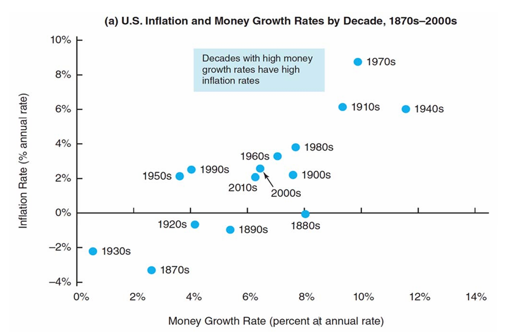
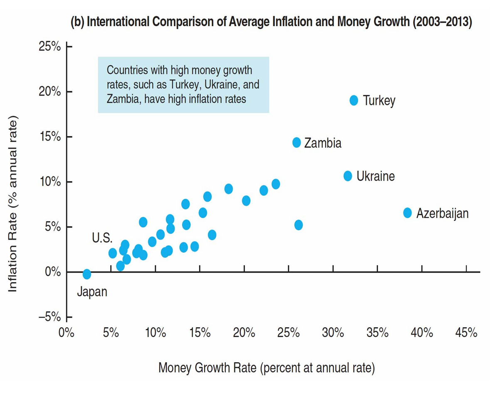
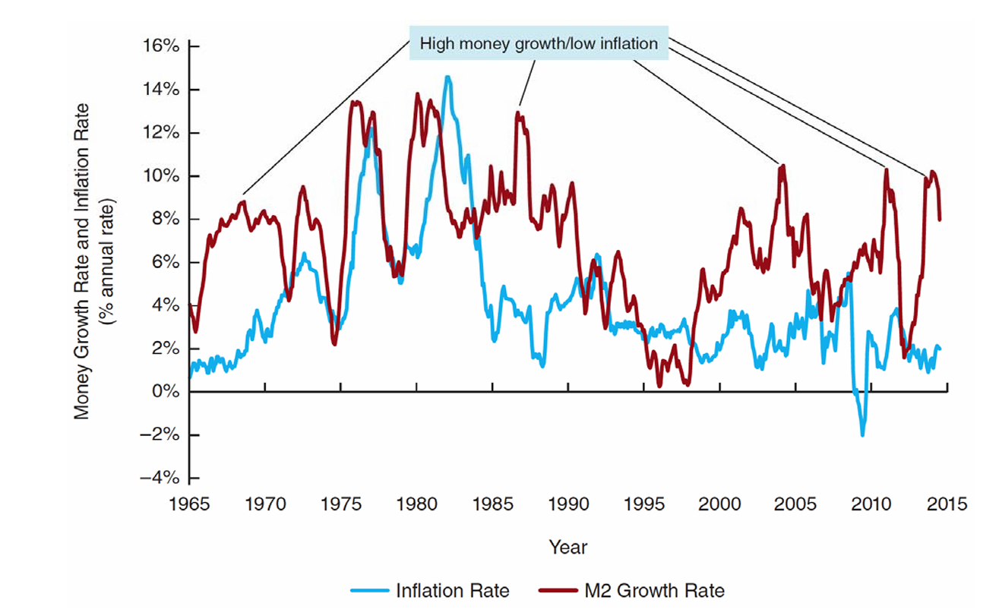

<style>
@media print{
  body, html, .remark-slides-area, .remark-notes-area {
    height: 100% !important;
    width: 100% !important;
    overflow: visible;
    display: inline-block;
    }
</style>

<style type="text/css">
.remark-slide-content {
    font-size: 38px;
    padding: 1em 4em 1em 4em;
}
</style>

<style type="text/css">
.my-one-page-font {
  font-size: 32px;
}
</style>

</style>

<style type="text/css">
.my-one-page-font-table {
  font-size: 28px;
}
</style>


```{r setup, include = FALSE}
library(tidyverse)
library(knitr)

opts_chunk$set(fig.width = 10, 
               message = FALSE, 
               warning = FALSE,
               echo = FALSE)
```

```{r xaringan-themer, include=FALSE, warning=FALSE}
#install.packages("xaringanthemer")
library(xaringanthemer)
style_mono_accent(
  base_color = "#135978", # #1c5253
  header_font_google = google_font("Josefin Sans"),
  text_font_google   = google_font("Montserrat", "500", "550i"),
  code_font_google   = google_font("Fira Mono"),
  colors = c(
  red = "#f34213",
  purple = "#3e2f5b",
  orange = "#ff8811",
  green = "#136f63",
  white = "#FFFFFF"
)
)
```

# Agenda  

1. Quantity Theory, Inflation, and the Demand for Money    

2. Class Activity

---

class: inverse, center, middle

# 1. Quantity Theory, Inflation, and the Demand for Money 

---

# Introduction

- Understanding the link between money supply, inflation, and money demand

- Exploring classical and Keynesian views on money demand

- Examining the impact of interest rates and budget deficits

- Discussing empirical evidence and case studies

---
class: my-one-page-font
# Classical Quantity Theory of Money

- The Quantity Theory of Money connects the money supply (M), velocity (V), price level (P), and output (Y).

## Equation of Exchange

$$ M \times V = P \times Y $$, where money supply times velocity equals nominal GDP.

- The equation of exchange links money supply, price level, and output.
- It helps analyze monetary policy's impact on inflation and economic activity.

**Example:**
- Nominal GDP = $15 trillion
- Money Supply = $3 trillion
- Velocity (V) = $PY / M$ = 15 / 3 = 5


---
class: my-one-page-font

# Determinants of Money Velocity

- Velocity measures the number of times that one unit of currency is used to purchase goods and services within a given time period. Typically stable in the short run.

- Velocity of money is influenced by:
  - Payment technologies (e.g., credit cards, digital payments)
  - Financial innovations (e.g., money market funds)
  - Economic conditions (e.g., inflation, interest rates)
- The determinants of velocity are important for understanding how changes in the money supply can impact the overall economy.

- Changes in velocity can affect the relationship between money supply and price level.
  - For example, if velocity increases due to technological advancements, the same money supply can lead to higher output and lower prices.
  - Conversely, if velocity decreases due to economic uncertainty, the same money supply may lead to higher prices and lower output.


---

# Money Demand

- When Velocity is constant:

$$ P \times Y = M \times V $$

- Dividing by V:

$$ M = \frac{P \times Y}{V} $$

- Money demand is proportional to nominal income (PY).

- Implications for monetary policy:
  - If the central bank increases the money supply, it can lead to higher prices or output.
  - The relationship between money supply and price level is crucial for understanding inflation.

---

# The Classical Quantity Theory and Inflation

- Applying the percentage change formula:

$\pi = \%\Delta M - \%\Delta Y$

- If velocity is constant, a 10% increase in the money supply $%ΔM=10%$ leads to a 10% increase in nominal GDP (PY). 
How this increase is divided between inflation $\pi=\%\Delta P$ and real output $\%\Delta Y$ depends on the state of the economy:
  - At full employment, the increase manifests entirely as inflation.
  - Below full employment, some of the increase contributes to economic growth $\%\Delta Y$.

- This relationship highlights the importance of controlling the money supply for price stability, a key responsibility of central banks.

---
class: my-one-page-font

# Demand for Money
- The demand for money is the desire to hold cash or liquid assets for transactions, precautionary, and speculative purposes.
- The demand for money is influenced by several factors:
  - Interest rates
  - Income levels
  - Inflation expectations
  - Economic conditions

- The demand for money can be represented by the following equation:
$$ M_d = f(1/V, Y, P) $$
- Where:
  - $M_d$ = demand for money
  - $V$ = velocity of money
  - $Y$ = income level
  - $P$ = price level

---

# Testing the Classical Quantity Theory of Money 

- In the long run, empirical evidence supports the classical quantity theory of money both in the U.S. and across countries.

.center[]
.small[Source: Mishkin, 13 ed.]

---

# Testing the Classical Quantity Theory of Money (cont.)

- In the long run, empirical evidence supports the classical quantity theory of money both in the U.S. and across countries.

.center[]
.small[Source: Mishkin, 13 ed.]

---

# Testing the Classical Quantity Theory of Money (cont.)

- In the short run, empirical evidence does not support the classical quantity theory of money.

.center[]
.small[Source: Mishkin, 13 ed.]

- The empirical evidence indicates the classical quantity theory of money is a good theory for inflation in the long run but not in the short run.

---

class: my-one-page-font

# Keynesian Theories of Money Demand

- Three motives for holding money:
  - Transactions Motive
  - Precautionary Motive
  - Speculative Motive

- Money demand: $M_d = f(i, Y)$  

- Real money demand function: $\frac{MD}{P} = L(Y, R)$

- Money demand is inversely related to interest rates and positively related to income.

- Liquidity preference theory highlights the role of interest rates in money demand.

- Higher interest rates reduce money demand due to the opportunity cost of holding money.

---

# Portfolio Theories of Money Demand

- Factors influencing money demand:
  - Wealth
  - Risk
  - Liquidity of other assets

- Money demand is influenced by interest rates, income, wealth, risk, and asset liquidity.

- Portfolio theories highlight trade-offs between holding money and other assets.

- Empirical evidence shows sensitivity of money demand to interest rates and income.

---

# Inflation and Quantity Theory

- Rewriting the quantity equation in percentage change form:

$$ \%M + \%V = \%P + \%Y $$

- If velocity is constant:

$$ \%P = \%M - \%Y $$

- Implications for monetary policy and inflation targeting.

- If the money supply grows faster than output, it can lead to inflation.

- If the money supply grows slower than output, it can lead to deflation.

- The quantity theory of money is a classical economic theory that explains the relationship between the money supply and price levels in an economy.

---

# Budget Deficits and Inflation

- Financing government deficits:
  - Taxation
  - Borrowing
  - Money Creation (Seigniorage)

- Government budget deficit: BD = G - T
- Financing deficit through bond issuance or increasing monetary base:

$BD = \Delta B + \Delta MB$, where:
  - $BD$ = budget deficit
  - $\Delta B$ = change in bonds
  - $\Delta MB$ = change in monetary base

- Persistent monetization of debt can lead to hyperinflation.


---

# Budget Deficits and Inflation (cont.)

- Hyperinflation example: Zimbabwe (2000s).
- Hyperinflation occurs when there is excessive money supply growth without corresponding economic growth.
- It leads to a rapid increase in prices, eroding the purchasing power of money.
- Hyperinflation can result from various factors, including excessive government spending, loss of confidence in the currency, and external shocks.
- The consequences of hyperinflation include:
  - Decreased savings and investment
  - Increased uncertainty and volatility in the economy
  - Social and political instability

**Case Study:**
- Germany 1920s and Zimbabwe 2000s

---

# Summary of Key Concepts

- Quantity Theory of Money: $MV = PY$

- Determinants of Money Velocity: Payment technologies, financial innovations, economic conditions

- Demand for Money: $M_d = f(1/V, Y, P)$

- Keynesian Theories: Transactions, precautionary, and speculative motives

- Fisher Equation: $M = \frac{P \times Y}{V}$

- Portfolio Theories: Wealth, risk, liquidity of other assets

- Inflation and Quantity Theory: $\%M + \%V = \%P + \%Y$

- Budget Deficits and Inflation: Financing through taxation, borrowing, or money creation

---

class: inverse, center, middle

# 2. Class Activity

---

class: inverse, center, middle

# Any QUESTIONS?

## Thank You!  

---

# Next Class

- (May 30) 
  - ESG and Sustainable Finance: The Role of Financial Institutions in Promoting Sustainability
  - Reading will be assigned


???
1. To print pdf slides
https://stackoverflow.com/questions/54968311/xaringan-export-slides-to-pdf-while-preserving-formatting

pagedown::chrome_print("W1_ME.html") # but not all pictures are visible

2. Option: https://stackoverflow.com/questions/54968311/xaringan-export-slides-to-pdf-while-preserving-formatting

install.packages("remotes")
remotes::install_github("jhelvy/xaringanBuilder")
remotes::install_github("jhelvy/renderthis@v0.0.9")

library(xaringanBuilder)
build_pdf("DVC.html")

3. Option
writeBin(as.raw(c()), "favicon.ico") # create an empty favicon.ico file
install.packages("renderthis")
remotes::install_github('rstudio/chromote')
library(renderthis)

renderthis::to_pdf("W12_FIS.html")

getwd()
setwd("C:/Users/Iegor/OneDrive - kdis.ac.kr/Documents/GitHub/Sogang/2025/Spring/Financial Institutions and System/Week 12")
