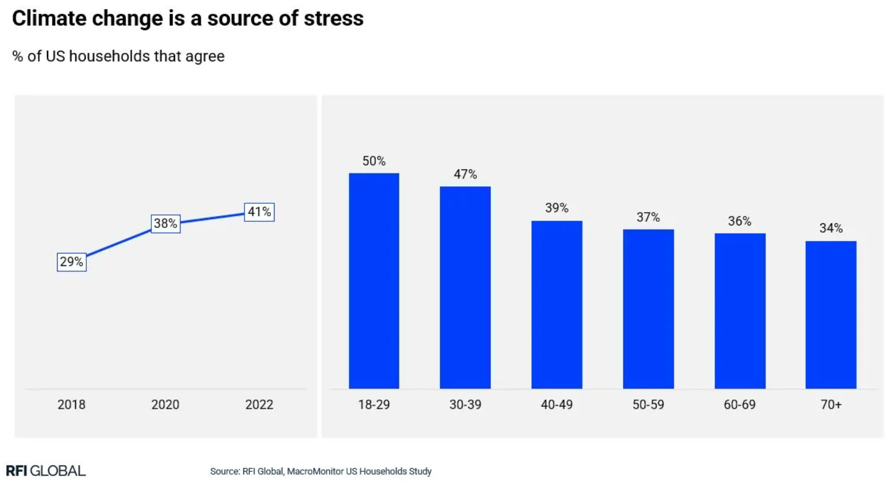
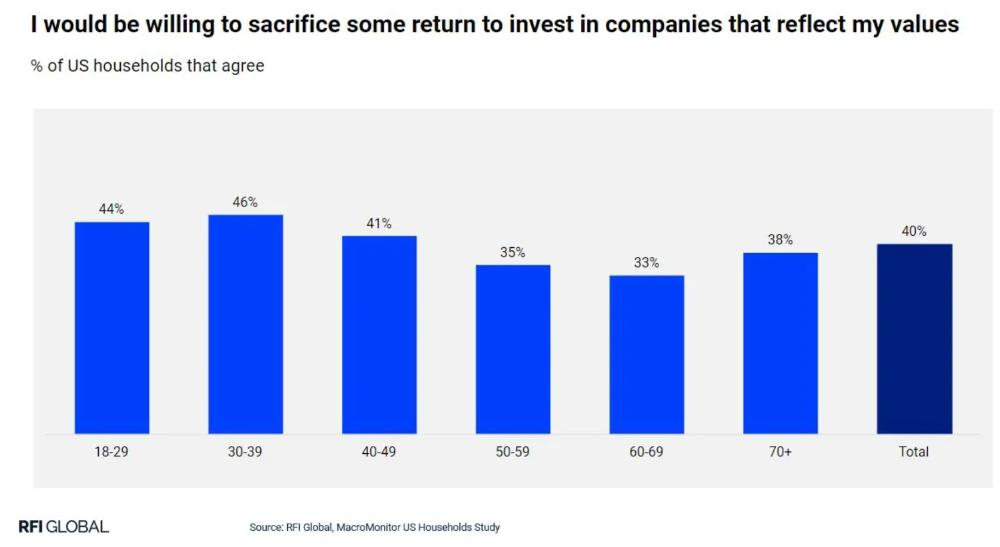
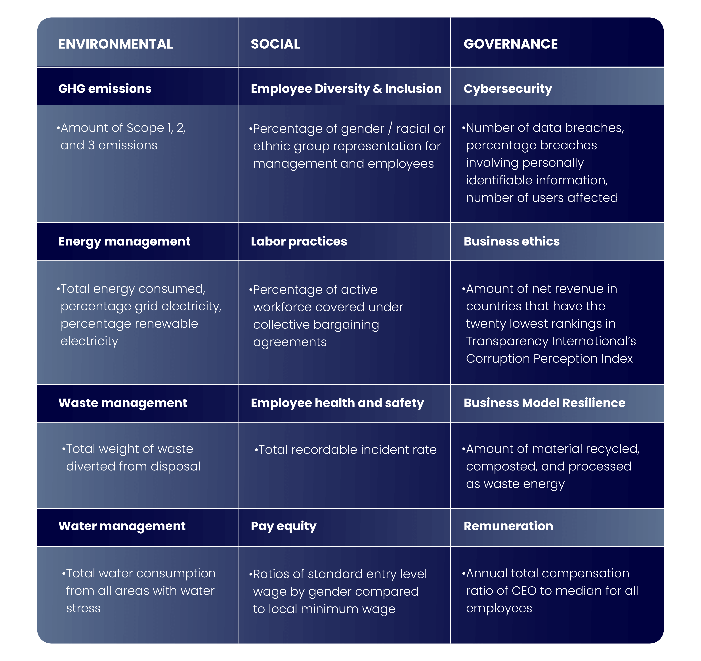
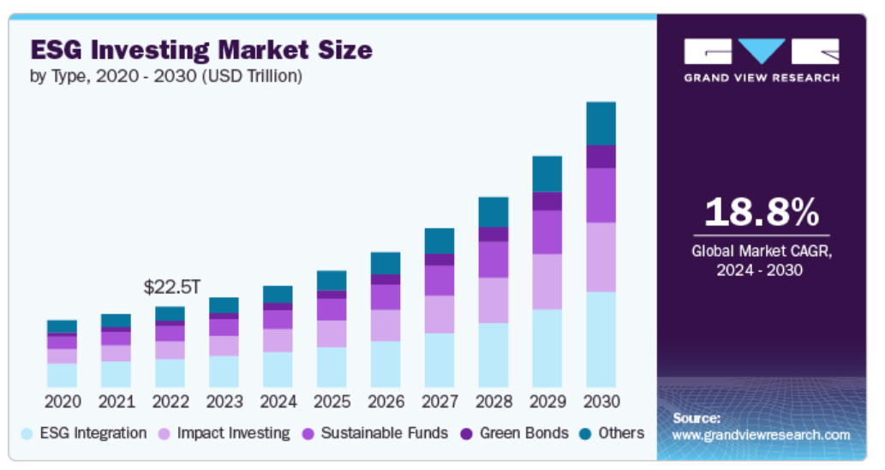
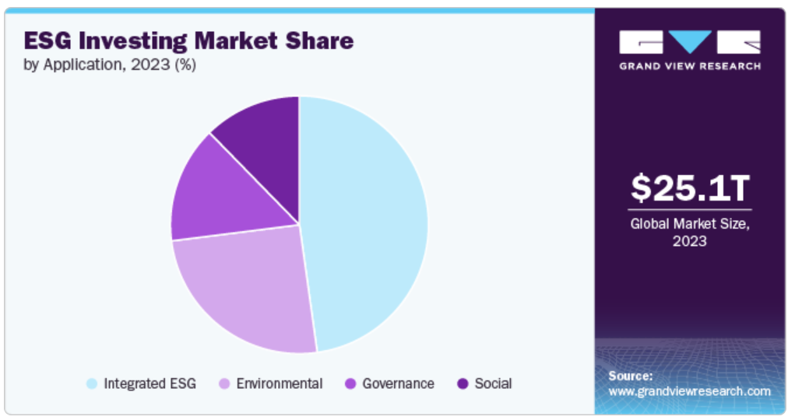

<style>
@media print{
  body, html, .remark-slides-area, .remark-notes-area {
    height: 100% !important;
    width: 100% !important;
    overflow: visible;
    display: inline-block;
    }
</style>

<style type="text/css">
.remark-slide-content {
    font-size: 38px;
    padding: 1em 4em 1em 4em;
}
</style>

<style type="text/css">
.my-one-page-font {
  font-size: 32px;
}
</style>

</style>

<style type="text/css">
.my-one-page-font-table {
  font-size: 28px;
}
</style>


```{r setup, include = FALSE}
library(tidyverse)
library(knitr)

opts_chunk$set(fig.width = 10, 
               message = FALSE, 
               warning = FALSE,
               echo = FALSE)
```

```{r xaringan-themer, include=FALSE, warning=FALSE}
#install.packages("xaringanthemer")
library(xaringanthemer)
style_mono_accent(
  base_color = "#135978", # #1c5253
  header_font_google = google_font("Josefin Sans"),
  text_font_google   = google_font("Montserrat", "500", "550i"),
  code_font_google   = google_font("Fira Mono"),
  colors = c(
  red = "#f34213",
  purple = "#3e2f5b",
  orange = "#ff8811",
  green = "#136f63",
  white = "#FFFFFF"
)
)
```

# Agenda  

1. ESG and Sustainable Finance: The Role of Financial Institutions in Promoting Sustainability  

2. Class Activity

---

# Climate Change: It's Getting Warmer

<div>
.center[]
</div>

<span style="font-size: 60%;">(Source: Met Office Climate Dashboard)</span>

- Global temperature anomalies are rising.
- Climate change is no longer a distant risk — it's a present reality.

---

# The Cost of Climate Disasters

<div>
.center[]
</div>

<span style="font-size: 60%;">(Source: Our World in Data based on EM-DAT)</span>

- Disasters impose significant and rising economic costs relative to GDP.
- Wildfires, floods, and storms cause both direct and indirect damage.

---

# Financial System's Contribution

<div>
.center[]
</div>

<span style="font-size: 60%;">(Source: Banking on Climate Chaos Report 2023)</span>

- Banks continue to finance fossil fuels.
- $5.5 trillion invested since the Paris Agreement.

---


class: inverse, center, middle

# 1. ESG and Sustainable Finance: The Role of Financial Institutions in Promoting Sustainability

---

# Introduction: What is ESG and Sustainable Finance?

- **ESG**: Environmental, Social, and Governance criteria used to evaluate corporate behavior

- **Sustainable Finance**: Financial activities that consider ESG factors to support long-term economic and societal well-being

> "Sustainable finance integrates environmental, social, and governance considerations into financial decision-making, aiming to balance economic advancement with ecological preservation and social justice."

---

# Climate change = stress

.center[]
.small[Source: RFI Global, MacroMonitor US Households Study]


---

# Why ESG Matters in Finance

- Reputational risk reduction (e.g., scandals, greenwashing)
- Long-term financial performance
- Rising regulatory demands (EU taxonomy, SFDR)
- Societal expectation: 40% of U.S. households would sacrifice some return for ESG-aligned investments

.center[]
.small[Source: RFI Global, MacroMonitor US Households Study]

---

# ESG Principles Breakdown

### Environmental
- Climate risk management
- Green investments
- Sustainable resource use

### Social
- Financial inclusion
- Labor rights
- Community development

### Governance
- Transparency and disclosures
- Anti-corruption
- Board diversity

---

# ESG Integration: Methods Used

- **ESG Ratings**: Evaluate ESG performance across firms

- **Impact Investing**: Intentional investments generating measurable societal benefits

- **Green/blue Bonds & Loans**: Fund environmentally beneficial projects

- **ESG Indexes**: Used as benchmarks or to create ESG-focused portfolios

---

# ESG Metrics in Practice

.pull-left[
.center[]
.small[Source: [Novisto](https://novisto.com/resources/blogs/understanding-esg-metrics-definition-examples)]
]

.pull-right[
- ESG integration varies across sectors

- Disclosure standards: GRI, SASB, TCFD

- Governance typically has clearer measurement frameworks than social or environmental dimensions
]

---

# ESG Investing Market Overview

.center[]
.small[Source: [Grand View Research](https://www.grandviewresearch.com/industry-analysis/esg-investing-market-report)]

---

# ESG Investing Market Overview (cont.)

.center[]
.small[Source: [Grand View Research](https://www.grandviewresearch.com/industry-analysis/esg-investing-market-report)]

---

# Investor Landscape in ESG

- **Institutional Investors (55.7%)** dominate ESG investing due to risk management and fiduciary duty

- **Retail Investors** gaining ground via ESG-themed ETFs and robo-advisors

> Online platforms and fintech apps democratize ESG investing for individuals

---

# Financial Institutions as ESG Catalysts

### Banking Sector
- Green deposits
- Sustainable infrastructure financing
- Transition financing for carbon-intensive sectors

### Investment Sector
- ESG ETFs and mutual funds
- Stewardship and shareholder engagement

> JPMorgan, BlackRock, Bank of America are leading adopters

---

# Consumer Expectations and Sentiment

.center[]
.small[Source: RFI Global, MacroMonitor US Households Study]

- Younger investors (<40) show stronger preference for ESG
- ESG values shape client loyalty and product design
- Transparency and social impact are now competitive advantages

---

# Global ESG Policy and Practice Trends

- Rise of climate-related financial risk disclosures

- EU Sustainable Finance Disclosure Regulation (SFDR)

- Sovereign green bonds (India, EU, others)

- Global ESG market estimated at $35 trillion+ assets under management

> ESG adoption is now seen as essential to financial and economic stability

---

# Case: ESG Crisis and Recovery

**COVID-19 impact**:
- ESG initiatives deprioritized during crisis

- Pandemic highlighted need for resilient, inclusive systems

- Renewed post-pandemic focus on ESG: climate risk, labor fairness, digital equity

---

# ESG in Central Banks and Regulation

- **ECB**: Promoting transparency on ESG-linked risks

- **RBI (India)**: Draft Disclosure Framework on Climate-related Risks (2024), Green Bond issuance

- **NGFS**: Global platform for green central banking

- **ESG Reporting**: Alignment with GRI, TCFD, EU CSRD

> Regulatory clarity drives better ESG integration and accountability
> ESG in financial regulation is becoming mandatory, not optional

---

# Summary & Discussion

- ESG is reshaping how banks and asset managers operate

- Regulation, data, and consumer pressure drive ESG adoption

- Financial institutions play a central role in steering capital toward sustainability

- ESG is not just risk mitigation—it’s also opportunity creation

---

# Q&A and Reflection

- What is the biggest challenge to ESG integration?

- Which ESG factor (E, S, G) is most critical in your context?

- How should regulators ensure transparency without stifling innovation?

---

# Used resources

- Mishkin, F. S. (2021). *Economics of Money, Banking, and Financial Markets*, 12th Edition
- Zairis (2024) *Sustainable Finance and ESG Importance*
- RFI Global MacroMonitor Reports
- Dan Byrne, *Guide to ESG in the Finance Sector*
- Grand View Research ESG Market Reports

---

class: inverse, center, middle

# 2. Class Activity

---

class: inverse, center, middle

# Any QUESTIONS?

## Thank You!  

---

# Next Class

- (June 06) 
  - ML/AI and Big Data in Finance
  - Reading will be assigned


???
1. To print pdf slides
https://stackoverflow.com/questions/54968311/xaringan-export-slides-to-pdf-while-preserving-formatting

pagedown::chrome_print("W1_ME.html") # but not all pictures are visible

2. Option: https://stackoverflow.com/questions/54968311/xaringan-export-slides-to-pdf-while-preserving-formatting

install.packages("remotes")
remotes::install_github("jhelvy/xaringanBuilder")
remotes::install_github("jhelvy/renderthis@v0.0.9")

library(xaringanBuilder)
build_pdf("DVC.html")

3. Option
writeBin(as.raw(c()), "favicon.ico") # create an empty favicon.ico file
install.packages("renderthis")
remotes::install_github('rstudio/chromote')
library(renderthis)

renderthis::to_pdf("W13_FIS.html")

getwd()
setwd("C:/Users/Iegor/OneDrive - kdis.ac.kr/Documents/GitHub/Sogang/2025/Spring/Financial Institutions and System/Week 13")
