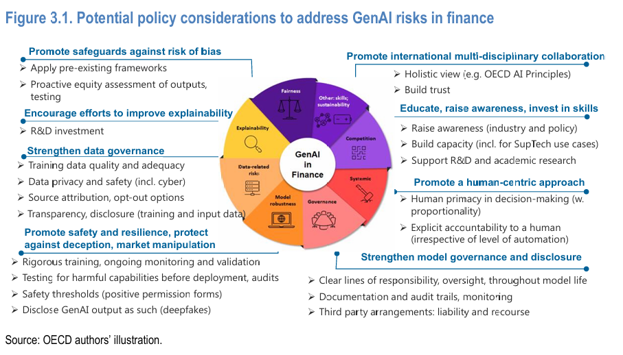

<style>
@media print{
  body, html, .remark-slides-area, .remark-notes-area {
    height: 100% !important;
    width: 100% !important;
    overflow: visible;
    display: inline-block;
    }
</style>

<style type="text/css">
.remark-slide-content {
    font-size: 38px;
    padding: 1em 4em 1em 4em;
}
</style>

<style type="text/css">
.my-one-page-font {
  font-size: 32px;
}
</style>

</style>

<style type="text/css">
.my-one-page-font-table {
  font-size: 28px;
}
</style>


```{r setup, include = FALSE}
library(tidyverse)
library(knitr)

opts_chunk$set(fig.width = 10, 
               message = FALSE, 
               warning = FALSE,
               echo = FALSE)
```

```{r xaringan-themer, include=FALSE, warning=FALSE}
#install.packages("xaringanthemer")
library(xaringanthemer)
style_mono_accent(
  base_color = "#135978", # #1c5253
  header_font_google = google_font("Josefin Sans"),
  text_font_google   = google_font("Montserrat", "500", "550i"),
  code_font_google   = google_font("Fira Mono"),
  colors = c(
  red = "#f34213",
  purple = "#3e2f5b",
  orange = "#ff8811",
  green = "#136f63",
  white = "#FFFFFF"
)
)
```

# Agenda  

1. ML/AI and Big Data in Finance  

2. Guest Speaker: Dr. Cory Baird

3. Class Activity

---

class: inverse, center, middle

**Reports submission deadline: June 6, 2025**

---

class: inverse, center, middle

# 1. ML/AI and Big Data in Finance

---

# Why AI/ML in Finance?

- **Volume**: Massive financial data from markets, transactions, sentiment

- **Velocity**: Real-time high-frequency trading, mobile payments

- **Variety**: Structured (prices, balance sheets) & unstructured (news, audio)

> AI turns information overload into actionable insight.

---

.center[

]
.small[<span style="font-size:50%;"><span style="font-size:50%;">Source: [Artificial Intelligence in Financial Services](https://reports.weforum.org/docs/WEF_Artificial_Intelligence_in_Financial_Services_2025.pdf)</span>]

---

# Impact of AI/ML in Finance

.center[

]
.small[<span style="font-size:50%;">Source: [Artificial Intelligence, Machine Learning and Big Data in Finance](https://www.oecd.org/en/publications/artificial-intelligence-machine-learning-and-big-data-in-finance_98e761e7-en.html)]


---

# Impact of AI/ML in Finance (cont)

.center[]
.small[<span style="font-size:50%;"><span style="font-size:50%;">Source: [Artificial Intelligence, Machine Learning and Big Data in Finance](https://www.oecd.org/en/publications/artificial-intelligence-machine-learning-and-big-data-in-finance_98e761e7-en.html)]

---

# AI applications in Finance

.center[]
.small[<span style="font-size:50%;">Source: [Artificial Intelligence, Machine Learning and Big Data in Finance](https://www.oecd.org/en/publications/artificial-intelligence-machine-learning-and-big-data-in-finance_98e761e7-en.html)]


---
# AI applications in Finance (cont)

.center[

]
.small[<span style="font-size:50%;">Source: [Generative artificial intelligence in finance](https://www.oecd.org/en/publications/generative-artificial-intelligence-in-finance_ac7149cc-en.html)]

---

# Big Data in Financial Systems

- **Sources**: Credit cards, IoT, mobile apps, ESG databases, satellite imagery

- **Storage & Processing**: Cloud infrastructure, distributed computing (e.g., Hadoop, Spark)

- **Key Tools**: Python, R, SQL, TensorFlow, PyTorch, AWS, Azure

**Applications**:
- Credit scoring (alternative data)

- AML (fraud networks)

- Insurance underwriting (wearables, GPS)

---

# Big Data 4 Vs

.center[]
.small[<span style="font-size:50%;">Source: [Artificial Intelligence, Machine Learning and Big Data in Finance](https://www.oecd.org/en/publications/artificial-intelligence-machine-learning-and-big-data-in-finance_98e761e7-en.html)]

---

# Big Data sources

.center[]
.small[<span style="font-size:50%;">Source: [Artificial Intelligence, Machine Learning and Big Data in Finance](https://www.oecd.org/en/publications/artificial-intelligence-machine-learning-and-big-data-in-finance_98e761e7-en.html)]

---

# ML in Asset Management

**Use Cases:**
- **Robo-advisors** (e.g., Betterment, Wealthfront)

- **Portfolio optimization** (reinforcement learning)

- **Sentiment-driven trading**

**Example**:
> Use of NLP to process central bank statements and forecast yield movements


---

# ML in Credit Risk

- **Traditional**: Logistic regression on limited variables

- **ML**: Random Forests, Gradient Boosting, XGBoost

- **FinTech**: Use of psychometric, telecom, social media data

**Result**: Broader inclusion + faster, more granular credit decisions


---

# Generative AI (GenAI) in Finance
- **Report automation** (earnings, analyst reports)
- **Chatbots** for financial services (e.g., Klarna, JPMorgan)
- **Personalized wealth management** (GenAI + client profiling)
- **Synthetic data generation** for stress testing, simulation

.center[

]
.small[<span style="font-size:50%;">Source: [Generative artificial intelligence in finance](https://www.oecd.org/en/publications/generative-artificial-intelligence-in-finance_ac7149cc-en.html)]

---

# Chat GPT adaptation in Finance

.center[

]
.small[<span style="font-size:50%;">Source: [Generative artificial intelligence in finance](https://www.oecd.org/en/publications/generative-artificial-intelligence-in-finance_ac7149cc-en.html)]

---

# Chat GPT adaptation in Finance (cont)

.center[

]
.small[<span style="font-size:50%;">Source: [Generative artificial intelligence in finance](https://www.oecd.org/en/publications/generative-artificial-intelligence-in-finance_ac7149cc-en.html)]

---
# Chat GPT adaptation in Finance (cont)

.center[

]
.small[<span style="font-size:50%;">Source: [Generative artificial intelligence in finance](https://www.oecd.org/en/publications/generative-artificial-intelligence-in-finance_ac7149cc-en.html)]

---

# GenAI applications in Finance

.center[

]
.small[<span style="font-size:50%;">Source: [Generative artificial intelligence in finance](https://www.oecd.org/en/publications/generative-artificial-intelligence-in-finance_ac7149cc-en.html)]

---

# GenAI applications in Finance (cont)

.center[

]
.small[<span style="font-size:50%;">Source: [Generative artificial intelligence in finance](https://www.oecd.org/en/publications/generative-artificial-intelligence-in-finance_ac7149cc-en.html)]

---

# GenAI Risk and Compliance Tools

- ESG report drafting (e.g., BloombergGPT)

- Explainable AI (XAI) integration with GenAI outputs

- Automated compliance & disclosure document review

> GenAI is becoming a co-pilot in risk and compliance functions.

---
# GenAI Risk and Compliance Tools (cont)

.center[

]
.small[<span style="font-size:50%;">Source: [Generative artificial intelligence in finance](https://www.oecd.org/en/publications/generative-artificial-intelligence-in-finance_ac7149cc-en.html)]

---

# Challenges and Risks
- **Bias** in data (historical inequality)
- **Black-box models** → Low interpretability
- **Cybersecurity** threats with automated systems
- **Regulatory lag** vs tech evolution

.center[

]
.small[<span style="font-size:50%;">Source: [Artificial Intelligence, Machine Learning and Big Data in Finance](https://www.oecd.org/en/publications/artificial-intelligence-machine-learning-and-big-data-in-finance_98e761e7-en.html)]
---

# Regulatory Landscape

- **EU AI Act**: Risk-based classification

- **US SEC**: AI & financial advisors’ fiduciary duty

- **OECD/WEF**: AI governance frameworks

> Financial AI requires explainability, accountability, fairness.

---
# Policy considerations

.center[

]
.small[<span style="font-size:50%;">Source: [Generative artificial intelligence in finance](https://www.oecd.org/en/publications/generative-artificial-intelligence-in-finance_ac7149cc-en.html)]

---

# Key Takeaways

- ML/AI & Big Data are transforming finance

- GenAI adds new opportunities in personalization, reporting, simulation

- Regulation, ethics, and interpretability are critical to adoption

- Institutions must balance innovation and responsibility

---

# Discussion and Q&A

- Which financial function will AI disrupt most?

- Should financial firms adopt open-source or closed-source models?

- How can regulators keep pace with innovation?

---

# Suggested Readings

- OECD (2023). *Artificial Intelligence in Financial Markets*

- WEF (2025). *AI in Financial Services*

- Bank of England. *Machine Learning in UK Financial Services*

- Bartram et al. (2021). *AI in Asset Management*

---

class: inverse, center, middle

# 2. Guest Speaker: Dr. Cory Baird

---

class: my-one-page-font

# Dr. Cory Baird

.pull-left[
.left[]
] 

.pull-right[

.bottom[
- Senior Analyst, GeoQuant (Fitch Group)
- Visiting Professor, University of Tokyo
- LinkedIn: [Cory Baird](https://www.linkedin.com/in/cory-baird-mn/)
]
]

### Academic Background

- **PhD in Public Policy, University of Maryland**  
  - Focus: ML & NLP for Central Bank Communication Analysis
- **Master's in Public Policy, University of Tokyo**  
  - Focus: Asian Financial Markets & FX Reserve Management

### Professional Expertise

- Develops **NLP systems and MLOps/LLMOps infrastructure** at GeoQuant.
- Analyzes the intersection of **monetary policy and financial markets** using ML models.
- Combines **academic research with industry applications**, enhancing data-driven decision-making.


---

class: inverse, center, middle

# 3. In-class Group Activity

---

# Your Takeaways from the Guest Speaker:

- What are the key insights from Dr. Baird's presentation?

- How can you apply these insights to your own research or work in finance & banking?

---

class: inverse, center, middle

# Any QUESTIONS?

## Thank You!  

---

# Next Class

- (June 13) 
  - Current Issues on Challenges and Risks in the Modern Financial System: students' presentations 


???
1. To print pdf slides
https://stackoverflow.com/questions/54968311/xaringan-export-slides-to-pdf-while-preserving-formatting

pagedown::chrome_print("W1_ME.html") # but not all pictures are visible

2. Option: https://stackoverflow.com/questions/54968311/xaringan-export-slides-to-pdf-while-preserving-formatting

install.packages("remotes")
remotes::install_github("jhelvy/xaringanBuilder")
remotes::install_github("jhelvy/renderthis@v0.0.9")

library(xaringanBuilder)
build_pdf("DVC.html")

3. Option
writeBin(as.raw(c()), "favicon.ico") # create an empty favicon.ico file
install.packages("renderthis")
remotes::install_github('rstudio/chromote')
library(renderthis)

renderthis::to_pdf("W14_FIS.html")

getwd()
setwd("C:/Users/Iegor/OneDrive - kdis.ac.kr/Documents/GitHub/Sogang/2025/Spring/Financial Institutions and System/Week 14")
