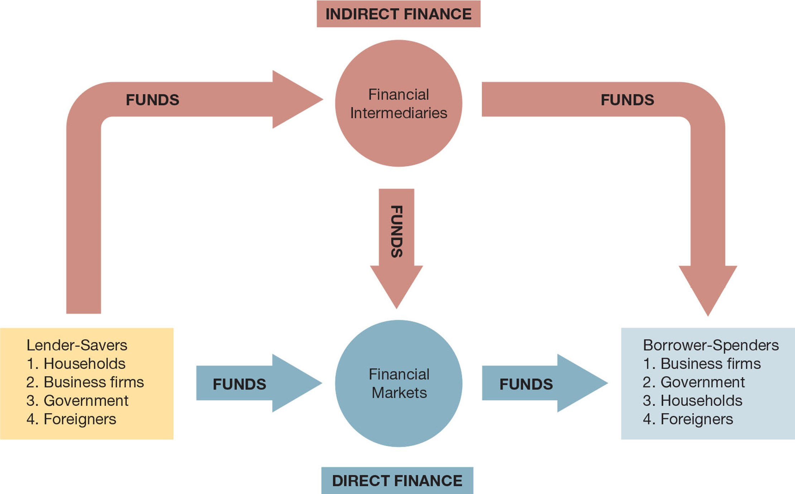

<style>
@media print{
  body, html, .remark-slides-area, .remark-notes-area {
    height: 100% !important;
    width: 100% !important;
    overflow: visible;
    display: inline-block;
    }
</style>

<style type="text/css">
.remark-slide-content {
    font-size: 38px;
    padding: 1em 4em 1em 4em;
}
</style>

<style type="text/css">
.my-one-page-font {
  font-size: 32px;
}
</style>

</style>

<style type="text/css">
.my-one-page-font-table {
  font-size: 28px;
}
</style>


```{r setup, include = FALSE}
library(tidyverse)
library(knitr)

opts_chunk$set(fig.width = 10, 
               message = FALSE, 
               warning = FALSE,
               echo = FALSE)
```

```{r xaringan-themer, include=FALSE, warning=FALSE}
#install.packages("xaringanthemer")
library(xaringanthemer)
style_mono_accent(
  base_color = "#135978", # #1c5253
  header_font_google = google_font("Josefin Sans"),
  text_font_google   = google_font("Montserrat", "500", "550i"),
  code_font_google   = google_font("Fira Mono"),
  colors = c(
  red = "#f34213",
  purple = "#3e2f5b",
  orange = "#ff8811",
  green = "#136f63",
  white = "#FFFFFF"
)
)
```


# Agenda  

1. An Overview of the Financial System  

2. Class Discussion: Financial Markets and Institutions  

3. Class Activity: The 2008 Financial Crisis and the Role of Financial Institutions 

---

class: inverse, center, middle

# 1. An Overview of the Financial System  

---

## Function of Financial Markets  

- Channel funds from economic players with **surplus funds** to those in need.  
- **Direct finance**: Borrowers sell **securities** directly to lenders.  

### Why is this important?  
- **Promotes economic efficiency** by ensuring capital allocation.  
- **Improves consumer well-being** by optimizing purchase timing.  
- **Enhances economic growth** by making capital available to productive investments.  

**Key Activities in Financial Markets:**  
- Facilitate the trading of **bonds and stocks**.  
- Affect **personal wealth, business growth, and economic stability**.  
- Play a crucial role during **financial crises**, impacting economies worldwide.  

---

### Flows of Funds Through the Financial System  

<div>
.center[]

---

## Structure of Financial Markets  

### Two Ways to Obtain Funds  
1. **Debt Markets**  
   - Borrowers issue **debt instruments** (loans, bonds) with fixed payments.  
   - **Maturity**: The number of years until repayment.  
   - **Short-term vs. long-term debt instruments**.  

2. **Equity Markets**  
   - Investors hold **shares** in a company’s net income and assets.  
   - **Dividends, voting rights**, and ownership advantages.  
   - **Residual claimants** – Equity holders get paid after debt holders.  

---

## Debt vs. Equity  

- **Debt holders** receive fixed payments and get priority over equity holders.  
- **Equity holders** benefit from increases in the corporation’s profitability.  
- **Key differences:** Risk, ownership rights, and potential returns.  

<div>
.center[]

---

## Primary and Secondary Markets  

- **Primary Market**  
  - New securities are sold to initial buyers (e.g., **IPOs**).  
  - Investment banks **underwrite** securities.  
  - Transactions are **not open to the public**.  

- **Secondary Market**  
  - Securities that have been previously issued are **resold**.  
  - **Brokers** match buyers with sellers.  
  - **Dealers** buy and sell securities at stated prices.  
  - Helps in **price discovery and liquidity provision**.  

---

## Why Secondary Markets Matter  

- **Firms raise funds only in the primary market**, but...  
- Secondary markets:  
  - **Improve liquidity** (easier buying and selling).  
  - **Determine security prices**, impacting primary market valuations.  
  - Support **financial stability and investment decisions**.  

---

## Types of Secondary Markets  

1. **Exchanges** – Buyers and sellers meet at a centralized location.  
   - *Examples:* NYSE, Chicago Board of Trade.  

2. **Over-the-Counter (OTC) Markets** – Dealers buy and sell securities remotely.  
   - *Examples:* Foreign Exchange (Forex), Federal Funds market.  
   - Operate **without centralized exchanges**.  

---

## Money and Capital Markets  

- **Money Market** – Short-term debt instruments, high liquidity.  
- **Capital Market** – Long-term debt and equity securities.  

**Why it matters?**  
- Money markets provide short-term funding for corporations and governments.  
- Capital markets allow firms to finance **long-term growth and investment**.  

---

## Financial Market Instruments  

<div>
.center[]

---

## Internationalization of Financial Markets  

- **Foreign Bonds** – Issued in a foreign country in that country’s currency.  

- **Eurobonds** – Issued in a currency **other than** the country’s own.  

- **Eurocurrencies** – Deposited foreign currencies outside their home country.  
  - *Example:* **Eurodollars** – USD deposits in non-U.S. banks.  

- **Increasing integration of global financial markets** impacts monetary policy worldwide.  

---

## Financial Intermediaries: Indirect Finance  

- **Financial intermediaries** connect savers with borrowers.  

- **Reduce asymmetric information problems** in markets.  

- Primary route for **fund transfers** in financial markets.  

### Why Important?  
- **Lower transaction costs** and improve **efficiency**.  

- **Facilitate risk sharing** through financial instruments.  

---

## Transaction Costs & Risk  

- **Transaction costs** – Time and money spent in financial transactions.  
  - **Economies of scale** lower costs for intermediaries.  

- **Risk** – Uncertainty of investment returns.  
  - Financial institutions **diversify risk** through asset transformation.  

---

## Asymmetric Information  

- **One party has more knowledge than the other.**  

- **Financial intermediaries help by:**  
  - **Adverse Selection** – Screening risky borrowers before lending.  
  - **Moral Hazard** – Ensuring borrowers act responsibly **after** receiving funds.  

---

## Types of Financial Intermediaries  

- **Depository Institutions** – Banks, credit unions, savings associations.  

- **Contractual Savings Institutions** – Pension funds, insurance companies.  

- **Investment Intermediaries** – Mutual funds, hedge funds, venture capital firms.  

---

## Regulation of the Financial System  

### Why regulate financial markets?  
1. **Increase transparency** for investors.  

2. **Ensure financial system stability**.  

3. **Protect consumers from fraud and mismanagement**.  


Financial regulations aim to **ensure market stability, protect consumers, and prevent systemic risks**. 

Below are key areas of regulation along with notable legislative frameworks.

---
class: my-one-page-font

## Regulation of the Financial System (Cont'd)  

### **1. Market Integrity & Investor Protection**  
- **Insider Trading Prevention** – Restricts unfair trading based on non-public information (*SEC rules*).  
- **Financial Market Transparency** – Mandates corporate disclosures and accounting standards (*Sarbanes-Oxley Act*).  
- **Credit Rating Agency Oversight** – Increases accountability for rating agencies (*Dodd-Frank Act*).  

### **2. Risk Management & Financial Stability**  
- **Capital Requirements** – Ensures banks hold sufficient reserves (*Basel Accords*).  
- **Liquidity Requirements** – Mandates adequate short-term funding to prevent crises (*Basel Accords*).  
- **Stress Testing** – Regularly assesses banks' resilience to economic shocks (*Dodd-Frank Act*).  
- **Derivatives Regulation** – Enhances transparency in complex financial products (*Dodd-Frank Act*).  

---
class: my-one-page-font

## Regulation of the Financial System (Cont'd)  

### **3. Consumer Protection & Fair Lending**  
- **Truth in Lending Act (TILA)** – Ensures transparency in loan agreements and interest rates.  
- **Anti-Money Laundering (AML) Rules** – Prevents financial crimes and terrorist financing (*Bank Secrecy Act*).  
- **Deposit Insurance** – Protects consumers' bank deposits from failures (*FDIC rules*).  

### **4. Systemic Risk & Crisis Management**  
- **Systemic Risk Oversight** – Introduces regulation for "too-big-to-fail" institutions (*Dodd-Frank Act*).  
- **Financial Institution Resolution & Living Wills** – Requires large banks to outline failure contingency plans (*Dodd-Frank Act*).  

### **5. Monetary Policy & Global Coordination**  
- **Monetary Policy Regulation** – Governs money supply and interest rates (*Federal Reserve Act*).  
- **International Banking Standards** – Ensures global financial stability (*Basel Accords*).  

---

## Government Regulation of Financial Institutions  

<div>
.center[]

---

class: my-one-page-font

## **Overview of the Financial System: Summary**  

The financial system **facilitates the flow of funds** between savers and borrowers, ensuring economic efficiency and stability.  

### **Key Functions**  
- **Capital Allocation** – Transfers funds from surplus units (savers) to deficit units (borrowers).  
- **Risk Management** – Enables risk-sharing through diversification and hedging instruments.  
- **Liquidity Provision** – Ensures the ability to buy/sell financial assets easily.  
- **Monetary Transmission** – Channels central bank policies into the economy.  

### **Main Components**  
1. **Financial Markets** – Includes money markets (short-term) & capital markets (long-term).  
2. **Financial Institutions** – Banks, insurers, mutual funds, and pension funds.  
3. **Financial Instruments** – Debt (bonds), equity (stocks), and derivatives.  
4. **Regulatory Framework** – Ensures stability and investor protection.  

### **Why It Matters?**  
- Drives **economic growth**  
- Supports **investment & innovation**  
- Maintains **financial stability**  

---

class: inverse, center, middle

# 2. Class Discussion: Financial Markets and Institutions

---

# **Group Activity: Financial Markets and Institutions**  

### **Discussion & Brainstorming**  
**Topic:** *The Role of Financial Markets and Institutions in the Economy*  

**Key Questions:**  
- How do **financial markets** facilitate capital allocation and economic growth?  

- In what ways do **financial intermediaries** reduce **transaction costs** and **manage risk**?  

- Why is **regulation** crucial for financial stability and investor protection?

- What are the **risks** associated with financial markets and institutions?

- How can financial institutions **mitigate risks** and **ensure market integrity**?

- What are the **benefits** and **challenges** of international financial markets?  

---

class: inverse, center, middle

# 3. Class Activity: The 2008 Financial Crisis and the Role of Financial Institutions

---

class: inverse, center, middle

# Any QUESTIONS?

## Thank You!  

---

# Next Class

- (Mar 21) Chap 3. What is money?


???
1. To print pdf slides
https://stackoverflow.com/questions/54968311/xaringan-export-slides-to-pdf-while-preserving-formatting

pagedown::chrome_print("W1_ME.html") # but not all pictures are visible

2. Option: https://stackoverflow.com/questions/54968311/xaringan-export-slides-to-pdf-while-preserving-formatting

install.packages("remotes")
remotes::install_github("jhelvy/xaringanBuilder")
remotes::install_github("jhelvy/renderthis@v0.0.9")

library(xaringanBuilder)
build_pdf("DVC.html")

3. Option
writeBin(as.raw(c()), "favicon.ico") # create an empty favicon.ico file
install.packages("renderthis")
remotes::install_github('rstudio/chromote')
library(renderthis)

renderthis::to_pdf("W2_FIS.html")

getwd()
setwd("C:/Users/Iegor/OneDrive - kdis.ac.kr/Documents/GitHub/Sogang/2025/Spring/Financial Institutions and System/Week 2")
