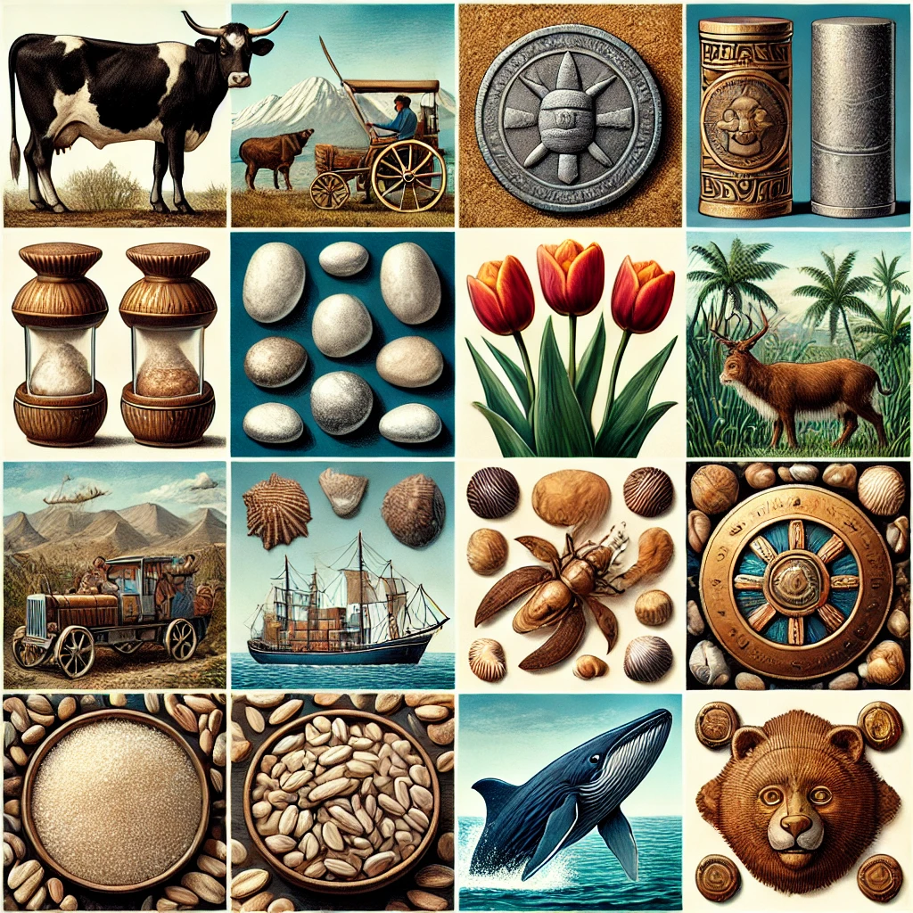
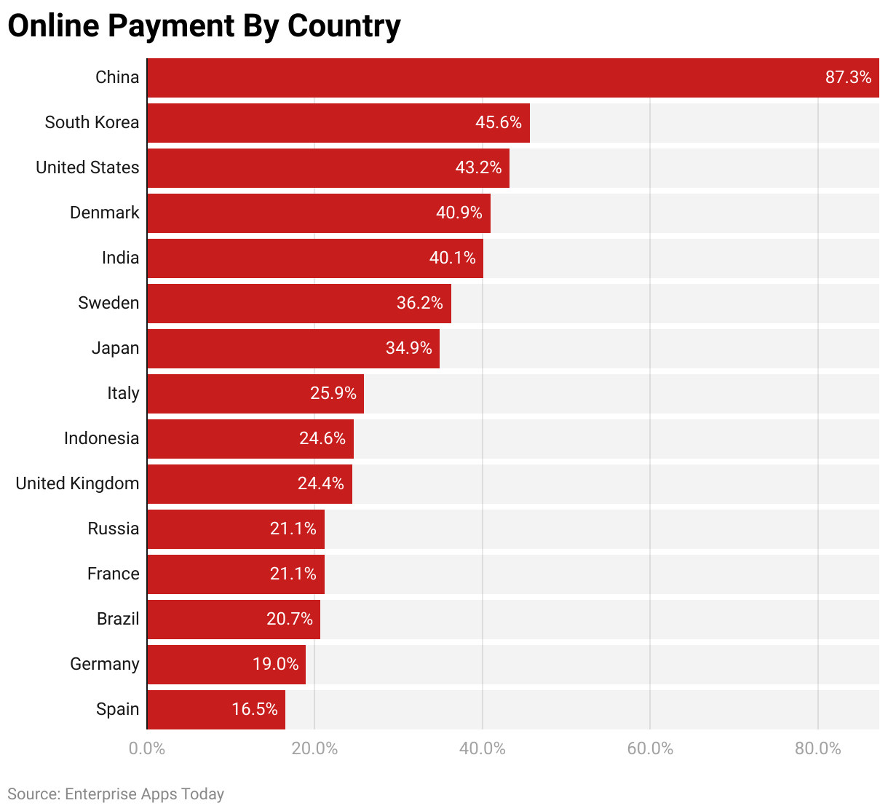
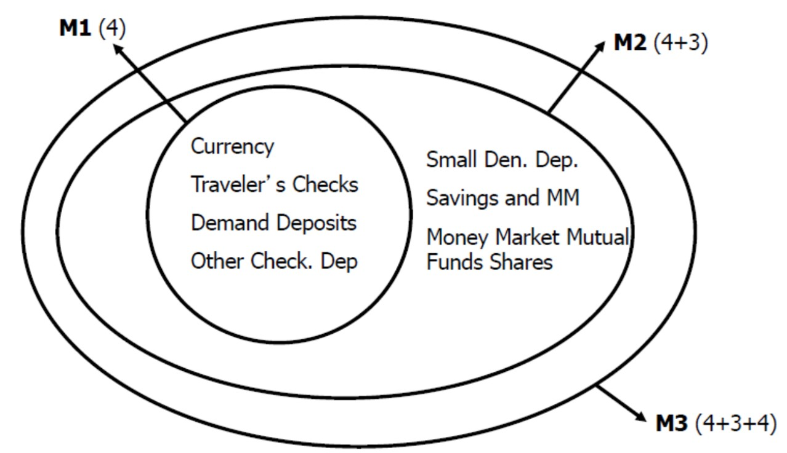
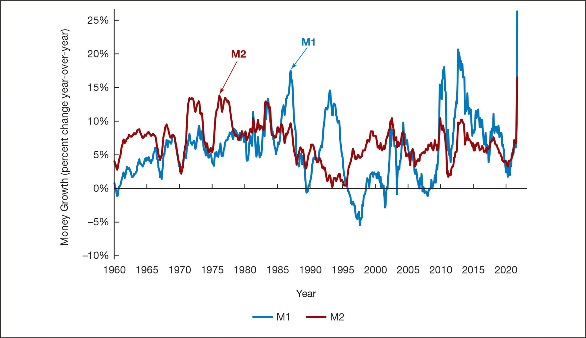

<style>
@media print{
  body, html, .remark-slides-area, .remark-notes-area {
    height: 100% !important;
    width: 100% !important;
    overflow: visible;
    display: inline-block;
    }
</style>

<style type="text/css">
.remark-slide-content {
    font-size: 38px;
    padding: 1em 4em 1em 4em;
}
</style>

<style type="text/css">
.my-one-page-font {
  font-size: 32px;
}
</style>

</style>

<style type="text/css">
.my-one-page-font-table {
  font-size: 28px;
}
</style>


```{r setup, include = FALSE}
library(tidyverse)
library(knitr)

opts_chunk$set(fig.width = 10, 
               message = FALSE, 
               warning = FALSE,
               echo = FALSE)
```

```{r xaringan-themer, include=FALSE, warning=FALSE}
#install.packages("xaringanthemer")
library(xaringanthemer)
style_mono_accent(
  base_color = "#135978", # #1c5253
  header_font_google = google_font("Josefin Sans"),
  text_font_google   = google_font("Montserrat", "500", "550i"),
  code_font_google   = google_font("Fira Mono"),
  colors = c(
  red = "#f34213",
  purple = "#3e2f5b",
  orange = "#ff8811",
  green = "#136f63",
  white = "#FFFFFF"
)
)
```

# Agenda  

1. What is Money?  

2. Class Discussion: The Evolution of Money

3. Class Activity: The Evolution of Money & Trust in Currency

---

class: inverse, center, middle

# 1. What is Money? 

---

## What can be similar between these objects?
 

<div>
.center[]

---

# Throughout thousands of years of human civilization, many strange things have been used as money.

<div style="display: flex; justify-content: space-between; gap: 2em;">

<div style="width: 45%;">
<strong>Cows</strong> in ancient Egypt.<br><br>
<strong>Salt</strong> in ancient Rome.<br><br>
<strong>Cigarettes</strong> in POW camps.<br><br>
<strong>Rai stones</strong> in Micronesia.<br><br>
<strong>Cheese</strong> in Italy.<br><br>
<strong>Tulips</strong> in the Netherlands.<br><br>
<strong>Whale teeth</strong> in Fiji.<br><br>
</div>

<div style="width: 45%;">
<strong>Cowrie shells</strong> in Africa and Asia.<br><br>
<strong>Beaver pelts</strong> in Canada.<br><br>
<strong>Cocoa beans</strong> in Mesoamerica.<br><br>
<strong>Feathers</strong> in New Guinea.<br><br>
<strong>Tea bricks</strong> in Siberia.<br><br>
<strong>Wampum</strong> in North America.<br><br>
<strong>Tobacco</strong> in the American colonies.<br><br>
</div>

</div>


???
Salt is one of the world’s oldest forms of payment. 
In fact, the word salary derives from the Latin “salarium,” which was the money paid to Roman soldiers to buy salt. 
It was the main form of currency in the Sahara Desert during the Middle Ages, and was used extensively throughout East Africa. 
Typically, one would lick a salt block to make sure it was real and break off pieces to make change.

---

## **Meaning of Money**  

**Definition**: Money (or the “money supply”) is **anything generally accepted** as a payment for goods, services, or debt repayment.  

**Forms of Money**:  
- **Currency** (paper bills & coins)  
- **Checks & Checking Deposits**  
- **Digital Money & Cryptocurrencies**  

**Money vs. Other Concepts:**  
- **Wealth**: Total collection of valuable assets (property, investments).  
- **Income**: Flow of earnings over time (a rate, not a stock).  

---

## **Functions of Money**  

**1. Medium of Exchange**  
- Eliminates the need for a **double coincidence of wants**.  
- Reduces **transaction costs** and promotes **specialization**.  

**Requirements of a Good Medium of Exchange:**  
- Easily standardized  
- Widely accepted  
- Divisible  
- Portable  
- Durable  

---
## **Functions of Money** (Cont'd)   

**2. Unit of Account**  
- Standardizes the measurement of **value** in an economy.  
- Reduces **transaction costs**.  

**3. Store of Value**  
- Saves **purchasing power over time**.  
- Other assets (real estate, stocks) also store value.  
- **Money loses value with inflation**.  

---

## **Evolution of the Payments System**  

1. **Commodity Money**: Precious metals, cigarettes, other physical valuables. 

2. **Fiat Money**: Government-issued currency with no intrinsic value.  

3. **Checks**: Written bank instructions for fund transfers.  

4. **Electronic Payments**: Online banking, bill payments.  

5. **E-Money (Digital Money)**:  
   - Debit cards 
   - Stored-value cards (smart cards) 
   - E-cash (cryptocurrencies, PayPal, mobile wallets) 

---

## **Online Payment Statistics By Country** in 2022

<div>
.center[]
</div>

---

## **Are We Headed for a Cashless Society?**  

Predictions of a cashless society have been around for **decades**, but why hasn’t it happened yet?  

**Barriers to a fully cashless economy:**  
- **High setup costs** for digital payment infrastructure.  
- **Security & privacy risks** with electronic transactions.  

However, **e-money usage is increasing** and is likely to grow further.  

---

## **Will Bitcoin Become the Money of the Future?**  

**Bitcoin & Cryptocurrencies**:  
- A decentralized form of **e-cash** secured through cryptography.  
- **Created in 2009**, Bitcoin is mined by solving cryptographic puzzles.  

**Pros & Cons of Bitcoin as Money:**  

✅ **Advantages**  
- Low transaction fees  
- Anonymity & decentralization  

❌ **Disadvantages**  
- High **price volatility**  
- Limited use as a **unit of account** and **store of value**  

*Does Bitcoin meet all the criteria to function as money?*  

---
class: my-one-page-font

## **Why Do Central Banks Care About Money?**  

**1. Monetary Policy & Economic Control**  
- Central banks regulate the **money supply** to stabilize the economy.  
- Adjusting interest rates influences **inflation, employment, and GDP growth**.  
**2. Inflation & Price Stability**  
- Too much money? **Inflation rises** 
- Too little money? **Deflation risks** 
- Central banks use **tools like open market operations** to manage inflation.  
**3. Financial Stability & Asset Prices**  
- Excess money in the system may fuel **asset bubbles** (stocks, housing).  
- Central banks monitor liquidity to **prevent financial crises**.  
**4. Economic Growth & Investment**  
- Money supply affects **credit availability** for businesses & consumers.  
- **Optimized liquidity** supports healthy economic expansion.  
**5. Exchange Rates & Global Trade**  
- Money supply influences **currency strength** 
- Impacts **international competitiveness & capital flows**.  

---
class: my-one-page-font

## **Why Are Central Banks Developing Digital Currencies?**  

**Central Bank Digital Currencies (CBDCs) are reshaping the future of money. But why?**  

**1. Greater Control & Policy Efficiency**  
- Enables **real-time monitoring** of money flows.  
- Enhances **monetary policy transmission** (interest rate changes work faster).  
**2. Financial Inclusion & Access**  
- Helps **unbanked populations** access financial services.  
- Digital wallets remove dependence on physical banks.  
**3. Lower Transaction Costs & Efficiency**  
- **Instant, low-cost payments** (domestically & cross-border).  
- Reduces reliance on expensive intermediaries (banks, payment processors).  
**4. Security & Fraud Prevention**  
- Harder to **counterfeit** than physical cash.  
- Reduces **money laundering risks** via better transaction tracking.  
**5. Strengthening International Payments**  
- Faster **cross-border transactions** without delays from banking intermediaries.  
- Reduces dependence on **SWIFT & correspondent banking systems**.  

*Will digital currencies replace cash completely?*  

---

## **Measuring Money: Monetary Aggregates**  

**How do we measure money?**  

🔹 **M1 (Most Liquid Assets)**  
- **Currency + Traveler’s Checks + Demand Deposits + Other Checkable Deposits**  

🔹 **M2 (Less Liquid Assets)**  
- **M1 + Savings Deposits + Small-Time Deposits + Money Market Accounts + Mutual Funds**  

---

## **The Federal Reserve’s Monetary Aggregates**  

<div>
.center[]

---

## **Monetary Aggregates Over Time**  

<div>
.center[]


**M1 vs. M2: Why does it matter?**  
- If M1 and M2 move **together**, choosing a measure is less important.  
- But when they diverge, **monetary policy decisions become more complex**.  

*Conclusion*: the choice of monetary aggregate is important for policymakers.

---

## **Growth Rates of M1 & M2 (1960-2020)**  

<div>
.center[]


---

class: inverse, center, middle

# 2. Class Discussion: The Evolution of Money

---

### **Discussion & Brainstorming**  
**Topic:** *The Evolution of Money*  

**Key Questions:**  
1. Looking at historical examples (cows, salt, shells, etc.), what characteristics made them function as money?  
2. Which of these forms of money do you think was the most effective? Why?  
3. Why did societies move from commodity money (gold, salt, etc.) to fiat money (paper currency)?  
4. Could any of the ancient money forms still work today in certain economies?  
5. Why was wampum valuable to some societies but meaningless to others?  
6. Do you think the perception of cryptocurrency is cultural, just like historical money?  
7. Will central bank digital currencies (CBDCs) replace cash?  
8. If you had to design a new form of money, what qualities would it need to be widely accepted?  
9. What lessons can we learn from historical money that might help us understand Bitcoin & cryptocurrencies?  

---

class: inverse, center, middle

# 3. Class Activity: The Evolution of Money & Trust in Currency

---

class: inverse, center, middle

# Any QUESTIONS?

## Thank You!  

---

# Next Class

- (Mar 28) Chapt. 4: The Meaning of Interest Rates


???
1. To print pdf slides
https://stackoverflow.com/questions/54968311/xaringan-export-slides-to-pdf-while-preserving-formatting

pagedown::chrome_print("W1_ME.html") # but not all pictures are visible

2. Option: https://stackoverflow.com/questions/54968311/xaringan-export-slides-to-pdf-while-preserving-formatting

install.packages("remotes")
remotes::install_github("jhelvy/xaringanBuilder")
remotes::install_github("jhelvy/renderthis@v0.0.9")

library(xaringanBuilder)
build_pdf("DVC.html")

3. Option
writeBin(as.raw(c()), "favicon.ico") # create an empty favicon.ico file
install.packages("renderthis")
remotes::install_github('rstudio/chromote')
library(renderthis)

renderthis::to_pdf("W3_FIS.html")

getwd()
setwd("C:/Users/Iegor/OneDrive - kdis.ac.kr/Documents/GitHub/Sogang/2025/Spring/Financial Institutions and System/Week 3")
