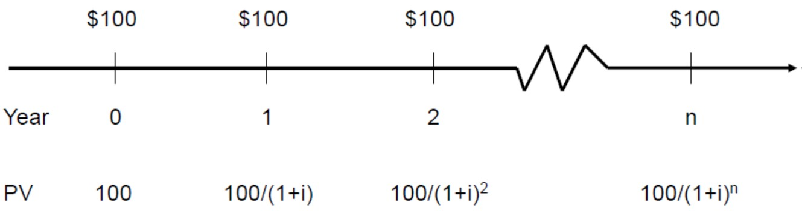
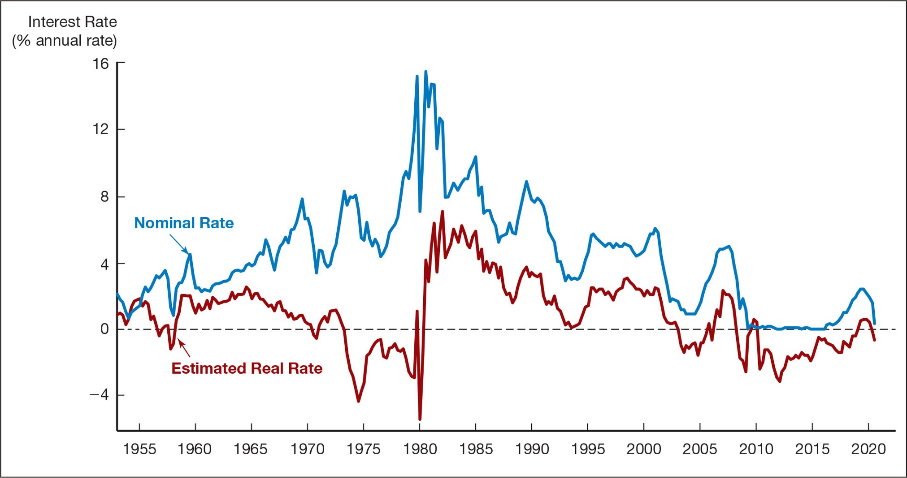
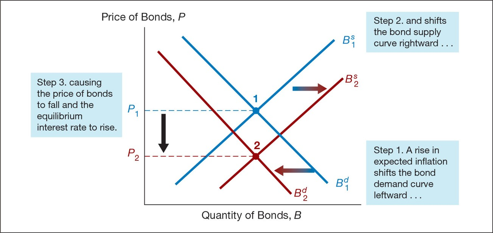
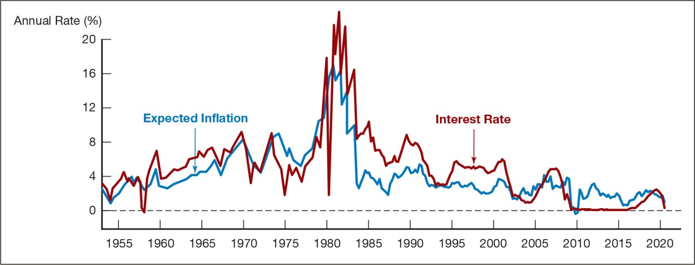
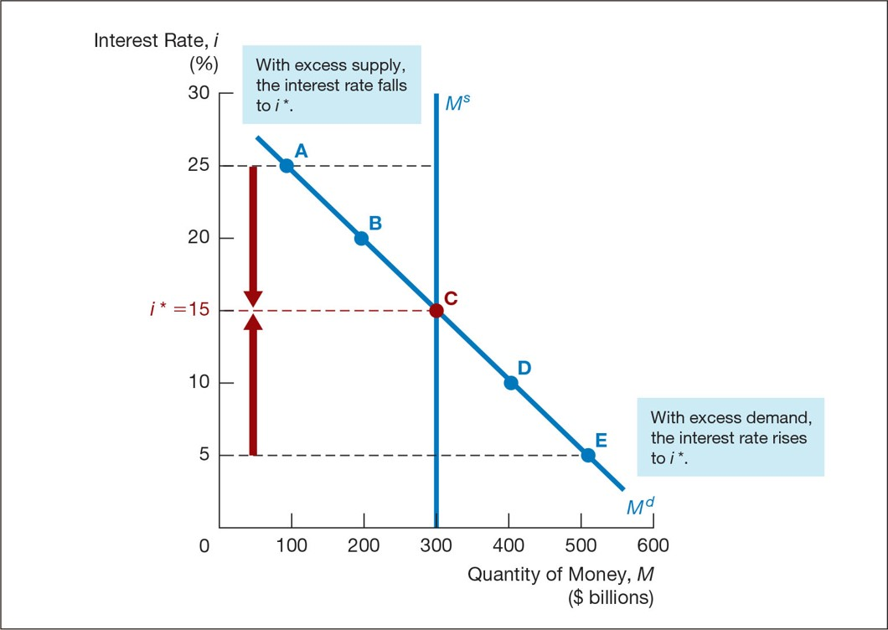
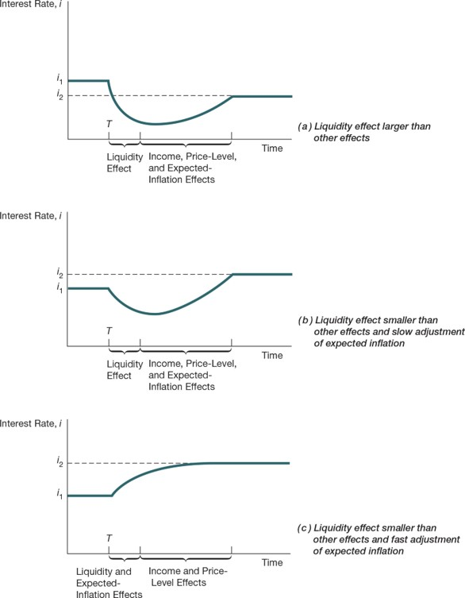
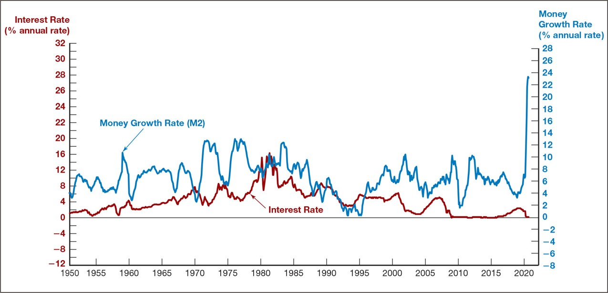

<style>
@media print{
  body, html, .remark-slides-area, .remark-notes-area {
    height: 100% !important;
    width: 100% !important;
    overflow: visible;
    display: inline-block;
    }
</style>

<style type="text/css">
.remark-slide-content {
    font-size: 38px;
    padding: 1em 4em 1em 4em;
}
</style>

<style type="text/css">
.my-one-page-font {
  font-size: 32px;
}
</style>

</style>

<style type="text/css">
.my-one-page-font-table {
  font-size: 28px;
}
</style>


```{r setup, include = FALSE}
library(tidyverse)
library(knitr)

opts_chunk$set(fig.width = 10, 
               message = FALSE, 
               warning = FALSE,
               echo = FALSE)
```

```{r xaringan-themer, include=FALSE, warning=FALSE}
#install.packages("xaringanthemer")
library(xaringanthemer)
style_mono_accent(
  base_color = "#135978", # #1c5253
  header_font_google = google_font("Josefin Sans"),
  text_font_google   = google_font("Montserrat", "500", "550i"),
  code_font_google   = google_font("Fira Mono"),
  colors = c(
  red = "#f34213",
  purple = "#3e2f5b",
  orange = "#ff8811",
  green = "#136f63",
  white = "#FFFFFF"
)
)
```

# Agenda  

1. What is an Interest Rate?  

2. The Behavior of Interest Rates

3. Class Activity: Understanding Interest Rates in Action

---

class: inverse, center, middle

# 1. What is an Interest Rate?  

---

## **Interest Rates: The Cost of Money**

**Definition**: The **interest rate** is the **price of borrowing money** or the **return earned from lending or saving money**.

**Why it matters**: It affects everything—from mortgages and student loans to investment decisions and inflation.

**Interest rate** = **Risk-free rate** + **Risk premium**

where, **Risk-free rate** = **Real rate** + **Expected inflation**

Note: 
- **Real rate** is the rate of return on an investment after adjusting for inflation. 
- Expected inflation is the rate at which prices are expected to rise. 
- Risk-free rate is the return on an investment that carries no risk of financial loss.
- Risk premium is the return in excess of the risk-free rate.

---

## Measuring Interest Rates

**Present Value (PV)**: Reflects the idea that **money today is worth more than money in the future**.

- A dollar today earns interest and grows to $1 \times (1+i)$ tomorrow.
- Ex: Would you prefer \$20M **today**, or \$1M every year for 20 years?

The answer depends on the **discount rate** or interest rate used.

---

## Compound Interest Example

Let `i = 0.10` (10%)

- Year 1: $$ $100 × (1 + 0.10) = $110 $$
- Year 2: $$ $110 × (1 + 0.10) = $121 → or $100 × (1 + 0.10)^2 $$
- Year 3: $$ $121 × (1 + 0.10) = $133 → or $100 × (1 + 0.10)^3 $$

**General formula**: $FV = PV \times (1 + i)^n$

---

## Simple Present Value

$PV = \frac{CF}{(1 + i)^n}$

Where:
- **PV** = Present Value
- **CF** = Future Cash Flow
- **i** = Interest Rate
- **n** = Time in years

.center[]

This formula helps us **compare money received at different times**.

---

## How Much Is That Jackpot Worth?

You win $20M, paid as $1M per year for 20 years.

- Is it really worth $20M today?
- Let’s assume an interest rate of 10%.

Calculate Present Value:

$PV = \frac{1M}{(1 + 0.10)} + \frac{1M}{(1 + 0.10)^2} + \ldots + \frac{1M}{(1 + 0.10)^{20}}$

This will result in a value significantly **less** than $20M. That’s the power of **discounting**.

---

## Four Types of Credit Market Instruments

1. **Simple Loan**: Lump sum borrowed and repaid with interest (e.g., short-term bank loan).

2. **Fixed Payment Loan**: Equal regular payments (e.g., car loans, mortgages).

3. **Coupon Bond**: Pays fixed interest (coupon) annually + face value at maturity.
   - **Coupon rate** = Annual coupon ÷ Face value
   - **Zero-coupon bonds**: No interim payments, only repayment at maturity.

4. **Discount Bond**: Sold below face value, pays no coupon (e.g., Treasury bills).

---

## Yield to Maturity (YTM)

YTM is the interest rate that **equates the bond’s current price with the present value of its future payments**.

### Why is YTM important?
- It reflects the **true return** on a bond if held to maturity.

**Example – Simple Loan**:
- PV = $100
- CF = $110 in 1 year

$100 = \frac{110}{1 + i} \Rightarrow i = 10%$

---

## Fixed Payment Loan Formula

$LV = \sum_{t=1}^{n} \frac{FP}{(1 + i)^t}$

Where:
- **LV** = Loan Value
- **FP** = Fixed annual payment
- **n** = Number of years

Used in amortized loans like mortgages.

---

## Coupon Bond Formula

$$ P = \sum_{t=1}^{n} \frac{C}{(1 + i)^t} + \frac{F}{(1 + i)^n} $$

Where:
- **P** = Current bond price
- **C** = Annual coupon payment
- **F** = Face value
- **i** = Interest rate
- **n** = Years to maturity

---

## Bond Pricing Insights

- **YTM = Coupon Rate** → Bond trades at **par** (face value).
- **YTM > Coupon Rate** → Bond trades **below par** (discount).
- **YTM < Coupon Rate** → Bond trades **above par** (premium).

.center[]

Remember: Bond price and Yield to Maturity (YTM) are inversely related — when price increases, yield decreases.

Why? Because paying a higher price for the same fixed future payments results in a lower return.

---

## Consol (Perpetuity)

A **consol bond** or **perpetuity** pays **coupon payments forever** and never matures.

$$ P = \frac{C}{i_c} $$

Where:
- **P** = Price
- **C** = Annual coupon
- **i_c** = Current yield

Used as a **simple approximation** of YTM when maturity is distant.

---

## Discount Bond Formula

$$ i = \frac{F - P}{P} $$

Where:
- **F** = Face value
- **P** = Current price

Like other bonds, **price ↑ → yield ↓**.

---

## Interest Rates vs Returns

$RET = \frac{C}{P_t} + \frac{P_{t+1} - P_t}{P_t}$

Where:
- **RET** = Return from holding bond for 1 period
- **C** = Coupon payment
- $P_t$ = Price at time t
- $P_{t+1}$ = Price at time t+1

**Two components**:
1. **Current yield**
2. **Capital gain/loss**

---

## Return vs Yield

- Return equals YTM **only** if held to maturity.
- Longer maturity → **greater interest-rate risk**.
- If interest rates **rise**, prices fall → **capital loss**.

.center[]

---

## Interest-Rate Risk

- **Long-term bonds** are more sensitive to interest rate changes.

- If you sell before maturity → you face price risk.

- But if you hold to maturity, your return = YTM.

Rule: The longer the maturity, the **higher the volatility** of bond price.

---

## Real vs Nominal Interest Rates

- **Nominal rate (i)**: Not adjusted for inflation

- **Real rate (iᵣ)**: Adjusted for inflation

Types of real rates:
- **Ex ante**: Based on **expected inflation**

- **Ex post**: Based on **actual inflation**

---

## Fisher Equation

$$ i = i_r + \pi^e $$

Where:
- **i** = Nominal rate
- **iᵣ** = Real rate
- $\pi^e$ = Expected inflation

Low real rates → borrowing is cheap → **more demand for credit**

---

.center[]

---

## Real-World Example: Fed Rate Hikes & Bank Failures

.center[]

---

## Fed Commentary: Financial Stability Risks

- Fed has increased exams after Silicon Valley Bank (SVB) collapse.

- Issue: **Unrealized losses** on long-term assets due to rising rates.

- Banks now face **tighter supervision and capital requirements**.

Shows how **interest rate changes ripple through the financial system**.

---

class: inverse, center, middle

# 2. The Behavior of Interest Rates

---

## Determinants of Asset Demand

An asset is anything that can be owned and has value.

Examples: money, laptops, cellphones, bonds, stocks, art, land, houses, and machinery.

**Asset demand** is the amount of an asset that people are willing to hold at a given price.

**Financial assets** are claims on real assets or income.

---

## Factors Affecting Asset Demand

- **Wealth**: Total resources, including all assets

- **Expected Return**: Return relative to other assets

- **Risk**: Uncertainty of returns

- **Liquidity**: Ease of converting to cash

---

## Theory of Portfolio Choice

1. Demand ↑ with **wealth**  

2. Demand ↑ with **expected return**  

3. Demand ↓ with **risk**  

4. Demand ↑ with **liquidity**

---

## Bond Market: Supply & Demand

- Lower price → Higher interest rate → Higher demand for bonds  

- Lower price → Higher interest rate → Lower supply of bonds

---

.center[]

---

## Market Equilibrium in Bonds

- Market clears when: $B^d = B^s$

- $B^d > B^s$: Excess demand → Price ↑ → Interest rate ↓

- $B^d < B^s$: Excess supply → Price ↓ → Interest rate ↑

---

## Changes in Equilibrium Interest Rates

**Demand for Bonds Shifts:**
- ↑ Wealth → Demand ↑
- ↑ Expected interest rate → Demand ↓
- ↑ Expected inflation → Demand ↓
- ↑ Risk → Demand ↓
- ↑ Liquidity → Demand ↑

---

## Supply of Bonds Shifts

- ↑ Profitability → Supply ↑

- ↑ Expected inflation → Supply ↑

- ↑ Budget deficit → Supply ↑

---

## Fisher Effect: Response to Expected Inflation

.center[]


---

## Expected Inflation vs Interest Rates (1953–2020)

.center[]


---

## Liquidity Preference Framework

- Keynesian model: equilibrium interest rate via money supply & demand

- Wealth held in either **money** or **bonds**

$B^s + M^s = B^d + M^d$
→ Rearranged: $B^s - B^d = M^s - M^d$

If $M^s = M^d$ → then $B^s = B^d$

---

## Demand for Money

As interest rate ↑:
- Opportunity cost of holding money ↑
- Expected return of money ↓
→ Demand for money ↓

Assume money supply is **fixed** by central bank.

Meaning:

- When interest rates go up:

You're missing out on more potential earnings by just holding onto cash — that’s the opportunity cost.

Since cash doesn’t earn interest, its return becomes less attractive compared to alternatives like bonds or savings accounts.

- Result: People prefer to hold less money and instead invest it — so the demand for money falls.

---

## Equilibrium in Money Market

.center[]

---

## Changes in Equilibrium (Liquidity Preference)

**Demand for Money Shifts:**
- **Income Effect**: ↑ income → ↑ money demand

- **Price-Level Effect**: ↑ prices → ↑ money demand

---

## Shifts in Supply of Money

- Central bank controls money supply

- Fed increases $M^s$ → Supply curve shifts **right**

---

## Money & Interest Rates

- Liquidity preference says ↑ $M^s$ → ↓ interest rate
- But...
    - **Price-level effect**: ↑ $M^s$ → ↑ prices → ↑ interest rate

---

## More Effects of Money Growth

- **Expected-inflation effect**: if people expect rising inflation, they demand higher interest

- **Income effect**: ↑ $M^s$ → ↑ income → ↑ interest

---

## Net Effect? Does ↑ Money Supply ↓ Rates?

- **Liquidity effect**: ↓ rates

- **Income effect**: ↑ rates

- **Price-level effect**: ↑ rates

- **Expected-inflation effect**: ↑ rates

---

## Response Over Time to Money Growth

.center[]

---

## Money Growth & Interest Rates (1950–2020)

.center[]

---


class: inverse, center, middle

# 3. Class Activity: Understanding Interest Rates in Action

---

class: inverse, center, middle

# Any QUESTIONS?

## Thank You!  

---

# Next Class

- (Apr 4) 
  - **Chap 6.** The Risk and Term Structure of Interest Rates; 
  - **Chap 7.** The Stock Market, the Theory of Rational Expectations, and the Efficient Market Hypothesis 


???
1. To print pdf slides
https://stackoverflow.com/questions/54968311/xaringan-export-slides-to-pdf-while-preserving-formatting

pagedown::chrome_print("W1_ME.html") # but not all pictures are visible

2. Option: https://stackoverflow.com/questions/54968311/xaringan-export-slides-to-pdf-while-preserving-formatting

install.packages("remotes")
remotes::install_github("jhelvy/xaringanBuilder")
remotes::install_github("jhelvy/renderthis@v0.0.9")

library(xaringanBuilder)
build_pdf("DVC.html")

3. Option
writeBin(as.raw(c()), "favicon.ico") # create an empty favicon.ico file
install.packages("renderthis")
remotes::install_github('rstudio/chromote')
library(renderthis)

renderthis::to_pdf("W4_FIS.html")

getwd()
setwd("C:/Users/Iegor/OneDrive - kdis.ac.kr/Documents/GitHub/Sogang/2025/Spring/Financial Institutions and System/Week 4")
