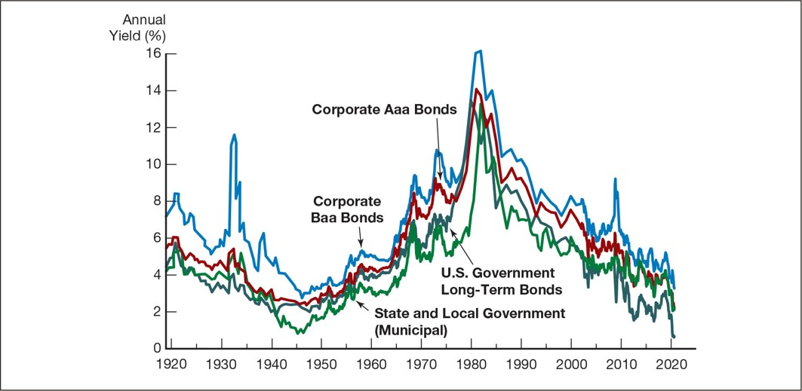
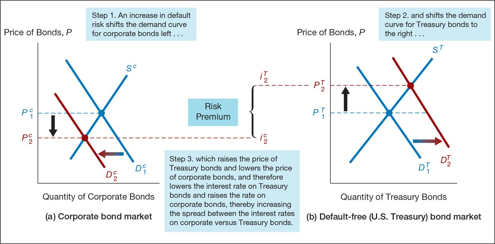
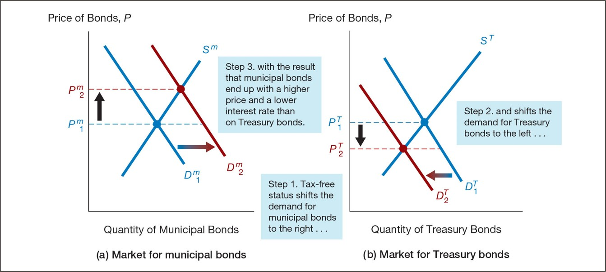
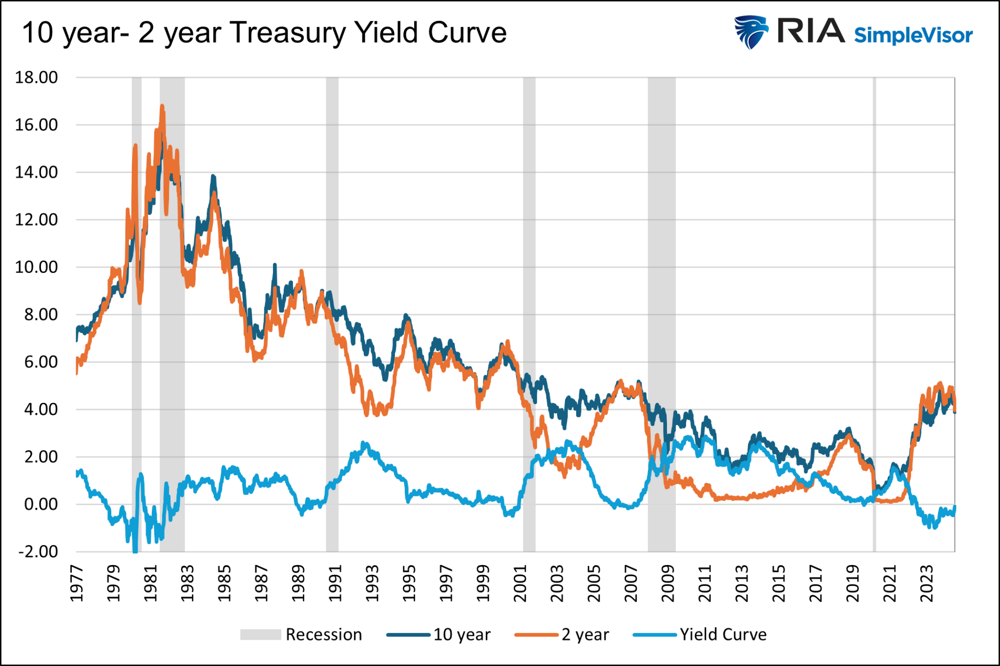
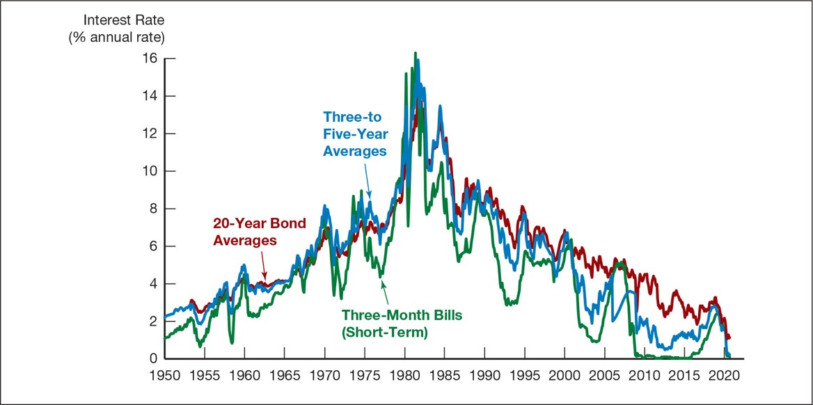
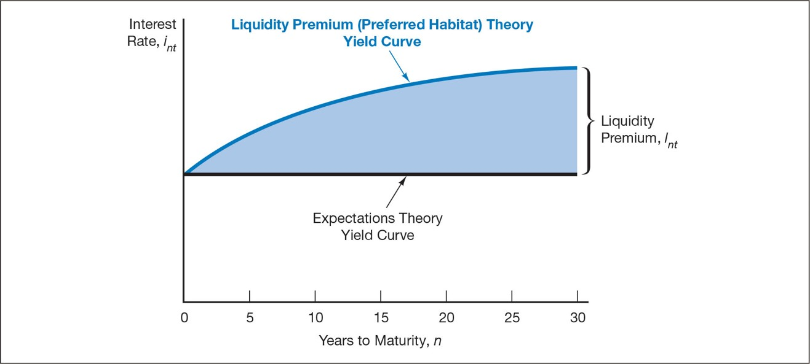
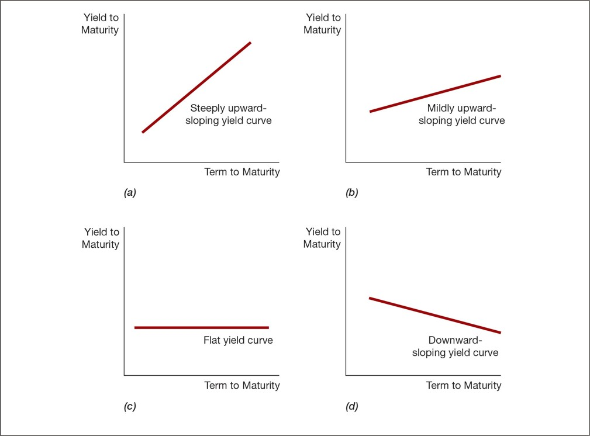
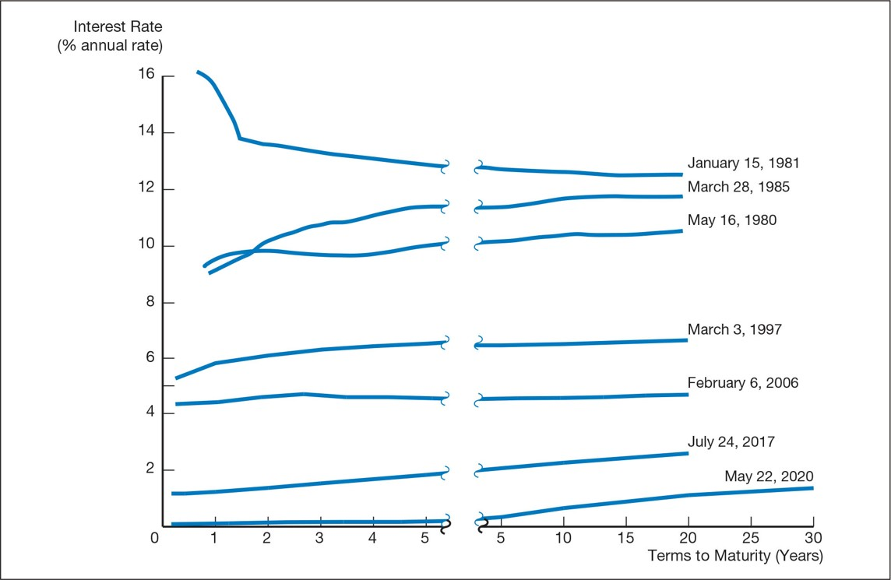
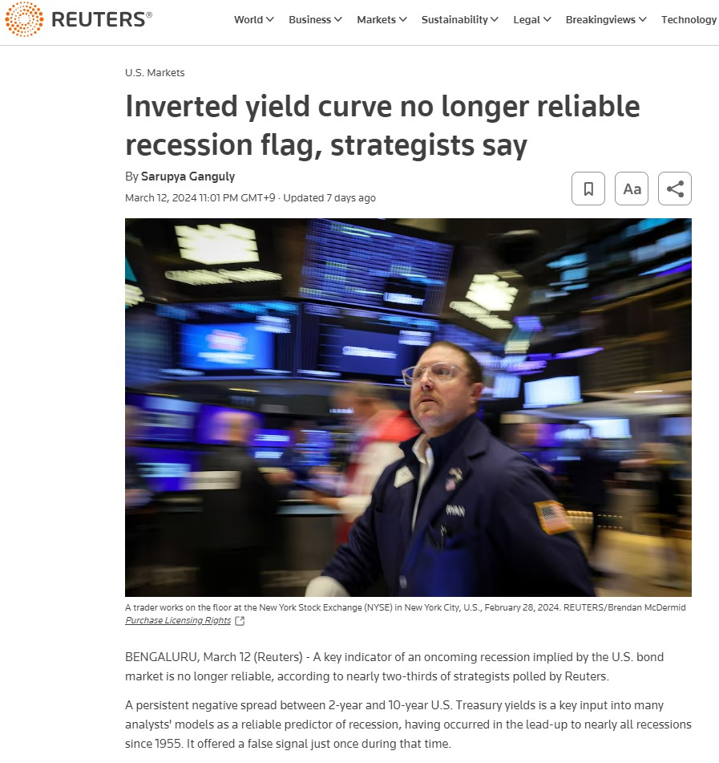

<style>
@media print{
  body, html, .remark-slides-area, .remark-notes-area {
    height: 100% !important;
    width: 100% !important;
    overflow: visible;
    display: inline-block;
    }
</style>

<style type="text/css">
.remark-slide-content {
    font-size: 38px;
    padding: 1em 4em 1em 4em;
}
</style>

<style type="text/css">
.my-one-page-font {
  font-size: 32px;
}
</style>

</style>

<style type="text/css">
.my-one-page-font-table {
  font-size: 28px;
}
</style>


```{r setup, include = FALSE}
library(tidyverse)
library(knitr)

opts_chunk$set(fig.width = 10, 
               message = FALSE, 
               warning = FALSE,
               echo = FALSE)
```

```{r xaringan-themer, include=FALSE, warning=FALSE}
#install.packages("xaringanthemer")
library(xaringanthemer)
style_mono_accent(
  base_color = "#135978", # #1c5253
  header_font_google = google_font("Josefin Sans"),
  text_font_google   = google_font("Montserrat", "500", "550i"),
  code_font_google   = google_font("Fira Mono"),
  colors = c(
  red = "#f34213",
  purple = "#3e2f5b",
  orange = "#ff8811",
  green = "#136f63",
  white = "#FFFFFF"
)
)
```

# Agenda  

1. Risk and Term Structure of Interest Rates 

2. Stock Market, Theory of Rational Expectations, and Efficient Market Hypothesis"

3. **Presentation Assignment Intro**

4. Class Activity: Mini-Debate – How Efficient Is the Stock Market?

---

class: inverse, center, middle

# 1. Risk and Term Structure of Interest Rates 

---

# Risk Structure of Interest Rates

Risk structure of interest rates: Why do bonds with the same maturity have different interest rates?
- **Risk structure**: Relationship between interest rates and risk of default.
- **Term structure**: Relationship between interest rates and time to maturity.

Bonds with the same maturity have different interest rates due to:

- **Default risk** - the risk that the issuer will not make payments.
- **Liquidity** - the ease of converting an asset to cash.
- **Tax considerations** - tax treatment of interest payments.

---

.center[]
.caption[Figure 1 Long-Term Bond Yields, 1919–2020]

---

### Default Risk

- Probability that the issuer of the bond is unable or unwilling to make interest or principal payments.

- **U.S. Treasury bonds** are considered default-free (government can raise taxes).

- **Risk premium** = Spread between interest rates on risky bonds and Treasuries of the same maturity.
  - A bond with default risk will always have a **positive risk premium**.
  - If default risk increases, risk premium **widens**.

---

.center[]

.caption[Figure 2 Response to an Increase in Default Risk on Corporate Bonds]

---

### Liquidity

- Ease of converting an asset to cash.

- Treasury bonds are more liquid (more buyers/sellers, lower transaction costs).

- Hence, **more liquid bonds have lower yields**.

### Income Tax Considerations

- **Municipal bonds**: Interest is exempt from federal income tax.

- As a result, their **yields are lower**, despite sometimes having more risk.

---

### Case Studies of Spreads

#### Global Financial Crisis (2007–2009)

- Collapse of subprime market → Baa bonds perceived as riskier.

- Investors demanded higher premiums.

#### Coronavirus Pandemic (2020)

- Lockdowns → Economic freeze → Investors avoided low-rated bonds.

- Risk premium on Baa bonds surged again.

---

.center[]

.caption[Figure 3 Interest Rates on Municipal and Treasury Bonds]

---

### Trump Tax Cuts and Bond Markets

- 2017: Top marginal tax rate reduced from 39.6% → 37%.

- After-tax return on **municipal bonds** fell vs. Treasuries.

- Demand for municipals dropped → their yields rose.

- Demand for Treasuries rose → their yields dropped.

---

# Term Structure of Interest Rates

Even with same risk/liquidity/tax, bond yields differ with **maturity**.

- **Yield curve**: Plot of yields across different maturities.
  - **Upward-sloping**: LT rates > ST rates (normal)
  - **Flat**: LT = ST
  - **Inverted**: LT < ST (often predicts recession)

---

.center[]

.caption[RIA - Yield Curve Shifts Offer Signals For Stockholders]


---

# Term Structure Facts

## 1. Interest Rates on Different Maturities Move Together

- When **short-term (ST) interest rates** rise, **long-term (LT) rates** usually rise too — and vice versa.
- This is because LT rates reflect the **average of expected future ST rates**.
- **Example**:  
  - 1-year rate today = 6%  
  - Expected 1-year rate next year = 8%  
  - Then, the 2-year bond rate ≈ **7%**

---
# Term Structure Facts (continued)

## 2. ST Rates Influence the Yield Curve Slope

- When **ST rates are low**, yield curves usually **slope upward**.  
  → Investors expect future ST rates to rise.  
- When **ST rates are high**, yield curves often **invert (slope downward)**.  
  → Investors expect ST rates to fall.
- **Examples**:  
  - ST rate today = 2%, expected next year = 4% → 2-year rate = **3%** → upward slope  
  - ST rate today = 6%, expected next year = 4% → 2-year rate = **5%** → downward slope

---

# Term Structure Facts (continued)

## 3. Yield Curves Are Usually Upward-Sloping

- Investors prefer **short-term bonds** (less risk, more liquidity).
- To compensate for the **additional risk** of holding long-term bonds, investors require a **term/liquidity premium**.
- Even with no change in expected future ST rates, this preference causes LT rates to be higher.
- Result: Yield curves typically slope **upward**.

---

### Three Theories

1. **Expectations Theory**: Explains facts 1 & 2

2. **Segmented Markets Theory**: Explains fact 3

3. **Liquidity Premium Theory**: Explains all three

---

.center[]

.caption[Figure 4 Movements Over Time of Interest Rates (U.S. Bonds)]

---

## Expectations Theory

- LT bond yield = average of expected ST rates over time.
- Investors view bonds of all maturities as **perfect substitutes**.
- If 1-year rate is 6% today, and expected to be 8% next year:

$$
\text{2-year bond rate} = (6\% + 8\%) / 2 = 7\%
$$

### **Mathematical Expression**

$i_{nt} = \frac{i_{t} + i_{t+1}^{e} + \cdots + i_{t+n-1}^{e}}{n}$


---

### Limits of Expectations Theory

- Explains why yields **move together** and react to ST levels.

- **Does NOT** explain why curves usually **slope upward**.

---

## Segmented Markets Theory

- Bonds of different maturities are **not substitutes**.

- Rates determined independently by supply and demand.

- Investors prefer **shorter maturities** (less risk).

- Explains persistent **upward slope** of yield curve.

---

## Liquidity Premium Theory

- Bonds are **substitutes**, but not perfect ones.
- LT yields = average of expected ST rates + **liquidity premium**.
- Premium increases with maturity (compensates for risk).

$i_{nt} = \frac{i_t + i_{t+1}^e + \cdots + i_{t+n-1}^e}{n} + l_{nt}$

---

## Preferred Habitat Theory

- Extension of liquidity premium.

- Investors prefer certain maturities ("habitats") but will shift if **compensated**.

- Explains why LT rates may be higher (need incentive).

---

.center[]

.caption[Figure 5 Liquidity Premium and Expectations Theory Combined]

---

.center[]

.caption[Figure 6 Yield Curves & Expectations Under Liquidity Premium Theory]

---

## Yield Curve as Forecasting Tool

- Contains info about **future rates, inflation, and GDP**.

- Rising curve → Boom

- Flat or inverted curve → **Recession warning**

---

.center[]

.caption[Figure 7 Yield Curves and Expectations of Short-Term Rates]

---

.center[]

---

## Yield Curve Inversion: What It Means

- **2y-10y inversion** has predicted most recessions since 1955.

- Today: curve inverted 20+ months, by ~46 bps.

- However, investors unsure if recession will occur:
  - Strong demand for long bonds
  - Fed keeps ST rates high due to strong economy

---

class: inverse, center, middle

# 2. Stock Market, Theory of Rational Expectations, and Efficient Market Hypothesis

---

# The Stock Market, Rational Expectations, and the Efficient Market Hypothesis

## Computing the Price of Common Stock

- Stock value = Present value of all expected future cash flows (dividends and selling price)

### One-Period Valuation Model
$$
P_0 = \frac{Div_1}{(1 + k_e)} + \frac{P_1}{(1 + k_e)}
$$
- $P_0$: Current stock price  
- $Div_1$: Dividend next year  
- $P_1$: Price next year  
- $k_e$: Required return on equity

---

## Example
- Intel stock = $50  
- Dividend = $0.16  
- Analyst forecast: price next year = $60  
- Your required return = 12%

$$
P_0 = \frac{0.16}{1.12} + \frac{60}{1.12} = \$53.71
$$

Since $$53.71 > $50$ → Buy the stock.

---

## The Generalized Dividend Valuation Model

$P_0 = \sum_{t=1}^{\infty} \frac{D_t}{(1 + k_e)^t}$

- Future dividends determine stock value

- If a stock doesn’t pay dividends → not valuable today

---

## Gordon Growth Model
$$
P_0 = \frac{D_1}{k_e - g} = \frac{D_0(1 + g)}{k_e - g}
$$
Where:  
- $D_0$: Most recent dividend  
- $g$: Constant dividend growth rate  
- $k_e$: Required return

**Assumptions**:
- Dividends grow forever at constant $g$
- $g < k_e$

---

## How the Market Sets Stock Prices

1. Price is set by the **highest bidder**.

2. Those with **better info** value assets more accurately.

3. Better info → **less perceived risk** → **higher value**.

**Prices reflect changing information.**

---

## Application: Monetary Policy & Stock Prices

- Fed lowers interest rates → Bond returns ↓ → Stock becomes more attractive → $k_e$ ↓

- Also boosts economy → Expected $g$ ↑

- Both effects → Stock prices ↑ (via Gordon model)

---

## Coronavirus Crash of 2020

- Dow dropped 37% (Feb–Mar 2020)

- Economic uncertainty → lower dividend growth $g$

- Risk ↑ → Required return $k_e$ ↑

$P_0 = \frac{D_1}{k_e - g} \downarrow$

---

## Rational Expectations Theory

- **Adaptive expectations**: Based only on past values

- **Rational expectations**:
  - Use all available information
  - May be inaccurate but unbiased

$X^e = X^{of}$
- $X^e$: Expected value  
- $X^{of}$: Optimal forecast

---

## Efficient Market Hypothesis (EMH)

- Prices **fully reflect** all available information.
- Expected return:
$$
R^e = \frac{P_{t+1}^e - P_t + C}{P_t}
$$
- In equilibrium:
$$
R^e = R^{of} = R^*
$$

---

## EMH Logic

If $R^{of} > R^*$ → $P_t$ ↑ → $R^{of}$ ↓ until $R^{of} = R^*$  
If $R^{of} < R^*$ → $P_t$ ↓ → $R^{of}$ ↑ until $R^{of} = R^*$

→ Prices adjust quickly via **arbitrage**

Simply put, if you can make money by buying or selling a stock, the price will adjust until you can’t.

---

## Do Analysts Help?

- Most public information is **already priced in**.

- Reports and tips rarely beat the market.

- **Buy and hold** is often optimal for average investors.

---

## Are Markets Always Efficient?

- **Market crashes** challenge “strong” efficiency view.

- EMH doesn’t claim prices are always correct — only **unpredictable**.

- Crashes may reflect psychology, not just fundamentals.

---

## Behavioral Finance

- Explains inefficiencies with psychology & sociology:
  - **Loss aversion** → Avoiding short selling
  - **Overconfidence** → Excessive trading
  - **Herding / social contagion** → Bubbles

---


class: inverse, center, middle

# 3. Presentation Assignment Intro

---


# Presentation Assignment

- According to the course syllabus, this **individual presentation assignment** accounts for **20% of your final grade**.

- Each student will give a **15-minute presentation** followed by a **5-minute Q&A session**.

- **Presentation Date:** Week 15 (June 13)

- **Topic:** *Current Issues on Challenges and Risks in the Modern Financial System*

**Tip:** Choose a topic that you find genuinely interesting — this will make your research, preparation, and presentation more engaging and insightful!


---
class: my-one-page-font


## Instructions & Requirements

### Topic Selection
- Choose a topic from the **List of Suggested Topics** below.
- **No duplicate topics** will be allowed — topics are assigned on a **first come, first served** basis.
- You may also propose a custom topic (subject to instructor approval).

### Suggested Topics
- The Rise of Shadow Banking: Risks Beyond the Regulators
- The Global Debt Crisis: Are Sovereign Defaults Inevitable?
- Bank Runs in the Digital Age: Lessons from SVB and Credit Suisse
- Climate Risk as a Financial Risk: The New Role of Central Banks
- FinTech Disruption: Balancing Innovation and Systemic Risk
- Cybersecurity in Finance: Are We Ready for the Next Digital Shock?
- CBDCs and the Future of Money: Stability Tool or Risk Amplifier?
- Inflation, Interest Rates, and Fragile Markets: A Perfect Storm?
- Geopolitical Risk and the Financial System: War, Sanctions, and Uncertainty
- Artificial Intelligence in Finance: Opportunity or Black Box Risk?
- Others at your proposal (requires prior approval by the instructor)

---

class: my-one-page-font

## Instructions & Requirements (cont'd)

### Presentation Delivery
- You must **submit the final version of your presentation slides** via Cyber Campus by **June 12 at 12:00 PM (noon)**.
- Prepare a presentation of **12–15 slides** (PowerPoint, PDF, or equivalent).
- You will have **15 minutes to present**, followed by a **5-minute Q&A**.
- **Active participation during other students’ Q&A sessions** is encouraged and will contribute to your grade.
- **Full credit** will be awarded only if you both **present** and **engage in Q&A discussions**.

### Summary Submission
- Submit a **1-page written summary** of your presentation.
- **Due date:** by class time on **June 6** via Cyber Campus.
- Format:
  - **Font:** 12 pt, **Spacing:** 1.5 lines
  - **Length:** maximum 1 page
  - **Content should include:**
    - Brief overview of your topic
    - Your key arguments and main findings
    - At least **3 academic references** (journal articles, policy papers, working papers)
    - **Citations and references** must follow **APA style**

---

## Grading Criteria (20%)
- Topic clarity and structure (4%)

- Quality of analysis and arguments (6%)

- Slide design and presentation delivery (4%)

- Summary paper (3%)

- Engagement in Q&A sessions (3%)


---


class: inverse, center, middle

# 4. Class Activity: Mini-Debate – How Efficient Is the Stock Market?

---

class: inverse, center, middle

# Any QUESTIONS?

## Thank You!  

---

# Next Class

- (Apr 11) 
  - **Chap 8.** An Economic Analysis of Financial Structure  
  - **Chap 13.** Banking and the Management of Financial Institutions 


???
1. To print pdf slides
https://stackoverflow.com/questions/54968311/xaringan-export-slides-to-pdf-while-preserving-formatting

pagedown::chrome_print("W1_ME.html") # but not all pictures are visible

2. Option: https://stackoverflow.com/questions/54968311/xaringan-export-slides-to-pdf-while-preserving-formatting

install.packages("remotes")
remotes::install_github("jhelvy/xaringanBuilder")
remotes::install_github("jhelvy/renderthis@v0.0.9")

library(xaringanBuilder)
build_pdf("DVC.html")

3. Option
writeBin(as.raw(c()), "favicon.ico") # create an empty favicon.ico file
install.packages("renderthis")
remotes::install_github('rstudio/chromote')
library(renderthis)

renderthis::to_pdf("W5_FIS.html")

getwd()
setwd("C:/Users/Iegor/OneDrive - kdis.ac.kr/Documents/GitHub/Sogang/2025/Spring/Financial Institutions and System/Week 5")
