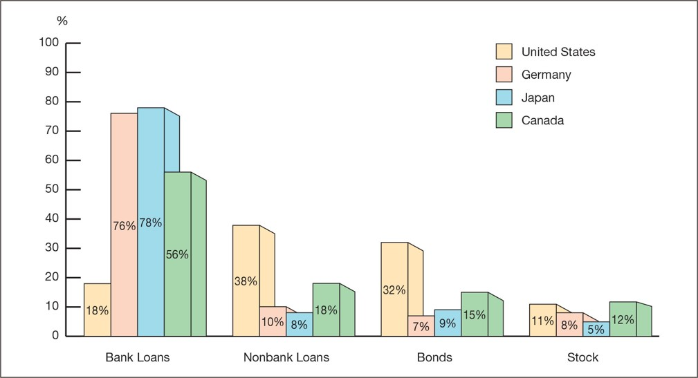
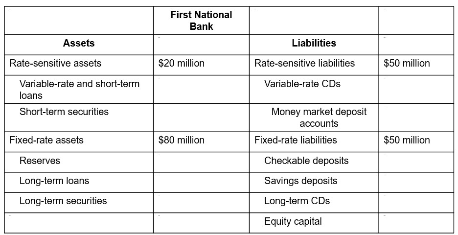

<style>
@media print{
  body, html, .remark-slides-area, .remark-notes-area {
    height: 100% !important;
    width: 100% !important;
    overflow: visible;
    display: inline-block;
    }
</style>

<style type="text/css">
.remark-slide-content {
    font-size: 38px;
    padding: 1em 4em 1em 4em;
}
</style>

<style type="text/css">
.my-one-page-font {
  font-size: 32px;
}
</style>

</style>

<style type="text/css">
.my-one-page-font-table {
  font-size: 28px;
}
</style>


```{r setup, include = FALSE}
library(tidyverse)
library(knitr)

opts_chunk$set(fig.width = 10, 
               message = FALSE, 
               warning = FALSE,
               echo = FALSE)
```

```{r xaringan-themer, include=FALSE, warning=FALSE}
#install.packages("xaringanthemer")
library(xaringanthemer)
style_mono_accent(
  base_color = "#135978", # #1c5253
  header_font_google = google_font("Josefin Sans"),
  text_font_google   = google_font("Montserrat", "500", "550i"),
  code_font_google   = google_font("Fira Mono"),
  colors = c(
  red = "#f34213",
  purple = "#3e2f5b",
  orange = "#ff8811",
  green = "#136f63",
  white = "#FFFFFF"
)
)
```

# Agenda  

1. An Economic Analysis of Financial Structure 

2. Banking and the Management of Financial Institutions

3. Class Activity

---

class: inverse, center, middle

# 1. An Economic Analysis of Financial Structure 

---

# Basic Facts About Financial Structure Throughout the World

This chapter provides an economic analysis of how our financial structure is designed to promote economic efficiency.

Figure 1 compares how businesses in the U.S., Germany, Japan, and Canada used external funding from 1970–2000.

---
.center[]
.caption[*Figure 1: Sources of External Funds for Nonfinancial Businesses: A Comparison of the United States with Germany, Japan, and Canada*
]


---

## 8 Basic Facts About Financial Structure Worldwide

1. Stocks are **not** the most important source of external financing for businesses.

2. Marketable securities are **not** the primary funding method.

3. **Indirect finance** is far more important than direct finance.

4. Financial **intermediaries** (especially banks) are key sources of business financing.

5. The financial system is heavily **regulated**.

6. Only **large firms** access securities markets easily.

7. **Collateral** is widely used in debt contracts.

8. Debt contracts contain **restrictive covenants** to reduce risk.

---

## Transaction Costs

- Examples: Brokerage fees, search costs, lack of diversification.

**Solutions by Financial Intermediaries:**
- **Economies of scale** – pool funds, reduce costs per investor, enable diversification.
- **Expertise** – better able to screen and manage investments.

---

## Asymmetric Information: Adverse Selection & Moral Hazard

- **Adverse selection**: Hidden information **before** transaction.

- **Moral hazard**: Hidden actions **after** transaction.

Agency theory explains how this affects financial decision-making.

---

## The Lemons Problem

If buyers can't distinguish good vs bad quality:

- They only pay average price.

- Good sellers exit.

- Only lemons remain.

Explains why firms don’t rely much on public equity/debt markets.

---

## Solving Adverse Selection

**Private Info Sales:**
- But... free-rider problem.

**Government Regulation:**
- Requires disclosures & audits (Fact 5).

- But not always reliable (e.g., Enron).

---

## Role of Financial Intermediaries

- Specialize in credit analysis.

- Make **private loans** (no free-rider issue).

- Earn higher returns, minimize risks.

Explains Facts 3, 4, and 6.

---

## Collateral & Net Worth

- **Collateral** reduces loss in case of default → more likely to get loan.

- **Net worth** plays similar role: "Only those who don't need loans can get them."

Explains Fact 7.

---

## Enron Implosion (2001)

- Hid debt off balance sheet.

- Regulation failed to catch deception.

- Massive employee pension losses.

Illustrates limits of disclosure-based regulation.

---

## Moral Hazard in Equity: Principal-Agent Problem

- **Separation of ownership & control** → managers may act in self-interest.

- Stockholders = Principals; Managers = Agents.

---

## Tools to Solve Principal-Agent Problem

- **Monitoring**: Costly ("costly state verification") → discourages equity.

- **Regulation**: Improves transparency (Fact 5).

- **Venture capital/private equity**: Avoid free-rider by controlling board (Fact 3).

---

## Debt vs Equity

- **Debt**: Requires fixed repayments; less monitoring needed.

- Moral hazard only matters if borrower defaults.

Explains Fact 1.

---

## Moral Hazard in Debt

- Borrowers may take on riskier projects than lender prefers.

**Solutions:**
- Net worth & collateral → align incentives.
- Restrictive covenants → monitor behavior, ensure proper use of funds (Fact 8).

---

## Role of Financial Intermediation

- Hard to write covenants for every scenario.

- Intermediaries make private loans → avoid free-riders.

Explains Facts 3 & 4.

---

## The Tyranny of Collateral

- In many developing countries, poor individuals **cannot legally claim** property.

- No collateral → few loans → persistent poverty.

**Takeaway**: Strong legal infrastructure is crucial for financial access.

---

class: inverse, center, middle

# 2. Banking and the Management of Financial Institutions

---

# The Bank Balance Sheet

To understand how banking works, start by looking at the bank balance sheet, a list of the bank's assets and liabilities.

$$
\text{Total Assets} = \text{Total Liabilities} + \text{Capital}
$$

A balance sheet shows the sources (liabilities and capital) and uses (assets) of funds.

Banks make profits by borrowing funds (via deposits, borrowing) and using them to purchase income-earning assets (loans and securities).

---

## Bank Liabilities: Checkable and Nontransaction Deposits

- **Checkable deposits**: allow account holders to write checks.
  - 14% of bank liabilities (June 2020)
  - Declined from 60% in the 1960s
  - Lowest-cost source of bank funds

- **Nontransaction deposits**:
  - No check-writing privileges
  - Include savings and time deposits
  - 63% of liabilities (June 2020)

---

## Bank Liabilities: Borrowings and Capital

- **Borrowings**:
  - From the Fed (discount loans), other banks (federal funds market), or corporations (Eurodollars)
  - Grew from 2% (1960s) to 10% (2020)

- **Bank Capital**:
  - 13% of assets (2020)
  - Raised via new equity or retained earnings
  - Cushion against asset value declines

---

## Bank Assets: Reserves and Interbank Deposits

- **Reserves**: deposits at the Fed + vault cash
  - Required reserves (based on reserve ratio)
  - Excess reserves (insurance against outflows)

- **Deposits at other banks**:
  - Small banks hold funds at larger banks for services
  - Reserves + deposits = ~15% of assets

---

## Bank Assets: Securities and Loans

- **Securities**:
  - All debt instruments; banks can't hold stock
  - ~20% of bank assets, provide ~10% of income
  - US gov't, agency, state/local bonds

- **Loans**:
  - Primary source of revenue: >50% of assets
  - Most profitable and riskiest asset

- **Other assets**: physical capital (buildings, equipment)

---

## Table: Commercial Bank Balance Sheet (June 2020)
.center[]
.center[]

---

## Basic Banking: Deposit Effects
.center[]
.center[]


- A cash deposit increases checkable deposits and reserves equally.
.center[]
.center[]


- A check deposit from another bank increases reserves.
- A check withdrawal causes a reserve loss.

---

## Making a Profit: Asset Transformation
.center[]
.center[]


- Borrow short (deposits), lend long (loans).
- Banks transform liabilities into assets with different risk, liquidity, and maturity.

---

## Principles of Bank Management

1. **Liquidity Management**: ensure enough reserves for withdrawals

2. **Asset Management**: earn high return, reduce risk, maintain liquidity

3. **Liability Management**: acquire funds at low cost

4. **Capital Adequacy Management**: maintain sufficient capital to prevent insolvency

---

## Liquidity Management Example

If a bank’s required reserve ratio is 10%:
.center[]
.center[]


- With ample excess reserves, the bank can handle withdrawals without asset sales.
.center[]
.center[]


- Without reserves, the bank must borrow or sell assets.

---

## Ways to Cover Reserve Shortfall

- **Borrow** from other banks or Fed (discount loan)
  - .center[]

- **Sell Securities**:
  - .center[]

- **Borrow from Fed**:
  - .center[]

- **Call in or sell loans**:
  - .center[]
  - Most costly, harms customer relationships

---

## Asset Management: Goals & Tools

### Three Goals:
1. Maximize returns
2. Minimize risk
3. Maintain liquidity

### Four Tools:
1. Lend to creditworthy borrowers
2. Purchase low-risk securities
3. Diversify asset portfolio
4. Balance returns vs. liquidity

---

## Liability & Capital Management

- **Liability Management**:
  - Shift from relying on checkable deposits
  - Use CDs, repurchase agreements, and federal funds

- **Capital Adequacy**:
  - Capital prevents bank failure
  - Affects return to shareholders (ROE)
  - Required by regulators

---

## Capital & Insolvency Example
.center[]

.center[]

Low capital means bad loans can wipe out equity → insolvency

---

## ROA, ROE, and Equity Multiplier

$$ \text{ROA} = \frac{\text{Net Profit}}{\text{Assets}} $$
$$ \text{ROE} = \frac{\text{Net Profit}}{\text{Equity}} $$
$$ \text{EM} = \frac{\text{Assets}}{\text{Equity}} \quad \Rightarrow \text{ROE} = \text{EM} \times \text{ROA} $$

Lower capital = higher ROE, but higher risk

---

## Capital Strategy

- **Surplus capital**: buy back stock, pay dividends, expand assets

- **Capital shortage**: issue equity, reduce dividends, shrink assets

> Lending contraction often follows a capital crunch

---

## Capital Crunch → Credit Crunch (GFC Example)

- Mortgage-backed losses reduced bank capital

- Banks tightened lending standards

- Lending and credit availability declined

---

## Managing Credit Risk: Adverse Selection & Moral Hazard

- **Adverse selection**: risky borrowers seek loans

- **Moral hazard**: borrowers take risky actions post-loan

> Solution: screen, monitor, require collateral, and limit exposure

---

## Credit Risk Management Tools

- **Screening & Monitoring** (e.g. credit scores, loan covenants)

- **Specialization in lending** (local knowledge)

- **Restrictive covenants** (e.g. no asset sales, reporting)

- **Loan commitments** (pre-agreed funding)

- **Collateral & compensating balances**

- **Credit rationing** (limit or refuse risky loans)

---

## Interest-Rate Risk Example
.center[]


- $20M rate-sensitive assets vs. $50M rate-sensitive liabilities
- 5% rate ↑ → $1.5M profit ↓
- 5% rate ↓ → $1.5M profit ↑

---

## Gap Analysis

$$ \text{Gap} = \text{Rate-Sensitive Assets} - \text{Rate-Sensitive Liabilities} = -\$30M $$

$$ \Delta \text{Profits} = \text{Gap} \times \Delta \text{Interest Rate} $$

---

## Managing Interest-Rate Risk

- **Shorten duration of assets**, **lengthen liabilities**

- **Use interest-rate derivatives** (e.g., swaps, futures)

- Accept some risk if expecting favorable rate movement

---

class: my-one-page-font

## **Conclusion: Key Takeaways**

- **Banking is a balancing act**: Profitability vs. risk, liquidity vs. return, capital vs. leverage.
  
- **The balance sheet tells a story**: How banks acquire funds (liabilities) and allocate them (assets) reflects their strategic priorities.

- **Risk management is central**: 
  - Credit risk (default)
  - Interest-rate risk (gap analysis & duration)
  - Liquidity risk (reserve management)

- **Capital matters**:
  - Protects against insolvency
  - Influences return on equity (ROE)
  - Regulated for systemic stability

- **Tools banks use**:
  - Asset/liability management
  - Covenants, collateral, monitoring
  - Specialization & long-term relationships
  - Derivatives for hedging

---


class: inverse, center, middle

# 3. Class Activity

---

class: inverse, center, middle

# Any QUESTIONS?

## Thank You!  

---

# Next Class

- (Apr 18) 
  - **Chap 14.** Central Banks   
  - **Chap 15.** The Money Supply Process


???
1. To print pdf slides
https://stackoverflow.com/questions/54968311/xaringan-export-slides-to-pdf-while-preserving-formatting

pagedown::chrome_print("W1_ME.html") # but not all pictures are visible

2. Option: https://stackoverflow.com/questions/54968311/xaringan-export-slides-to-pdf-while-preserving-formatting

install.packages("remotes")
remotes::install_github("jhelvy/xaringanBuilder")
remotes::install_github("jhelvy/renderthis@v0.0.9")

library(xaringanBuilder)
build_pdf("DVC.html")

3. Option
writeBin(as.raw(c()), "favicon.ico") # create an empty favicon.ico file
install.packages("renderthis")
remotes::install_github('rstudio/chromote')
library(renderthis)

renderthis::to_pdf("W6_FIS.html")

getwd()
setwd("C:/Users/Iegor/OneDrive - kdis.ac.kr/Documents/GitHub/Sogang/2025/Spring/Financial Institutions and System/Week 6")
