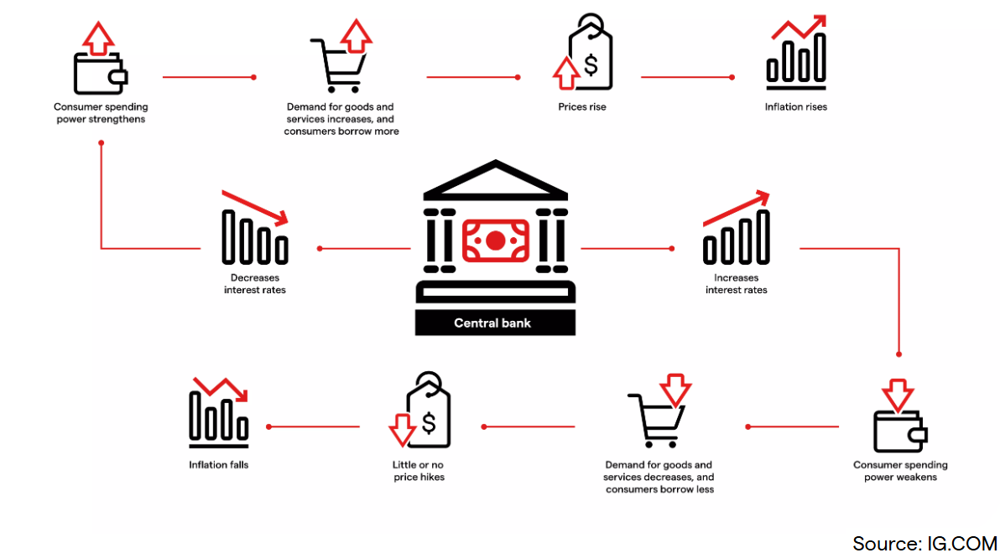

<style>
@media print{
  body, html, .remark-slides-area, .remark-notes-area {
    height: 100% !important;
    width: 100% !important;
    overflow: visible;
    display: inline-block;
    }
</style>

<style type="text/css">
.remark-slide-content {
    font-size: 38px;
    padding: 1em 4em 1em 4em;
}
</style>

<style type="text/css">
.my-one-page-font {
  font-size: 32px;
}
</style>

</style>

<style type="text/css">
.my-one-page-font-table {
  font-size: 28px;
}
</style>


```{r setup, include = FALSE}
library(tidyverse)
library(knitr)

opts_chunk$set(fig.width = 10, 
               message = FALSE, 
               warning = FALSE,
               echo = FALSE)
```

```{r xaringan-themer, include=FALSE, warning=FALSE}
#install.packages("xaringanthemer")
library(xaringanthemer)
style_mono_accent(
  base_color = "#135978", # #1c5253
  header_font_google = google_font("Josefin Sans"),
  text_font_google   = google_font("Montserrat", "500", "550i"),
  code_font_google   = google_font("Fira Mono"),
  colors = c(
  red = "#f34213",
  purple = "#3e2f5b",
  orange = "#ff8811",
  green = "#136f63",
  white = "#FFFFFF"
)
)
```

# Agenda  

1. Central Banks 

2. The Money Supply Process

3. Guest Lecture: Monetary Policy

4. Class Activity

---

class: inverse, center, middle

# 1. Central Banks  

---

# Central Banks: An Introduction

## What is a Central Bank?

- A central bank is the institution that manages a country's currency, money supply, and interest rates.

- Examples: Federal Reserve (U.S.), ECB (Eurozone), Bank of England, Bank of Korea.

---

## Key Functions of Central Banks

1. **Monetary policy implementation**

2. **Currency issuance**

3. **Lender of last resort**

4. **Foreign exchange management**

5. **Maintaining financial stability**

6. **Regulation and supervision of commercial banks**

---

# Why Do We Need Central Banks?

## Without a central bank:
- Who controls inflation?
- Who helps in a financial crisis?
- Who supervises commercial banks?

.center[]


---

# Historical Perspective

## Evolution of Central Banking:
- 17th century: Sweden’s Riksbank – first central bank

- 1694: Bank of England

- 20th century: Rise of modern independent central banks

- Post-2008: More focus on financial 

- Post-COVID: New challenges (e.g., digital currencies)

---

# Objectives of Central Banks

1. **Price stability** (control inflation)
2. **Full employment** (indirectly through monetary policy)
3. **Stable financial system**
4. **Stable exchange rates**

<div class="illustration">
<strong>Illustration</strong>: ECB's mandate focuses almost solely on price stability, while the Fed has a dual mandate (price stability + maximum employment).
</div>

---

# Tools of Monetary Policy

1. **Open Market Operations (OMOs)**

2. **Policy interest rates (discount rate, repo rate)**

3. **Reserve requirements**

4. **Forward guidance**

---

# Monetary Policy in Action

.flex-container[
.flex-item[
### When inflation is high:
- Central banks increase interest rates
- Reduce money supply
- Slow down borrowing and spending

### When recession hits:
- Lower interest rates
- Inject liquidity
- Stimulate demand
],
.flex-item[
.center[]
]
]

<style>
.flex-container {
  display: flex;
  justify-content: space-between;
  align-items: center;
}
.flex-item {
  width: 48%;
}
</style>

---

# Central Bank Independence

## Why is it important?
- Insulates from political pressure
- Helps maintain credibility
- Anchors inflation expectations

## Forms of independence:
- Goal independence
- Instrument independence

<div class="illustration">
<strong>Example</strong>: Bundesbank was historically independent, influencing ECB's design.
</div>

---

# Case Study: The Federal Reserve

- Dual mandate: price stability + full employment

- 12 regional banks + Board of Governors

- FOMC meets 8 times/year

- Sets the federal funds rate

---

# Case Study: The European Central Bank

- Primary mandate: price stability

- Governing Council (ECB + 20 central banks)

- Uses OMOs, MROs, and LTROs

<div class="illustration">
<strong>Illustration</strong>: ECB response during the Eurozone crisis
</div>

---

# The Role During Crises

## Global Financial Crisis 2008
- Central banks cut rates to near-zero
- Quantitative easing (QE)
- Emergency lending facilities

## COVID-19
- Pandemic response: liquidity support
- Rate cuts, asset purchases
- Coordination with fiscal policy

---

# Challenges Facing Central Banks Today

1. Persistently low interest rates

2. Financial market distortions

3. Central bank digital currencies (CBDCs)

4. Climate risk and sustainable finance

5. Political pressure

---

class: inverse, center, middle

# 2. The Money Supply Process

---

# Three Players in the Money Supply Process

- **The Central bank**  
  - Oversees the banking system and conducts monetary policy

- **Banks (Depository Institutions)**  
  - Accept deposits and make loans

- **Depositors**  
  - Hold deposits in banks

Illustration: Picture of central bank, commercial bank, and depositors linked in a triangle

---

# The Fed’s Balance Sheet

.center[]

- **Liabilities**:
  - Currency in circulation (held by public)
  - Reserves (bank deposits at the Fed + vault cash)
  - Increases in either increase money supply
  - Fed liabilities + Treasury liabilities = **Monetary base**

- **Reserves**:
  - Required and excess reserves

---

# Fed's Assets and Impact

.center[]

- **Assets**:
  - **Securities**: Mainly Treasury; purchases increase reserves
  - **Loans**: Discount loans to banks → increase reserves

- Importance:
  - Affects monetary base and money supply
  - Fed earns income from these assets

---

# Control of the Monetary Base

- **Monetary base** (MB) = Currency in circulation (C) + Reserves (R)

$\text{MB} = C + R$

- Controlled via **open market operations**:
  - Purchases increase MB
  - Sales decrease MB

---

# Open Market Operations

- **Open Market Purchase** = Fed buys bonds from primary dealers
- **Open Market Sale** = Fed sells bonds
- **Impact**:
  - Purchase → ↑ Reserves, ↑ MB
  - Sale → ↓ Reserves or ↓ Currency, ↓ MB

---

# Open Market Purchase from a Bank

.center[]

- Fed buys $100m in bonds from a primary dealer
- Bank reserves ↑ $100m
- MB ↑ $100m

---

# Open Market Sale

- Fed sells $100m in bonds
- MB decreases by $100m
- **Reserves unchanged** if banks pay via reserves

---

# Shifts from Deposits to Currency

.center[]

- Depositors convert deposits into currency
- Reserves ↓, Currency ↑, MB constant
- **Fed controls MB more than reserves**

---

# Loans to Financial Institutions

.center[]

- Fed lends to a bank (e.g., $100m)
- Reserves ↑, MB ↑ by same amount

---

# Other Influences on MB

- **Float**
- **Treasury deposits at Fed**
- **Foreign exchange operations**

---

# Fed Control of Monetary Base

- MB = BR (borrowed reserves) + MBₙ (nonborrowed base)

$MB = MB_n + BR$

- MBₙ: fully controlled by Fed (via open market ops)
- BR: depends on bank borrowing decisions

---

# Multiple Deposit Creation: Basic Idea

- Fed adds $1 in reserves → multiple deposit creation
- A single bank lends excess reserves → new deposits

.center[]

---

# System-Wide Deposit Creation

.center[]

- Loans at one bank → deposits at another
- Process continues if no excess reserves held
- Deposit creation = geometric series

---

# Total Increase in Deposits

- Reserve requirement = 10%
- Simple deposit multiplier:

$\Delta D = \frac{1}{r} \times \Delta R$

- $100m reserves → $1,000m deposits

---

# Table 1: Deposit Creation Summary

.center[]

- Process stops when no more excess reserves
- Simple multiplier depends on **r**

---

# Deposit Creation Limits

- Loans or securities purchases create same deposit expansion
- System vs individual bank:
  - System: total reserves stay in system
  - Single bank: reserves lost if loans transferred

---

# Final Deposit Expansion Equation

$D = \frac{1}{r} \times R$
$\Delta D = \frac{1}{r} \times \Delta R$

- Equilibrium: no excess reserves remain
- Total R = Required R when deposit creation stops

---

# Critique of Simple Model

- **Not all excess reserves are lent out**
- **Depositors may hold cash** → stops deposit expansion
- **Banks may hold excess reserves**
- Real-world multiplier < simple multiplier

---

# Determinants of Money Supply

| Factor                       | Effect on Money Supply        |
|-----------------------------|-------------------------------|
| ↑ Nonborrowed MB (MBₙ)      | ↑ Money supply                |
| ↑ Borrowed reserves (BR)    | ↑ Money supply                |
| ↑ Required reserve ratio (r)| ↓ Money supply                |
| ↑ Excess reserves           | ↓ Money supply                |
| ↑ Currency holdings         | ↓ Money supply                |

---

# Money Multiplier

$M = m \times MB$

- M = money supply (M1)
- m = money multiplier

$m = \frac{1+c}{r+e+c}$
- c = currency ratio, e = excess reserve ratio, r = reserve ratio

---

# Multiplier Intuition (Example)

- c = 0.5, e = 0.001, r = 0.1

$m = \frac{1+0.5}{0.1 + 0.001 + 0.5} = \frac{1.5}{0.601} \approx 2.5$

- Less than 10 (simple multiplier)
- Currency doesn't multiply

---

# Quantitative Easing (QE)

- Post-2007: Fed bought long-term securities to increase MB
- MB ↑ 350% → M1 ↑ only 100%
- Why? **Money multiplier ↓**:
  - Excess reserve ratio ↑↑↑

---

# COVID-19 Crisis: Similar QE Patterns

- Fed again engaged in QE
- MB ↑, but M1 ↑ less due to rising excess reserves
- Interest on excess reserves incentivized banks to hold them

---

# Figure: M1 and Monetary Base (2007–2020)

.center[]

---

# Figure: Excess Reserves & Currency Ratio (2007–2020)

.center[]

---

# Summary

- Fed controls money supply mainly via **open market ops**
- Reserves → deposit creation → **multiplied money supply**
- Final supply depends on:
  - Reserve ratio
  - Currency preferences
  - Excess reserves

$M = \frac{1+c}{r+e+c} \times MB$


---


class: inverse, center, middle

# 3. Guest Lecture: Monetary Policy (10 - 11:15 am)

---


class: inverse, center, middle

# 4. Class Activity

---

# Class Discussion

- Discuss the role of central banks in managing inflation and employment.

- How do central banks respond to financial crises?

- Your takeaway from the guest lecture on monetary policy.

- How do you think the role of central banks will evolve in the future?


---

class: inverse, center, middle

# Any QUESTIONS?

## Thank You!  

---

# Next Class

-(April 25) Midterm Exam (09:32-11:45) 
      - Please review slides for conceptual based questions.
      - Please review in-class activities for practical/case based questions.


???
1. To print pdf slides
https://stackoverflow.com/questions/54968311/xaringan-export-slides-to-pdf-while-preserving-formatting

pagedown::chrome_print("W1_ME.html") # but not all pictures are visible

2. Option: https://stackoverflow.com/questions/54968311/xaringan-export-slides-to-pdf-while-preserving-formatting

install.packages("remotes")
remotes::install_github("jhelvy/xaringanBuilder")
remotes::install_github("jhelvy/renderthis@v0.0.9")

library(xaringanBuilder)
build_pdf("DVC.html")

3. Option
writeBin(as.raw(c()), "favicon.ico") # create an empty favicon.ico file
install.packages("renderthis")
remotes::install_github('rstudio/chromote')
library(renderthis)

renderthis::to_pdf("W7_FIS.html")

getwd()
setwd("C:/Users/Iegor/OneDrive - kdis.ac.kr/Documents/GitHub/Sogang/2025/Spring/Financial Institutions and System/Week 7")
