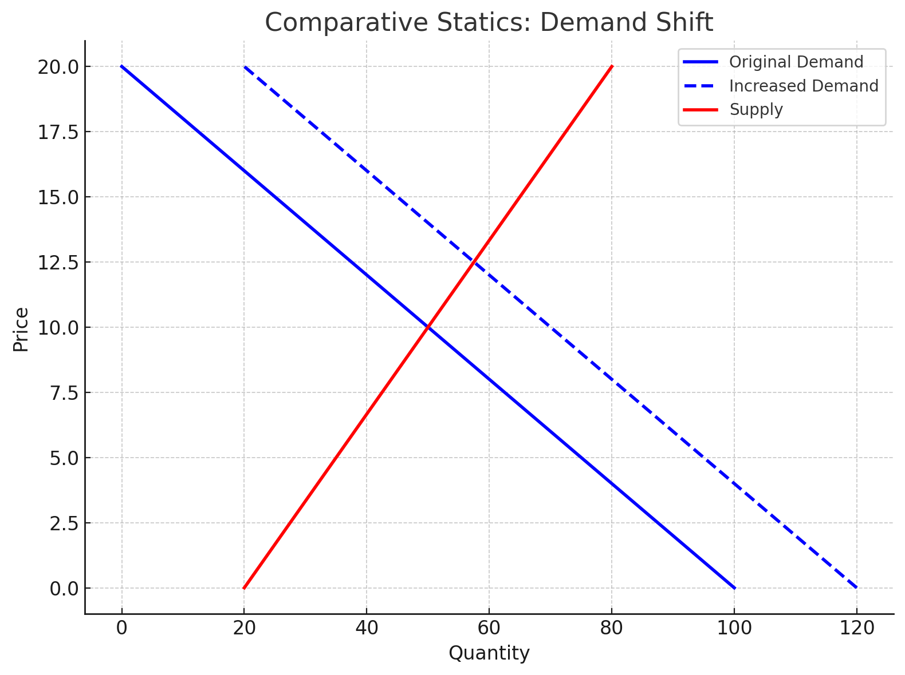

<style>
@media print{
  body, html, .remark-slides-area, .remark-notes-area {
    height: 100% !important;
    width: 100% !important;
    overflow: visible;
    display: inline-block;
    }
</style>

<style type="text/css">
.remark-slide-content {
    font-size: 34px;
    padding: 1em 4em 1em 4em;
}
</style>

<style type="text/css">
.my-one-page-font {
  font-size: 28px;
}
</style>

</style>

<style type="text/css">
.my-one-page-font-table {
  font-size: 24px;
}
</style>


```{r setup, include = FALSE}
library(tidyverse)
library(knitr)

opts_chunk$set(fig.width = 10, 
               message = FALSE, 
               warning = FALSE,
               echo = FALSE)
```

```{r xaringan-themer, include=FALSE, warning=FALSE}
#install.packages("xaringanthemer")
library(xaringanthemer)
style_mono_accent(
  base_color = "#1c5253",
  header_font_google = google_font("Josefin Sans"),
  text_font_google   = google_font("Montserrat", "500", "550i"),
  code_font_google   = google_font("Fira Mono"),
  colors = c(
  red = "#f34213",
  purple = "#3e2f5b",
  orange = "#ff8811",
  green = "#136f63",
  white = "#FFFFFF"
)
)
```

# Why It Matters in Economics, Business & Finance

Comparative statics is an essential technique used to understand how changes in **policy, shocks, or parameters** affect outcomes in economic models.

- In **macroeconomics**, we can predict how national income responds to a change in government spending or taxation.
- In **finance**, understanding multipliers helps estimate how economic indicators respond to policy adjustments.
- In **microeconomics**, it shows how supply and demand curves shift in response to taxes, subsidies, or preferences.

It allows decision-makers to simulate "what if" scenarios and make **informed, strategic choices**.

---

# Learning Objectives

By the end of this class, you should be able to:

- Derive the **reduced form** of macroeconomic models

- Compute **national income multipliers**

- Interpret **qualitatively** how changes in parameters affect outcomes

- Use **quantitative** multiplier analysis

- Apply **multipliers** in a simple one-good market model

---

# Agenda  

1. Comparative Statics (5.3)  

2. Class Activity

---

class: inverse, center, middle

# 1. Comparative Statics (5.3)

---

# Structural Form → Reduced Form

### Example:

Suppose:
$$
Y = C + I + G
$$
$$
C = a + b(Y - T)
$$

This is the **structural form**.

We substitute $C$ into the $Y$ equation:

$$
Y = a + b(Y - T) + I + G
$$

Solve for $Y$ → this is the **reduced form**.

---

# Solving for Y

Start with:
$$
Y = a + b(Y - T) + I + G
$$
Distribute:
$$
Y = a + bY - bT + I + G
$$
Group terms:
$$
Y - bY = a - bT + I + G
$$
Factor:
$$
Y(1 - b) = a - bT + I + G
$$
Solve:
$$
Y = \frac{1}{1 - b}(a - bT + I + G)
$$

This is the **reduced form**: it shows $Y$ as a function of **exogenous variables**

---

# Multiplier Concept

From the reduced form:
$$
Y = \frac{1}{1 - b}(a - bT + I + G)
$$

- The **multiplier** is $\frac{1}{1 - b}$
- It shows how **sensitive** $Y$ is to a change in **G**, **I**, etc.

If $b = 0.8$, multiplier = $\frac{1}{1 - 0.8} = 5$

So:
- $\Delta G = 10$ → $\Delta Y = 5 \times 10 = 50$

From economics perspectives it means that $Y$ is **5 times more sensitive** to changes in $G$ than $G$ itself.

---

# Practice Problem

Given:
- $a = 20$, $b = 0.75$
- $T = 10$, $I = 30$, $G = 40$

1. Write reduced form for $Y$

2. Compute multiplier

3. Calculate $Y$

4. If $G$ increases to 50, what is the new $Y$?

---

# Solution

1. Reduced form:
$$
Y = \frac{1}{1 - 0.75}(20 - 0.75 \cdot 10 + 30 + 40) = 4(20 - 7.5 + 30 + 40) = 4(82.5)
$$

2. Multiplier = $\frac{1}{1 - 0.75} = 4$

3. $Y = 330$

4. New $G = 50$ →
$$
Y = 4(20 - 7.5 + 30 + 50) = 4(92.5) = 370
$$

---

# Market Model Example

Supply and demand:
$$
Q_d = 100 - 5P \quad Q_s = 20 + 3P
$$

Equilibrium: $Q_d = Q_s$

Solve:
$100 - 5P = 20 + 3P \Rightarrow 80 = 8P \Rightarrow P^* = 10 \Rightarrow Q^* = 100 - 5 \cdot 10 = 50$

Now increase demand:
$$
Q_d = 120 - 5P
$$

→ Solve again:
$120 - 5P = 20 + 3P \Rightarrow 100 = 8P \Rightarrow P^* = 12.5, Q^* = 120 - 5 \cdot 12.5 = 57.5$

Shows how change in **parameters** shifts equilibrium.

---

# Plot: Comparative Statics in Supply & Demand

.center[]


---

# Summary

- Comparative statics helps **evaluate how equilibrium changes** with a shift in exogenous variables

- Multiplier tells us the **magnitude of change**

- We derived **reduced form** from structure

- We applied the concept to:
  - National income
  - Market models


---

class: inverse, center, middle

# 2. Group Activity

---

# Group Activity: Comparative Statics Battle

- **4 teams of 4 students**.

- Each team competes to solve a set of comparative statics challenges.

- Teams get **2 minutes** per question.

- Points awarded for:
  - Correct answer ✅
  - Economic interpretation 💡
  - Bonus if solved under 1 minute ⏱️

---

## Round 1: Solve the Model!

**Structural Form:**
$$
Y = C + I + G, \quad C = a + b(Y - T)
$$

Each team:
1. Derive the **reduced form** of Y.

2. Identify the **multiplier**.

3. Compute Y if $a = 10, b = 0.8, I = 30, G = 40, T = 5$

---

## Round 2: Policy Shock Simulation

Suppose:
$$
Y = \frac{1}{1 - b}(a - bT + I + G)
$$

**Government increases spending:** $\Delta G = +20$

Each team:
- Calculate the new Y if $b = 0.75$

- Discuss: "Why does a higher b mean a bigger impact?"

---

## Round 3: Market Shock

Market model:
$$
Q_d = 120 - 4P, \quad Q_s = 30 + 2P
$$

Task:
1. Find equilibrium $P^*$, $Q^*$

2. If $Q_d$ shifts to $140 - 4P$, find new $P$, $Q$

3. Sketch **before/after curves**

---

# Wrap-Up & Debrief

- Which team explained their **economic reasoning** best?

- Where did **math meet policy**?

- Pints for participation!

???

# ✅ Round 1: Solve the Model

**Structural form:**
$$
Y = C + I + G, \quad C = a + b(Y - T)
$$
Substitute C:
$$
Y = a + b(Y - T) + I + G
$$
Expand:
$$
Y = a + bY - bT + I + G \Rightarrow Y(1 - b) = a - bT + I + G
$$
**Reduced form:**
$$
Y = \frac{1}{1 - b}(a - bT + I + G)
$$

Given: \( a = 10, b = 0.8, T = 5, I = 30, G = 40 \)

Multiplier: \( \frac{1}{1 - 0.8} = 5 \)

Compute Y:
$$
Y = 5(10 - 0.8 \cdot 5 + 30 + 40) = 5(10 - 4 + 30 + 40) = 5(76) = \boxed{380}
$$

#---

# 🔄 Round 2: Policy Shock Simulation

Model:
$$
Y = \frac{1}{1 - b}(a - bT + I + G)
$$
If \( \Delta G = 20 \), and \( b = 0.75 \), then multiplier:
$$
\frac{1}{1 - 0.75} = 4
$$
Then:
$$
\Delta Y = 4 \cdot 20 = \boxed{80}
$$

**Explanation:** Higher b = higher marginal propensity to consume → bigger ripple effect from G.

#---

# 💥 Round 3: Market Shock

Initial demand and supply:
$$
Q_d = 120 - 4P, \quad Q_s = 30 + 2P
$$
Find equilibrium:
$$
120 - 4P = 30 + 2P \Rightarrow 90 = 6P \Rightarrow P^* = 15
$$
$$
Q^* = 120 - 4(15) = 60
$$

**After demand shift:**
$$
Q_d = 140 - 4P
$$
Equilibrium:
$$
140 - 4P = 30 + 2P \Rightarrow 110 = 6P \Rightarrow P^* = \frac{110}{6} \approx 18.33
$$
$$
Q^* = 140 - 4(18.33) \approx 140 - 73.33 = \boxed{66.67}
$$

#---

# 🏁 Summary of Results

- **Y (original)** = 380
- **New Y after G increase** = 460
- **Market P/Q before** = (15, 60)
- **Market P/Q after** = (18.33, 66.67)

Use visuals in class to reinforce shifts!


---

class: inverse, center, middle

# Any QUESTIONS?

## Thank you for your attention!

---

## Next Classes

- (May 9) Unconstrained Optimization (5.4)


???
1. To print pdf slides
https://stackoverflow.com/questions/54968311/xaringan-export-slides-to-pdf-while-preserving-formatting

pagedown::chrome_print("W1_ME.html") # but not all pictures are visible

2. Option: https://stackoverflow.com/questions/54968311/xaringan-export-slides-to-pdf-while-preserving-formatting

install.packages("remotes")
remotes::install_github("jhelvy/xaringanBuilder")
remotes::install_github("jhelvy/renderthis@v0.0.9")

library(xaringanBuilder)
build_pdf("DVC.html")

3. Option
writeBin(as.raw(c()), "favicon.ico") # create an empty favicon.ico file
install.packages("renderthis")
remotes::install_github('rstudio/chromote')
library(renderthis)

renderthis::to_pdf("W10_1_ME.html")

getwd()
setwd("C:/Users/Iegor/OneDrive - kdis.ac.kr/Documents/GitHub/Sogang/2025/Spring/Mathematical Economics/Week 10_1")
