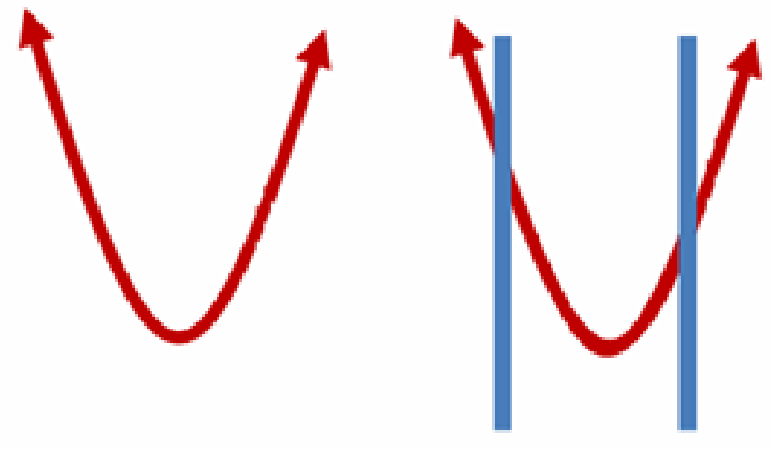
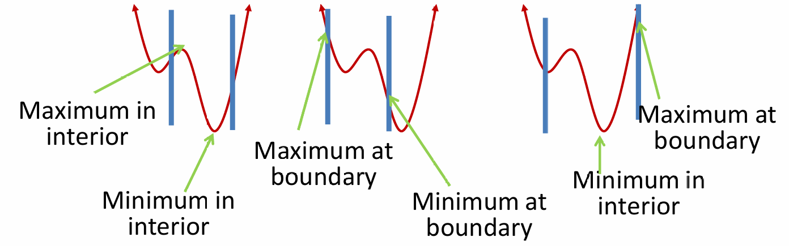
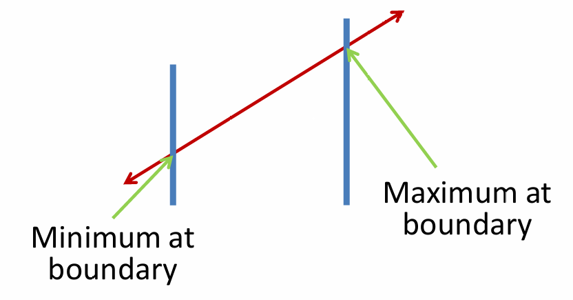
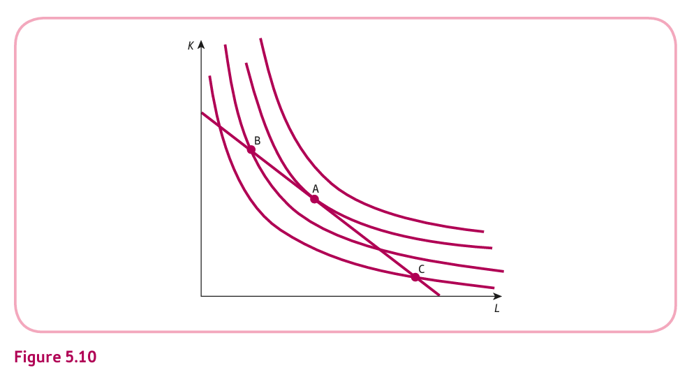

<style>
@media print{
  body, html, .remark-slides-area, .remark-notes-area {
    height: 100% !important;
    width: 100% !important;
    overflow: visible;
    display: inline-block;
    }
</style>

<style type="text/css">
.remark-slide-content {
    font-size: 34px;
    padding: 1em 4em 1em 4em;
}
</style>

<style type="text/css">
.my-one-page-font {
  font-size: 28px;
}
</style>

</style>

<style type="text/css">
.my-one-page-font-table {
  font-size: 24px;
}
</style>


```{r setup, include = FALSE}
library(tidyverse)
library(knitr)

opts_chunk$set(fig.width = 10, 
               message = FALSE, 
               warning = FALSE,
               echo = FALSE)
```

```{r xaringan-themer, include=FALSE, warning=FALSE}
#install.packages("xaringanthemer")
library(xaringanthemer)
style_mono_accent(
  base_color = "#1c5253",
  header_font_google = google_font("Josefin Sans"),
  text_font_google   = google_font("Montserrat", "500", "550i"),
  code_font_google   = google_font("Fira Mono"),
  colors = c(
  red = "#f34213",
  purple = "#3e2f5b",
  orange = "#ff8811",
  green = "#136f63",
  white = "#FFFFFF"
)
)
```

# Why Constrained Optimization Matters

- In economics and business, resources are limited, leading to optimization problems under constraints.

- Firms aim to **maximize output** or **minimize costs** given a budget or cost constraint.

- Consumers aim to **maximize utility** given a budget constraint.

- Understanding constrained optimization helps in decision-making related to **resource allocation**, **cost control**, and **profit maximization**.

---

# Learning Objectives

By the end of this class, you should be able to:

- Use first-order partial derivatives to find stationary points.

- Use second-order partial derivatives to classify stationary points.

- Maximize the profit of a firm producing two goods.

- Optimize profit for a firm using price discrimination in different markets.

---

# Agenda  

1. Constrained Optimization (5.5)

2. Class Activity

---

# Constrained Optimization

-  Previously, most of the functions we examined were unconstrained, meaning they either had no boundaries, or the boundaries were soft.

.center[]

- Today, we will be examining situations that involve constraints.  
  - A constraint is a hard limit placed on the value of a variable, which prevents us from going forever in certain directions.

- Constrained optimization involves maximizing or minimizing a function subject to constraints.

---

# Constrained Optimization (cont'd)

For nonlinear functions, the optimum values can occur either at the boundaries or within the feasible region, depending on the nature of the function and the constraints. 

This requires careful analysis using first-order and second-order conditions to identify the optimal solution.

.center[]

---

# Constrained Optimization (cont'd)

- For linear functions, the optimum values typically occur at the boundaries of the feasible region, as the objective function increases or decreases along the edges.

.center[]

---

# Constrained Optimization (cont'd)

- When maximizing an objective function, constraints often involve limited resources such as time, money, or materials. These constraints define the feasible region and set boundaries on the maximum achievable value of the objective function.

- In minimization problems, constraints are typically more specific to the context, such as operational limits, cost restrictions, or environmental factors. These constraints ensure that the solution remains practical and aligned with real-world conditions.

---

class: my-one-page-font

# Writing Constraints

- Constraints can be written in various forms, including equations, inequalities, or sets of conditions.
- The most common form is the equality constraint, which specifies that a certain condition must hold true.
- For example, if we have a function $f(x, y)$ and a constraint $g(x, y) = 0$, we can express the problem as:
  
    - Maximize $f(x, y)$ subject to $g(x, y) = 0$.

- Alternatively, we can use inequality constraints, which specify that a certain condition must be satisfied without equality.
- For example, if we have a function $f(x, y)$ and a constraint $g(x, y) \leq 0$, we can express the problem as:

    - Maximize $f(x, y)$ subject to $g(x, y) \leq 0$.


- In some cases, we may have multiple constraints, which can be expressed as a system of equations or inequalities.
- For example, if we have a function $f(x, y)$ and two constraints $g_1(x, y) = 0$ and $g_2(x, y) \leq 0$, we can express the problem as:

    - Maximize $f(x, y)$ subject to $g_1(x, y) = 0$ and $g_2(x, y) \leq 0$.

---

# Writing Constraints (cont'd)

- Recall from Algebra that if a single banana costs $1, then two bananas cost $2, five bananas cost $5, and n bananas cost 1n.

- If you buy n bananas at $1 and m apples at $2, then your total cost will be 1n + 2m.

- If you only have $10 to spend at the banana-and-apple store, then your total cost must be less than or equal to $10.

- This can be expressed as:
$$ 
1n + 2m ≤ 10. $$

- This means that the total cost of bananas and apples must not exceed $10.

- The constraint ensures that the consumer does not exceed their budget while purchasing the desired quantities of bananas and apples.

---

# Constraints in Optimization Problems

- Constraints define the feasible region and set boundaries for optimization problems.
- They ensure practical and real-world applicability.

- Common types of constraints:
  - **Resource-based**: Availability of resources or production capacity.
  - **Economic**: Budget limitations or market demand.
  - **Physical**: Operational or environmental limits.

- Forms of constraints:
  - **Equations**: Exact conditions (e.g., $g(x, y) = 0$).
  - **Inequalities**: Flexible conditions (e.g., $g(x, y) \leq 0$).

- Types of constraints:
  - **Linear**: Solvable using linear programming.
  - **Nonlinear**: Requires advanced methods like Lagrange multipliers.

- Key takeaway: Define constraints carefully to reflect real-world conditions and ensure meaningful solutions.

---

# Graphical interpretation of constrained optimisation.

- In constrained optimization, we aim to maximize or minimize a function subject to a constraint.

.center[]

- The graph illustrates constrained optimization with isoquants (output levels) and a cost constraint (budget line).  
- The optimal point (A) is where the isoquant is tangent to the cost line, maximizing output within the budget.  
- The slope of the isoquant (MRTS) shows the trade-off between labor and capital.  
- The slope of the cost line reflects the relative prices of labor and capital.  
- Points B and C are suboptimal, with inefficient resource allocation.

---

# Example: Cost Minimization in Production

**Problem Statement:**

A firm’s unit capital and labor costs are $1 and $2, respectively. The production function is given by:

$$ Q = 4LK + L^2 $$

- The firm is constrained by a total input cost of $105:

$$ K + 2L = 105 $$

- Objective: Maximize output by determining the optimal levels of $K$ and $L$.

---

# Step-by-Step Solution

### Step 1: Constraint Rearrangement

Rearrange the cost constraint to express $K$ in terms of $L$:

$$ K = 105 - 2L $$

---

# Step 2: Substitute in the Objective Function

Substituting into the production function:

$$ Q = 4L(105 - 2L) + L^2 $$

Expanding and simplifying:

$$ Q = 420L - 8L^2 + L^2 $$

$$ Q = 420L - 7L^2 $$

---

# Step 3: First and Second Derivatives

### First Derivative:

$$ \frac{dQ}{dL} = 420 - 14L $$

Set the first derivative to zero to find the stationary point:

$$ 420 - 14L = 0 $$

$$ L = 30 $$

### Second Derivative:

$$ \frac{d^2Q}{dL^2} = -14 $$ (negative, indicating a maximum)

---

# Step 4: Optimal Levels of Inputs

- Substitute $L = 30$ back into the constraint to find $K$:

$$ K = 105 - 2(30) = 45 $$

- Maximum output:

$$ Q = 420(30) - 7(30)^2 = 6300 $$

**Conclusion:** The firm should use **30 units of labor** and **45 units of capital** to maximize output at **6300 units**.

---

# Marginal Products and Ratios

Marginal products are calculated as follows:

- $MP_L = 4K + 2L = 4(45) + 2(30) = 240$
- $MP_K = 4L = 4(30) = 120$

**Ratio of Marginal Products to Prices:**

- $\frac{MPL}{P_L} = \frac{240}{2} = 120$
- $\frac{MPK}{P_K} = \frac{120}{1} = 120$

Since the ratios are equal, the firm is optimizing the input allocation efficiently.

---

# Your turn: Utility Maximization

#### Problem Statement

- An individual’s utility function is given by:

$$
U = x_1 x_2
$$

- Prices of goods:
  - $G_1$: $2
  - $G_2$: $10

- Budget: $400

- Budget Constraint: 
  $2x_1 + 10x_2 = 400$

**Task:**
- Determine the utility-maximizing quantities of $x_1$ and $x_2$.
- Verify that the ratio of marginal utility to price is the same for both goods at the optimum.

???

**Step 1:** Rearrange the budget constraint to express $x_2$ in terms of $x_1$:

$$
x_2 = rac{400 - 2x_1}{10} = 40 - 0.2x_1
$$

#---

# Step 2: Substitute in Utility Function

- Substituting $x_2$ in the utility function:

$$
U = x_1 \cdot (40 - 0.2x_1) = 40x_1 - 0.2x_1^2
$$

- Now, we have a single variable function in terms of $x_1$.

#---

# Step 3: First Derivative

- Differentiate the utility function to find the stationary point:

$$
rac{dU}{dx_1} = 40 - 0.4x_1
$$

- Set the first derivative equal to zero:

$$
40 - 0.4x_1 = 0
$$

$$
x_1 = 100
$$

#---

# Step 4: Substitute $x_1$ Back into Budget Constraint

- Substitute $x_1 = 100$ back into the budget constraint to find $x_2$:

$$
2(100) + 10x_2 = 400
$$

$$
200 + 10x_2 = 400
$$

$$
10x_2 = 200 \implies x_2 = 20
$$

**Optimal Bundle:** $(x_1, x_2) = (100, 20)$

#---

# Step 5: Marginal Utility Analysis

- Marginal Utilities:
  - $MU_{x_1} = x_2 = 20$
  - $MU_{x_2} = x_1 = 100$

- Marginal Utility per Dollar:
  - $rac{MU_{x_1}}{p_1} = rac{20}{2} = 10$
  - $rac{MU_{x_2}}{p_2} = rac{100}{10} = 10$

Since the ratios are equal, the allocation is optimal.

**Answer:** At the optimal point, the ratio of marginal utility to price is the same for both goods.

---

# Another Example: **Cost Minimization Problem**

**Problem Statement:**
- A firm’s production function is given by:
  $$ Q = 2K^{1/2}L^{1/2} $$
- Unit capital and labour costs are $4 and $3, respectively.
- The firm must provide 160 units of output.

**Objective:** Minimize the total cost while meeting the production requirement.

---

# **Objective Function and Constraint**

- **Objective Function (Total Cost):**
  $$ TC = 4K + 3L $$

- **Production Constraint:**
  $$ 2K^{1/2}L^{1/2} = 160 $$

**Goal:** Minimize TC subject to the production constraint.

---

# **Step 1: Express L in Terms of K**

- Rewrite the production constraint:
  $$ 2K^{1/2}L^{1/2} = 160 $$

- Divide both sides by $2K^{1/2}$:
  $$ L^{1/2} = \frac{160}{2K^{1/2}} $$
  $$ L^{1/2} = 80K^{-1/2} $$

- Square both sides:
  $$ L = \frac{6400}{K} $$

---

# **Step 2: Substitute L in TC Function**

- Substitute $L = \frac{6400}{K}$ in the TC function:

  $$ TC = 4K + 3L $$
  $$ TC = 4K + 3\left( \frac{6400}{K} \right) $$
  $$ TC = 4K + \frac{19200}{K} $$

**Now, the objective function is expressed in terms of one variable, $K$.**

---

# **Step 3: First Derivative and Stationary Point**

- Take the first derivative of TC with respect to $K$:

  $$ \frac{d(TC)}{dK} = 4 - \frac{19200}{K^2} $$

- Set the derivative to zero and solve:

  $$ 4 - \frac{19200}{K^2} = 0 $$
  $$ 4K^2 = 19200 $$
  $$ K^2 = 4800 $$
  $$ K \approx 69.28 $$

---

# **Step 4: Verify Minimum using Second Derivative**

- Take the second derivative:

  $$ \frac{d^2(TC)}{dK^2} = \frac{38400}{K^3} $$

- At $K = 69.28$:
  $$ \frac{38400}{(69.28)^3} > 0 $$

Since the second derivative is positive, the point is a **minimum**.

---

# **Step 5: Calculate L**

- Substitute $K = 69.28$ back into the constraint equation:

  $$ L = \frac{6400}{69.28} \approx 92.38 $$

**Optimal Input Combination:**  
- $K \approx 69.28$ units of capital  
- $L \approx 92.38$ units of labor  

---

# **Economic Interpretation:**
- The firm minimizes cost by using 69.28 units of capital and 92.38 units of labor.

- This combination ensures that the production target of 160 units is met at the lowest cost.

**Important:** Verify that the marginal product per dollar spent is equalized across both inputs, ensuring cost minimization.

---

class: inverse, center, middle

# 2. Group Activity

---

# Group Activity: Optimization Battle

## Instructions:
- **4 groups** with **4 students each**.

- Each group gets a unique economic optimization problem.

- You will have **15 minutes** to solve it and **5 minutes** to present your's solution.

---

# Group 1: Cost Minimization

**Problem:**  
A firm produces goods using labor (L) and capital (K). The cost function is:

$$ TC = 5L + 10K $$

They must produce 200 units with the production function:  
$$ Q = 2L^{0.5} K^{0.5} $$

- Determine the optimal combination of L and K to minimize cost.
- Verify the ratio of marginal products to prices.

---

# Group 2: Utility Maximization

**Problem:**  
A consumer has a utility function given by:

$$ U = 3x + 2y $$

The prices of goods are $4 and $2, respectively. The budget is $120.

- Determine the optimal consumption of x and y to maximize utility.
- Check the marginal utility per dollar spent.

---

# Group 3: Profit Maximization

**Problem:**  
A firm sells two products, A and B, with the profit function:

$$ \Pi = 50A + 75B - 10A^2 - 15B^2 - 5AB $$

- Find the optimal production levels of A and B to maximize profit.
- Verify using the second-order conditions.

---

# Group 4: Investment Portfolio Optimization

**Problem:**  
A firm invests in two assets, X and Y. The return function is:

$$ R = 0.08X + 0.12Y - 0.005X^2 - 0.007Y^2 - 0.002XY $$

- Determine the optimal investment in X and Y to maximize returns.
- Interpret the economic meaning of the results.

---

# Debrief and Discussion

- Each group presents their solution and explains their economic interpretation.

- Discuss how the optimal choices vary based on the objective: cost minimization, utility maximization, profit maximization, or return optimization.

- What commonalities and differences did you observe across the problems?

- Groups 1 and 2: **Constrained Optimization Problems**
- Groups 3 and 4: **Unconstrained Optimization Problems**

- Key Takeaway: Constrained problems require adjusting the objective function using the given constraint, while unconstrained problems are solved directly by setting first-order derivatives to zero and analyzing second-order conditions.


???

# Group Activity: Solutions 💡

## Group 1: Cost Minimization (Constrained)

**Problem:**  
A firm produces goods using labor (L) and capital (K). The cost function is:

$$ TC = 5L + 10K $$

They must produce 200 units with the production function:  
$$ Q = 2L^{0.5} K^{0.5} $$

**Solution:**  
1. Constraint:  
   - Rearrange to express K in terms of L:  
   $$ Q = 2L^{0.5}K^{0.5} \Rightarrow 200 = 2L^{0.5}K^{0.5} $$  
   $$ K = \left( \frac{200}{2L^{0.5}} \right)^2 $$

2. Substitution in the cost function:  
   $$ TC = 5L + 10 \left( \frac{200}{2L^{0.5}} \right)^2 $$  
   $$ TC = 5L + 10 \left( 100L^{-0.5} \right)^2 $$

3. Differentiating and setting to zero, we find optimal L and K.

#---

## Group 2: Utility Maximization (Constrained)

**Problem:**  
A consumer has a utility function given by:

$$ U = 3x + 2y $$

The prices of goods are $4 and $2, respectively. The budget is $120.

**Solution:**  
1. Constraint:  
   - Budget constraint:  
   $$ 4x + 2y = 120 $$  
   $$ y = 60 - 2x $$

2. Substitute in utility function:  
   $$ U = 3x + 2(60 - 2x) = 120 - x $$

3. Deriving and setting to zero, we find the optimal x and y.

#---

## Group 3: Profit Maximization (Unconstrained)

**Problem:**  
A firm sells two products, A and B, with the profit function:

$$ \Pi = 50A + 75B - 10A^2 - 15B^2 - 5AB $$

**Solution:**  
1. First-order conditions:  
   $$ \frac{\partial \Pi}{\partial A} = 50 - 20A - 5B = 0 $$  
   $$ \frac{\partial \Pi}{\partial B} = 75 - 30B - 5A = 0 $$

2. Solving the system of equations to find optimal A and B.

#---

## Group 4: Investment Portfolio Optimization (Unconstrained)

**Problem:**  
A firm invests in two assets, X and Y. The return function is:

$$ R = 0.08X + 0.12Y - 0.005X^2 - 0.007Y^2 - 0.002XY $$

**Solution:**  
1. First-order conditions:  
   $$ \frac{\partial R}{\partial X} = 0.08 - 0.01X - 0.002Y = 0 $$  
   $$ \frac{\partial R}{\partial Y} = 0.12 - 0.014Y - 0.002X = 0 $$

2. Solve for optimal investment in X and Y.

---


class: my-one-page-font

# Summary

- **Objective:** Maximize or minimize a function with constraints.

- **Constraints:** Define feasible region and set boundaries.

- **Types of Constraints:** Resource-based, economic, physical.

- **Forms of Constraints:** Equations, inequalities, linear, nonlinear.

- **Steps in Constrained Optimization:**
  1. Rearrange constraints.
  2. Substitute into the objective function.
  3. Find first and second derivatives.
  4. Solve for optimal values.
  5. Verify marginal products and ratios.

- **Applications:** Cost minimization, utility maximization, profit maximization.
- **Key Takeaway:** Define constraints carefully to reflect real-world conditions and ensure meaningful solutions.
- **Marginal products and ratios:** Ensure efficient allocation of resources.
- **Graphical interpretation:** Understand the relationship between constraints and optimization.

---

class: inverse, center, middle

# Any QUESTIONS?

## Thank you for your attention!

---

## Next Classes

- (May 16) Lagrange Multipliers (5.6)
   - Home Work #2 announcement


???
1. To print pdf slides
https://stackoverflow.com/questions/54968311/xaringan-export-slides-to-pdf-while-preserving-formatting

pagedown::chrome_print("W1_ME.html") # but not all pictures are visible

2. Option: https://stackoverflow.com/questions/54968311/xaringan-export-slides-to-pdf-while-preserving-formatting

install.packages("remotes")
remotes::install_github("jhelvy/xaringanBuilder")
remotes::install_github("jhelvy/renderthis@v0.0.9")

library(xaringanBuilder)
build_pdf("DVC.html")

3. Option
writeBin(as.raw(c()), "favicon.ico") # create an empty favicon.ico file
install.packages("renderthis")
remotes::install_github('rstudio/chromote')
library(renderthis)

renderthis::to_pdf("W11_1_ME.html")

getwd()
setwd("C:/Users/Iegor/OneDrive - kdis.ac.kr/Documents/GitHub/Sogang/2025/Spring/Mathematical Economics/Week 11_1")
