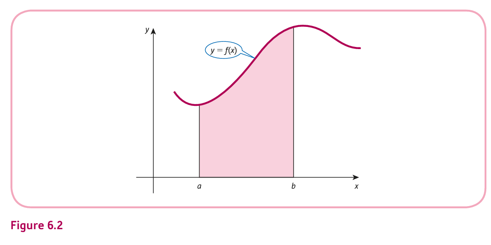
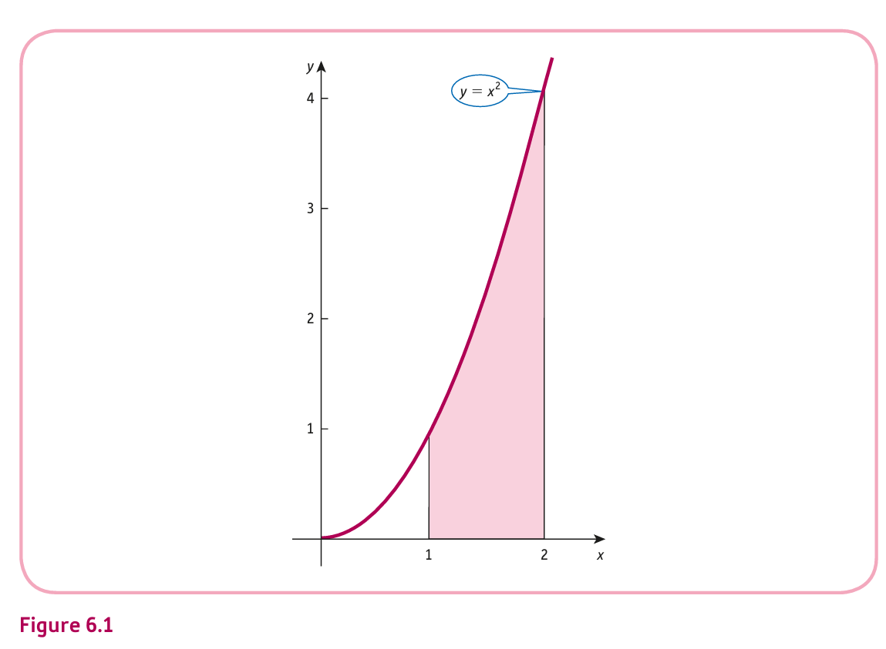
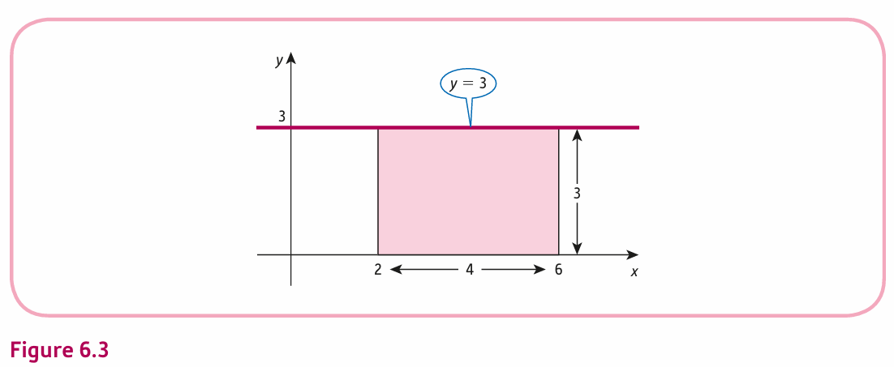
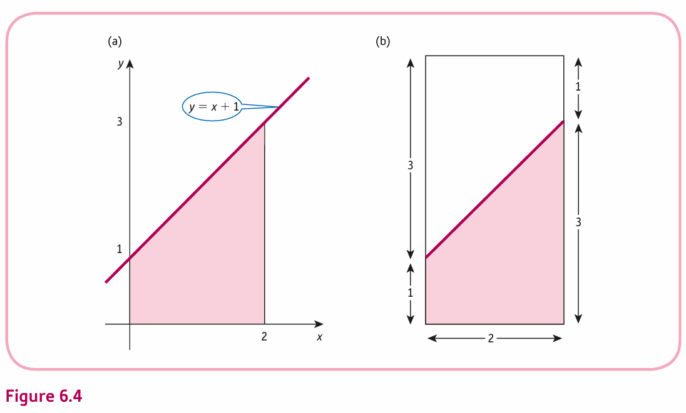
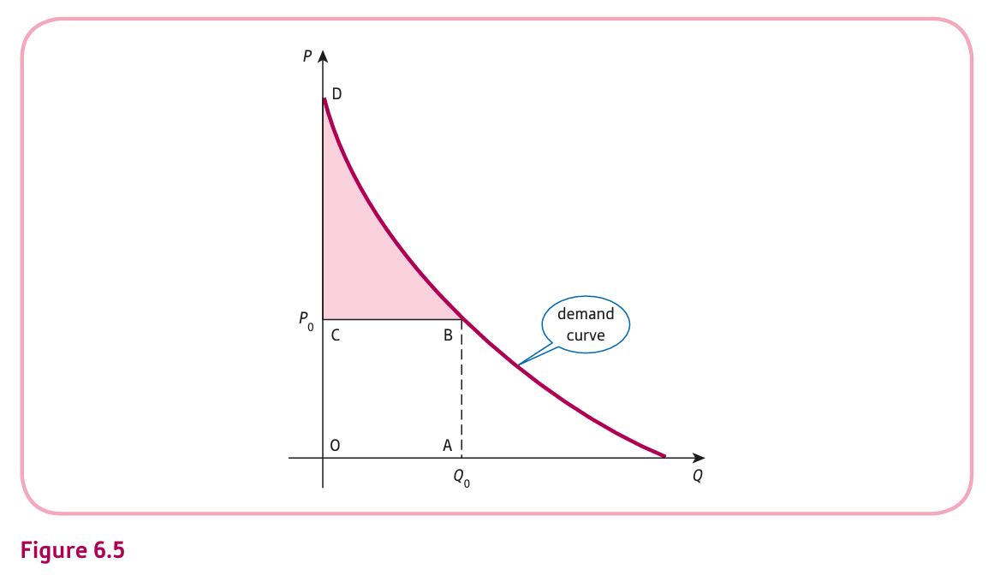
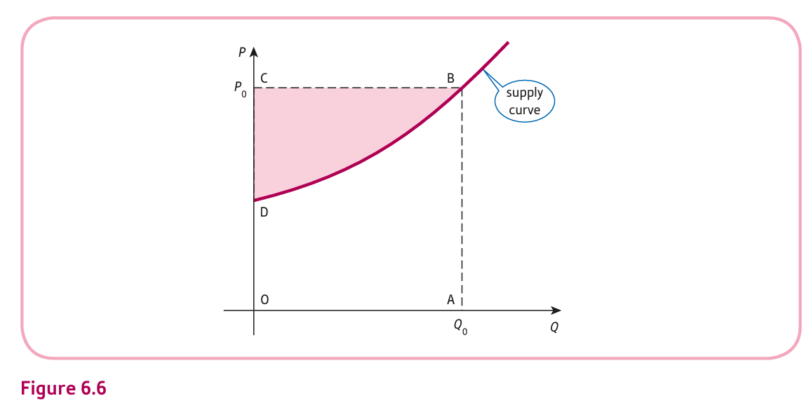

<style>
@media print{
  body, html, .remark-slides-area, .remark-notes-area {
    height: 100% !important;
    width: 100% !important;
    overflow: visible;
    display: inline-block;
    }
</style>

<style type="text/css">
.remark-slide-content {
    font-size: 34px;
    padding: 1em 4em 1em 4em;
}
</style>

<style type="text/css">
.my-one-page-font {
  font-size: 28px;
}
</style>

</style>

<style type="text/css">
.my-one-page-font-table {
  font-size: 24px;
}
</style>


```{r setup, include = FALSE}
library(tidyverse)
library(knitr)

opts_chunk$set(fig.width = 10, 
               message = FALSE, 
               warning = FALSE,
               echo = FALSE)
```

```{r xaringan-themer, include=FALSE, warning=FALSE}
#install.packages("xaringanthemer")
library(xaringanthemer)
style_mono_accent(
  base_color = "#1c5253",
  header_font_google = google_font("Josefin Sans"),
  text_font_google   = google_font("Montserrat", "500", "550i"),
  code_font_google   = google_font("Fira Mono"),
  colors = c(
  red = "#f34213",
  purple = "#3e2f5b",
  orange = "#ff8811",
  green = "#136f63",
  white = "#FFFFFF"
)
)
```


# Why It Matters in Economics & Finance

- Definite integration is crucial for calculating areas under curves, total costs, revenues, and investment values.

- In economics, it is used to determine **consumer and producer surplus** and **capital accumulation**.

- In finance, it helps in calculating **present value of continuous revenue streams**.

---

# Understanding Definite Integration

- Integration finds the **area under a curve** between two specific points.
- Notation: If $f(x)$ is continuous over $[a, b]$, then:

$$
\int_a^b f(x) \, dx = F(b) - F(a)
$$

where
- $f(x)$ is the function to be integrated,
- $a$ and $b$ are the limits of integration,
- $F(x)$ is the **antiderivative** of $f(x)$.
  - $F(b)$ and $F(a)$ are the values of the antiderivative at $b$ and $a$, respectively.

---

class: my-one-page-font

# Visualizing the Definite Integral

.center[]

- This graph shows the general concept of finding the area under a curve between two points, $a$ and $b$.

- The definite integral gives the **net area** between the curve and the x-axis over the interval $[a, b]$.
- The area can be positive or negative depending on the position of the curve relative to the x-axis.
- If the curve is above the x-axis, the area is positive; if below, the area is negative.

---

# Understanding Definite Integration (cont)

- Example:

$$
\int_0^3 (2x + 1) \, dx = \left[ x^2 + x \right]_0^3 = (9 + 3) - (0 + 0) = 12
$$

- Example:

  - Find the area under $y = x^2$ from $x = 1$ to $x = 2$.

  $$
  \int_1^2 x^2 \, dx = \left[ \frac{x^3}{3} \right]_1^2 = \frac{8}{3} - \frac{1}{3} = \frac{7}{3}
  $$

---

# Visualizing the Area Under a Curve

.center[]

- This graph illustrates the area under the curve $y = x^2$ between $x = 1$ and $x = 2$.

- The area represents the **definite integral** value.

---


# Definite Integration Examples

### Example (a): Evaluating the Definite Integral

Evaluate the definite integral:

$$
\int_2^6 3 \, dx
$$

**Solution:**

We integrate the constant function:

$$
\int_2^6 3 \, dx = [3x]_2^6 = 3(6) - 3(2) = 18 - 6 = 12
$$

This can also be confirmed graphically by calculating the area of the rectangle (Figure 6.3):
- **Base:** $6 - 2 = 4$
- **Height:** $3$
- **Area:** $4 \times 3 = 12$
---
### Example (a): Evaluating the Definite Integral (cont)

.center[]


---

### Example (b): Evaluating the Definite Integral

Evaluate the definite integral:

$$
\int_0^2 (x + 1) \, dx
$$

**Solution:**

We integrate the linear function:

$$
\int_0^2 (x + 1) \, dx = \left[ \frac{x^2}{2} + x \right]_0^2
$$

Substituting the limits:

$$
= \left( \frac{2^2}{2} + 2 \right) - \left( \frac{0^2}{2} + 0 \right)
$$

$$
= (2 + 2) - (0) = 4
$$

---
### Example (b): Evaluating the Definite Integral (cont)

Graphically, this is represented as a region under $y=x+1$ (Figure 6.4a) and a one-half of the rectangle (Figure 6.4b):
- **Base:** $2$
- **Height:** $4$
- **Area:** $\frac{1}{2} \times 2 \times 4 = 4$

.center[]

---


# Area Under Demand Curve - Consumer Surplus

.center[]

- Consumer surplus is the area under the demand curve and above the price line.

- It measures the **benefit consumers receive** when purchasing a product at a given price.

---

# Area Under Demand Curve - Consumer Surplus (cont)

## Problem Statement

- Find the **consumer’s surplus** at $Q = 5$ for the demand function:

$$
P = 30 - 4Q
$$

---
# Area Under Demand Curve - Consumer Surplus (cont)

## Step 1: Define the Function

- The demand function is:

$$
f(Q) = 30 - 4Q
$$

- At $Q_0 = 5$, the price is:

$$
P_0 = 30 - 4(5) = 10
$$

---
# Area Under Demand Curve - Consumer Surplus (cont)

## Step 2: Consumer Surplus Formula

The formula for **consumer’s surplus** is:

$$
CS = \int_0^{Q_0} f(Q) \, dQ - Q_0 	\times P_0
$$

Substituting the given values:

$$
CS = \int_0^5 (30 - 4Q) \, dQ - 5 	\times 10
$$

---
# Area Under Demand Curve - Consumer Surplus (cont)

## Step 3: Solve the Integral with R

```{r, echo=TRUE}
# Define the function
f <- function(Q) { 30 - 4 * Q }

# Integrate
cs_integral <- integrate(f, lower = 0, upper = 5)$value

# Calculate CS
P0 <- 10
Q0 <- 5
CS <- cs_integral - Q0 * P0

# Display result
CS
```

---
# Area Under Demand Curve - Consumer Surplus (cont)

## Step 4: Mathematical Solution

1. Integrate:

$$
\int_0^5 (30 - 4Q) \, dQ = [30Q - 2Q^2]_0^5
$$

$$
= (30 	\times 5 - 2 	\times 5^2) - (30 	\times 0 - 2 	\times 0^2)
$$

$$
= (150 - 50) - (0 - 0) = 100
$$

2. Calculate CS:

$$
CS = 100 - 5 	\times 10 = 100 - 50 = 50
$$

**Answer:** The consumer surplus is **50 units**.


---

# Producer Surplus

.center[]

- Producer surplus is the area above the supply curve and below the price line.

- It represents the **benefit producers receive** by selling at a market price higher than the minimum they would accept.

---

# Producer Surplus (cont)

# Producer’s Surplus - Example

### Given:
- Demand function: $P = 35 - Q^2$
- Supply function: $P = 3 + Q^2$

**Objective:** Calculate the producer’s surplus assuming pure competition.

---
# Producer Surplus (cont)

## Step 1: Find Equilibrium

- Set demand equal to supply:

$$
35 - Q^2 = 3 + Q^2
$$

$$
35 - 2Q^2 = 3
$$

$$
-2Q^2 = -32
$$

$$
Q^2 = 16 \implies Q = 4
$$

- Equilibrium price:

$$
P_0 = 35 - (4)^2 = 19
$$

---
# Producer Surplus (cont)

## Step 2: Define Producer Surplus

$$
PS = Q_0 P_0 - \int_0^{Q_0} (3 + Q^2) \, dQ
$$

Where:
- $Q_0 = 4$
- $P_0 = 19$

---
# Producer Surplus (cont)

## Step 3: Calculate Producer Surplus wih R

```{r, echo=TRUE}
Q0 <- 4
P0 <- 19

# Define the supply function
supply <- function(Q) {
  3 + Q^2
}

# Calculate integral
integral <- integrate(supply, lower = 0, upper = Q0)$value

# Calculate PS
PS <- Q0 * P0 - integral
PS
```

---
# Producer Surplus (cont)

## Step 4: Mathematical Solution
1. Calculate the integral:
$$
\int_0^4 (3 + Q^2) \, dQ = [3Q + \frac{Q^3}{3}]_0^4
$$
$$
= (3 \times 4 + \frac{4^3}{3}) - (0)
$$
$$
= (12 + \frac{64}{3}) - 0
$$
$$
= \frac{36}{3} + \frac{64}{3} = \frac{100}{3}
$$

---
# Producer Surplus (cont)

## Step 4: Mathematical Solution (cont)

2. Calculate PS:
$$
PS = Q_0 P_0 - \int_0^{Q_0} (3 + Q^2) \, dQ
$$
$$
= 4 \times 19 - \frac{100}{3}
$$
$$
= 76 - \frac{100}{3}
$$
$$
= \frac{228}{3} - \frac{100}{3} = \frac{128}{3}
$$
$$
= 42.67
$$

---
# Producer Surplus (cont)

## Step 5: Interpretation

- The producer's surplus is approximately 42.67.

- This represents the area above the supply curve and below the equilibrium price line up to the equilibrium quantity.

---

# Net Investment and Capital Formation

## Understanding Net Investment

- **Net Investment (I)** is defined as the rate of change of capital stock (K).
- The relationship is given by:

$$
I(t) =\frac{dK}{dt}
$$

- Here, $I(t)$ is the flow of money in dollars per year, and $K(t)$ is the accumulated capital.

---
# Net Investment and Capital Formation (cont)

## Capital Formation - Definite Integral

- To calculate the capital formation over a period from $t_1$ to $t_2$, we use:

$$
\int_{t_1}^{t_2} I(t) \, dt
$$

- If we are given the investment flow function, we integrate to find the capital stock.

.small[Note: Capital accumulation is the total amount of capital accumulated over time, considering continuous inflows and outflows.]

---
# Net Investment and Capital Formation (cont)

## Example - Capital Formation

**Investment Flow Function:**
$$
I(t) = 9000 \sqrt{t}
$$

(a) Calculate the capital formation from the end of the first year to the end of the fourth year with R:

```{r, echo=TRUE}
# Integration for capital formation
capital_formation <- integrate(function(t) 9000 * sqrt(t), lower = 1, upper = 4)$value
capital_formation
```

---
# Net Investment and Capital Formation (cont)

## Example - Capital Formation (cont)

(b) Determine the number of years before capital stock exceeds $100,000 with R.

We need to solve:
$$
\int_0^T 9000 \sqrt{t} \, dt = 100000
$$

```{r, echo=TRUE}
# Solving for T
solve_T <- function(T) {
  integral_value <- integrate(function(t) 9000 * sqrt(t), lower = 0, upper = T)$value
  return(integral_value - 100000)
}

T_value <- uniroot(solve_T, c(0, 10))$root
T_value
```

- The capital stock reaches $100,000 approximately **6.5 years** into the investment period.

---
class: my-one-page-font

# Net Investment and Capital Formation (cont)

## Example - Capital Formation (cont)
### Mathematical Solution (a)
- The integral is:
$$
\int_1^4 9000 \sqrt{t} \, dt = 9000 \left[ \frac{2}{3} t^{3/2} \right]_1^4
$$
- Evaluating the integral:
$$
= 9000 \left( \frac{2}{3} (4^{3/2}) - \frac{2}{3} (1^{3/2}) \right)
$$
$$
= 9000 \left( \frac{2}{3} (8) - \frac{2}{3} (1) \right)
$$
$$
= 9000 \left( \frac{16}{3} - \frac{2}{3} \right) = 9000 \left( \frac{14}{3} \right) = 42000
$$


**Answer:** The capital formation from the end of the first year to the end of the fourth year is **$42,000**.

---
class: my-one-page-font

# Net Investment and Capital Formation (cont)

## Example - Capital Formation (cont)
### Mathematical Solution (b)
- To find $T$ such that:
$$
\int_0^T 9000 \sqrt{t} \, dt = 100000
$$
- The integral is:
$$
\int_0^T 9000 \sqrt{t} \, dt = 9000 \left[ \frac{2}{3} t^{3/2} \right]_0^T
$$
- Evaluating the integral:
$$
= 9000 \left( \frac{2}{3} T^{3/2} - 0 \right)
$$
$$
= 6000 T^{3/2}
$$

---
class: my-one-page-font

# Net Investment and Capital Formation (cont)

## Example - Capital Formation (cont)
### Mathematical Solution (b) (cont)

- Setting equal to $100,000$:
$$
6000 T^{3/2} = 100000
$$
$$
T^{3/2} = \frac{100000}{6000}
$$
$$
T^{3/2} = \frac{50}{3}
$$
$$
T = \left( \frac{50}{3} \right)^{2/3} \approx 6.5
$$

**Answer:** The capital stock exceeds $100,000$ approximately **6.5 years** after the start of the investment.

---

# Net Investment and Capital Formation (cont)

# Interpretation and Insights

- Capital formation provides a measure of how investment over time accumulates into capital stock.

- Understanding the time it takes for investment to achieve certain capital levels helps in financial planning and forecasting.
---

# Present Value of Continuous Revenue Stream

## Problem Statement

- Calculate the present value of a continuous revenue stream of $1000 per year for 5 years, discounted at 9% annually.

- The present value is given by:

$$
P = \int_0^5 1000 e^{-0.09t} \, dt
$$

---
# Present Value of Continuous Revenue Stream (cont)

## Step 1: Setup the Integral

- We need to evaluate the definite integral:

$$
P = \int_0^5 1000 e^{-0.09t} \, dt
$$

- This integral represents the **present value** of a revenue stream discounted continuously.

---
# Present Value of Continuous Revenue Stream (cont)

## Step 2: Solve the Integral

- The integral is of the form:

$$
\int e^{at} \, dt =\frac{1}{a} e^{at} + C
$$

- Applying the integral:

$$
\int 1000 e^{-0.09t} \, dt =\frac{1000}{-0.09} e^{-0.09t} \Bigg|_0^5
$$

---
# Present Value of Continuous Revenue Stream (cont)

## Step 3: Evaluate the Integral

- Evaluating at the bounds:

$$
P = \frac{1000}{0.09} \left( e^{-0.09 	\times 5} - e^{0} 
\right)
$$

$$
= -11111.11 \left( e^{-0.45} - 1 
\right)
$$

---
# Present Value of Continuous Revenue Stream (cont)

## Step 4: Calculate the Present Value

- Approximating $e^{-0.45} \approx 0.6376$:

$$
P \approx -11111.11 (0.6376 - 1)
$$

$$
\approx -11111.11 	\times -0.3624
$$

$$
\approx 4026.35
$$

**Answer:** The present value of the continuous revenue stream is **$4026.35**.

---


# Practice Problems

1. Evaluate the definite integral:
   - $\int_1^4 (3x^2 + 2) \, dx$

2. Calculate the consumer surplus given the demand curve $P = 50 - 2Q$ and market price $P = 30$.

3. Determine the present value of a continuous revenue stream given by $R(t) = 150e^{0.04t}$ over 3 years.

???


#---

# Problem 1: Definite Integral

**Evaluate the integral:**

$$
\int_1^4 (3x^2 + 2) \, dx
$$

**Step 1: Integrate the function:**

$$
\int (3x^2 + 2) \, dx = \int 3x^2 \, dx + \int 2 \, dx
$$

$$
= x^3 + 2x + C
$$

**Step 2: Apply the limits:**

$$
\left[ x^3 + 2x \right]_1^4 = (4^3 + 2 \cdot 4) - (1^3 + 2 \cdot 1)
$$

$$
= (64 + 8) - (1 + 2)
$$

$$
= 72 - 3 = 69
$$

Answer: $69$

#---

# Problem 2: Consumer Surplus

**Given Demand Curve:**

$$
P = 50 - 2Q
$$

Market Price: $30

**Consumer Surplus Formula:**

$$
CS = \int_0^{Q^*} (P_d - P_m) \, dQ
$$

**Step 1: Find the quantity at market price:**

Set $P = 30$:

$$
30 = 50 - 2Q
$$

$$
2Q = 20 \implies Q^* = 10
$$

**Step 2: Apply the consumer surplus formula:**

$$
CS = \int_0^{10} (50 - 2Q - 30) \, dQ
$$

$$
= \int_0^{10} (20 - 2Q) \, dQ
$$

**Step 3: Integrate:**

$$
\left[ 20Q - Q^2 \right]_0^{10}
$$

$$
= (20 \cdot 10 - 10^2) - (20 \cdot 0 - 0^2)
$$

$$
= (200 - 100) - (0 - 0)
$$

$$
= 100
$$

Answer: $100

#---

# Problem 3: Present Value of Revenue Stream

**Given Revenue Function:**

$$
R(t) = 150e^{0.04t}
$$

Time Period: 3 years

**Present Value Formula:**

$$
PV = \int_0^3 150e^{0.04t} \, dt
$$

**Step 1: Integrate the exponential function:**

$$
\int 150e^{0.04t} \, dt = \frac{150}{0.04} e^{0.04t} + C
$$

**Step 2: Apply the limits:**

$$
\left[ \frac{150}{0.04} e^{0.04t} \right]_0^3
$$

$$
= \frac{150}{0.04} (e^{0.12}) - \frac{150}{0.04} (1)
$$

$$
= 3750 (1.1275) - 3750 (1)
$$

$$
= 4228.13 - 3750
$$

$$
= 478.13
$$

Answer: $478.13

#---

---

# Summary

- Definite integration calculates areas under curves, total costs, revenues, and surplus values.

- It is applied in economic analysis to assess **consumer and producer surplus** and **capital accumulation**.

- Setting up and evaluating definite integrals is essential for economic applications.

---

class: inverse, center, middle

# 2. Home work #2

---

class: my-one-page-font-table

## Homework #2

- **Due Date:** June 13, 2025, before the start of class.
- **Submission Format:** Submit your solutions as a single PDF file via the Cyber Campus.
- **Instructions:** 
  - Clearly show all steps and calculations.
  - Include explanations for your answers where applicable.
  - Ensure your submission is neat and well-organized.
  - Bring any questions to the office hours or email me.

- Work on your Home Assignment #2 (Jacques, 10th edition, Chapters 5-9):
  - Chapter 5.1: Exercise 5.1, Problem 5 (p. 411)
  - Chapter 5.2: Exercise 5.2, Problem 7 (p. 427)
  - Chapter 5.3: Exercise 5.3, Practice Problem inside the chapter (p. 432 only)
  - Chapter 5.4: Exercise 5.4, Problem 5 (p. 457)
  - Chapter 5.5: Exercise 5.5, Problems 6 and 7  (p. 467)
  - Chapter 5.6: Exercise 5.6, Problem 4 (p. 479)
  - Chapter 6.1: Exercise 6.1, Problem 3 (p. 506)
  - Chapter 6.2: Exercise 6.2, Problem 6 (p. 521)
  - Chapter 7.1: Exercise 7.1, Problem 5 (p. 553)
  - Chapter 7.2: Exercise 7.2, Problem 6 (p. 572)
  - Chapter 7.3: Exercise 7.3, Problem 5 (p. 584)
  - Chapter 8.1: Exercise 8.1, Problem 6 (p. 615)
  - Chapter 8.2: Exercise 8.2, Problem 3 (p. 626)
  - Chapter 9.1: Exercise 9.1, Problem 4 (p. 655)
  - Chapter 9.2: Exercise 9.2, Problem 3 (p. 670)

Good luck!


---

class: inverse, center, middle

# Any QUESTIONS?

## Thank you for your attention!

---

## Next Classes

- (May 28) **Quiz 2** 
- (May 30) Basic Matrix Operation (7.1) Matrix Inversion (7.2) 


???
1. To print pdf slides
https://stackoverflow.com/questions/54968311/xaringan-export-slides-to-pdf-while-preserving-formatting

pagedown::chrome_print("W1_ME.html") # but not all pictures are visible

2. Option: https://stackoverflow.com/questions/54968311/xaringan-export-slides-to-pdf-while-preserving-formatting

install.packages("remotes")
remotes::install_github("jhelvy/xaringanBuilder")
remotes::install_github("jhelvy/renderthis@v0.0.9")

library(xaringanBuilder)
build_pdf("DVC.html")

3. Option
writeBin(as.raw(c()), "favicon.ico") # create an empty favicon.ico file
install.packages("renderthis")
remotes::install_github('rstudio/chromote')
library(renderthis)

renderthis::to_pdf("W12_2_ME.html")

getwd()
setwd("C:/Users/Iegor/OneDrive - kdis.ac.kr/Documents/GitHub/Sogang/2025/Spring/Mathematical Economics/Week 12_2")
