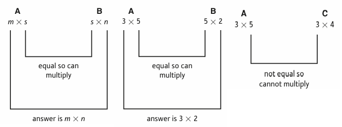

<style>
@media print{
  body, html, .remark-slides-area, .remark-notes-area {
    height: 100% !important;
    width: 100% !important;
    overflow: visible;
    display: inline-block;
    }
</style>

<style type="text/css">
.remark-slide-content {
    font-size: 34px;
    padding: 1em 4em 1em 4em;
}
</style>

<style type="text/css">
.my-one-page-font {
  font-size: 28px;
}
</style>

</style>

<style type="text/css">
.my-one-page-font-table {
  font-size: 24px;
}
</style>


```{r setup, include = FALSE}
library(tidyverse)
library(knitr)

opts_chunk$set(fig.width = 10, 
               message = FALSE, 
               warning = FALSE,
               echo = FALSE)
```

```{r xaringan-themer, include=FALSE, warning=FALSE}
#install.packages("xaringanthemer")
library(xaringanthemer)
style_mono_accent(
  base_color = "#1c5253",
  header_font_google = google_font("Josefin Sans"),
  text_font_google   = google_font("Montserrat", "500", "550i"),
  code_font_google   = google_font("Fira Mono"),
  colors = c(
  red = "#f34213",
  purple = "#3e2f5b",
  orange = "#ff8811",
  green = "#136f63",
  white = "#FFFFFF"
)
)
```

# Agenda

1. Basic Matrix Operation (7.1)

2. Matrix Inversion (7.2)

3. Homework #2

---

# Why Matrices Matter in Economics

- Matrix algebra allows economists to:
  - Solve systems of equations
  - Model economic input-output relationships
  - Optimize production & costs
  - Forecast using linear models

- Applications include:
  - Input-output models
  - Markov chains
  - Linear regression models
  - Economic equilibrium analysis

---

class: inverse, center, middle
# 1. Basic Matrix Operation (7.1)

---

# Example: Sales Table

Suppose that a firm produces three types of goods (G1, G2, G3) and sells them to two customers (C1 and C2). The matrix:

$$A = \begin{bmatrix}
    & \text{G1} & \text{G2} & \text{G3} \\
\text{C1} & 7 & 3 & 4 \\
\text{C2} & 1 & 5 & 6
\end{bmatrix}$$


represents monthly sales:
- Row 1: customer C1
- Row 2: customer C2
- Columns: goods G1, G2, G3

This format allows for compact storage and easy operations like summing totals or multiplying by price vectors.

---

# Basic Matrix Terminology

- A matrix is a rectangular array of numbers:

$$A = \begin{bmatrix} 2 & 3 \\ 4 & 5 \end{bmatrix}$$

- **Order**: number of rows $\times$ number of columns (dimensions)
- **Row vector**: 1 row, $n$ columns  
- **Column vector**: $n$ rows, 1 column
- **Element**: $a_{ij}$ is the element in row $i$, column $j$
- **Square matrix**: same number of rows and columns (e.g., $2 \times 2$)

- **Zero matrix**: all elements are zero
$$O = \begin{bmatrix} 0 & 0 \\ 0 & 0 \end{bmatrix}$$

---

# General Matrix Notation

A general matrix $D$ of order $3 \times 2$:
$$D = \begin{bmatrix} d_{11} & d_{12} \\ d_{21} & d_{22} \\ d_{31} & d_{32} \end{bmatrix}$$

A general matrix $E$ of order $3 \times 3$:
$$E = \begin{bmatrix} e_{11} & e_{12} & e_{13} \\ e_{21} & e_{22} & e_{23} \\ e_{31} & e_{32} & e_{33} \end{bmatrix}$$

---
# Basic Matrix Operations

## Transpose of a Matrix
- **Transpose**: $A^T$ flips rows and columns

$$A = \begin{bmatrix} 1 & 2 \\ 3 & 4 \end{bmatrix} \Rightarrow A^T = \begin{bmatrix} 1 & 3 \\ 2 & 4 \end{bmatrix}$$

- Rows become columns

- Used frequently in optimization and econometrics

---
# Basic Matrix Operations (continued)

## Matrix Addition & Subtraction

Two matrices of the same order:

$$A = \begin{bmatrix} 1 & 2 \\ 3 & 4 \end{bmatrix}, \quad B = \begin{bmatrix} 5 & 6 \\ 7 & 8 \end{bmatrix}$$

$$A + B = \begin{bmatrix} 6 & 8 \\ 10 & 12 \end{bmatrix}, \quad A - B = \begin{bmatrix} -4 & -4 \\ -4 & -4 \end{bmatrix}$$

---
# Basic Matrix Operations (continued)

## Scalar Multiplication

Multiply each element:

$$2A = 2 \cdot \begin{bmatrix} 1 & 2 \\ 3 & 4 \end{bmatrix} = \begin{bmatrix} 2 & 4 \\ 6 & 8 \end{bmatrix}$$

---
# Basic Matrix Operations (continued)

## Matrix Multiplication

- Only defined if inner dimensions match: $A_{m \times n} \cdot B_{n \times p}$

Example:

$$A = \begin{bmatrix} 1 & 2 \\ 3 & 4 \end{bmatrix}, \quad B = \begin{bmatrix} 2 & 0 \\ 1 & 5 \end{bmatrix}$$

$$AB = \begin{bmatrix} 1\cdot2 + 2\cdot1 & 1\cdot0 + 2\cdot5 \\ 3\cdot2 + 4\cdot1 & 3\cdot0 + 4\cdot5 \end{bmatrix} = \begin{bmatrix} 4 & 10 \\ 10 & 20 \end{bmatrix}$$

- Dimensions of the result: $m \times p$

---
# Basic Matrix Operations (continued)

## Matrix Multiplication Advice
> Take the trouble to check before you begin that it is possible to form the matrix product and anticipate the order of the end result.

- Jot down the dimensions: inner numbers must match.
- The result’s dimensions = outer numbers.

If:

$$A: 3\times5,\quad B: 5\times2,\quad C: 3\times4$$

Then:
- AB is possible → result is 3×2
- AC is **not** possible (inner numbers don't match)

.center[]

---
# Basic Matrix Operations (continued)

## General Matrix Multiplication
If A is $m \times s$ and B is $s \times n$, then $AB$ is $m \times n$. Element $c_{ij}$ is:

$$c_{ij} = \text{row}_i(A) \cdot \text{col}_j(B)$$

Let:

$$A = \begin{bmatrix} 2 & 1 & 0 \\ 1 & 0 & 4 \end{bmatrix},
\quad
B = \begin{bmatrix} 3 & 1 & 2 & 1 \\ 1 & 0 & 1 & 2 \\ 5 & 4 & 1 & 1 \end{bmatrix}$$

Check: A is 2×3, B is 3×4 ⇒ AB exists, size is 2×4
---
# Basic Matrix Operations (continued)

## Calculating Elements of AB

- $c_{11} = 2\cdot3 + 1\cdot1 + 0\cdot5 = 6 + 1 + 0 = 7$
- $c_{12} = 2\cdot1 + 1\cdot0 + 0\cdot4 = 2 + 0 + 0 = 2$
- $c_{13} = 2\cdot2 + 1\cdot1 + 0\cdot1 = 4 + 1 + 0 = 5$
- $c_{14} = 2\cdot1 + 1\cdot2 + 0\cdot1 = 2 + 2 + 0 = 4$

Continue for second row…
---
## Basic Matrix Operations (continued)

# Full Product AB

$$AB = \begin{bmatrix} 7 & 2 & 5 & 4 \\ 23 & 17 & 6 & 5 \end{bmatrix}$$

Step-by-step matrix multiplication shows the power of matrix algebra in summarizing economic relationships.
---
class: my-one-page-font

## Basic Matrix Operations (continued)
# Properties of Matrix Operations

- A matrix is a rectangular array of numbers, organized into rows and columns. 
- The dimensions of a matrix are given as $m \times n$, where $m$ is the number of rows and $n$ is the number of columns. 
- Each element in the matrix is indexed by its row and column position, denoted as $a_{ij}$.

Provided that the indicated sums and products make sense,

- $A + B = B + A$
- $A − A = 0$
- $A + 0 = A$
- $k(A + B) = kA + kB$
- $k(lA) = (kl)A$
- $A(B + C) = AB + AC$
- $(A + B)C = AC + BC$
- $A(BC) = (AB)C$

We also have the **non-property**:

- $AB \ne BA$

---

# Matrix Representation of Systems

System of equations:

$$\begin{cases}
2x + 3y = 8 \\
4x - y = 2
\end{cases}
\quad \Rightarrow \quad AX = B$$

Where:

$$A = \begin{bmatrix} 2 & 3 \\ 4 & -1 \end{bmatrix}, \quad X = \begin{bmatrix} x \\ y \end{bmatrix}, \quad B = \begin{bmatrix} 8 \\ 2 \end{bmatrix}$$

---

# Identity Matrix

- Identity matrix $I$ acts like 1 in multiplication:

$$I = \begin{bmatrix} 1 & 0 \\ 0 & 1 \end{bmatrix}, \quad AI = IA = A$$

---

class: inverse, center, middle
# 2. Matrix Inversion (7.2)

---

# Matrix Inversion (2x2 Case)

Given:

$$A = \begin{bmatrix} a & b \\ c & d \end{bmatrix}$$


- The matrix $A^{-1}$ is called the inverse of $A$, and it plays a role similar to the reciprocal of a number in arithmetic.  

- Although the formula for $A^{-1}$ may appear complex, its construction for a $2 \times 2$ matrix is straightforward and systematic.

If $\det (A) = ad - bc \ne 0$, the inverse is:

$$A^{-1} = \frac{1}{ad - bc} \begin{bmatrix} d & -b \\ -c & a \end{bmatrix}$$

*Note*: $\det (A)$ is the determinant of $A$.

---

# Nota bene

For any nonzero number `x`, its reciprocal is `1/x`.

- The reciprocal of 5 is 1/5.

- The reciprocal of 1/3 is 3 (because 1/3 × 3 = 1).

- Multiplying a number by its reciprocal always gives 1.


---

# Solving Equations Using Inverses

From $AX = B$, multiply both sides by $A^{-1}$:

$$X = A^{-1}B$$

- This allows us to find the solution vector $X$ directly.

- If $A$ is invertible, we can solve systems of equations efficiently.

---

# Example: Solving for Equilibrium Prices

We are given a system of equations:

$$-4P_1 + P_2 = -13 \\
2P_1 - 5P_2 = -7$$

Express this system in matrix form and hence find the values of P1 and P2.

---

### Step 1: Express in Matrix Form

Write the system as:

$$\begin{bmatrix}-4 & 1 \\ 2 & -5\end{bmatrix} \begin{bmatrix}P_1 \\ P_2\end{bmatrix} = \begin{bmatrix}-13 \\ -7\end{bmatrix}$$

Let:
$$A = \begin{bmatrix}-4 & 1 \\ 2 & -5\end{bmatrix}$$
$$x = \begin{bmatrix}P_1 \\ P_2\end{bmatrix}$$
$$b = \begin{bmatrix}-13 \\ -7\end{bmatrix}$$

So the system becomes $$Ax = b$$

---

### Step 2: Find the Determinant of A

$$\text{det}(A) = (-4)(-5) - (1)(2) = 20 - 2 = 18$$

Since $$\text{det}(A) \ne 0$$, the matrix is invertible.

---

### Step 3: Find the Inverse of A

Using the formula for a 2x2 inverse:

$$A^{-1} = \frac{1}{\text{det}(A)} \begin{bmatrix}-5 & -1 \\ -2 & -4\end{bmatrix} = \frac{1}{18} \begin{bmatrix}-5 & -1 \\ -2 & -4\end{bmatrix}$$

---

### Step 4: Solve for x

Multiply $$A^{-1}$$ by $$b$$:

$$x = A^{-1}b = \frac{1}{18} \begin{bmatrix}-5 & -1 \\ -2 & -4\end{bmatrix} \begin{bmatrix}-13 \\ -7\end{bmatrix}$$

---

### Step 5: Matrix Multiplication

Compute:

$$\begin{aligned}
P_1 &= \frac{1}{18}((-5)(-13) + (-1)(-7)) = \frac{1}{18}(65 + 7) = \frac{72}{18} = 4 \\
P_2 &= \frac{1}{18}((-2)(-13) + (-4)(-7)) = \frac{1}{18}(26 + 28) = \frac{54}{18} = 3
\end{aligned}$$

---

### Final Answer

$$P_1 = 4$$

$$P_2 = 3$$

These are the equilibrium prices.

---

# 3x3 Matrices, Determinants, and Cofactors

The concepts of determinant, inverse and identity matrices apply to 3x3 matrices as well.

The identity matrix:

$$I = \begin{bmatrix} 1 & 0 & 0 \\ 0 & 1 & 0 \\ 0 & 0 & 1 \end{bmatrix}$$

Check that for any matrix $A$:

$$AI = A, \quad IA = A$$

To compute an inverse, we need **cofactors**:
- The cofactor $A_{ij}$ is the determinant of the 2x2 matrix formed by removing row $i$ and column $j$, multiplied by $(-1)^{i+j}$

---

# 3x3 Matrices, Determinants, and Cofactors (cont)

Example: For matrix $A$, to find $A_{23}$, delete row 2 and column 3 to get:

$$\text{Minor of } A_{23} = \begin{bmatrix} a_{11} & a_{12} \\ a_{31} & a_{32} \end{bmatrix}$$

Cofactor:

$$A_{23} = (-1)^{2+3} \cdot (a_{11}a_{32} - a_{12}a_{31}) = -a_{11}a_{32} + a_{12}a_{31}$$

This sign pattern follows the "checkerboard" rule:

$$\begin{bmatrix} + & - & + \\ - & + & - \\ + & - & + \end{bmatrix}$$

---
# 3x3 Matrices, Determinants, and Cofactors (cont)

## 3x3 Determinants and Inverses

We are now in a position to describe how to calculate the determinant and inverse of a 3x3 matrix.

To compute $\det(A)$:
- Multiply elements in any row/column by their cofactors
- The sum gives the determinant
- Same result regardless of row/column used — useful for checking!

If expanding along the first row:

$$\det(A) = a_{11}A_{11} + a_{12}A_{12} + a_{13}A_{13}$$

Or down the second column:

$$\det(A) = a_{12}A_{12} + a_{22}A_{22} + a_{32}A_{32}$$

This flexibility allows for easier calculations in practice.

---
class: my-one-page-font

# 3x3 Matrices, Determinants, and Cofactors (cont)

## 3x3 Inverse Matrix Structure

The inverse of the 3 × 3 matrix
$$A = \begin{bmatrix} a_{11} & a_{12} & a_{13} \\ a_{21} & a_{22} & a_{23} \\ a_{31} & a_{32} & a_{33} \end{bmatrix}$$
is computed using cofactors and determinant.

1. Form the matrix of cofactors (the adjugate matrix): 
$$\text{cof}(A) = \begin{bmatrix} A_{11} & A_{12} & A_{13} \\ A_{21} & A_{22} & A_{23} \\ A_{31} & A_{32} & A_{33} \end{bmatrix}$$

2. Take (1) transpose to get the adjoint matrix:
$$\text{adj}(A) = \begin{bmatrix} A_{11} & A_{21} & A_{31} \\ A_{12} & A_{22} & A_{32} \\ A_{13} & A_{23} & A_{33} \end{bmatrix}$$

---

# 3x3 Matrices, Determinants, and Cofactors (cont)

## 3x3 Inverse Matrix Structure (cont)

3. Multiply by $\frac{1}{\det(A)}$:
$$A^{-1} = \frac{1}{\det(A)} \cdot \text{adj}(A)$$

❗ If $\det(A) = 0$, the matrix is **singular** and the inverse **does not exist**.

**Advice**: Check your result by confirming that:
$$A^{-1}A = I \quad \text{and} \quad AA^{-1} = I$$

---
class: my-one-page-font
# 3x3 Matrices, Determinants, and Cofactors (cont)

## Example: Inverse of a 3x3 Matrix

Given:
$$A = \begin{bmatrix} 2 & 4 & 1 \\ 4 & 3 & 7 \\ 2 & 1 & 3 \end{bmatrix}$$

Previously computed cofactors:
$$A_{11} = 2,\quad A_{12} = 2,\quad A_{13} = -2 \\
A_{21} = -11,\quad A_{22} = 4,\quad A_{23} = 6 \\
A_{31} = 25,\quad A_{32} = -10,\quad A_{33} = -10$$

$$\text{adjugate}(A) = \begin{bmatrix} 2 & 2 & -2 \\ -11 & 4 & 6 \\ 25 & -10 & -10 \end{bmatrix}, \quad
\text{adjoint}(A) = \text{adjugate}(A)^T = \begin{bmatrix} 2 & -11 & 25 \\ 2 & 4 & -10 \\ -2 & 6 & -10 \end{bmatrix}$$

---
# 3x3 Matrices, Determinants, and Cofactors (cont)

## Example: Inverse of a 3x3 Matrix (cont)

Given $\det(A) = 10$, we compute:
$$A^{-1} = \frac{1}{10} \cdot \begin{bmatrix} 2 & -11 & 25 \\ 2 & 4 & -10 \\ -2 & 6 & -10 \end{bmatrix}$$

Verification:
$$A^{-1}A = I, \quad AA^{-1} = I \quad \text{✓}$$

---

class: my-one-page-font

# Practice Problems

- Given the matrix:
$$A = \begin{bmatrix} 1 & 2 & 3 \\ 4 & 5 & 6 \end{bmatrix}$$
   - Find $A^T$ (transpose).
   - Calculate $2A$ (scalar multiplication).
   - Add $A$ to itself.

- Multiply:
$$\begin{bmatrix} 2 & 1 \\ 3 & 4 \end{bmatrix} \cdot \begin{bmatrix} 1 & 0 \\ 0 & 5 \end{bmatrix}$$

- Find the inverse of:

$$\begin{bmatrix} 3 & 2 \\ 1 & 4 \end{bmatrix}$$

- Solve for $x$ and $y$:
$$\begin{cases}
3x + 2y = 10 \\
4x - y = 5
\end{cases}$$

---

# Practice Problems (continued)
- We are given a system of equations:

$$9P_1 + P_2 = 43 \\
2P_1 + 7P_2 = 57$$

Express this system in matrix form and hence find the values of P1 and P2.

- Find the inverse of the matrix:
$$A = \begin{bmatrix} 1 & 2 & 3 \\ 4 & 5 & 6 \\ 7 & 8 & 9 \end{bmatrix}$$

???

Matrix form:
\[
A = \begin{bmatrix} 9 & 1 \\ 2 & 7 \end{bmatrix}, \quad x = \begin{bmatrix} P_1 \\ P_2 \end{bmatrix}, \quad b = \begin{bmatrix} 43 \\ 57 \end{bmatrix}
\]

\[
\det(A) = 9 \cdot 7 - 1 \cdot 2 = 63 - 2 = 61 \ne 0
\]

\[
A^{-1} = \frac{1}{61} \begin{bmatrix} 7 & -1 \\ -2 & 9 \end{bmatrix}
\]

\[
x = A^{-1}b = \frac{1}{61} \begin{bmatrix} 7 & -1 \\ -2 & 9 \end{bmatrix} \begin{bmatrix} 43 \\ 57 \end{bmatrix} = \frac{1}{61} \begin{bmatrix} 7\cdot43 - 57 \\ -2\cdot43 + 9\cdot57 \end{bmatrix} = \frac{1}{61} \begin{bmatrix} 244 \ 431 \end{bmatrix} = \begin{bmatrix} 4 \ 7 \end{bmatrix}
\]

---

# Summary

- A matrix is a way to organize data into rows and columns.

- Matrix operations help simplify and solve systems of economic equations

- Inversion is crucial for solving systems when direct substitution isn’t feasible

- Input-output analysis is a powerful economic application

- Linear algebra is a foundation of modern data modeling and optimization

---

class: inverse, center, middle

# 3. Home work #2

---

class: my-one-page-font-table

## Homework #2

- **Due Date:** June 13, 2025, before the start of class.
- **Submission Format:** Submit your solutions as a single PDF file via the Cyber Campus.
- **Instructions:** 
  - Clearly show all steps and calculations.
  - Include explanations for your answers where applicable.
  - Ensure your submission is neat and well-organized.
  - Bring any questions to the office hours or email me.

- Work on your Home Assignment #2 (Jacques, 10th edition, Chapters 5-9):
  - Chapter 5.1: Exercise 5.1, Problem 5 (p. 411)
  - Chapter 5.2: Exercise 5.2, Problem 7 (p. 427)
  - Chapter 5.3: Exercise 5.3, Practice Problem inside the chapter (p. 432 only)
  - Chapter 5.4: Exercise 5.4, Problem 5 (p. 457)
  - Chapter 5.5: Exercise 5.5, Problems 6 and 7  (p. 467)
  - Chapter 5.6: Exercise 5.6, Problem 4 (p. 479)
  - Chapter 6.1: Exercise 6.1, Problem 3 (p. 506)
  - Chapter 6.2: Exercise 6.2, Problem 6 (p. 521)
  - Chapter 7.1: Exercise 7.1, Problem 5 (p. 553)
  - Chapter 7.2: Exercise 7.2, Problem 6 (p. 572)
  - Chapter 7.3: Exercise 7.3, Problem 5 (p. 584)
  - Chapter 8.1: Exercise 8.1, Problem 6 (p. 615)
  - Chapter 8.2: Exercise 8.2, Problem 3 (p. 626)
  - Chapter 9.1: Exercise 9.1, Problem 4 (p. 655)
  - Chapter 9.2: Exercise 9.2, Problem 3 (p. 670)

Good luck!


---

class: inverse, center, middle

# Any QUESTIONS?

## Thank you for your attention!

---

## Next Classes

- (June 4) Cramer’s Rule (7.3) 


???
1. To print pdf slides
https://stackoverflow.com/questions/54968311/xaringan-export-slides-to-pdf-while-preserving-formatting

pagedown::chrome_print("W1_ME.html") # but not all pictures are visible

2. Option: https://stackoverflow.com/questions/54968311/xaringan-export-slides-to-pdf-while-preserving-formatting

install.packages("remotes")
remotes::install_github("jhelvy/xaringanBuilder")
remotes::install_github("jhelvy/renderthis@v0.0.9")

library(xaringanBuilder)
build_pdf("DVC.html")

3. Option
writeBin(as.raw(c()), "favicon.ico") # create an empty favicon.ico file
install.packages("renderthis")
remotes::install_github('rstudio/chromote')
library(renderthis)

renderthis::to_pdf("W13_2_ME.html")

getwd()
setwd("C:/Users/Iegor/OneDrive - kdis.ac.kr/Documents/GitHub/Sogang/2025/Spring/Mathematical Economics/Week 13_2")
