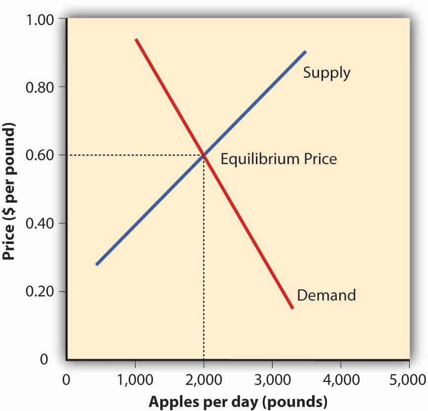
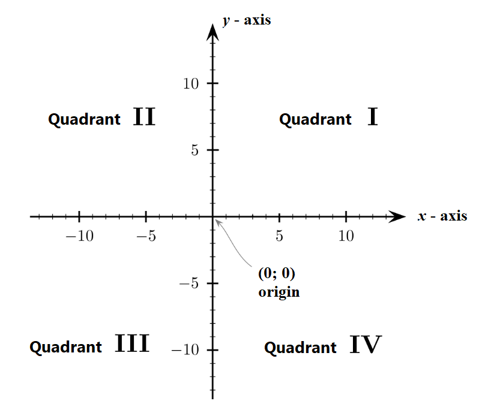
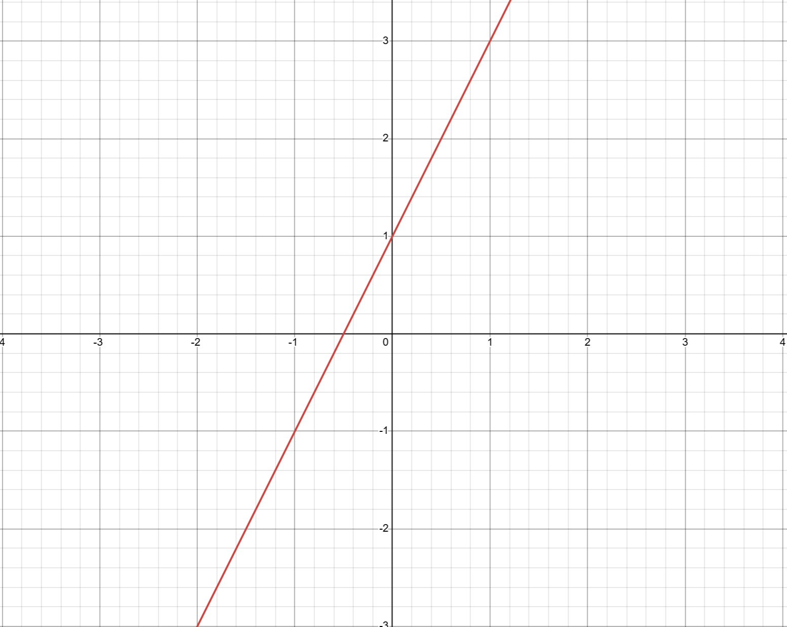
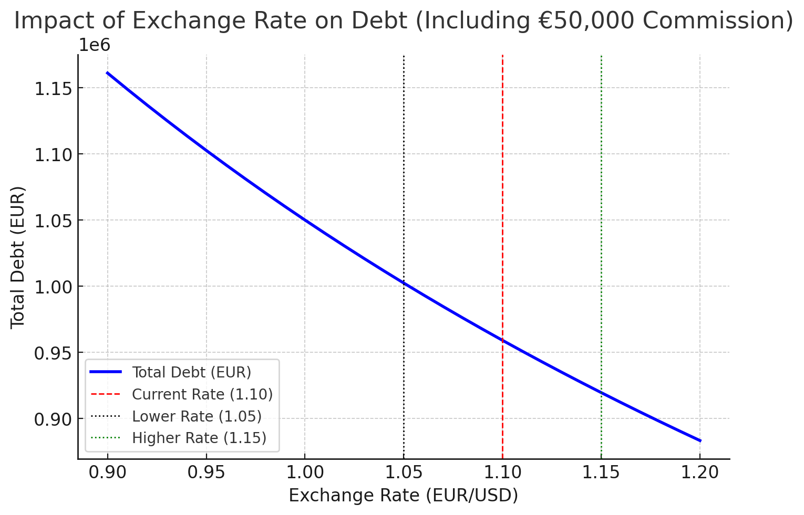
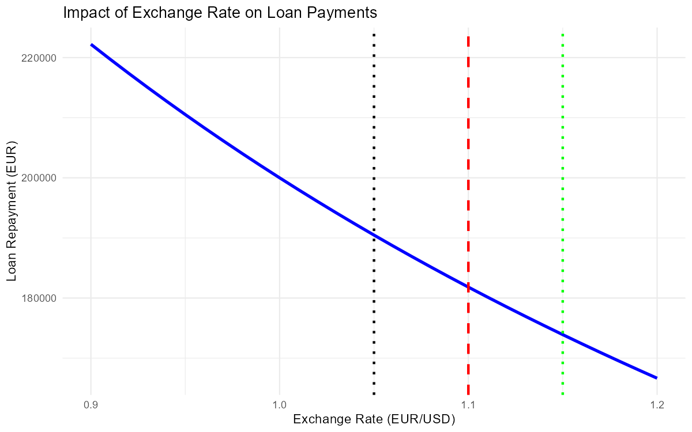
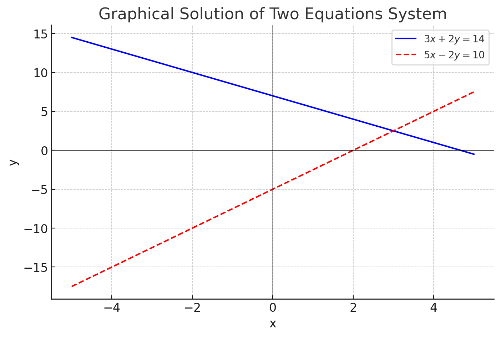
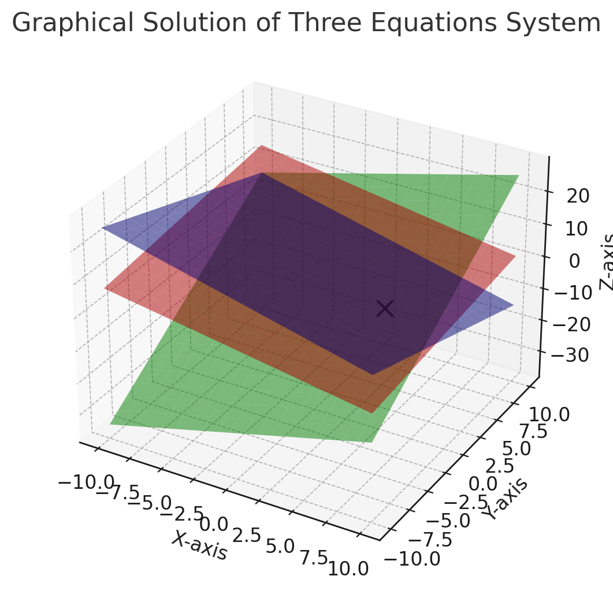

<style>
@media print{
  body, html, .remark-slides-area, .remark-notes-area {
    height: 100% !important;
    width: 100% !important;
    overflow: visible;
    display: inline-block;
    }
</style>

<style type="text/css">
.remark-slide-content {
    font-size: 34px;
    padding: 1em 4em 1em 4em;
}
</style>

<style type="text/css">
.my-one-page-font {
  font-size: 28px;
}
</style>

</style>

<style type="text/css">
.my-one-page-font-table {
  font-size: 24px;
}
</style>


```{r setup, include = FALSE}
library(tidyverse)
library(knitr)

opts_chunk$set(fig.width = 10, 
               message = FALSE, 
               warning = FALSE,
               echo = FALSE)
```

```{r xaringan-themer, include=FALSE, warning=FALSE}
#install.packages("xaringanthemer")
library(xaringanthemer)
style_mono_accent(
  base_color = "#1c5253",
  header_font_google = google_font("Josefin Sans"),
  text_font_google   = google_font("Montserrat", "500", "550i"),
  code_font_google   = google_font("Fira Mono"),
  colors = c(
  red = "#f34213",
  purple = "#3e2f5b",
  orange = "#ff8811",
  green = "#136f63",
  white = "#FFFFFF"
)
)
```

# Why Are These Concepts Essential in Economics?

## Supply and Demand Graph

<div>
.center[]

<div style="font-size: 12px; text-align: center; margin-top: 20px;">
</div>

---

# Why Are These Concepts Essential in Economics? (cont)

## Visualizing Economic Relationships

- **Supply and Demand Curves**: Graphs illustrate how prices and quantities interact in markets.
- **Cost and Revenue Functions**: Visual tools to analyze profitability and break-even points.

## Solving Equations for Economic Analysis

- **Equilibrium Analysis**: Determining market-clearing prices and quantities.
- **Optimization**: Maximizing profit or minimizing cost functions.

## Real-World Applications

- **Policy Modeling**: Predicting outcomes of fiscal and monetary policies.
- **Business Strategy**: Informing pricing, production, and investment decisions.

*Let’s dive in!*

---


# **Learning Objectives**

At the end of this class, you should be able to:

- **Graph** linear equations in one/two variables.
- **Solve** a linear equation and a system of two simultaneous linear equations using **elimination**.  
- **Detect** when a system of equations **has no solution**.  
- **Identify** when a system of equations has **infinitely many solutions**.  
- **Solve** a system of **three equations with three unknowns** using **elimination**. 

---

# Section 1.3: Graphs of Equations

## Understanding the Cartesian Coordinate System


<div style="display: flex; justify-content: center; align-items: center;">

  <div style="flex: 1; text-align: left;">
    <ul>
      <li><strong>X-axis</strong>: Horizontal line</li>
      <li><strong>Y-axis</strong>: Vertical line</li>
      <li><strong>Origin</strong>: Intersection of X and Y axes (0,0)</li>
      <li><strong>Quadrants</strong>: Four sections divided by the axes</li>
    </ul>
  </div>

  <div style="flex: 1; text-align: center;">
    
  </div>

</div>


---

# **Plotting Linear Equations**

## **Understanding Linear Equations**

<div style="display: flex; justify-content: space-between; align-items: flex-start;">

  <!-- Left Column -->
  <div style="flex: 1; padding-right: 20px;">
    <ul>
      <li><strong>Linear Equation</strong>: \( y = mx + c \)</li>
      <li>\( m \): <strong>Slope of the line</strong></li>
      <li>\( c \): <strong>Y-intercept</strong> (point where the line crosses the Y-axis)</li>
    </ul>
  </div>

  <!-- Right Column -->
  <div style="flex: 1;">
    <ul>
      <strong>Example:</strong>
      <li>Plot the equation \( y = 2x + 1 \).</li>
    </ul>
<div>
.center[]
</div>

Source: [Desmos Graphing Calculator](https://www.desmos.com/calculator)
  </div>
</div>

???
    ```{r save_plot, echo=FALSE, fig.width=6, fig.height=4, message=FALSE, warning=FALSE}
    # Load required package
    if (!requireNamespace("ggplot2", quietly = TRUE)) {
      install.packages("ggplot2")
    }
    library(ggplot2)

    # Create and save plot
    plot_file <- "linear_equation_plot.png"
    png(plot_file, width=6, height=4, units="in", res=150)
    ggplot(data.frame(x = c(-5, 5)), aes(x)) +
      stat_function(fun = function(x) 2 * x + 1, color = "blue") +
      labs(title = "Graph of y = 2x + 1", x = "x", y = "y") +
      theme_minimal()
    dev.off()
    ```


---

## **Your turn**

### Please plot the following linear equations:

1. \(y = 3x - 2\)
2. \(y = -2x + 3\)
3. \(y = 0.5x + 1\)

---

# **Impact of Exchange Rate on Loan Payments**

## **How Exchange Rate Affects Loan Repayments**

- A company must pay **$200,000 annually** for a loan.

- The payment in **EUR depends on the exchange rate**.

- If the **exchange rate changes**, the **amount in EUR** fluctuates.
  - Say, exchange rate fluctuates from **€1 = $0.90** to **€1 = $1.20**.

- There is a fixed commission fee of **€50,000** for the transaction.

---

# **Debt and Exchange Rate Relationship**

## **Equation for Debt Calculation**

A company borrows in **USD**, but its total debt in **EUR** depends on the exchange rate and a **fixed commission**.

$$
D = \frac{L}{ER} + C
$$

Where:
- D = Total debt in **EUR**
- L = Loan amount in **USD**
- ER = Exchange rate **(EUR/USD)**
- C = Fixed commission **(€50,000 EUR)**

---

## **Example Calculation**

A company borrows **$1,000,000 USD**, and the exchange rate is **1 EUR = 1.10 USD**, with a **€50,000 commission**.

$$
D = \frac{1,000,000}{1.10} + 50,000
$$

$$
D = 909,091 + 50,000 = 959,091 \text{ EUR}
$$

If the **exchange rate drops** to **1.05 EUR/USD**, the debt increases:

$$
D = \frac{1,000,000}{1.05} + 50,000 = 952,381 + 50,000 = 1,002,381 \text{ EUR}
$$

**As the EUR weakens, the debt in EUR increases even more!**

???


```{r plot_debt_fx_commission, echo=FALSE, fig.width=8, fig.height=5, message=FALSE, warning=FALSE}
library(ggplot2)

# Define exchange rates and corresponding debt values (including commission)
exchange_rates <- seq(0.90, 1.20, by = 0.01)
debt_values <- (1000000 / exchange_rates) + 50000
data <- data.frame(ExchangeRate = exchange_rates, DebtEUR = debt_values)

# Create the plot
ggplot(data, aes(x = ExchangeRate, y = DebtEUR)) +
  geom_line(color = "blue", size = 1.2) +
  geom_vline(xintercept = 1.10, linetype = "dashed", color = "red", size=1) +
  geom_vline(xintercept = 1.05, linetype = "dotted", color = "black", size=1) +
  geom_vline(xintercept = 1.15, linetype = "dotted", color = "green", size=1) +
  labs(title = "Impact of Exchange Rate on Debt (Including Commission)",
       x = "Exchange Rate (EUR/USD)", 
       y = "Total Debt in EUR") +
  theme_minimal()
```

---
# **Visualizing Impact of Exchange Rate on Loan Payments** (cont)

<div>
.center[]
</div>


???
## **Define Exchange Rates and Compute Loan Repayments**

```{r data_prep, echo=FALSE}
library(ggplot2)

# Define exchange rates and corresponding payments in EUR
exchange_rates <- seq(0.90, 1.20, by = 0.01)
loan_payments_eur <- 200000 / exchange_rates
data <- data.frame(ExchangeRate = exchange_rates, PaymentEUR = loan_payments_eur)
# Generate the plot
p <- ggplot(data, aes(x = ExchangeRate, y = PaymentEUR)) +
  geom_line(color = "blue", size = 1.2) +
  geom_vline(xintercept = 1.10, linetype = "dashed", color = "red", size=1) +
  geom_vline(xintercept = 1.05, linetype = "dotted", color = "black", size=1) +
  geom_vline(xintercept = 1.15, linetype = "dotted", color = "green", size=1) +
  labs(title = "Impact of Exchange Rate on Loan Payments",
       x = "Exchange Rate (EUR/USD)", 
       y = "Loan Repayment (EUR)") +
  theme_minimal()

# Save the plot
ggsave("loan_payments_plot.png", p, width=8, height=5, dpi=150)
```



---

# **What is a Simultaneous Equation?**

- A **system of equations** consists of two or more equations with multiple variables.  

- The goal is to **find the values of the unknowns** that satisfy all equations simultaneously.  

Example of a system with two unknowns:

$$
\begin{aligned}
2x + 3y &= 12 \\
4x - y &= 5
\end{aligned}
$$

---

# **Method: Solving by Elimination (Two Equations)**

**Steps to solve**:

1. **Multiply or adjust** the equations to align one variable.  
2. **Add or subtract** the equations to eliminate one variable.  
3. **Solve** for the remaining variable.  
4. **Substitute** back to find the second variable.  

**Example: Solve the system**

$$
\begin{aligned}
3x + 2y &= 14 \\
5x - 2y &= 10
\end{aligned}
$$

**Step 1: Add the two equations**  
$$
(3x + 2y) + (5x - 2y) = 14 + 10
$$

$$
8x = 24 \Rightarrow x = 3
$$

---

**Example: Solve the system** (cont)


**Step 2: Substitute \( x = 3 \) into one equation**  

$$
3(3) + 2y = 14
$$

$$
9 + 2y = 14 \Rightarrow 2y = 5 \Rightarrow y = 2.5
$$

 **Solution**: \( x = 3, y = 2.5 \)

---

# **Graphical Interpretation of a System of Equations**

## **Graphical Solution**
- **Graph each equation** on the same axes.
- **Intersection point** is the solution to the system.

**Example:**

<div>
.center[]
</div>

---

# **No Solution Case (Inconsistent System)**

A system has **no solution** if the equations are contradictory.

**Example:**
$$
\begin{aligned}
2x + 4y &= 10 \\
x + 2y &= 6
\end{aligned}
$$

Dividing the first equation by 2:
$$
x + 2y = 5
$$

This contradicts the second equation **\( x + 2y = 6 \)**!  

**No solution exists** → The lines are **parallel**.

---

# **Infinitely Many Solutions (Dependent System)**

A system has **infinitely many solutions** if the equations are identical.

**Example:**
$$
\begin{aligned}
2x + 3y &= 6 \\
4x + 6y &= 12
\end{aligned}
$$

Divide the second equation by **2**:
$$
2x + 3y = 6
$$

**The equations are identical**, meaning **infinitely many solutions** exist.  

**Graphically, the lines overlap completely**.

---

# **Your Turn: Practice Problems**

## Please solve the following systems of equations:

1. \( x + 2y = 5 \) and \( 2x - y = 3 \)
2. \( 3x + 2y = 14 \) and \( 5x - 2y = 10 \)
3. \( 2x + 4y = 10 \) and \( x + 2y = 6 \)


---
# Solving a 3×3 System Using Elimination

## **Problem: Solve the System**

$$
\begin{aligned}
x + y + z &= 6 \quad (1) \\
2x - y + 3z &= 14 \quad (2) \\
x + 2y - z &= 4 \quad (3)
\end{aligned}
$$

---

# **Step 1: Eliminate \( z \)**

Adding **(1) and (3)**:

$$
2x + 3y = 10 \quad (4)
$$

Multiplying **(1) by -2** and adding to (2):

$$
-3y + z = 2 \quad (5)
$$

---

# **Step 2: Express \( z \) in Terms of \( y \)**

From (5):

$$
z = 3y + 2
$$

Substituting into (1):

$$
x + y + (3y + 2) = 6
$$

$$
x + 4y = 4 \quad (6)
$$

Now solve:

$$
\begin{aligned}
2x + 3y &= 10 \quad (4) \\
x + 4y &= 4 \quad (6)
\end{aligned}
$$

---

# **Step 3: Solve for \( y \) and \( x \)**

Multiply (6) by -2 and add:

$$
-2x - 8y + 2x + 3y = -8 + 10
$$

$$
-5y = 2 \Rightarrow y = -\frac{2}{5}
$$

Substituting \( y \) into (6):

$$
x = 4 + \frac{8}{5} = \frac{28}{5}
$$

---

# **Step 4: Solve for \( z \)**

$$
z = 3(-\frac{2}{5}) + 2 = \frac{4}{5}
$$

# **Final Answer**

$$
x = \frac{28}{5}, \quad y = -\frac{2}{5}, \quad z = \frac{4}{5}
$$

---


# Graphical Solution of a 3*3 System of Equations

**Example:**

<div>
.center[]
</div>

???
# **📊 R Code: Visualizing Systems of Equations**

```{r solve_system_plot, echo=FALSE, fig.width=6, fig.height=5, message=FALSE, warning=FALSE}
library(ggplot2)

# Define equations: y = (12 - 2x) / 3 and y = (5 + 4x) / 2
x_vals <- seq(-5, 5, by = 0.1)
y1 <- (12 - 2*x_vals) / 3
y2 <- (5 + 4*x_vals) / 2

# Create plot
df <- data.frame(x = x_vals, y1 = y1, y2 = y2)

ggplot(df, aes(x)) +
  geom_line(aes(y = y1), color = "blue", size = 1.2, linetype = "solid", label = "Equation 1") +
  geom_line(aes(y = y2), color = "red", size = 1.2, linetype = "dashed", label = "Equation 2") +
  labs(title = "Graphical Solution of a System of Equations",
       x = "x", y = "y") +
  theme_minimal()
```

# **📊 R Code: Verify the Solution**

```{r solve_system, echo=TRUE}
# Define the coefficient matrix (A) and the result vector (B)
A <- matrix(c(1, 1, 1,
              2, -1, 3,
              1, 2, -1), nrow=3, byrow=TRUE)

B <- c(6, 14, 4)

# Solve for (x, y, z)
solution <- solve(A, B)
solution
```

---

# Your Turn: Practice Problems

## Please solve the following 3*3 systems of equations:

1. \( x + y + z = 6 \), \( 2x - y + 3z = 14 \), \( x + 2y - z = 4 \)
2. \( x + 2y + z = 6 \), \( 2x - y + 3z = 14 \), \( x + 2y - z = 4 \)


---

# Conclusion: Why This Math Matters

1. **Graphs of Equations**: Visual tools to understand relationships in economics.

2. **Solving Equations**: Essential for equilibrium analysis and optimization in economics.

3. **Systems of Equations**: Used to model complex economic relationships.

4. **Real-World Applications**: Informing policy decisions and business strategies.

---

# Next Steps

1. Practice **algebra problems from the textbook** (Jacques, Sections 1.3, 1.4). 

2. Bring any questions to our **next class discussion!**  

**Math is powerful—and fun!** 


---

class: inverse, center, middle

# Any QUESTIONS?

---

# Next Class

- (Mar 14) Supply and Demand Analysis (1.5), Transposition of Formulae (1.6), National Income Determination (1.7) 


???
1. To print pdf slides
https://stackoverflow.com/questions/54968311/xaringan-export-slides-to-pdf-while-preserving-formatting

pagedown::chrome_print("W1_ME.html") # but not all pictures are visible

2. Option: https://stackoverflow.com/questions/54968311/xaringan-export-slides-to-pdf-while-preserving-formatting

install.packages("remotes")
remotes::install_github("jhelvy/xaringanBuilder")
remotes::install_github("jhelvy/renderthis@v0.0.9")

library(xaringanBuilder)
build_pdf("DVC.html")

3. Option
writeBin(as.raw(c()), "favicon.ico") # create an empty favicon.ico file
install.packages("renderthis")
remotes::install_github('rstudio/chromote')
library(renderthis)

renderthis::to_pdf("W2_1_ME.html")

getwd()
setwd("C:/Users/Iegor/OneDrive - kdis.ac.kr/Documents/GitHub/Sogang/2025/Spring/Mathematical Economics/Week 2_1")
