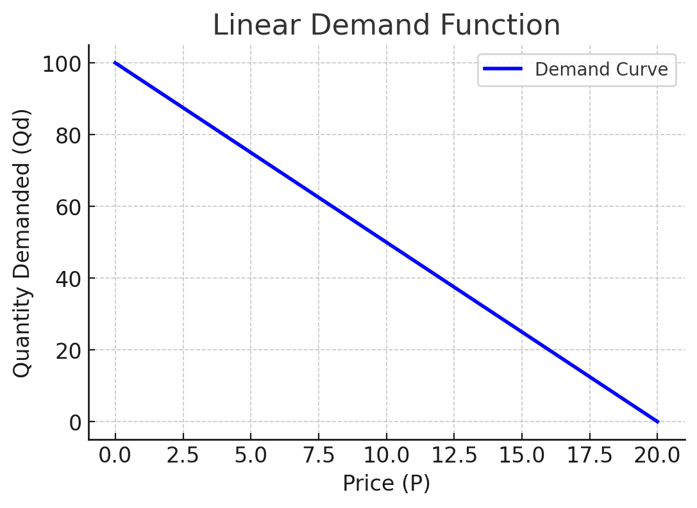
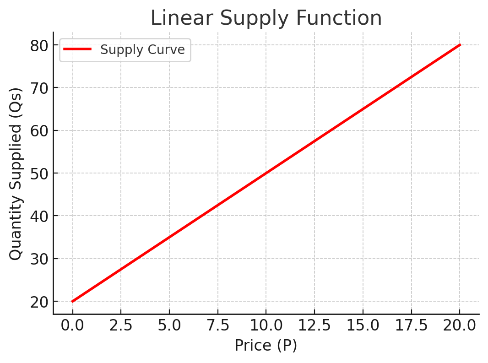
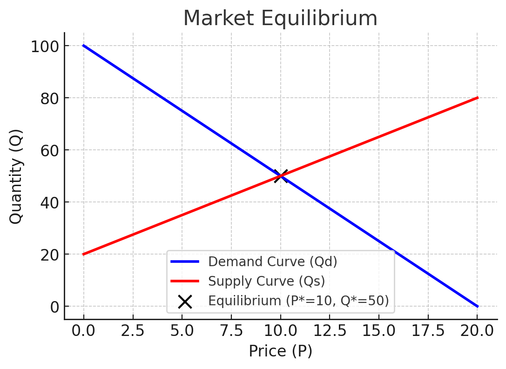
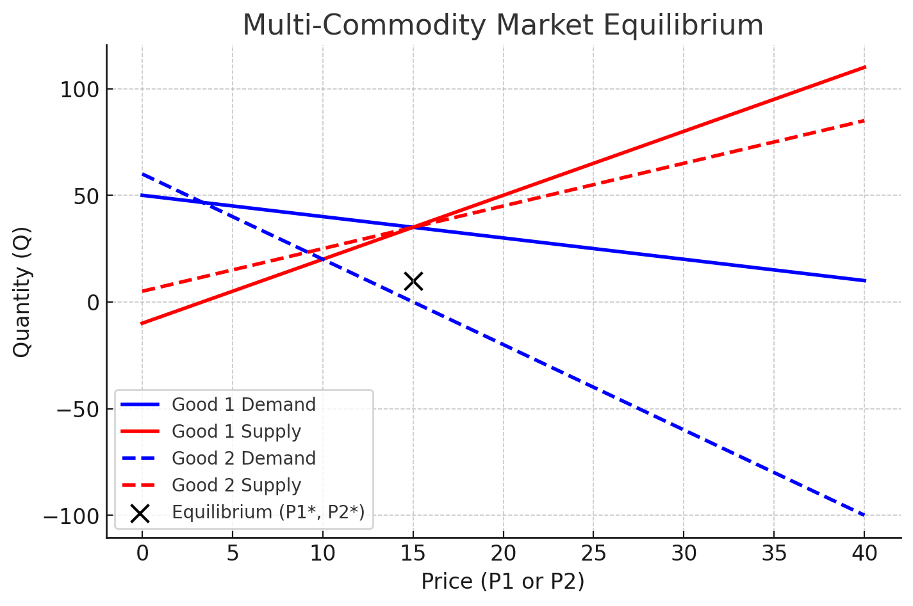
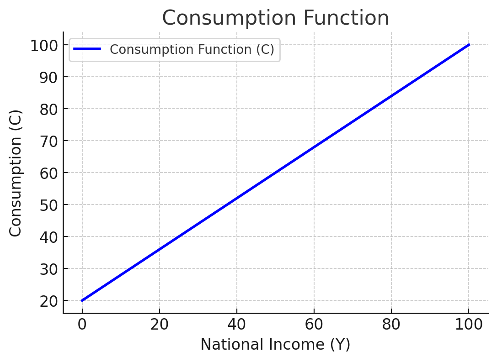
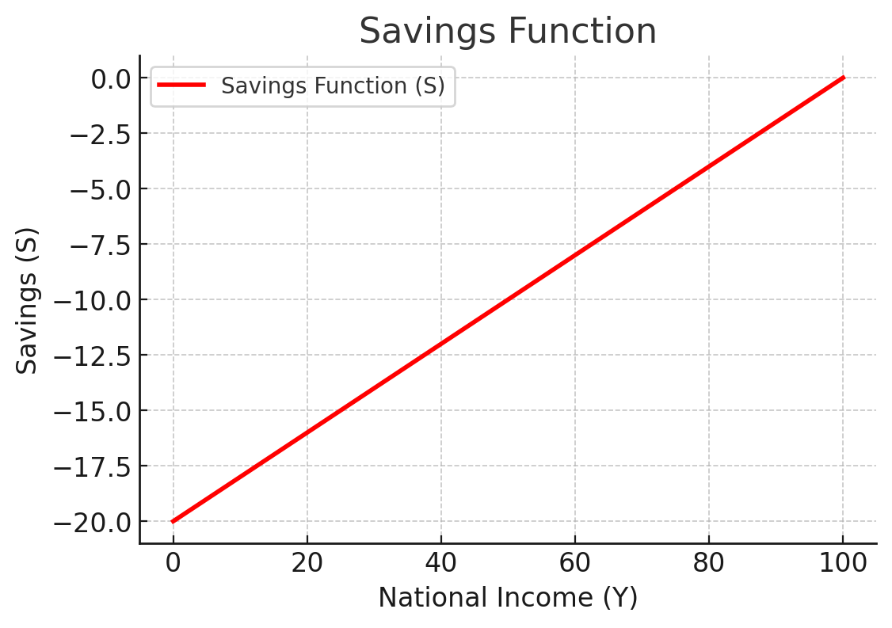

<style>
@media print{
  body, html, .remark-slides-area, .remark-notes-area {
    height: 100% !important;
    width: 100% !important;
    overflow: visible;
    display: inline-block;
    }
</style>

<style type="text/css">
.remark-slide-content {
    font-size: 34px;
    padding: 1em 4em 1em 4em;
}
</style>

<style type="text/css">
.my-one-page-font {
  font-size: 28px;
}
</style>

</style>

<style type="text/css">
.my-one-page-font-table {
  font-size: 24px;
}
</style>


```{r setup, include = FALSE}
library(tidyverse)
library(knitr)

opts_chunk$set(fig.width = 10, 
               message = FALSE, 
               warning = FALSE,
               echo = FALSE)
```

```{r xaringan-themer, include=FALSE, warning=FALSE}
#install.packages("xaringanthemer")
library(xaringanthemer)
style_mono_accent(
  base_color = "#1c5253",
  header_font_google = google_font("Josefin Sans"),
  text_font_google   = google_font("Montserrat", "500", "550i"),
  code_font_google   = google_font("Fira Mono"),
  colors = c(
  red = "#f34213",
  purple = "#3e2f5b",
  orange = "#ff8811",
  green = "#136f63",
  white = "#FFFFFF"
)
)
```

# Why Are These Concepts Essential in Economics?

1. **Supply and Demand Analysis** → Understanding **market equilibrium**.  

2. **Transposition of Formulae** → Rearranging equations to **solve for key economic variables**.  

3. **National Income Determination** → Finding **equilibrium GDP** in macroeconomic models.


---

# **Learning Objectives**

At the end of this section, you should be able to:

1. **Use function notation**, $y = f(x)$.  

2. **Identify** endogenous and exogenous variables.  

3. **Sketch and interpret** a **linear demand function**.  

4. **Sketch and interpret** a **linear supply function**.  

5. **Determine** equilibrium price and quantity **graphically** and **algebraically**.  

6. **Solve simultaneous equations** for multi-commodity equilibrium.

7. **Transpose formulae** to solve for unknown variables in economic models.

8. **National Income Determination**: Understand the concept of national income and its determinants.

---

class: inverse, center, middle

# 1. Supply and Demand Analysis

---

# **Function Notation in Economics**

Economic models often use **function notation**:

$$
y = f(x)
$$

where:
- \( x \) is the **independent variable** (e.g., price, income).
- \( y \) is the **dependent variable** (e.g., quantity demanded, total revenue).

Note: **Functions** describe **relationships** between variables.

**Example: Demand Function**  
If demand depends on price:

$$
Q_d = f(P) = 100 - 5P
$$

where:
- $Q_d$ is **quantity demanded**.
- $P$ is **price**.
- The function shows that as **price increases, demand decreases**.

---

# **Endogenous vs. Exogenous Variables**

- **Endogenous Variables** → **Determined within the model** (e.g., equilibrium price and quantity).
- **Exogenous Variables** → **Determined outside the model** (e.g., government policies, income levels).

Example:
$$
Q_d = 100 - 5P
$$
$$
Q_s = 20 + 3P
$$

Here:
- **\( P \)** (price) and **\( Q \)** (quantity) are **endogenous**.
- **Shocks like taxes or subsidies** are **exogenous**.

---

# **Demand and Supply Functions**

## **Linear Demand Function**
A linear demand function follows:

$$
Q_d = a - bP
$$

where:
- \( a \) is the **intercept** (max demand at price = 0).
- \( b \) is the **slope** (rate at which demand falls when price rises).

???
```{r demand_plot, echo=FALSE, fig.width=6, fig.height=4, message=FALSE, warning=FALSE}
library(ggplot2)

# Define demand function
P <- seq(0, 20, by=0.5)
Qd <- 100 - 5*P
data_demand <- data.frame(P, Qd)

# Plot
ggplot(data_demand, aes(x=P, y=Qd)) +
  geom_line(color="blue", size=1.2) +
  labs(title="Linear Demand Function", x="Price (P)", y="Quantity Demanded (Qd)") +
  theme_minimal()
```

---

# **Demand and Supply Functions** (cont)

## Demand Graph

<div>
.center[]

<div style="font-size: 12px; text-align: center; margin-top: 20px;">
</div>

---

# **Demand and Supply Functions** (cont)
## **Supply Function**

A **linear supply function** follows:

$$
Q_s = c + dP
$$

where:
- \( c \) is the **intercept** (minimum quantity supplied at zero price).
- \( d \) is the **slope** (rate at which supply increases as price rises).

### **Example Supply Function**
$$
Q_s = 20 + 3P
$$

---

# **Demand and Supply Functions** (cont)

## Supply Graph

<div>
.center[]

<div style="font-size: 12px; text-align: center; margin-top: 20px;">
</div>


???
# **📊 Plotting the Linear Supply Function**

```{r supply_plot, echo=FALSE, fig.width=6, fig.height=4, message=FALSE, warning=FALSE}
library(ggplot2)

# Define supply function
P <- seq(0, 20, by=0.5)
Qs <- 20 + 3*P
data_supply <- data.frame(P, Qs)

# Plot
ggplot(data_supply, aes(x=P, y=Qs)) +
  geom_line(color="red", size=1.2) +
  labs(title="Linear Supply Function", x="Price (P)", y="Quantity Supplied (Qs)") +
  theme_minimal()
```

---


# **Market Equilibrium Concept**

Market equilibrium occurs where **quantity demanded** equals **quantity supplied**:

$$
Q_d = Q_s
$$

Using the demand function:

$$
Q_d = 100 - 5P
$$

And the supply function:

$$
Q_s = 20 + 3P
$$

Setting them equal:

$$
100 - 5P = 20 + 3P
$$

---

# **Solving for Equilibrium Price and Quantity**

Solving for $P^*$:

$$
100 - 5P = 20 + 3P
$$

$$
80 = 8P
$$

$$
P^* = 10
$$

Substituting $P^*$ into the demand equation:

$$
Q^* = 100 - 5(10) = 50
$$

**Equilibrium Price:** $P^*$ = 10;  
**Equilibrium Quantity:** $Q^*$ = 50 

---

# **Market Equilibrium Plot**

<div>
.center[]

<div style="font-size: 12px; text-align: center; margin-top: 20px;">
</div>

???

```{r equilibrium_plot, echo=FALSE, fig.width=6, fig.height=4, message=FALSE, warning=FALSE}
library(ggplot2)

# Define price range
P <- seq(0, 20, by=0.5)

# Define demand and supply functions
Qd <- 100 - 5*P
Qs <- 20 + 3*P
data_demand <- data.frame(P, Qd)
data_supply <- data.frame(P, Qs)

# Define equilibrium point
equilibrium <- data.frame(P=c(10), Q=c(50))

# Create the plot
ggplot() +
  geom_line(data=data_demand, aes(x=P, y=Qd), color="blue", size=1.2, linetype="solid", label="Demand Curve") +
  geom_line(data=data_supply, aes(x=P, y=Qs), color="red", size=1.2, linetype="solid", label="Supply Curve") +
  geom_point(data=equilibrium, aes(x=P, y=Q), color="black", size=4) +
  labs(title="Market Equilibrium", x="Price (P)", y="Quantity (Q)") +
  theme_minimal()
```


---

# **Your Turn: Practice Problem**

Given the **demand and supply functions** for one good:

**Demand Function:**
$$
Q_d = 50 - 2P
$$

**Supply Function:**
$$
Q_s = -10 + 3P
$$

1. **Find the equilibrium price** $P^*$ and **quantity** $Q^*$.
2. **Plot the demand and supply functions**.
3. **Show the equilibrium point**.

---

# **Your Turn: Practice Problem** (cont)

Given the **demand and supply functions** for one good:

**Demand Function:**
$$
Q_d = 40 - 7P
$$

**Supply Function:**
$$
Q_s = -30 + 4P
$$

1. **Find the equilibrium price** $P^*$ and **quantity** $Q^*$.
2. **Plot the demand and supply functions**.
3. **Show the equilibrium point**.


---

# **Multi-Commodity Market Equilibrium**

In **multi-commodity markets**, equilibrium is determined by **simultaneously solving multiple demand and supply equations**.

- **Each good has its own demand and supply function**.  

- **Equilibrium occurs when** demand equals supply **for all goods**.  

-  **Requires solving a system of linear equations**.

---

# **Two-Commodity Market Equilibrium**

Consider an economy with **two goods** where:

**Demand Functions:**
$$
\begin{aligned}
Q_{d1} &= 50 - 2P_1 + P_2 \\
Q_{d2} &= 60 - P_1 - 3P_2
\end{aligned}
$$

**Supply Functions:**
$$
\begin{aligned}
Q_{s1} &= -10 + 3P_1 \\
Q_{s2} &= 5 + 2P_2
\end{aligned}
$$

**Find the equilibrium prices** $P_1^*$ and $P_2^*$.

---

# **Step 1: Rearrange into Standard Form**

At **equilibrium**, demand = supply:

$$
\begin{aligned}
-5P_1 + P_2 &= -60 \quad (1) \\
-P_1 - 5P_2 &= -55 \quad (2)
\end{aligned}
$$

**Rearranged equations are now in standard form**.

---

# **Step 2: Solve for $P_2^*$**

Multiply **Equation (2)** by **5**:

$$
\begin{aligned}
-5P_1 + P_2 &= -60 \\
-5P_1 - 25P_2 &= -275
\end{aligned}
$$

Now subtract:

$$
(-5P_1 - 25P_2) - (-5P_1 + P_2) = -275 + 60
$$

$$
-26P_2 = -215
$$

$$
P_2^* = \frac{-215}{-26} = 8.27
$$

**Equilibrium price for Good 2**: $P_2^* = 8.27$.

---

# **Step 3: Solve for $P_1^*$**

Substituting $P_2 = 8.27$ into **Equation (1)**:

$$
-5P_1 + 8.27 = -60
$$

$$
-5P_1 = -60 - 8.27
$$

$$
P_1^* = \frac{-68.27}{-5} = 13.65
$$

**Equilibrium price for Good 1**: $P_1^* = 13.65$.

---

# **Final Answer**

\[
\boxed{ P_1^* = 13.65, \quad P_2^* = 8.27 }
\]

**These are the equilibrium prices where demand equals supply**.

---

# **Graphical Solution**

<div>
.center[]

<div style="font-size: 12px; text-align: center; margin-top: 20px;">
</div>

---

# **Your Turn: Practice Problem**

Solve for equilibrium prices $P_1^*$ and $P_2^*$ in the following two cases.

---

# **Example 1: Two-Commodity Market**
Consider an economy with **two goods** where:

**Demand Functions:**
$$
\begin{aligned}
Q_{d1} &= 80 - 4P_1 + 2P_2 \\
Q_{d2} &= 100 - 3P_1 - P_2
\end{aligned}
$$

**Supply Functions:**
$$
\begin{aligned}
Q_{s1} &= 20 + 5P_1 \\
Q_{s2} &= 10 + 4P_2
\end{aligned}
$$

**Find the equilibrium prices** $P_1^*$ and $P_2^*$ by solving:

$$
\begin{aligned}
80 - 4P_1 + 2P_2 &= 20 + 5P_1 \\
100 - 3P_1 - P_2 &= 10 + 4P_2
\end{aligned}
$$

---

# **Example 2: Alternative Market System**
A different economy has the following market equations:

**Demand Functions:**
$$
\begin{aligned}
Q_{d1} &= 60 - 3P_1 + P_2 \\
Q_{d2} &= 90 - 2P_1 - 2P_2
\end{aligned}
$$

**Supply Functions:**
$$
\begin{aligned}
Q_{s1} &= -5 + 4P_1 \\
Q_{s2} &= 15 + 3P_2
\end{aligned}
$$

**Find the equilibrium prices** $P_1^*$ and $P_2^*$ by solving:

$$
\begin{aligned}
60 - 3P_1 + P_2 &= -5 + 4P_1 \\
90 - 2P_1 - 2P_2 &= 15 + 3P_2
\end{aligned}
$$

---

# **Instructions**
- **Rearrange equations** into standard form \( Ax + By = C \).

- **Use elimination or substitution** to solve.

- **Interpret the results**: What do the equilibrium prices mean for the market?

---

class: inverse, center, middle

# 2. Transposition of Formulae

---

# **What is Transposition of Formulae?**

1. **Rearranging an equation to express one variable in terms of others**.  

2. **Useful in economics, finance, and business analysis**.  

3. **Allows solving for unknown variables in different contexts**.  

Example:
$$
A = B + C
$$
To express \( C \) in terms of \( A \) and \( B \):

$$
C = A - B
$$

---

# **Example 1: Solving for Price in Demand Function**

Consider a **linear demand function**:

$$
Q_d = a - bP
$$

We want to solve for \( P \):

$$
P = \frac{a - Q_d}{b}
$$

If $Q_d = 100 - 5P$, solve for \( P \):

$$
P = \frac{100 - Q_d}{5}
$$

Now we can **calculate the price for any given quantity**.

---

# **Example 2: Solving for Time in Interest Formula**

The compound interest formula is:

$$
A = P(1 + r)^t
$$

Solve for \( t \):

1. Divide both sides by \( P \):

$$
\frac{A}{P} = (1 + r)^t
$$

2. Take the natural logarithm:

$$
\ln \left(\frac{A}{P} \right) = t \ln (1 + r)
$$

3. Solve for \( t \):

$$
t = \frac{\ln(A/P)}{\ln(1 + r)}
$$

**Now, we can compute the time required to reach a future value given a rate.**


---

class: inverse, center, middle

# 3. National Income Determination

---

# **What is National Income?**

- **Total value of goods and services produced** in a country over a period.

- **Measures economic activity** and **standard of living**.

- **Components of National Income**:
  - **Consumption (C)**: Spending by households.
  - **Investment (I)**: Spending by firms.
  - **Government Spending (G)**: Public expenditure.
  - **Net Exports (NX)**: Exports minus imports.

- **National Income Formula**:
$$
Y = C + I + G + NX
$$


---

# **The Consumption Function**
The **linear consumption function**:

$$
C = C_0 + cY
$$

where:
- \( C \) = Total consumption
- \(C_0) = Autonomous consumption (spending even if income is zero)
- \( c \) = Marginal propensity to consume (MPC) (i.e., how much of each extra unit of income is consumed)
- \( Y \) = National income

**Interpretation:**  
- If **income increases**, **consumption increases**.  
- The slope \( c \) tells us **how much of each extra unit of income is consumed**.

---

# **Plotting the Consumption Function**

<div>
.center[]

<div style="font-size: 12px; text-align: center; margin-top: 20px;">
</div>


---

# **The Savings Function**

In macroeconomics, **savings** is the portion of income that is **not spent on consumption**.

The **linear savings function** is:

$$
S = S_0 + sY
$$

where:
- \( S \) = **Total savings**
- \(S_0) = **Autonomous savings** (can be negative if dissaving occurs)
- \( s \) = **Marginal propensity to save (MPS)** (i.e., how much of each extra unit of income is saved)
- \( Y \) = **National income**

Since **income is either spent or saved**, we know:

$$
MPC + MPS = 1
$$

**Interpretation:**  
- If **MPC = 0.8**, then **MPS = 0.2**.
- **Higher income leads to higher savings**.

---

# **Plotting the Savings Function**

<div>
.center[]

<div style="font-size: 12px; text-align: center; margin-top: 20px;">
</div>

---


# **The Income-Expenditure Model**

The **Income-Expenditure Model** determines **equilibrium national income**.

In a **simple Keynesian model**, total spending is:

$$
Y = C + I + G + (X - M)
$$

where:
- \( C \) = **Consumption**
- \( I \) = **Investment**
- \( G \) = **Government spending**
- \( X - M \) = **Net exports** (ignored for a closed economy)

At **equilibrium**, income equals total spending:

$$
Y = C_0 + cY + I + G
$$

Solving for **equilibrium income**:

$$
Y^* = \frac{C_0 + I + G}{1 - c}
$$

**Higher MPC leads to a higher equilibrium national income**.

---

# **Problem Statement**
Given:

$$
G = 40, \quad I = 55, \quad C = 0.8Y_d + 25, \quad T = 0.1Y + 10
$$

Find the **equilibrium level of national income** $Y^*$.

---

# **Step 1: Define Disposable Income**
Disposable income $Y_d$ is the **income left after taxation**:

$$
Y_d = Y - T
$$

Using the tax function:

$$
T = 0.1Y + 10
$$

$$
Y_d = Y - (0.1Y + 10) = 0.9Y - 10
$$

**Disposable income depends on total income $Y$**.

---

# **Step 2: Write the Consumption Function**
Consumption function is given by:

$$
C = 0.8 Y_d + 25
$$

Substituting $Y_d = 0.9Y - 10$:

$$
C = 0.8(0.9Y - 10) + 25
$$

$$
C = 0.72Y - 8 + 25
$$

$$
C = 0.72Y + 17
$$

**Consumption increases with national income \( Y \)**.

---

# **Step 3: Write the Equilibrium Condition**
In equilibrium:

$$
Y = C + I + G
$$

Substituting known values:

$$
Y = (0.72Y + 17) + 55 + 40
$$

$$
Y = 0.72Y + 112
$$

**Now solve for \( Y \)**.

---

# **Step 4: Solve for Equilibrium Income**
Rearrange the equation:

$$
Y - 0.72Y = 112
$$

$$
0.28Y = 112
$$

$$
Y^* = \frac{112}{0.28} = 400
$$

**Equilibrium national income is $Y^* = 400$**.

---

# **Your Turn: Practice Problem**

Given the following information:

$$
G = 50, \quad I = 60, \quad C = 0.7Y_d + 30, \quad T = 0.15Y + 10
$$

Find the **equilibrium level of national income** $Y^*$.

---

# **Summary**

1. **Supply and Demand Analysis** helps us understand market equilibrium.

2. **Transposition of Formulae** allows us to solve for unknown variables in economic models.

3. **National Income Determination** helps us find equilibrium GDP in macroeconomic models.

**Math is powerful—and fun!**

---

# Next Steps

1. Practice **problems from the textbook** (Jacques 10ed, Sections 1.5-1.7). 

2. Bring any questions to our **next class discussion!**  

3. Work on your Home Assignment #1 (due next Friday, 13:30pm).
  - Chapter 1.1: Exercise 1.1, Problems 12, 14-16, 19 (p. 21-22)
  - Chapter 1.2: Exercise 1.2, Problems 9, 11, 14 (p. 39)
  - Chapter 1.3: Exercise 1.3, Problems 10 and (p. 53-54)
  - Chapter 1.4: Exercise 1.4, Problem 4 (p. 65)
  - Chapter 1.5: Exercise 1.5, Problems 3, 5, 8  (p. 81)
  - Chapter 1.6: Exercise 1.6, Problem 5 (p. 92)
  - Chapter 1.7: Exercise 1.7, Problem 6 and 7 (p. 106)

---

class: inverse, center, middle

# Any QUESTIONS?

## Thank you for your attention!

---

# Next Class

- (Mar 19) Quadratic Functions (2.1), Revenue, Cost, and Profit (2.2)  


???
1. To print pdf slides
https://stackoverflow.com/questions/54968311/xaringan-export-slides-to-pdf-while-preserving-formatting

pagedown::chrome_print("W1_ME.html") # but not all pictures are visible

2. Option: https://stackoverflow.com/questions/54968311/xaringan-export-slides-to-pdf-while-preserving-formatting

install.packages("remotes")
remotes::install_github("jhelvy/xaringanBuilder")
remotes::install_github("jhelvy/renderthis@v0.0.9")

library(xaringanBuilder)
build_pdf("DVC.html")

3. Option
writeBin(as.raw(c()), "favicon.ico") # create an empty favicon.ico file
install.packages("renderthis")
remotes::install_github('rstudio/chromote')
library(renderthis)

renderthis::to_pdf("W2_2_ME.html")

getwd()
setwd("C:/Users/Iegor/OneDrive - kdis.ac.kr/Documents/GitHub/Sogang/2025/Spring/Mathematical Economics/Week 2_2")
