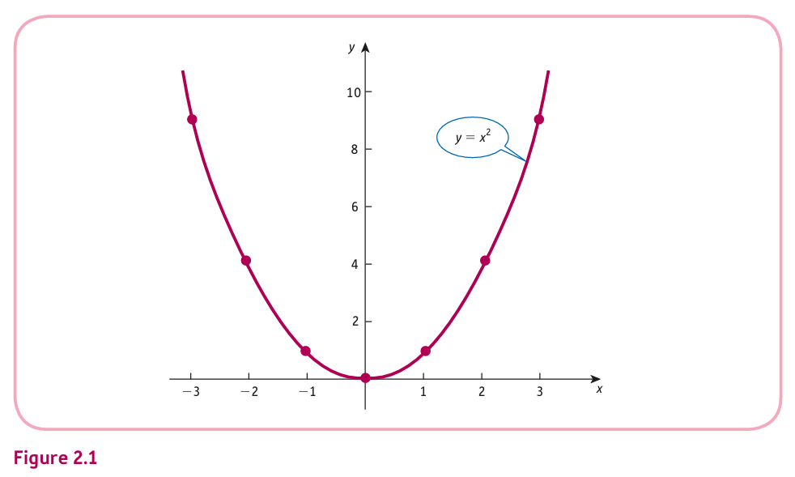
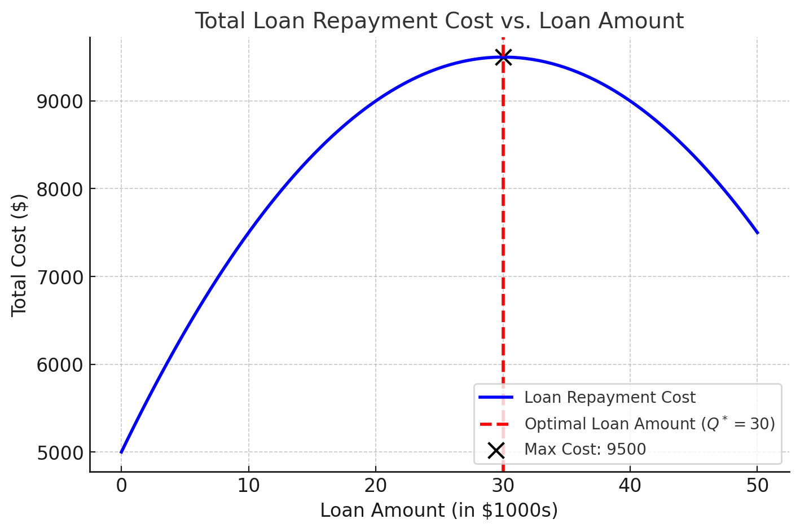
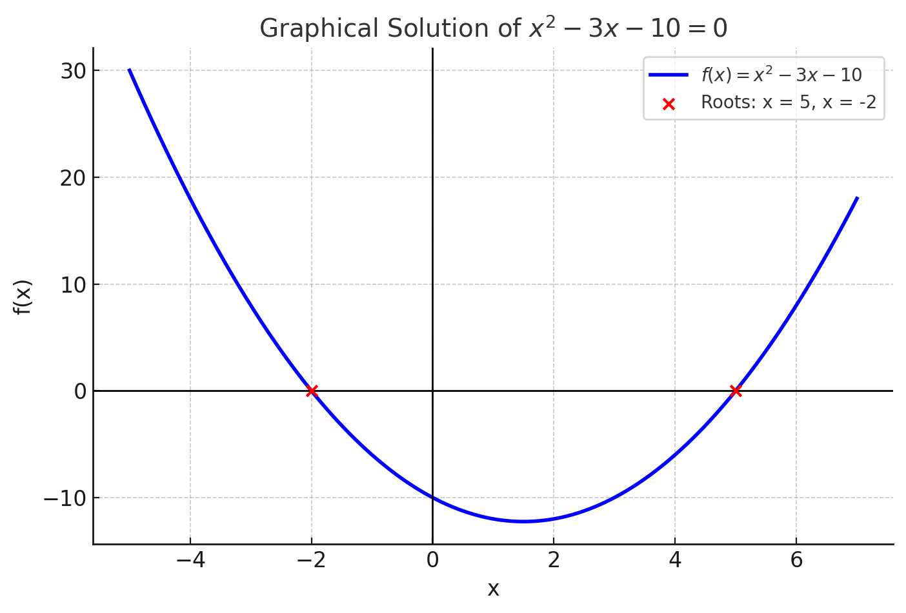
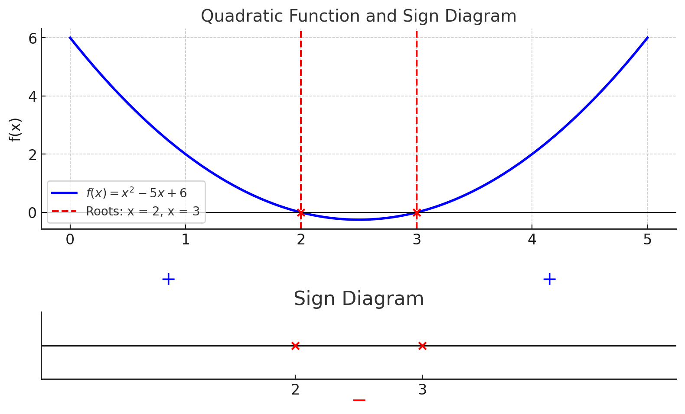
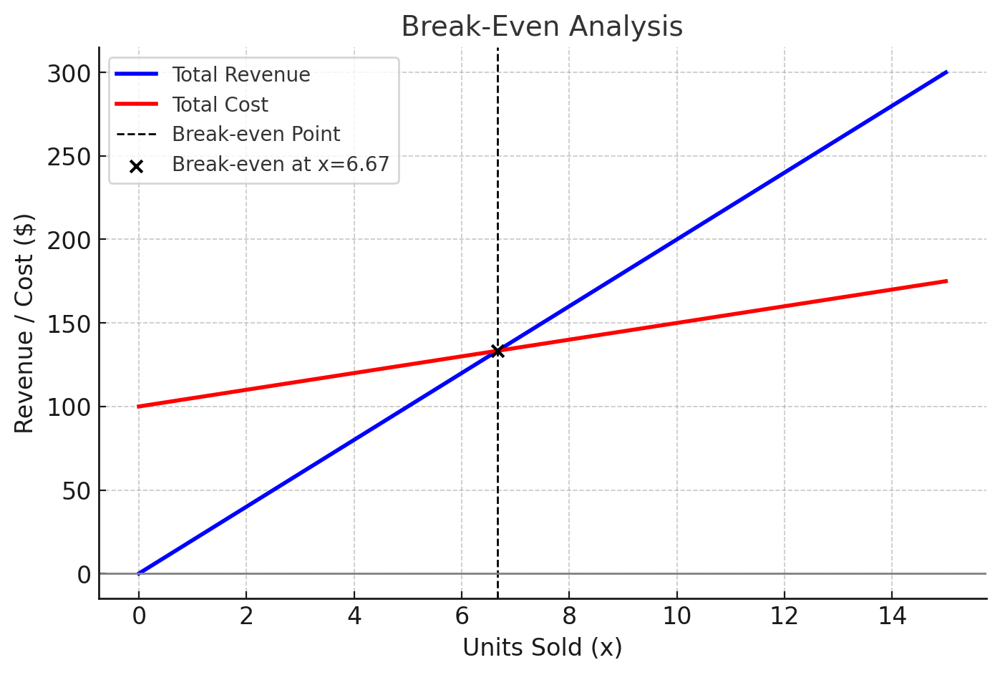

<style>
@media print{
  body, html, .remark-slides-area, .remark-notes-area {
    height: 100% !important;
    width: 100% !important;
    overflow: visible;
    display: inline-block;
    }
</style>

<style type="text/css">
.remark-slide-content {
    font-size: 34px;
    padding: 1em 4em 1em 4em;
}
</style>

<style type="text/css">
.my-one-page-font {
  font-size: 28px;
}
</style>

</style>

<style type="text/css">
.my-one-page-font-table {
  font-size: 24px;
}
</style>


```{r setup, include = FALSE}
library(tidyverse)
library(knitr)

opts_chunk$set(fig.width = 10, 
               message = FALSE, 
               warning = FALSE,
               echo = FALSE)
```

```{r xaringan-themer, include=FALSE, warning=FALSE}
#install.packages("xaringanthemer")
library(xaringanthemer)
style_mono_accent(
  base_color = "#1c5253",
  header_font_google = google_font("Josefin Sans"),
  text_font_google   = google_font("Montserrat", "500", "550i"),
  code_font_google   = google_font("Fira Mono"),
  colors = c(
  red = "#f34213",
  purple = "#3e2f5b",
  orange = "#ff8811",
  green = "#136f63",
  white = "#FFFFFF"
)
)
```

# **What is a U-turn?**

- **U-turn** is a maneuver used to reverse the direction of travel.

- **Quadratic functions** are like U

<div>
.center[]

</div>


---

# **Why Study Quadratic Functions?**

- **Appear in business & economics**: Cost, revenue, profit functions.  
- **Essential for decision-making**: Finding maximum revenue, profit, and break-even points.  
- **Graphical analysis**: Helps visualize relationships in markets.  

*At the end of this class, you will be able to:*
- Solve quadratic equations using **factorization & quadratic formula**.
- Sketch **quadratic function graphs** using tables and key points.
- Solve **quadratic inequalities** with graphs & sign diagrams.
- Analyze **total revenue, cost, and profit** functions.
- Find **optimal output & break-even levels**.

---

class: inverse, center, middle

# Section 2.1: Quadratic Functions


---

# **Section 2.1: Quadratic Functions**
## **What is a Quadratic Function?**
A **quadratic function** has the form:

$$
f(x) = ax^2 + bx + c
$$

where:
- $a, b, c$ are constants.
- $a \neq 0$ (ensures it is a quadratic function).
- The graph is a **parabola** (U-shaped or inverted U).

---

# **Graph of Quadratic Functions**

- **Vertex**: The turning point of the parabola.
- **Axis of symmetry**: The line that divides the parabola into two equal halves.
- **Intercepts**: Points where the parabola crosses the x- and y-axes.

<div>
.center[]

</div>

---

# **Examples of Quadratic Functions in Economics**

1. **Cost Function**: $C(x) = 0.1x^2 + 10x + 100$.

2. **Revenue Function**: $R(x) = -0.2x^2 + 50x$.

3. **Profit Function**: $P(x) = -0.2x^2 + 50x - 100$.

---

# **Real-World Example: Loan Repayment Optimization**

Imagine you **borrow money from a bank**. The **total repayment cost** depends on how much you borrow.  
Banks often use **quadratic equations** to estimate **total repayment costs**.

**Loan Cost Function:**
$$
C = 5000 + 300Q - 5Q^2
$$

where:
- $C$ = **Total cost of repayment** (in dollars)
- $Q$ = **Loan amount borrowed** (in thousands of dollars)
- $5000$ = Fixed bank fee
- $300Q$ = Interest cost per loan size
- $-5Q^2$ = Discount on large loans

**Goal:** Find the loan amount that minimizes total repayment cost.

---

# **Step 1: Understanding the Function**
The equation:

$$
C = 5000 + 300Q - 5Q^2
$$

is a **quadratic function** because of the $Q^2$ term.  

Since the **coefficient of $Q^2$ is negative** (-5), the graph is an **upside-down parabola** (meaning the function decreases after reaching a maximum point, indicating that there is an optimal loan amount where costs are minimized).

**Why does this make sense?**  
- At **small loan amounts** (Q), total cost is high due to **fixed fees**.
- At **large loan amounts**, costs decrease because banks offer **discounts on large loans**.

**Somewhere in between, the cost is minimized**.

---

# **Step 2: Finding the Optimal Loan Amount**
The **minimum cost** occurs at the **vertex** of the quadratic function.

Formula for the vertex of a quadratic equation $ax^2 + bx + c$ (the x-coordinate of the vertex):

$$
Q^* = \frac{-b}{2a}
$$

For our function:

$$
C = -5Q^2 + 300Q + 5000
$$

- \( a = -5 \)
- \( b = 300 \)

Using the vertex formula:

$$
Q^* = \frac{-300}{2(-5)} = 30
$$

**Optimal Loan Amount:** $Q^* = 30,000$ dollars.

---

# **Step 3: Interpreting the Result**
The **optimal loan amount** is $30,000.

- For loans less than **$30,000**: Repayment costs remain high due to fixed administrative fees.

- For loans greater than **$30,000**: Costs decrease as banks offer discounts on larger loans, reducing the overall repayment burden.

---

# **Step 4: Graphing the Function**

Let's **graph the loan cost function** to visualize the relationship between loan amount and total cost.

<div>
.center[]

</div>

---


# **Solving Quadratic Equations**
## **1. Factorization Method**
If a quadratic can be **factored**, we set each factor to zero.

**Example:**
$$
x^2 - 5x + 6 = 0
$$
Factorizing:

$$
(x - 2)(x - 3) = 0
$$

Setting each factor to zero:

$$
x - 2 = 0 \quad \Rightarrow \quad x = 2
$$

$$
x - 3 = 0 \quad \Rightarrow \quad x = 3
$$

**Solutions:** $x = 2, x = 3$.

---

# **Solving Quadratic Equations** (cont'd)

## Your Turn: Solve the Quadratic Equation

$$
x^2 - 7x + 10 = 0
$$
*Hint*: think about two numbers that multiply to 10 and add up to 7.

$$
2x^2 - 5x - 3 = 0
$$
*Hint*: think about $(x-3)$ as a factor.

$$
3x^2 + 2x - 8 = 0
$$
*Hint*: think about $(x+2)$ as a factor.


**Step 1:** Factorize the quadratic equation.

**Step 2:** Set each factor to zero.

**Step 3:** Find the solutions.

???

x(x−5)−2(x−5)=0

2x(x−3)+1(x−3)=0

3x(x+2)−4(x+2)=0


---
class: my-one-page-font

# **Solving Quadratic Equations** (cont'd)

## **2. Quadratic Formula**
For any equation $ax^2 + bx + c = 0$, the **quadratic formula** is:

$$
x = \frac{-b \pm \sqrt{b^2 - 4ac}}{2a}
$$

**Example:** Solve 
$$2x^2 - 3x - 2 = 0$$.

### **Step 1: Recall the Quadratic Formula**

where:
- \( a = 2 \) (coefficient of $x^2$)
- \( b = -3 \) (coefficient of $x$)
- \( c = -2 \) (constant term)

---
# **Solving Quadratic Equations** (cont'd)
## **2. Quadratic Formula** (cont'd)

### **Step 2: Compute the Discriminant**
The discriminant is:

$$
D = b^2 - 4ac
$$

Substituting the values:

$$
D = (-3)^2 - 4(2)(-2)
$$

$$
D = 9 + 16 = 25
$$

Since \( D = 25 \) is **positive**, we get **two real solutions**.

- When $D < 0$, there are **no real solutions**.

- When $D = 0$, there is **one real solution**.

---
class: my-one-page-font

# **Solving Quadratic Equations** (cont'd)

## **2. Quadratic Formula** (cont'd)

### **Step 3: Solve for \( x \)**

Substituting into the quadratic formula:

$$
x = \frac{-(-3) \pm \sqrt{25}}{2(2)}
$$

$$
x = \frac{3 \pm 5}{4}
$$

Splitting into two cases:

$$
x_1 = \frac{3 + 5}{4} = \frac{8}{4} = 2
$$

$$
x_2 = \frac{3 - 5}{4} = \frac{-2}{4} = -\frac{1}{2}
$$

**Final Answers:**  
$$
\boxed{x = 2, \quad x = -\frac{1}{2}}
$$

---

# **Your Turn: Solve Quadratic Equations**
## **Example Problems**

**1.** $x^2 + 3x - 10 = 0$.

**2.** $2x^2 - 3x - 2 = 0$.

**3.** $3x^2 + 2x - 8 = 0$.

**Step 1:** Recall the **quadratic formula**.

**Step 2:** Compute the **discriminant**.

**Step 3:** Solve for \( x \).

Remember to **check your answers**!

???

x=2, -5
x=2, -1/2
x= 4/3, -2

---
# **Solving Quadratic Equations** (cont'd)

# **3. Graphical Solution**

- **Graph the quadratic function**.
- **Find the x-intercepts** (where the function crosses the x-axis).
- **Solutions are the x-intercepts**.

**Example:** Solve $x^2 - 3x - 10 = 0$.

<div>
.center[]

</div>

---

# **Solving Quadratic Equations** (cont'd)
# **3. Graphical Solution** (cont'd)


We analyze the quadratic function:

$$
f(x) = x^2 - 5x + 6
$$

## **What is a Sign Diagram?**
A **sign diagram** helps us determine:
- **Where the function is positive or negative**  
- **The intervals where the function is increasing or decreasing**  
- **The critical points (x-intercepts)**  

---

## **Step 1: Solve for Roots**
Solving $x^2 - 5x + 6 = 0$ by factorization:

$$
(x - 2)(x - 3) = 0
$$

Thus, the **roots** (x-intercepts) are:

$$
x = 2, \quad x = 3
$$

Also, let's find vertex for better sketching:

$$
x = \frac{-(-5)}{2(1)} = \frac{5}{2} = 2.5
$$

$$
f(2.5) = (2.5)^2 - 5(2.5) + 6 = 6.25 - 12.5 + 6 = -0.25 \quad (\text{lowest point})
$$

The graph is symmetric around $x=2.5$.

---

## **Step 2: Constructing the Sign Diagram**
Since $f(x) = x^2 - 5x + 6$ is a quadratic equation with **a positive leading coefficient**, the parabola opens **upward**.

We divide the number line into three **intervals**:
- Left of $x = 2$: Choose $x = 1$, substitute into $f(x)$:

  $$
  f(1) = 1^2 - 5(1) + 6 = 1 - 5 + 6 = 2 \quad (\text{Positive})
  $$

- Between $x = 2$ and $x = 3$: Choose $x = 2.5$, substitute:

  $$
  f(2.5) = (2.5)^2 - 5(2.5) + 6 = 6.25 - 12.5 + 6 = -0.25 \quad (\text{Negative})
  $$

- Right of $x = 3$: Choose $x = 4$, substitute:

  $$
  f(4) = 4^2 - 5(4) + 6 = 16 - 20 + 6 = 2 \quad (\text{Positive})
  $$

---

## **Step 3: Interpretation**
- **For \( x < 2 \): \( f(x) > 0 \) → Function is positive** 📈 

- **For \( 2 < x < 3 \): \( f(x) < 0 \) → Function is negative** 📉  

- **For \( x > 3 \): \( f(x) > 0 \) → Function is positive** 📈  

- **At \( x = 2 \) and \( x = 3 \), \( f(x) = 0 \) → These are the roots (x-intercepts).**

---

## **Step 4: Graph & Sign Diagram**
<div>
.center[]
</div>

**Interpretation of the Sign Diagram:**
1. The function is **positive** for \( x < 2 \) and \( x > 3 \).
2. The function is **negative** between **\( 2 < x < 3 \)**.
3. The function **crosses the x-axis at \( x = 2 \) and \( x = 3 \)**.
4. The function **changes signs** at these points.

---

# **Your Turn: Graphical Solution** (cont'd)

## **Example Problem**
**Quadratic Equation:** $x^2 + 3x - 10 = 0$.
**Graph the quadratic function with sign diagram** and **find the solutions**.

**Step 1:** **Graph the function**.
**Step 2:** **Find the x-intercepts**.
**Step 3:** **Solutions are the x-intercepts**.

**Hint:** Use the **quadratic formula** to verify your answers.

---

class: inverse, center, middle

# Section 2.2: Revenue, Cost, and Profit Functions

---

# **Section 2.2: Revenue, Cost, and Profit Functions**
## **What are Revenue, Cost, and Profit Functions?**
- **Revenue Function**: $R(x) = p(x) \cdot x$.
- **Cost Function**: $C(x) = f(x) \cdot x + k$.
- **Profit Function**: $P(x) = R(x) - C(x)$.

where:
- $x$ = **Quantity of output**.
- $p(x)$ = **Price per unit**.
- $f(x)$ = **Fixed cost per unit**.
- $k$ = **Fixed cost**.

---

# **Total Revenue Function**
The **total revenue** is the **product of price and quantity**:

$$
R(x) = p(x) \cdot x
$$

**Example:** If the price is $10 and you sell 100 units, the total revenue is $1000.

---

# **Total Cost Function**

The **total cost** is the **sum of fixed and variable costs**:

$$
C(x) = f(x) \cdot x + k
$$

**Example:** If the fixed cost is $1000, variable cost is $5 per unit, and you produce 100 units, the total cost is $1500.

---

# **Total Profit Function**
The **total profit** is the **difference between total revenue and total cost**:

$$
P(x) = R(x) - C(x)
$$

**Example:** If total revenue is $1000 and total cost is $1500, the total profit is $500.

---

# **Break-Even Analysis**

**Break-even point** is where **total revenue equals total cost**:

$$
R(x) = C(x)
$$

**Example:** If total revenue is $1000 and total cost is $1000, the break-even point is 100 units.

## **Understanding Break-Even Analysis**
- At this point, **profit is zero**.  
- Businesses use break-even analysis to determine the minimum sales required to **cover costs**.

---

# **Step 1: Defining the Functions**
Given the **total revenue** and **total cost functions**, we define:

$$
\begin{aligned}
R(x) &= 20x \quad \text{(Total Revenue)} \\
C(x) &= 5x + 100 \quad \text{(Total Cost)} \\
P(x) &= R(x) - C(x) \quad \text{(Profit)}
\end{aligned}
$$

where:
- \( x \) = **Number of units sold**.
- \( R(x) \) = **Revenue from selling \( x \) units at $20 per unit**.
- \( C(x) \) = **Fixed cost of $100 plus $5 per unit produced**.
- \( P(x) \) = **Profit function (Revenue - Cost)**.

---

# **Step 2: Finding the Break-Even Point**
Break-even occurs when:

$$
R(x) = C(x)
$$

$$
20x = 5x + 100
$$

Solving for \( x \):

$$
20x - 5x = 100
$$

$$
15x = 100
$$

$$
x = \frac{100}{15} = 6.67
$$

**Break-even point is at \( x = 6.67 \) units**.

---

# **Step 3: Computing the Profit**
$$
P(x) = R(x) - C(x)
$$

Substituting \( x = 6.67 \):

$$
P(6.67) = 20(6.67) - (5(6.67) + 100)
$$

$$
= 133.33 - (33.33 + 100)
$$

$$
= 133.33 - 133.33 = 0
$$

**Profit is zero at break-even point, as expected!**

---

# **Step 4: Graphing the Functions**

Let's **graph the revenue, cost, and profit functions** to visualize the relationships.

<div>
.center[]
</div>


---

# **Your Turn: Break-Even Analysis**
## **Example Problem**

**Total Revenue Function:** $R(x) = 10x$.
**Total Cost Function:** $C(x) = 5x + 50$.
**Profit Function:** $P(x) = R(x) - C(x)$.

**Step 1:** Find the **break-even point**.

**Step 2:** Calculate the **profit** at the break-even point.

**Step 3:** Graph the **revenue, cost, and profit functions**.


---
# **Summary**

1. **Quadratic functions** are essential in economics for analyzing cost, revenue, and profit functions.

2. **Solving quadratic equations** helps find optimal solutions in business and economics.

3. **Revenue, cost, and profit functions** are crucial for decision-making and break-even analysis.

4. **Graphical analysis** helps visualize relationships between variables.

**Math is powerful—and fun!**

---

class: inverse, center, middle

# Any QUESTIONS?

## Thank you for your attention!

---

# Next Class

- (Mar 21) Indices and Logarithms (2.3), Exponential and Natural Log Functions (2.4)   


???
1. To print pdf slides
https://stackoverflow.com/questions/54968311/xaringan-export-slides-to-pdf-while-preserving-formatting

pagedown::chrome_print("W1_ME.html") # but not all pictures are visible

2. Option: https://stackoverflow.com/questions/54968311/xaringan-export-slides-to-pdf-while-preserving-formatting

install.packages("remotes")
remotes::install_github("jhelvy/xaringanBuilder")
remotes::install_github("jhelvy/renderthis@v0.0.9")

library(xaringanBuilder)
build_pdf("DVC.html")

3. Option
writeBin(as.raw(c()), "favicon.ico") # create an empty favicon.ico file
install.packages("renderthis")
remotes::install_github('rstudio/chromote')
library(renderthis)

renderthis::to_pdf("W3_1_ME.html")

getwd()
setwd("C:/Users/Iegor/OneDrive - kdis.ac.kr/Documents/GitHub/Sogang/2025/Spring/Mathematical Economics/Week 3_1")
