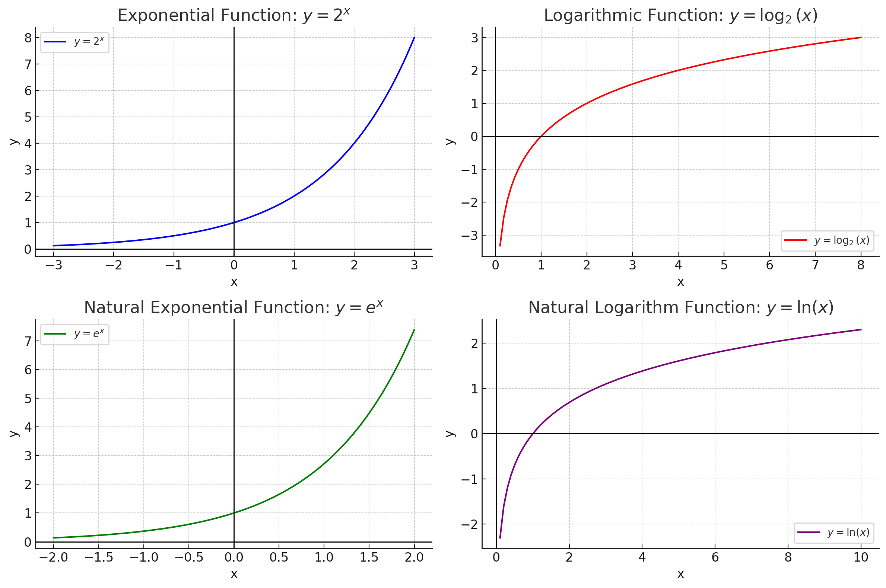

<style>
@media print{
  body, html, .remark-slides-area, .remark-notes-area {
    height: 100% !important;
    width: 100% !important;
    overflow: visible;
    display: inline-block;
    }
</style>

<style type="text/css">
.remark-slide-content {
    font-size: 34px;
    padding: 1em 4em 1em 4em;
}
</style>

<style type="text/css">
.my-one-page-font {
  font-size: 28px;
}
</style>

</style>

<style type="text/css">
.my-one-page-font-table {
  font-size: 24px;
}
</style>


```{r setup, include = FALSE}
library(tidyverse)
library(knitr)

opts_chunk$set(fig.width = 10, 
               message = FALSE, 
               warning = FALSE,
               echo = FALSE)
```

```{r xaringan-themer, include=FALSE, warning=FALSE}
#install.packages("xaringanthemer")
library(xaringanthemer)
style_mono_accent(
  base_color = "#1c5253",
  header_font_google = google_font("Josefin Sans"),
  text_font_google   = google_font("Montserrat", "500", "550i"),
  code_font_google   = google_font("Fira Mono"),
  colors = c(
  red = "#f34213",
  purple = "#3e2f5b",
  orange = "#ff8811",
  green = "#136f63",
  white = "#FFFFFF"
)
)
```


## Introduction

- **Why do we study these?**
  - Indices and logarithms are fundamental for understanding **economic growth**, **inflation**, and **interest rates**.

  - Logarithmic scales simplify **financial data analysis**.

  - Exponential functions describe **compounding interest** and **population growth**.

  - Natural log functions are essential for **continuous growth models**.

---

class: inverse, center, middle

# Indices and Logarithms

---
# **Section 1: Indices and Exponents**

## **1.1 Understanding Indices**

*Indices* are used to represent **repeated multiplication**.

*Exponents* show the **number of times** a base is multiplied by itself.


- The general form of an **exponential expression**:

  $$ a^n $$

  where:
  - **a** is the base - the number being multiplied
  - **n** is the exponent or index - the number of times the base is multiplied by itself

**Examples:**

  - $2^3 = 2 	\times 2 	\times 2 = 8$
  - $10^{-2} = \frac{1}{10^2} = 0.01$

---
# **Section 1: Indices and Exponents** (cont'd)
### **1.2 Rules of Indices**

1. **Multiplication Rule**:
  $$ a^m \times a^n = a^{m+n} $$

2. **Division Rule**:
  $$ \frac{a^m}{a^n} = a^{m-n} $$

3. **Power Rule**:
  $$ (a^m)^n = a^{mn} $$

4. **Zero Power Rule**:
  $$ a^0 = 1 $$

5. **Fractional Exponents**:
  $$ a^{1/n} = \sqrt[n]{a} $$

---
# **Section 1: Indices and Exponents** (cont'd)
### **1.2 Rules of Indices** (cont'd)

##### **Examples: Laws of Indices**

**Example:** Simplify $2^3 \times 2^2$

$$
 2^3 \times 2^2 = 2^{3+2} = 2^5 = 32 
$$

**Example:** Evaluate $2^4 \div 2^2$

$$
 2^4 \div 2^2 = 2^{4-2} = 2^2 = 4 
$$

**Example:** Solve $3^x = 81$

$$
 3^x = 81 = 3^4 \Rightarrow x = 4 
$$


---

# **Your Turn: Practice Problems**

1. **Simplify:** $5^3 \times 5^{-1}$

2. **Evaluate:** $3^4 \div 3^2$

3. **Solve:** $2^x = 16$

4. **Find:** $\sqrt[3]{64}$

5. **Use Indices:** Solve $10^{2x} = 1000$


---

# **Section 2: Logarithms**

## **2.1 Definition of Logarithms**

*Logarithms* show the **exponent** to which a base must be raised to produce a given number.

The logarithm is the **inverse** of exponentiation:

$$ \log_a(x) = y \quad \text{if and only if} \quad a^y = x $$

**Examples:**

  - $\log_2 8 = 3$ because $2^3 = 8$
  - $\log_{10} 1000 = 3$ because $10^3 = 1000$

---
# **Section 2: Logarithms** (cont'd)

### **2.2 Logarithm Rules**

1. **Multiplication Rule**:
  $$ \log_b(xy) = \log_b x + \log_b y $$

2. **Division Rule**:
  $$ \log_b(\frac{x}{y}) = \log_b x - \log_b y $$

3. **Power Rule**:
  $$ \log_b(x^c) = c \log_b x $$

**Example:**

$$ 
\log_2(4 \times 8) = \log_2 4 + \log_2 8 = 2 + 3 = 5 
$$

---

# **Your Turn: Practice Problems**

1. **Simplify:** $\log_2 32$

2. **Evaluate:** $\log_3 81$

3. **Solve:** $\ln(x) = 2$

4. **Find:** The value of $\log_2 16$

5. **Use Logs:** Solve $e^{2x} = 10$

---

class: inverse, center, middle

# Exponential and Natural Logarithmic Functions

---

# **Section 3: Exponential and Natural Logarithmic Functions**

## **What Are Exponential and Natural Logarithmic Functions?**

- **Exponential Functions** describe **growth and decay** in economics, finance, and science.
  - Example: **Compound interest, inflation, population growth**.
  - General form:
    $$ y = a e^{bx} $$
    where:
    - \( e \) is Euler’s number (~2.718) - constant number, the base of the natural logarithm.
    - \( a \) is the initial value
    - \( b \) determines growth (+) or decay (-).

---

# **Section 3: Exponential and Natural Logarithmic Functions** (cont'd)

## **What Are Exponential and Natural Logarithmic Functions?** (cont'd)

- **Natural Logarithm Functions** help analyze **percent changes and elasticities**.
  - Used in **logarithmic transformations of economic data**.
  - Inverse of exponential function:
    $$ \ln(y) = x \quad 	ext{if} \quad e^x = y $$

**Why Important?**
- Used in financial modeling (continuous interest rates, risk analysis).
- Logarithmic scales simplify large economic datasets.

---

# **Section 4: Exponential Growth in Economics**

### **The Number e and Continuous Growth**

The mathematical constant **e** (Euler’s number, $e \approx 2.718$) is fundamental in continuous growth models:

$$ 
A = A_0 e^{rt} 
$$

where:
- $A$ is the final amount
- $A_0$ is the initial amount
- $r$ is the growth rate
- $t$ is time

**Example:** If $1000 is invested at a 5% continuous interest rate, find the amount after 3 years.

$$ 
A = 1000 \times e^{0.05 \times 3} \approx 1161.83 
$$

---

## **Section 5: Logarithmic Applications in Economics**

### **Elasticity of Demand and Supply**

Elasticity is defined as:

$$ 
E = \frac{dQ}{dP} \times \frac{P}{Q} $$

Taking logarithms:

$$ \log Q = \log a + b \log P 
$$

where $ b$ represents the price elasticity.

**Example:** If demand follows $Q = 200P^{-0.5}$, then:

$$ \log Q = \log 200 - 0.5 \log P 
$$

$$ E = -0.5 $$ (inelastic demand) - when the price of a good or service goes up, consumers' buying habits stay about the same, and when the price goes down, consumers' buying habits also remain unchanged.

---

## **Section 6: Solving Logarithmic Equations**

**Example 1:** Solve $2^x = 16$

$$ x = \log_2(16) = 4 
$$

**Example 2:** Solve $\ln(x) = 2$

$$ x = e^2 \approx 7.39 
$$

---

## **Visualizing Exponential and Logarithmic Functions**

<div>
.center[]
</div>

- **Top Left:** $y = 2^x$ (Exponential Growth)
- **Top Right:** $y = \log_2(x)$ (Logarithmic Function)
- **Bottom Left:** $y = e^x$ (Natural Exponential Growth)
- **Bottom Right:** $y = \ln(x)$ (Natural Logarithm)

---

## **Practice Problems**

1. **Simplify:** $5^3 \times 5^{-1}$

2. **Evaluate:** $\log_2(32)$

3. **Solve:** $10^x = 1000$

4. **Find:** The elasticity of demand if $Q = 250P^{-0.8}$.

5. **Use Logs:** Solve $e^{2x} = 10$.

---

## **Summary**
1. **Indices and logarithms** simplify economic modeling.

2. **Exponential growth** explains interest rates, inflation, and GDP.

3. **Logarithmic transformations** help interpret financial data.

4. **Euler’s number** is key in continuous growth models.


---

## **Discussion Questions**
1. Why do economists use logarithms for large financial data?

2. How does exponential growth affect debt accumulation?

3. What is the significance of the natural logarithm in finance?

???

1. Answer: Logarithms simplify large datasets and make data analysis easier.

2. Answer: Exponential growth can lead to rapid debt accumulation due to compounding interest.

3. Answer: The natural logarithm is used to analyze continuous growth models and interest rates.


---

class: inverse, center, middle

# Any QUESTIONS?

## Thank you for your attention!

---

# Next Class

- (Mar 26) Percentages (3.1), Compound Interest (3.2)    


???
1. To print pdf slides
https://stackoverflow.com/questions/54968311/xaringan-export-slides-to-pdf-while-preserving-formatting

pagedown::chrome_print("W1_ME.html") # but not all pictures are visible

2. Option: https://stackoverflow.com/questions/54968311/xaringan-export-slides-to-pdf-while-preserving-formatting

install.packages("remotes")
remotes::install_github("jhelvy/xaringanBuilder")
remotes::install_github("jhelvy/renderthis@v0.0.9")

library(xaringanBuilder)
build_pdf("DVC.html")

3. Option
writeBin(as.raw(c()), "favicon.ico") # create an empty favicon.ico file
install.packages("renderthis")
remotes::install_github('rstudio/chromote')
library(renderthis)

renderthis::to_pdf("W3_2_ME.html")

getwd()
setwd("C:/Users/Iegor/OneDrive - kdis.ac.kr/Documents/GitHub/Sogang/2025/Spring/Mathematical Economics/Week 3_2")
