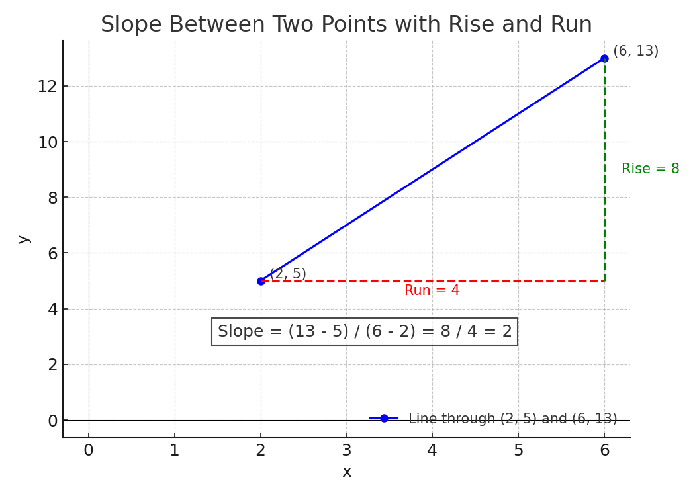
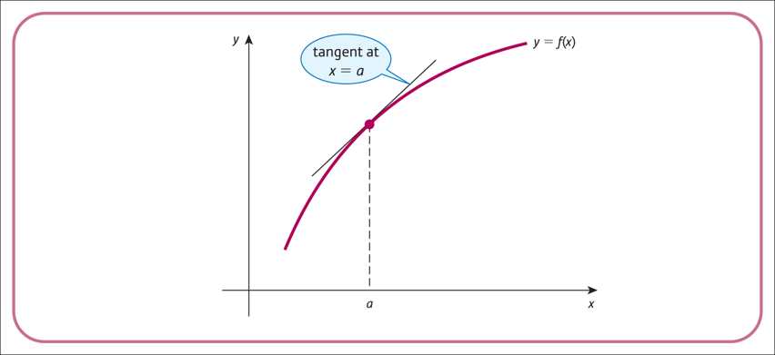

<style>
@media print{
  body, html, .remark-slides-area, .remark-notes-area {
    height: 100% !important;
    width: 100% !important;
    overflow: visible;
    display: inline-block;
    }
</style>

<style type="text/css">
.remark-slide-content {
    font-size: 34px;
    padding: 1em 4em 1em 4em;
}
</style>

<style type="text/css">
.my-one-page-font {
  font-size: 28px;
}
</style>

</style>

<style type="text/css">
.my-one-page-font-table {
  font-size: 24px;
}
</style>


```{r setup, include = FALSE}
library(tidyverse)
library(knitr)

opts_chunk$set(fig.width = 10, 
               message = FALSE, 
               warning = FALSE,
               echo = FALSE)
```

```{r xaringan-themer, include=FALSE, warning=FALSE}
#install.packages("xaringanthemer")
library(xaringanthemer)
style_mono_accent(
  base_color = "#1c5253",
  header_font_google = google_font("Josefin Sans"),
  text_font_google   = google_font("Montserrat", "500", "550i"),
  code_font_google   = google_font("Fira Mono"),
  colors = c(
  red = "#f34213",
  purple = "#3e2f5b",
  orange = "#ff8811",
  green = "#136f63",
  white = "#FFFFFF"
)
)
```

# Why This Topic Matters

In economics and business, we often want to understand how **one variable responds to changes in another**. This is where **derivatives** come in:

- Derivatives measure **rates of change** — critical for cost, revenue, profit, and utility analysis.

- Used to find **slopes**, **marginal values**, **optimization**, and **elasticities**.

- Widely applied in **demand/supply**, **investment analysis**, and **business decision-making**.

Simply put, derivatives help us understand how small changes in one variable can lead to changes in another.

> “Derivatives are the language of marginal thinking in economics.”

---

# Section 4.1: The Derivative of a Function

## What is a Derivative?

The **derivative** of a function at a point gives the **slope of the tangent line** — how much the function is changing at that point.

### Notation:
- $f'(x)$
- $\frac{dy}{dx}$

### Interpretation:
If $f(x)$ is output, then $f'(x)$ is the **marginal change** in output for a unit change in $x$.

---

## Slope of a Function

The slope of a function at a point is the **instantaneous rate of change** of the function at that point.
- It tells us how steep the function is at that point.
- A **positive slope** means the function is increasing, while a **negative slope** means it is decreasing.
- A **zero slope** means the function is flat (no change).

- The slope can be thought of as the **rise over run**: how much the function rises (or falls) for a given change in $x$.


- For linear functions, the slope is constant and can be calculated using the formula:
$$\text{slope} = \frac{y_2 - y_1}{x_2 - x_1}$$

- The slope is **not constant** for non-linear functions, but we can approximate it using the derivative.


---

## Slope from Two Points

For a straight line:

$$\text{slope} = \frac{y_2 - y_1}{x_2 - x_1}$$

Example:
Find the slope between (2, 5) and (6, 13):

$$\frac{13 - 5}{6 - 2} = \frac{8}{4} = 2$$

**Interpretation:** The function rises by 2 units for every 1 unit increase in $x$.

---

## Illustration

<div>
.center[]
</div>

---

## Visual Meaning of Derivative

To **estimate** the slope of a curve at a point:
- Draw the **tangent line** at that point.
- The slope of the tangent ≈ $f'(x)$

The steeper the curve, the larger the derivative.


<div>
.center[]
</div>

---

class: my-one-page-font

## Differentiate Power Functions

Power rule:
$$
\frac{d}{dx}(x^n) = n x^{n-1}
$$

- Example:
$$
\frac{d}{dx}(x^3) = 3x^2
$$

  - Solution:
$$
\frac{d}{dx}(x^3) = 3x^{3-1} = 3x^2
$$

---

class: my-one-page-font

## Differentiate Power Functions (continued)

- Example:
$$
\frac{d}{dx}(5x^4) = 20x^3
$$

  - Solution:
$$
\frac{d}{dx}(5x^4) = 5 \cdot 4x^{4-1} = 20x^3
$$

- Example:
$$
\frac{d}{dx}(\frac{1}{x}) = \frac{d}{dx}(x^{-1}) = -x^{-2}
$$

  - Solution:
$$
\frac{d}{dx}(x^{-1}) = -1 \cdot x^{-2} = -\frac{1}{x^2}
$$

---

## Your turn! Differentiate

- Find $\frac{d}{dx}(x^5)$

- Find $\frac{d}{dx}(x^{-3})$

- Differentiate $f(x) = 2x^3 + 3x^2 - 4x + 1$

- Differentiate $f(x) = 3x^2 + 4x - 5$

---


# Section 4.2: Rules of Differentiation

## Constant Rule

If $c$ is a constant:
$$ \frac{d}{dx}(c) = 0 $$

- $\frac{d}{dx}(7) = 0$

- $\frac{d}{dx}(-12) = 0$

- Example:
$$ \frac{d}{dx}(3) = 0 $$


---

## Constant Multiple Rule

$$ \frac{d}{dx}[c \cdot f(x)] = c \cdot f'(x) $$

- $\frac{d}{dx}[5x^3] = 5 \cdot 3x^2 = 15x^2$

- Example:
$$ \frac{d}{dx}[7x^2] = 7 \cdot 2x^{2-1} = 14x $$


---

## Sum and Difference Rule

$$
\frac{d}{dx}[f(x) + g(x)] = f'(x) + g'(x) $$

$$
\frac{d}{dx}[f(x) - g(x)] = f'(x) - g'(x)
$$

- Example:
$$
\frac{d}{dx}(x^2 + 3x) = 2x + 3
$$

- Example:
$$
\frac{d}{dx}(x^3 - x^2) = 3x^2 - 2x
$$

---

## Second-Order Derivatives

The **second derivative** tells us how the **first derivative** (i.e., the slope) is changing. It gives insight into the **curvature** or **concavity** of the function:

$$
\frac{d^2y}{dx^2} = f''(x)
$$

### Interpretation:
- If $f''(x) > 0$: the function is **concave upward** — the slope is increasing, like a smile 
- If $f''(x) < 0$: the function is **concave downward** — the slope is decreasing, like a frown 

Think of it as the **slope of the slope** — how fast the rate of change is changing.

### Example:
$$
\frac{d^2}{dx^2}(x^3) = \frac{d}{dx}(3x^2) = 6x
$$

This means the concavity of $x^3$ depends on $x$: when $x > 0$, it's concave up; when $x < 0$, it's concave down.


---

# Practice Problems

1. Find $\frac{d}{dx}(4x^3 - 2x + 7)$

2. Differentiate $5x^2 + 6x - 1$ and interpret the result.

3. Compute $\frac{d}{dx}(x^{-2})$

4. Find $\frac{d^2}{dx^2}(x^3 - 2x^2 + x)$

5. Given $f(x) = x^2 + 3x$, find and sketch $f'(x)$

---

## Example from Finance: Marginal Cost and Profit

A company produces and sells a product. Its **cost** and **revenue** functions (in dollars) are given by:

$$
C(x) = 200 + 10x + 0.5x^2 \quad \text{(Cost Function)}
$$
$$
R(x) = 40x \quad \text{(Revenue Function)}
$$

The **profit function** is:
$$
\Pi(x) = R(x) - C(x) = 40x - (200 + 10x + 0.5x^2) = -0.5x^2 + 30x - 200
$$

### Find:
1. The **marginal profit**: $\Pi'(x)$
2. The **rate at which marginal profit changes**: $\Pi''(x)$
3. The production level that **maximizes profit**.
4. The **maximum profit** at that level of production.

---

## Example from Finance: Marginal Cost and Profit (continued)


### Solution:
1. $\Pi'(x) = \frac{d}{dx}(-0.5x^2 + 30x - 200) = -x + 30$
2. $\Pi''(x) = \frac{d}{dx}(-x + 30) = -1$

- Since $\Pi''(x) < 0$, the profit function is **concave down**, meaning the maximum exists.

3. Set $\Pi'(x) = 0 \Rightarrow -x + 30 = 0 \Rightarrow x = 30$

So, the company **maximizes profit at 30 units of output**.

### Answers
1. Marginal profit: $\Pi'(x) = -x + 30$
2. Rate of change of marginal profit: $\Pi''(x) = -1$ (constant, negative)
3. Production level that maximizes profit: $x = 30$
4. Maximum profit: $\Pi(30) = R(30) - C(30) = 40(30) - (200 + 10(30) + 0.5(30^2)) = 1200 - 200 - 300 - 450 = 250$

---

class: my-one-page-font

## Your Turn! Marginal Profit Application

A startup produces custom-designed notebooks. Its **cost** and **revenue** functions are:

$$
C(x) = 150 + 12x + 0.3x^2 \quad \text{(Cost Function)}
$$
$$
R(x) = 36x \quad \text{(Revenue Function)}
$$

The **profit function** is:

$$
\Pi(x) = R(x) - C(x)
$$


### Tasks for You

1. **Find the profit function** $\Pi(x)$.
2. **Differentiate** to get the **marginal profit function** $\Pi'(x)$.
3. **Find the second derivative** $\Pi''(x)$ and interpret it.
4. **Determine** the level of production that **maximizes profit**.
5. **Calculate the maximum profit** at that level.

- Try to solve step-by-step using the rules from today's lecture.  
We will discuss the solution together after 10 minutes!

---


# Summary

- Derivatives = **instantaneous rate of change**

- Power rule and linearity make differentiation efficient

- Second derivatives describe curvature and behavior


---


class: inverse, center, middle

# Any QUESTIONS?

## Thank you for your attention!

---

## Next Class: Quiz #1

- Please review **Homework #1**, all **in-class examples**, and **relevant textbook problems**.

- Quiz will be **paper-based** and will last **70 - 80 minutes**.

- **No electronic devices allowed**, except for a **basic calculator**.


???
1. To print pdf slides
https://stackoverflow.com/questions/54968311/xaringan-export-slides-to-pdf-while-preserving-formatting

pagedown::chrome_print("W1_ME.html") # but not all pictures are visible

2. Option: https://stackoverflow.com/questions/54968311/xaringan-export-slides-to-pdf-while-preserving-formatting

install.packages("remotes")
remotes::install_github("jhelvy/xaringanBuilder")
remotes::install_github("jhelvy/renderthis@v0.0.9")

library(xaringanBuilder)
build_pdf("DVC.html")

3. Option
writeBin(as.raw(c()), "favicon.ico") # create an empty favicon.ico file
install.packages("renderthis")
remotes::install_github('rstudio/chromote')
library(renderthis)

renderthis::to_pdf("W5_1_ME.html")

getwd()
setwd("C:/Users/Iegor/OneDrive - kdis.ac.kr/Documents/GitHub/Sogang/2025/Spring/Mathematical Economics/Week 5_1")
