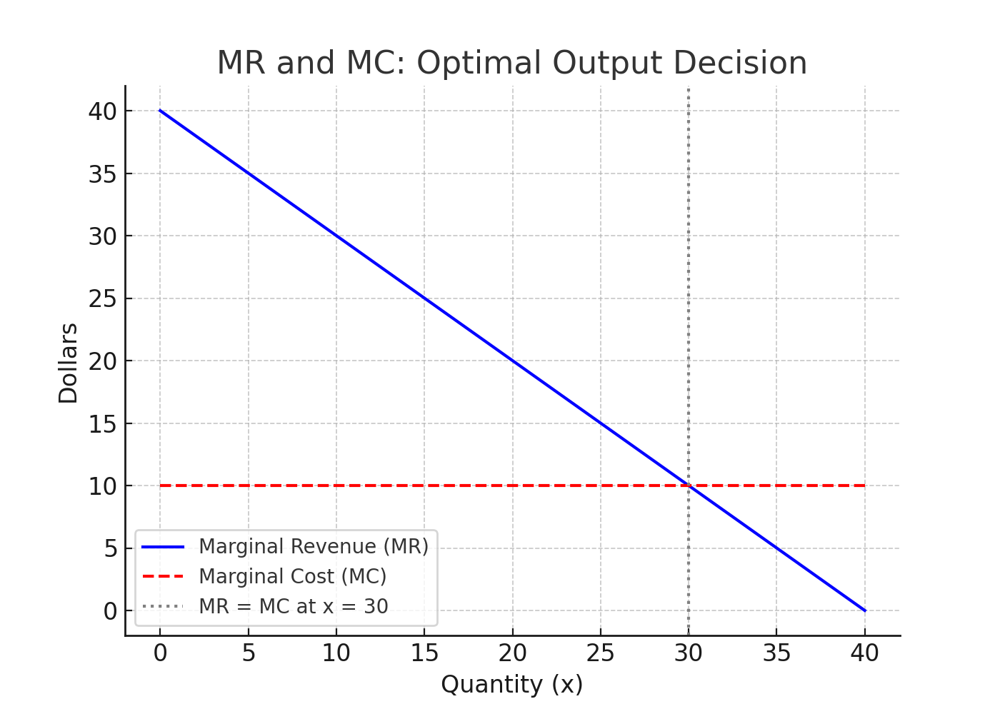
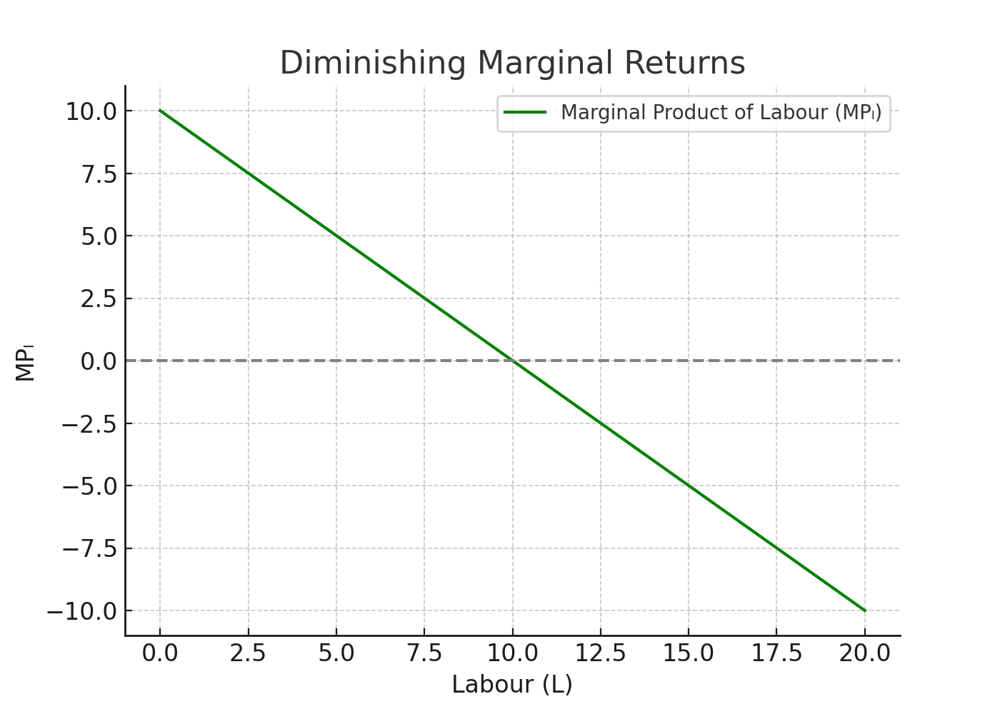

<style>
@media print{
  body, html, .remark-slides-area, .remark-notes-area {
    height: 100% !important;
    width: 100% !important;
    overflow: visible;
    display: inline-block;
    }
</style>

<style type="text/css">
.remark-slide-content {
    font-size: 34px;
    padding: 1em 4em 1em 4em;
}
</style>

<style type="text/css">
.my-one-page-font {
  font-size: 28px;
}
</style>

</style>

<style type="text/css">
.my-one-page-font-table {
  font-size: 24px;
}
</style>


```{r setup, include = FALSE}
library(tidyverse)
library(knitr)

opts_chunk$set(fig.width = 10, 
               message = FALSE, 
               warning = FALSE,
               echo = FALSE)
```

```{r xaringan-themer, include=FALSE, warning=FALSE}
#install.packages("xaringanthemer")
library(xaringanthemer)
style_mono_accent(
  base_color = "#1c5253",
  header_font_google = google_font("Josefin Sans"),
  text_font_google   = google_font("Montserrat", "500", "550i"),
  code_font_google   = google_font("Fira Mono"),
  colors = c(
  red = "#f34213",
  purple = "#3e2f5b",
  orange = "#ff8811",
  green = "#136f63",
  white = "#FFFFFF"
)
)
```

# Agenda  

1. Marginal Functions 

2. Group Activity: Marginal Strategy Showdown

---

class: inverse, center, middle

# 1. Marginal Functions 

---

# Why Marginal Functions Matter

Marginal functions help us understand how **economic quantities change** when we adjust inputs or make small decisions.

- In **microeconomics**, marginal revenue and marginal cost are essential to determine **optimal production** and **pricing decisions**.

- In **macroeconomics**, marginal propensity to consume and save help model **aggregate demand**.

- In **production theory**, marginal product helps evaluate **efficiency** of labour and capital.

---

# Learning Objectives

By the end of this lecture, you should be able to:
- Calculate **marginal revenue** and **marginal cost**
- Calculate **marginal product of labour**
- Derive the link between **marginal and average revenue** under different market structures
- State the **law of diminishing marginal productivity** using calculus
- Calculate **marginal propensity to consume** and **save**

---

# Marginal Revenue & Marginal Cost

- **Marginal Revenue (MR)** is the **additional revenue** earned from selling one more unit:

$$ MR = \frac{dR}{dx} $$

- **Marginal Cost (MC)** is the **additional cost** from producing one more unit:

$$ MC = \frac{dC}{dx} $$

---

### Example:
Let revenue: $R(x) = 40x - 0.5x^2$ and cost: $C(x) = 10x + 50$

- $MR = \frac{dR}{dx} = 40 - x$
- $MC = \frac{dC}{dx} = 10$

At $x = 20$:
- $MR = 20$, $MC = 10$

The firm should produce more since MR > MC.

---

## Visualizing MR and MC
.center[]

- The intersection point where MR = MC gives the **profit-maximizing output level**.
- If MR > MC, the firm should increase output.
- If MR < MC, the firm should reduce output.

---

# Marginal Product of Labour

- The **Marginal Product of Labour (MP\_L)** is the additional output from hiring one more worker:

$$ MP_L = \frac{dQ}{dL} $$

### Example:
Let $Q = 10L - 0.5L^2$

- $MP_L = \frac{dQ}{dL} = 10 - L$
- When $L = 4$: $MP_L = 6$

Output increases but at a diminishing rate — see law of diminishing returns.

---

## Visualizing Diminishing Marginal Returns

.center[]

- MP\_L decreases as L increases
- After a point, adding more labour **reduces efficiency**

---

# Law of Diminishing Marginal Productivity

The **law states** that, after a point, adding more of a variable input leads to smaller increases in output:

$$ MP_L = \frac{dQ}{dL} \text{ decreases as } L \text{ increases} $$

- Seen in the production function $Q = 10L - 0.5L^2$
- Marginal product falls as L increases

---

# Monopoly vs Perfect Competition

## Perfect Competition:
- $MR = AR = P$ (Price is constant)
- Average Revenue and Marginal Revenue are equal

## Monopoly:
- Price falls as more units are sold
- $MR < AR$
- Total revenue function $R(x) = P(x) \cdot x$, where $P(x)$ is decreasing

### Example:
$P(x) = 100 - 2x \Rightarrow R(x) = (100 - 2x)x = 100x - 2x^2$

- $MR = \frac{dR}{dx} = 100 - 4x$
- $AR = R(x)/x = 100 - 2x$

Always: $MR < AR$

---

# Marginal Propensity to Consume (MPC) and Save (MPS)

- **MPC** is the fraction of additional income that is consumed:

$$ MPC = \frac{dC}{dY} $$

- **MPS** is the fraction of additional income that is saved:

$$ MPS = \frac{dS}{dY} $$

Always: $MPC + MPS = 1$

---

# Example: MPC and MPS

Let consumption function be:

$$ C = 30 + 0.8Y \Rightarrow MPC = 0.8 $$

Since $S = Y - C = Y - (30 + 0.8Y) = -30 + 0.2Y$

Then $MPS = \frac{dS}{dY} = 0.2$

$MPC + MPS = 0.8 + 0.2 = 1$

---

# Your Turn!

### Practice Problems:
1. Let $R(x) = 50x - x^2$, $C(x) = 10x + 60$
   - Find MR and MC
   - At what x is MR = MC?

2. If $Q = 20L - L^2$, find the marginal product and show diminishing returns

3. For $C = 40 + 0.75Y$, calculate MPC and MPS

4. A monopolist faces $P(x) = 120 - 3x$
   - Derive total revenue, AR, MR
   - Compare MR and AR

???

### Practice Problems:
1. Let \( R(x) = 50x - x^2 \), \( C(x) = 10x + 60 \)
   - \( MR = \frac{dR}{dx} = 50 - 2x \)
   - \( MC = \frac{dC}{dx} = 10 \)
   - Set MR = MC: \( 50 - 2x = 10 \Rightarrow x = 20 \)
   - ✅ At 20 units, MR = MC → profit-maximizing output.

2. Let \( Q = 20L - L^2 \):
   - \( MP_L = \frac{dQ}{dL} = 20 - 2L \)
   - ✅ As L increases, MP_L decreases → demonstrates **diminishing returns**.

3. Given \( C = 40 + 0.75Y \):
   - \( MPC = 0.75 \)
   - \( MPS = 1 - 0.75 = 0.25 \)
   - ✅ Shows how each extra dollar of income is used.

4. \( P(x) = 120 - 3x \)
   - \( R(x) = P(x) \cdot x = (120 - 3x)x = 120x - 3x^2 \)
   - \( AR = \frac{R(x)}{x} = 120 - 3x \)
   - \( MR = \frac{dR}{dx} = 120 - 6x \)
   - ✅ MR < AR → characteristic of monopoly.


---

# Summary

- Marginal functions describe how **economic values change at the margin**.

- **MR and MC** determine **optimal output**.

- **Marginal product** explains productivity in firms.

- **MPC and MPS** are foundational for understanding **macroeconomic behaviour**.

> In economics, it's not just the level that matters — it's how fast it changes.

---

class: inverse, center, middle

# 2. Group Activity: Marginal Strategy Showdown

---

# Marginal Strategy Showdown

**Objective**: Apply marginal concepts (MR, MC, MPₗ, MPC) to make business or policy decisions.

*Setup*:
- 4 groups of 4 students each.

- Each group receives a scenario card (provided below).

- Must answer the question and present their logic in 2 minutes.

---
class: my-one-page-font

# Scenario Cards

1. *Group 1*: Production Strategy (MR vs. MC)
Your firm produces gadgets. The MR from the last unit sold was $20, and the MC was $25.
  - Should you increase, reduce, or maintain current production? Explain using marginal principles.

2. *Group 2*: Hiring Decision (Marginal Product)
You added one more worker, and output rose by 3 units. The previous worker added 6 units.
  - Are you experiencing diminishing returns? Should you hire another?

3. *Group 3*: Consumer Behaviour (MPC & MPS)
A consumer's income increases by $100. She spends $70 and saves $30.
  - Calculate MPC and MPS. What would a policy-maker learn from this?

4. *Group 4*: Monopoly Pricing
A monopolist sees that when they sell 2 more units, total revenue increases by $10.
  - Is MR < AR? Should the firm lower or raise the price to increase profit?


???
Scenario 1: Production Strategy (MR vs. MC)
MR = $20, MC = $25

✅ Answer:
The firm should reduce production.

Why? Because marginal cost exceeds marginal revenue → producing more would lead to loss on the next unit.

🧠 Concepts Applied:
Profit-maximizing condition: produce where MR = MC

If MR < MC → reduce output

🌍 Real-World Tie-In:
Companies routinely cut production when marginal profit turns negative (e.g. during overcapacity or demand drops).

Scenario 2: Hiring Decision (Marginal Product)
Last worker added 6 units → new worker adds 3 units

✅ Answer:
Yes, this is diminishing marginal returns.

As more units of labour are added, marginal product decreases.

🧠 Concepts Applied:
MPₗ = ΔQ / ΔL

Diminishing returns occur after a point even if total output is still rising.

🌍 Real-World Tie-In:
Common in agriculture, retail and factory production: too many workers → crowding → productivity falls.

Scenario 3: Consumer Behaviour (MPC & MPS)
Income ↑ by $100 → spent $70, saved $30

✅ Answer:
MPC = 0.70, MPS = 0.30

This shows the consumer spends 70% of additional income and saves 30%.

🧠 Concepts Applied:
MPC = ΔC / ΔY = 70 / 100

MPS = 1 - MPC = 0.30

🌍 Real-World Tie-In:
Governments use MPC to predict stimulus effectiveness (e.g. tax cuts: who will spend more?).

Scenario 4: Monopoly Pricing
Selling more units raises total revenue by $10 → MR is positive but less than price

✅ Answer:
Yes, MR < AR in monopoly since price must drop to sell more.

The firm should assess if MR > MC; only then increase output.

If MR < MC, reduce output.

🧠 Concepts Applied:
Monopoly TR = P(x) × x, so MR < AR because of downward-sloping demand.

Unlike perfect competition, marginal revenue declines faster than price.

🌍 Real-World Tie-In:
Monopolies like airlines, utilities use MR analysis to optimize pricing and output.

---

class: inverse, center, middle

# Any QUESTIONS?

## Thank you for your attention!

---

## Next Class

- (April 11) Further Rules of Differentiations (4.4), Elasticity (4.5) 


???
1. To print pdf slides
https://stackoverflow.com/questions/54968311/xaringan-export-slides-to-pdf-while-preserving-formatting

pagedown::chrome_print("W1_ME.html") # but not all pictures are visible

2. Option: https://stackoverflow.com/questions/54968311/xaringan-export-slides-to-pdf-while-preserving-formatting

install.packages("remotes")
remotes::install_github("jhelvy/xaringanBuilder")
remotes::install_github("jhelvy/renderthis@v0.0.9")

library(xaringanBuilder)
build_pdf("DVC.html")

3. Option
writeBin(as.raw(c()), "favicon.ico") # create an empty favicon.ico file
install.packages("renderthis")
remotes::install_github('rstudio/chromote')
library(renderthis)

renderthis::to_pdf("W6_1_ME.html")

getwd()
setwd("C:/Users/Iegor/OneDrive - kdis.ac.kr/Documents/GitHub/Sogang/2025/Spring/Mathematical Economics/Week 6_1")
