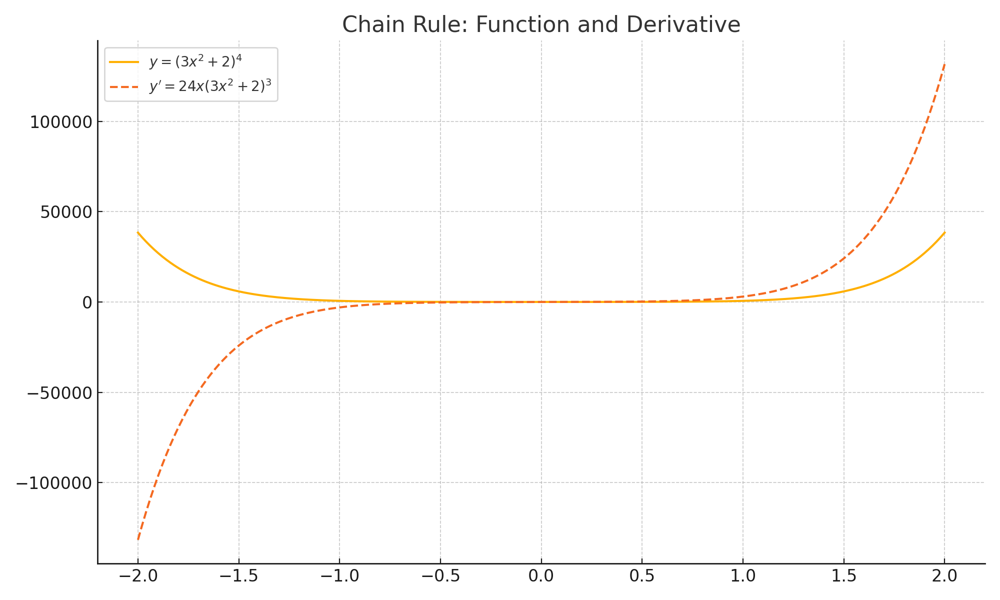
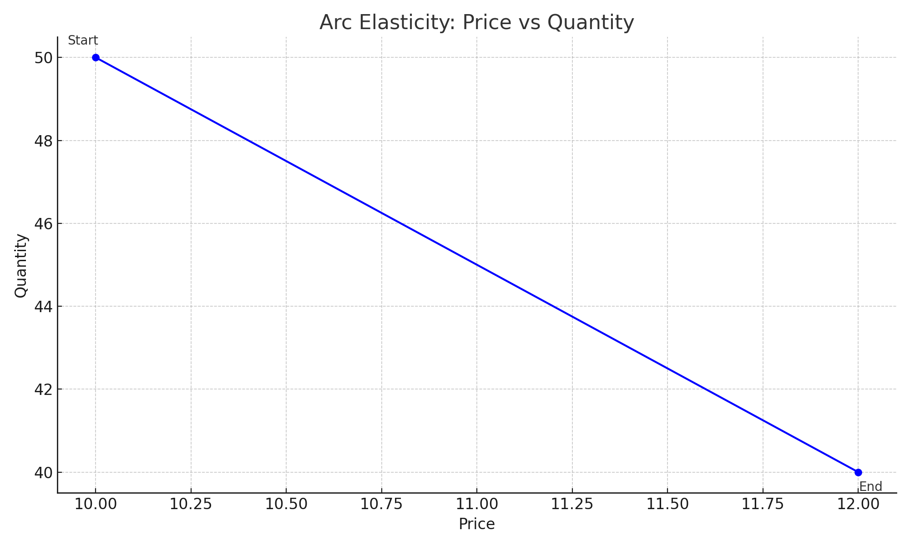
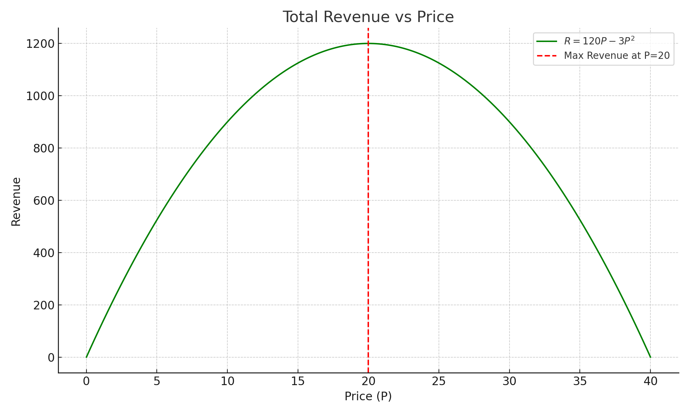

<style>
@media print{
  body, html, .remark-slides-area, .remark-notes-area {
    height: 100% !important;
    width: 100% !important;
    overflow: visible;
    display: inline-block;
    }
</style>

<style type="text/css">
.remark-slide-content {
    font-size: 34px;
    padding: 1em 4em 1em 4em;
}
</style>

<style type="text/css">
.my-one-page-font {
  font-size: 28px;
}
</style>

</style>

<style type="text/css">
.my-one-page-font-table {
  font-size: 24px;
}
</style>


```{r setup, include = FALSE}
library(tidyverse)
library(knitr)

opts_chunk$set(fig.width = 10, 
               message = FALSE, 
               warning = FALSE,
               echo = FALSE)
```

```{r xaringan-themer, include=FALSE, warning=FALSE}
#install.packages("xaringanthemer")
library(xaringanthemer)
style_mono_accent(
  base_color = "#1c5253",
  header_font_google = google_font("Josefin Sans"),
  text_font_google   = google_font("Montserrat", "500", "550i"),
  code_font_google   = google_font("Fira Mono"),
  colors = c(
  red = "#f34213",
  purple = "#3e2f5b",
  orange = "#ff8811",
  green = "#136f63",
  white = "#FFFFFF"
)
)
```

# Agenda  

1. Further Rules of Differentiations (4.4)

2. Elasticity (4.5) 

3. Group Activity: Differentiation & Elasticity Challenge

---

# Learning Objectives

## Section 4.4 – Further Rules of Differentiation
- Use the **chain rule** to differentiate a function of a function
- Apply the **product rule** to differentiate the product of two functions
- Apply the **quotient rule** to differentiate the ratio of two functions
- Differentiate **complex functions** combining multiple rules

## Section 4.5 – Elasticity
- Calculate **arc elasticity** (average)
- Calculate **point elasticity**
- Determine whether elasticity is **elastic**, **unitary**, or **inelastic**
- Understand **elasticity and total revenue**
- Analyze elasticity in **linear demand functions**

---

class: inverse, center, middle

# 1. Further Rules of Differentiations (4.4)

---

# Chain Rule

Used when you have a function **inside** another function:

$$ \frac{dy}{dx} = \frac{dy}{du} \cdot \frac{du}{dx} $$

### Example:
Let $y = (3x^2 + 2)^4$

- Set $u = 3x^2 + 2$
- $\frac{dy}{dx} = 4u^3 \cdot \frac{du}{dx} = 4(3x^2 + 2)^3 \cdot 6x = 24x(3x^2 + 2)^3$

Apply chain rule when exponents wrap a full expression

---

# Illustration of Chain Rule

.center[]

---

# Product Rule

Used when differentiating a **product of two functions**:

$$ \frac{d}{dx}[u(x) \cdot v(x)] = u'(x)v(x) + u(x)v'(x) $$

### Example:
$y = x^2 \cdot \ln(x)$
- $u = x^2, \quad v = \ln(x)$
- $y' = 2x \cdot \ln(x) + x^2 \cdot \frac{1}{x} = 2x \ln(x) + x$

Both terms matter!

---

# Quotient Rule

Used when differentiating a **quotient of two functions**:

$$ \frac{d}{dx}\left[\frac{u(x)}{v(x)}\right] = \frac{u'(x)v(x) - u(x)v'(x)}{[v(x)]^2} $$

### Example:
$y = \frac{\ln(x)}{x}$
- $u = \ln(x), \quad v = x$
- $y' = \frac{\frac{1}{x} \cdot x - \ln(x) \cdot 1}{x^2} = \frac{1 - \ln(x)}{x^2}$

Useful for cost/revenue ratios!

---

# Combination of Rules

### Example:
$y = \frac{(x^2 + 1)^3 \cdot \ln(x)}{x^2}$
- Use **product rule** on numerator, **chain rule** on $(x^2 + 1)^3$
- Use **quotient rule** for the entire function

Many economic models require **layered differentiation**

---

class: inverse, center, middle

# 2. Elasticity (4.5)

---

# Elasticity of Demand & Supply

## Arc Elasticity:
Average elasticity over an interval:

$$ E_d = \frac{\Delta Q / \text{avg } Q}{\Delta P / \text{avg } P} = \frac{\frac{Q_2 - Q_1}{(Q_1 + Q_2)/2}}{\frac{P_2 - P_1}{(P_1 + P_2)/2}} $$

### Example:
- Price increases from $10 to $12, quantity falls from 50 to 40
- $E_d = \frac{(40 - 50)/45}{(12 - 10)/11} = \frac{-10/45}{2/11} = -1.22$

Elastic demand (|E| > 1) meaning consumers are sensitive to price changes

---

# Illustration of Arc Elasticity

.center[]

---

## Point Elasticity:
Use **derivative** and point values:

$$ E_d = \frac{dQ}{dP} \cdot \frac{P}{Q} $$

If $Q = 120 - 3P$, then $\frac{dQ}{dP} = -3$
- At $P = 10$, $Q = 90$

$E_d = -3 \cdot \frac{10}{90} = -0.33$

Inelastic demand meaning consumers are less sensitive to price changes

---

# Elasticity & Revenue

- If $|E_d| > 1$: Lowering price **increases** revenue
- If $|E_d| < 1$: Lowering price **decreases** revenue
- At $|E_d| = 1$: Revenue is **maximized**

### Graph it: Revenue = $P × Q = P(120 - 3P) = 120P - 3P^2$
- Max revenue when $MR = 0 \Rightarrow$ elasticity = 1

---

# Illustration of Revenue and Elasticity

.center[]

---

# Elasticity in Linear Demand

If $Q = a - bP$, then:

$$ E_d = -b \cdot \frac{P}{Q} $$

- Easy to evaluate at any point
- At $P = 0$, elasticity = 0 (perfectly inelastic)
- At $Q = 0$, elasticity = $\infty$ (perfectly elastic)
- At midpoint, $E_d = -1$

Linear demand: Elasticity changes **along** the curve

---

# Practice Problems

1. Differentiate using chain rule:
   - (a) $f(x) = (5x^2 + 1)^4$

2. Differentiate using product rule:
   - (a) $f(x) = x^2 e^x$

3. Differentiate using quotient rule:
   - (a) $f(x) = \frac{e^x}{x^2}$

4. Find arc elasticity:
   - Price rises from \$8 to \$10; Q falls from 60 to 48

5. For $Q = 100 - 4P$, find point elasticity at $P = 10$

6. Interpret elasticity:
   - When $E_d = -1$, what happens to total revenue if price increases?

???


# ✅ Solutions: Practice Problems


### 1. Chain Rule

Function:  
$$ f(x) = (5x^2 + 1)^4 $$

Let \( u = 5x^2 + 1 \)

Then:  
\[
f'(x) = 4(5x^2 + 1)^3 \cdot \frac{d}{dx}(5x^2 + 1) = 4(5x^2 + 1)^3 \cdot 10x = 40x(5x^2 + 1)^3
\]


### 2. Product Rule

Function:  
$$ f(x) = x^2 e^x $$

\[
f'(x) = \frac{d}{dx}[x^2] \cdot e^x + x^2 \cdot \frac{d}{dx}[e^x] = 2x e^x + x^2 e^x = e^x(2x + x^2)
\]


### 3. Quotient Rule

Function:  
$$ f(x) = \frac{e^x}{x^2} $$

Let \( u = e^x \), \( v = x^2 \)

\[
f'(x) = \frac{u'v - uv'}{v^2} = \frac{e^x \cdot x^2 - e^x \cdot 2x}{x^4} = \frac{e^x(x^2 - 2x)}{x^4}
\]


### 4. Arc Elasticity

\[
P_1 = 8, \ P_2 = 10,\ Q_1 = 60,\ Q_2 = 48
\]

\[
E_d = \frac{(Q_2 - Q_1)/\text{avg }Q}{(P_2 - P_1)/\text{avg }P} = \frac{-12 / 54}{2 / 9} = \frac{-0.222}{0.222} = -1
\]

✅ **Unit elastic**


### 5. Point Elasticity

Demand:  
$$ Q = 100 - 4P \Rightarrow \frac{dQ}{dP} = -4 $$

At \( P = 10 \):  
\[
Q = 100 - 4(10) = 60
\]
\[
E_d = \frac{dQ}{dP} \cdot \frac{P}{Q} = -4 \cdot \frac{10}{60} = -0.667
\]

✅ **Inelastic**


### 6. Interpretation of Elasticity

If \( E_d = -1 \): **Unit Elastic Demand**

💡 **Total revenue is maximized**.  
If price increases or decreases slightly, **total revenue does not change**.

---


# Summary

- Use chain, product, and quotient rules to handle **complex expressions**

- Elasticity helps us understand **how responsive** quantity is to price

- Price elasticity relates directly to **revenue decisions**

> In economics, calculus lets us optimize decisions, and elasticity helps us understand consumer response.


---

class: inverse, center, middle

# 3. Group Activity: Differentiation & Elasticity Challenge

---

# Setup

- Class of **16 students → 4 groups of 4**
- Each group receives **1 challenge card**
- Work collaboratively on whiteboards or paper

Time:
- 10 mins group work  
- 2 mins presentation per group  
- 5 mins wrap-up discussion

---

# Group 1: Chain Rule in Production

**Production Function:**  
$$ Q = (5L^2 + 3)^3 $$

1. Find the marginal product using the **chain rule**  
2. Interpret: What does it say about productivity as labor increases?

---

# Group 2: Product Rule in Revenue

**Revenue Function:**  
$$ R(x) = x \cdot \ln(x) $$

1. Find **marginal revenue** using the product rule  
2. Evaluate MR at \( x = 1 \)

---

# Group 3: Elasticity Debate

**Demand Function:**  
$$ Q = 120 - 4P $$

1. Calculate **point elasticity** at \( P = 10 \)  
2. Should the firm **raise or lower the price** to increase revenue?

---

# Group 4: Quotient Rule in Cost Analysis

**Average Cost per unit:**  
$$ C(x) = \frac{100 + 2x^2}{x} $$

1. Find the **marginal cost per unit** using the quotient rule  
2. What does it imply as output grows?


???


# ✅ Group Activity: Answer Key


# 🟦 Group 1: Chain Rule in Production

Function:  
$$ Q = (5L^2 + 3)^3 $$

Let \( u = 5L^2 + 3 \), so  
$$
\frac{dQ}{dL} = \frac{d}{dL}(u^3) = 3u^2 \cdot \frac{du}{dL} = 3(5L^2 + 3)^2 \cdot 10L = 30L(5L^2 + 3)^2
$$

**Interpretation:**  
As labor increases, marginal product increases initially (due to the \( L \) term), but will eventually show diminishing returns due to the squared term inside.


# 🟨 Group 2: Product Rule in Revenue

Function:  
$$ R(x) = x \cdot \ln(x) $$

Use the product rule:  
$$
R'(x) = \frac{d}{dx}[x] \cdot \ln(x) + x \cdot \frac{d}{dx}[\ln(x)] = 1 \cdot \ln(x) + x \cdot \frac{1}{x} = \ln(x) + 1
$$

At \( x = 1 \):  
$$
R'(1) = \ln(1) + 1 = 0 + 1 = 1
$$

✅ Marginal revenue at 1 unit sold is \$1.


# 🟧 Group 3: Elasticity Debate

Function:  
$$ Q = 120 - 4P $$

$$
\frac{dQ}{dP} = -4, \quad \text{At } P = 10, \ Q = 120 - 4(10) = 80
$$

$$
E_d = \frac{dQ}{dP} \cdot \frac{P}{Q} = -4 \cdot \frac{10}{80} = -0.5
$$

**Interpretation:**  
|E| < 1 → **Inelastic demand**  
✅ Raising price would **increase revenue**


# 🟩 Group 4: Quotient Rule in Cost

Function:  
$$ C(x) = \frac{100 + 2x^2}{x} $$

Let \( u = 100 + 2x^2 \), \( v = x \)  
$$
C'(x) = \frac{(4x \cdot x) - (100 + 2x^2) \cdot 1}{x^2} = \frac{4x^2 - 100 - 2x^2}{x^2} = \frac{2x^2 - 100}{x^2}
$$

✅ Shows decreasing cost at first, but after a certain point marginal cost starts rising again.


---

class: inverse, center, middle

# Any QUESTIONS?

## Thank you for your attention!

---

## Next Class

- (April 16) Optimization of Economic Functions (4.6, 4.7) 


???
1. To print pdf slides
https://stackoverflow.com/questions/54968311/xaringan-export-slides-to-pdf-while-preserving-formatting

pagedown::chrome_print("W1_ME.html") # but not all pictures are visible

2. Option: https://stackoverflow.com/questions/54968311/xaringan-export-slides-to-pdf-while-preserving-formatting

install.packages("remotes")
remotes::install_github("jhelvy/xaringanBuilder")
remotes::install_github("jhelvy/renderthis@v0.0.9")

library(xaringanBuilder)
build_pdf("DVC.html")

3. Option
writeBin(as.raw(c()), "favicon.ico") # create an empty favicon.ico file
install.packages("renderthis")
remotes::install_github('rstudio/chromote')
library(renderthis)

renderthis::to_pdf("W6_2_ME.html")

getwd()
setwd("C:/Users/Iegor/OneDrive - kdis.ac.kr/Documents/GitHub/Sogang/2025/Spring/Mathematical Economics/Week 6_2")
