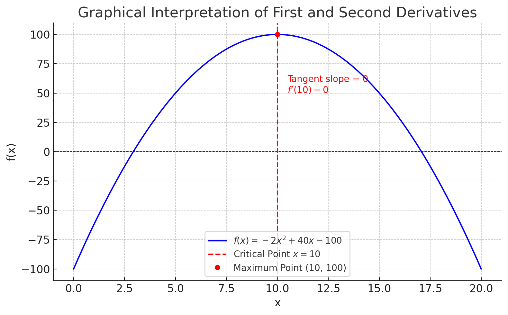

<style>
@media print{
  body, html, .remark-slides-area, .remark-notes-area {
    height: 100% !important;
    width: 100% !important;
    overflow: visible;
    display: inline-block;
    }
</style>

<style type="text/css">
.remark-slide-content {
    font-size: 34px;
    padding: 1em 4em 1em 4em;
}
</style>

<style type="text/css">
.my-one-page-font {
  font-size: 28px;
}
</style>

</style>

<style type="text/css">
.my-one-page-font-table {
  font-size: 24px;
}
</style>


```{r setup, include = FALSE}
library(tidyverse)
library(knitr)

opts_chunk$set(fig.width = 10, 
               message = FALSE, 
               warning = FALSE,
               echo = FALSE)
```

```{r xaringan-themer, include=FALSE, warning=FALSE}
#install.packages("xaringanthemer")
library(xaringanthemer)
style_mono_accent(
  base_color = "#1c5253",
  header_font_google = google_font("Josefin Sans"),
  text_font_google   = google_font("Montserrat", "500", "550i"),
  code_font_google   = google_font("Fira Mono"),
  colors = c(
  red = "#f34213",
  purple = "#3e2f5b",
  orange = "#ff8811",
  green = "#136f63",
  white = "#FFFFFF"
)
)
```

# Agenda  

1. Optimization of Economic Functions (4.6, 4.7) 

2. Group Activity: Optimize the Business!

---

# Learning Objectives

### Section 4.6 – Optimization of Economic Functions
- Use **first-order derivatives** to find stationary points
- Use **second-order derivatives** to classify max/min
- Apply calculus to **maximize or minimize economic functions**
- Sketch graphs using critical points

### Section 4.7 – Further Optimization Concepts
- At max profit: **MR = MC**
- At max profit: **slope of MR < slope of MC**
- Optimize profits **with/without price discrimination**
- Show **APL = MPL** at max APL
- Derive the **EOQ** formula in inventory management

---

class: inverse, center, middle

# 1. Optimization of Economic Functions (4.6, 4.7)

---

# Optimization: Economic Motivation

In economics, we often want to:
- Maximize **profit**, **revenue**, or **utility**

- Minimize **costs**, **waste**, or **risk**

These require:
- Finding **stationary points** of a function

- Classifying them using **second-order derivatives**

Note: Stationary points are where the first derivative is zero or undefined.
- They indicate where a function **changes direction** (max/min)

---

class: my-one-page-font

# Step-by-Step: Find Stationary Points

### 1. First Derivative Test
Let:
$$ f(x) = -2x^2 + 40x - 100 $$

Find:
$$ f'(x) = -4x + 40 $$
Set derivative = 0:
$$ -4x + 40 = 0 \Rightarrow x = 10 $$

### 2. Second Derivative Test
$$ f''(x) = -4 < 0 $$ → Maximum point (because it's negative)
- If $f''(x) > 0$, it's a minimum point

### Maximum profit at $x = 10$, $f(10) = -2(100) + 400 - 100 = 200$

---

# Graphical Interpretation
- First derivative = slope of tangent
- Second derivative = curvature
- Stationary points: where slope = 0
- Max if concave down, min if concave up

.center[]


---

# MR = MC: Condition for Max Profit

If:
$$ \Pi(x) = R(x) - C(x) $$
Then:
$$ \Pi'(x) = R'(x) - C'(x) = 0 $$
→ So:  
$$ MR = MC $$

Also:  
$$ \text{If } MR' < MC' \Rightarrow \text{Local Max} $$

---

# Example: Profit Maximization

Let:  
$$ R(x) = 60x - x^2, \quad C(x) = 10x + 20 $$

Profit:  
$$ \Pi(x) = R(x) - C(x) = 60x - x^2 - 10x - 20 = -x^2 + 50x - 20 $$

1. First derivative:
$$ \Pi'(x) = -2x + 50 $$ → Set to 0 → $x = 25$

2. Second derivative:
$$ \Pi''(x) = -2 < 0 $$ → Max point

Max profit at $x = 25$, $\Pi(25) = -625 + 1250 - 20 = 605$

---

# APL = MPL: Max Avg Productivity

Let:  
$$ Q = 20L - L^2 $$

- APL = $\frac{Q}{L} = 20 - L$
- MPL = $\frac{dQ}{dL} = 20 - 2L$

Set APL = MPL:
$$ 20 - L = 20 - 2L \Rightarrow L = 0 $$

→ Verify using derivative of APL

Note: APL stands for **Average Product of Labor** and MPL for **Marginal Product of Labor**
- APL = MPL at $L = 0$ → Max APL

---

class: my-one-page-font

# EOQ Formula (Economic Order Quantity)

- Economic Order Quantity (EOQ) is a key concept in inventory management. 

- It helps determine the optimal order quantity that minimizes total inventory costs, which include ordering and holding costs.

Let:
- $D$ = annual demand
- $C_o$ = ordering cost per order
- $C_h$ = holding cost per unit/year
- $Q$ = order quantity

Total Cost:
$$ TC(Q) = \frac{D}{Q} C_o + \frac{Q}{2} C_h $$

Minimize $TC(Q)$ by:
$$ \frac{dTC}{dQ} = -\frac{DC_o}{Q^2} + \frac{C_h}{2} = 0 $$

---

class: my-one-page-font

# EOQ Formula (Economic Order Quantity) (cont'd)

Solve:
$$ Q^* = \sqrt{\frac{2DC_o}{C_h}} $$

This gives optimal order size

---

# EOQ Formula (Economic Order Quantity) (cont'd)

## Example:

A company sells 1,000 units of a product per year.  
Each order costs $50 to place.  
The holding cost per unit is $2 per year.

$EOQ = \sqrt{\frac{2 \cdot 1000 \cdot 50}{2}} = \sqrt{50000} \approx 223.6$

**Optimal order size = 224 units** (rounded)

### Interpretation

- The company should order **224 units each time** to minimize total inventory costs.
- This balances the **ordering cost** and the **holding cost** efficiently.

---

# Practice Problems

1. Maximize $f(x) = -x^2 + 12x - 15$ using first and second derivatives.
2. For $R(x) = 30x - 0.5x^2$, $C(x) = 5x + 10$, find profit-maximizing output.
3. If $Q = 100L - 2L^2$, find when APL = MPL.
4. Derive EOQ for $D = 1000$, $C_o = 50$, $C_h = 2$

???


## 1. Maximize $f(x) = -x^2 + 12x - 15$

**Step 1: First derivative**

$$
f'(x) = -2x + 12
$$

Set $f'(x) = 0$:

$$
-2x + 12 = 0 \Rightarrow x = 6
$$

**Step 2: Second derivative**

$$
f''(x) = -2 < 0
$$

✅ Maximum at $x = 6$

$$
f(6) = -(6)^2 + 12(6) - 15 = -36 + 72 - 15 = 21
$$

**Result:** Max value is **21** at $x = 6$


## 2. Profit Maximization

Given:

$$
R(x) = 30x - 0.5x^2, \quad C(x) = 5x + 10
$$

Profit:

$$
\Pi(x) = R(x) - C(x) = 30x - 0.5x^2 - 5x - 10 = -0.5x^2 + 25x - 10
$$

**First derivative**:

$$
\Pi'(x) = -x + 25
$$

Set to 0:

$$
-x + 25 = 0 \Rightarrow x = 25
$$

**Second derivative**:

$$
\Pi''(x) = -1 < 0
$$

✅ Max profit at $x = 25$


## 3. APL = MPL

Given:

$$
Q = 100L - 2L^2
$$

$$
APL = \frac{Q}{L} = 100 - 2L
$$

$$
MPL = \frac{dQ}{dL} = 100 - 4L
$$

Set APL = MPL:

$$
100 - 2L = 100 - 4L \Rightarrow 2L = 0 \Rightarrow L = 0
$$

✅ Maximum APL occurs at $L = 0$

(Note: Unusual — consider verifying if this makes sense in context.)


## 4. EOQ Formula

Given:

$$
D = 1000, \quad C_o = 50, \quad C_h = 2
$$

EOQ Formula:

$$
EOQ = \sqrt{\frac{2DC_o}{C_h}} = \sqrt{\frac{2 \cdot 1000 \cdot 50}{2}} = \sqrt{50000} = 223.6
$$

✅ EOQ ≈ **224 units**


---

# Summary
- Use first and second derivatives to **optimize** economic functions
- **MR = MC** is critical for profit max
- Derivatives help identify where functions **turn** and **peak**
- APL = MPL and EOQ have clear, testable formulas

> In economics, **optimization** helps us allocate resources most efficiently

---

class: inverse, center, middle

# 2. Group Activity: Optimize the Business!

---

# Group Activity: Optimize the Business!

### Setup:
- Form **4 teams** of **4 students** each.
- Each team represents a **small business** deciding **how many units** of a product to produce.

---

### Your Business Setup:
You sell eco-friendly water bottles. Your revenue and cost functions are:

- $R(x) = 80x - x^2$ (Revenue)
- $C(x) = 20x + 100$ (Cost)

---

### Your Task:
1. Derive the **profit function**: $\Pi(x) = R(x) - C(x)$
2. Use **first-order** and **second-order derivatives** to find:
   - The **profit-maximizing output**
   - The **maximum profit**
3. Sketch a **graph** of $R(x), C(x), \Pi(x)$
4. Present your findings in **3–4 minutes**

---

### Rules:
- You can use your notes and calculators.
- One person from each group presents.
- Bonus points for the most creative graph sketch!

---

class: inverse, center, middle

# Any QUESTIONS?

## Thank you for your attention!

---

## Next Class

- (April 18) Easter Holiday (Recorded lecture): The Derivative of the Exponential and Natural Log Functions (4.8) 
- (April 23) No Class (Midterm Exam Week)
- (April 25) Mid term exam (in class):
  - Review all material from the beginning of the semester
  - Pay attention to the examples in the slides, HW #1, Quiz #1 and the exercises in the textbook


???
1. To print pdf slides
https://stackoverflow.com/questions/54968311/xaringan-export-slides-to-pdf-while-preserving-formatting

pagedown::chrome_print("W1_ME.html") # but not all pictures are visible

2. Option: https://stackoverflow.com/questions/54968311/xaringan-export-slides-to-pdf-while-preserving-formatting

install.packages("remotes")
remotes::install_github("jhelvy/xaringanBuilder")
remotes::install_github("jhelvy/renderthis@v0.0.9")

library(xaringanBuilder)
build_pdf("DVC.html")

3. Option
writeBin(as.raw(c()), "favicon.ico") # create an empty favicon.ico file
install.packages("renderthis")
remotes::install_github('rstudio/chromote')
library(renderthis)

renderthis::to_pdf("W7_1_ME.html")

getwd()
setwd("C:/Users/Iegor/OneDrive - kdis.ac.kr/Documents/GitHub/Sogang/2025/Spring/Mathematical Economics/Week 7_1")
