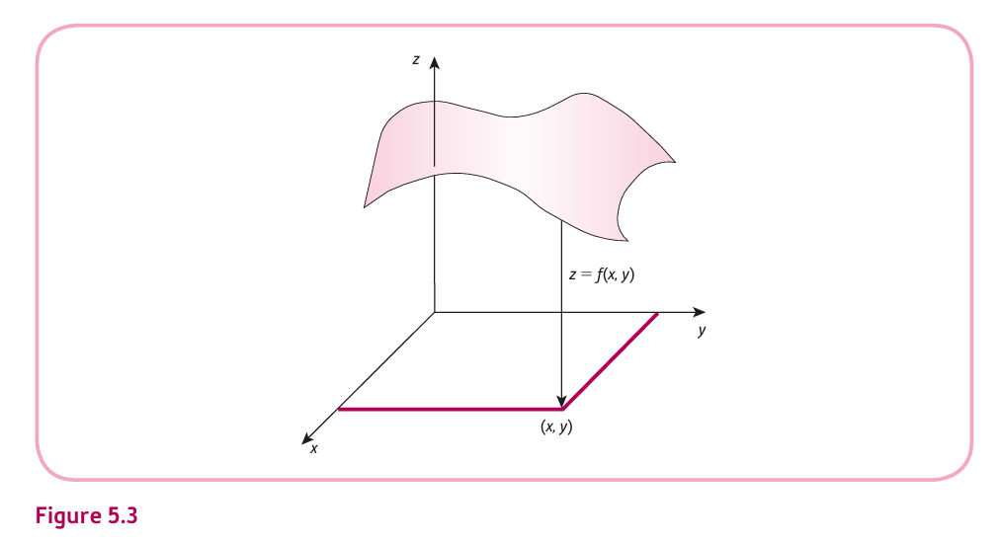
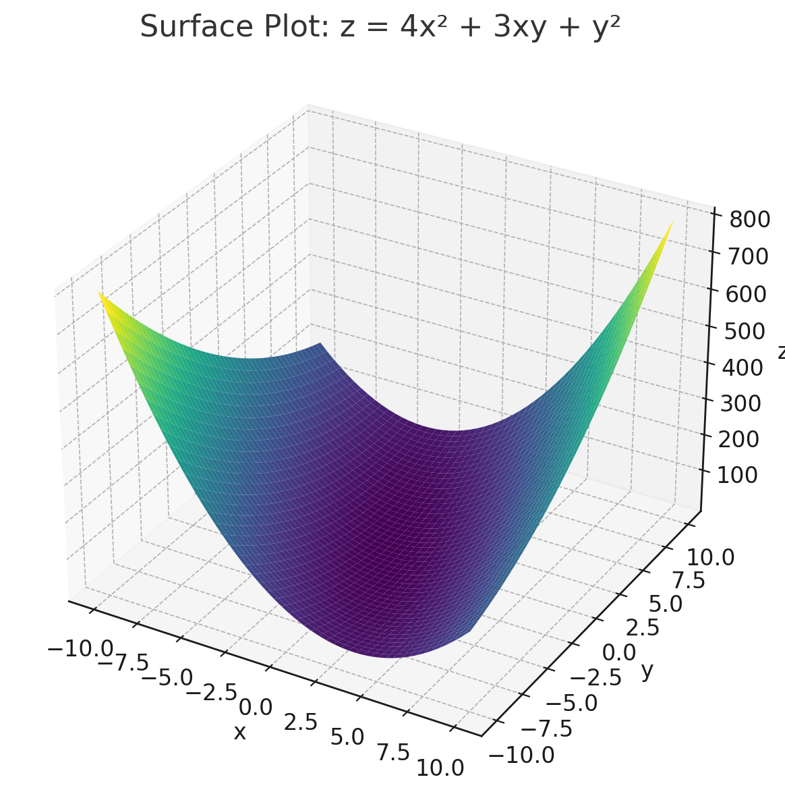

<style>
@media print{
  body, html, .remark-slides-area, .remark-notes-area {
    height: 100% !important;
    width: 100% !important;
    overflow: visible;
    display: inline-block;
    }
</style>

<style type="text/css">
.remark-slide-content {
    font-size: 34px;
    padding: 1em 4em 1em 4em;
}
</style>

<style type="text/css">
.my-one-page-font {
  font-size: 28px;
}
</style>

</style>

<style type="text/css">
.my-one-page-font-table {
  font-size: 24px;
}
</style>


```{r setup, include = FALSE}
library(tidyverse)
library(knitr)

opts_chunk$set(fig.width = 10, 
               message = FALSE, 
               warning = FALSE,
               echo = FALSE)
```

```{r xaringan-themer, include=FALSE, warning=FALSE}
#install.packages("xaringanthemer")
library(xaringanthemer)
style_mono_accent(
  base_color = "#1c5253",
  header_font_google = google_font("Josefin Sans"),
  text_font_google   = google_font("Montserrat", "500", "550i"),
  code_font_google   = google_font("Fira Mono"),
  colors = c(
  red = "#f34213",
  purple = "#3e2f5b",
  orange = "#ff8811",
  green = "#136f63",
  white = "#FFFFFF"
)
)
```

# Agenda  

1.  Functions of Several Variables (5.1)  

2. Class Activity

---

class: inverse, center, middle

# 1. Functions of Several Variables (5.1)

---

# Learning Objectives

- Use function notation $z = f(x, y)$

- Calculate **first-order partial derivatives**

- Calculate **second-order partial derivatives**

- Understand that $f_{xy} = f_{yx}$ (usually)

- Use the **small increments formula**

- Perform **implicit differentiation**

---

# What Are Multivariable Functions?

A function with **two or more independent variables**.

### Example:
Let $z = f(x, y) = 4x^2 + 3xy + y^2$

- $z$ depends on both $x$ and $y$

- This could model something like **profit**, **cost**, or **utility** depending on two goods or inputs

---

# Multivariable Functions Graphically

A function of two variables can be visualized as a **surface** in 3D space.

<div style="text-align:center;">
  
</div>

This graph shows how a function $z = f(x, y)$ maps a pair $(x, y)$ into a surface value $z$. 

It represents the output (e.g., cost, utility, profit) depending on two input variables.

The surface curves depending on how each variable changes, giving rise to partial derivatives.

---

# First-Order Partial Derivatives

**Partial derivative " means:**
- **Partial**: only one variable is changing, the other is held constant
- **Derivative**: the rate of change of the function with respect to that variable
- **Take the derivative**: treat the other variable as a constant

Take the derivative **with respect to one variable**, holding the other constant.

### Example:
Let $f(x, y) = 4x^2 + 3xy + y^2$

- $f_x = \frac{\partial f}{\partial x} = 8x + 3y$
- $f_y = \frac{\partial f}{\partial y} = 3x + 2y$

> **Interpretation**: how $z$ changes when we slightly change $x$ (or $y$) keeping the other constant.

---

# Second-Order Partial Derivatives

Take the partial derivative **again**.

Using $f(x, y) = 4x^2 + 3xy + y^2$:

- $f_{xx} = \frac{\partial^2 f}{\partial x^2} = 8$
- $f_{yy} = \frac{\partial^2 f}{\partial y^2} = 2$
- $f_{xy} = \frac{\partial^2 f}{\partial y \partial x} = 3$
- $f_{yx} = \frac{\partial^2 f}{\partial x \partial y} = 3$

> $f_{xy} = f_{yx}$ → **mixed partial derivatives are equal** (if $f$ is smooth)

---

# Surface Plot of a Multivariable Function

### Function: \( z = 4x^2 + 3xy + y^2 \)

<div style="text-align:center;">
  
</div>

---

# Surface Plot of a Multivariable Function (continued)


### Interpretation:

- This 3D plot shows how the output \( z \) varies with two input variables \( x \) and \( y \).

- The **curved surface** represents a **multivariable quadratic function**.

- As both \( x \) and \( y \) increase in magnitude, the value of \( z \) increases rapidly.

- The function is **convex**, indicating that it has a **minimum point** where the surface is lowest.

- Such plots are commonly used in **cost**, **utility**, and **production functions** in economics to visualize how two inputs interact.


---

class: my-one-page-font

# Small Increments Formula

Increment is a small change in the variable.
Let $f(x, y)$ be a function of two variables. If we have small changes $\Delta x$ and $\Delta y$, we can estimate the change in $z$ as:

$$
\Delta z \approx f_x(x_0, y_0) \cdot \Delta x + f_y(x_0, y_0) \cdot \Delta y
$$

Where:
- $f_x(x_0, y_0)$ is the partial derivative of $f$ with respect to $x$ at $(x_0, y_0)$
- $f_y(x_0, y_0)$ is the partial derivative of $f$ with respect to $y$ at $(x_0, y_0)$

### Example:
Let $f(x, y) = x^2 + 3y^2$, find $\Delta z$ when:
- $x = 1$, $y = 2$
- $\Delta x = 0.1$, $\Delta y = -0.2$

Partial derivatives:
- $f_x = 2x \Rightarrow f_x(1, 2) = 2$
- $f_y = 6y \Rightarrow f_y(1, 2) = 12$

$\Delta z \approx 2(0.1) + 12(-0.2) = 0.2 - 2.4 = \boxed{-2.2}$

---

# Implicit Differentiation

When variables are related **implicitly** (not as $y = f(x)$), we still find $\frac{dy}{dx}$.

### Example:
Let $x^2 + y^2 = 25$. Differentiate both sides:

$$
\frac{d}{dx}(x^2) + \frac{d}{dx}(y^2) = 0 \Rightarrow 2x + 2y \cdot \frac{dy}{dx} = 0
$$

Solve:
$$
\frac{dy}{dx} = -\frac{x}{y}
$$

---

# Practice Problems

1. Let $f(x, y) = 5x + xy^2 - 10$, and $g(x_1, x_2, x_3) = x_1 + x_2 + x_3$. Evaluate:
   - (a) $f(0, 0)$
   - (b) $f(1, 2)$
   - (c) $f(2, 1)$
   - (d) $g(5, 6, 10)$
   - (e) $g(0, 0, 0)$
   - (f) $g(10, 5, 6)$

2. Find $f_x$, $f_y$, $f_{xx}$, $f_{yy}$, $f_{xy}$ for $f(x, y) = x^2y + y^3$

3. Use small increments: $f(x, y) = 2x + y^2$, $x=2$, $y=1$, $\Delta x=0.05$, $\Delta y=-0.1$

4. Implicit diff: Given $x^2 - xy + y^2 = 7$, find $\frac{dy}{dx}$

???
# ✅ Problem 1: Function Evaluation

Let $f(x, y) = 5x + xy^2 - 10$ and $g(x_1, x_2, x_3) = x_1 + x_2 + x_3$.

- (a) $f(0, 0) = \boxed{-10}$  
- (b) $f(1, 2) = \boxed{-1}$  
- (c) $f(2, 1) = \boxed{2}$  
- (d) $g(5, 6, 10) = \boxed{21}$  
- (e) $g(0, 0, 0) = \boxed{0}$  
- (f) $g(10, 5, 6) = \boxed{21}$


# ✅ Problem 2: Partial Derivatives

Function: $f(x, y) = x^2y + y^3$

**First-order derivatives:**
- $f_x = 2xy$
- $f_y = x^2 + 3y^2$

**Second-order derivatives:**
- $f_{xx} = 2y$
- $f_{yy} = 6y$
- $f_{xy} = f_{yx} = 2x$

✔️ Mixed partials are equal.


# ✅ Problem 3: Small Increments

Given $f(x, y) = 2x + y^2$  
At $x = 2$, $y = 1$, $\Delta x = 0.05$, $\Delta y = -0.1$

Partial derivatives:
- $f_x = 2$
- $f_y = 2y = 2$

$$
\Delta z \approx f_x \cdot \Delta x + f_y \cdot \Delta y = 2(0.05) + 2(-0.1) = 0.1 - 0.2 = \boxed{-0.1}
$$


# ✅ Problem 4: Implicit Differentiation

Given:
$$
x^2 - xy + y^2 = 7
$$
Differentiate both sides:
\[
2x - (x \frac{dy}{dx} + y) + 2y \frac{dy}{dx} = 0
\]

Group $\frac{dy}{dx}$ terms:
\[
( -x + 2y ) \frac{dy}{dx} = y - 2x
\]

Solve:
\[
\frac{dy}{dx} = \frac{y - 2x}{2y - x}
\]

Final Answer: \( \boxed{\frac{dy}{dx} = \frac{y - 2x}{2y - x}} \)


???

???


# ✅ Solutions: Practice Problems


## 🔹 1. Differentiate:

### (a) $f(x) = e^{2x^2}$

Use chain rule:

$$
f'(x) = e^{2x^2} \cdot \frac{d}{dx}(2x^2) = e^{2x^2} \cdot 4x = 4x e^{2x^2}
$$


### (b) $g(x) = \ln(x^2 + 1)$

Use chain rule:

$$
g'(x) = \frac{1}{x^2 + 1} \cdot 2x = \frac{2x}{x^2 + 1}
$$


## 🔹 2. Product Rule

### (a) $y = x e^{3x}$

Let $u = x$, $v = e^{3x}$

$$
y' = u'v + uv' = 1 \cdot e^{3x} + x \cdot 3e^{3x} = e^{3x} + 3x e^{3x}
$$

✅ Final Answer: $y' = e^{3x}(1 + 3x)$


## 🔹 3. Quotient Rule

### (a) $y = \frac{e^x}{x^3}$

Let $u = e^x$, $v = x^3$

$$
y' = \frac{u'v - uv'}{v^2} = \frac{e^x \cdot x^3 - e^x \cdot 3x^2}{x^6}
= \frac{e^x (x^3 - 3x^2)}{x^6}
= \frac{e^x x^2 (x - 3)}{x^6} = \frac{e^x(x - 3)}{x^4}
$$

✅ Final Answer: $y' = \frac{e^x(x - 3)}{x^4}$


## 🔹 4. Application: Revenue Growth

### Given: $R(t) = 12000e^{0.04t}$

$$
R'(t) = 12000 \cdot 0.04 \cdot e^{0.04t} = 480 e^{0.04t}
$$

### ✅ Interpretation:

The **rate of change of revenue** is proportional to the current revenue level.  
This reflects **exponential growth** – each year, revenue grows faster.

---

# Summary

- Partial derivatives help analyze functions with multiple inputs

- Second-order and mixed derivatives are tools for optimization

- Small increments formula estimates change efficiently

- Implicit differentiation handles **non-solved** functions

In economics, these techniques are used in:

- **Cost functions** with multiple inputs

- **Utility and production functions**

- **Marginal analysis** in multivariate cases


---

class: inverse, center, middle

# 2. Group Activity: Cost Function Strategy Game

---

class: my-one-page-font

### Objective:
Use teamwork to analyze how changes in labor and capital affect total cost and marginal cost.

### Instructions:
- Form **4 groups** of **4 students**.
- Each group gets:
  - A cost function: $C(L, K) = 20L + 30K + LK$
  - A table with sample values for $L$ and $K$.
- Tasks:
  1. Calculate $C_L$ and $C_K$ (partial derivatives).
  2. Interpret their economic meaning.
  3. Discuss in your group: **How would increasing $L$ while holding $K$ constant affect costs?**
  4. Sketch a 3D cost surface or use a grid to show your interpretation.

Each group will present a 2-minute explanation of:
- Your calculated derivatives
- Your insights on labor and capital usage

---

### Sample Table:
| L (Labour) | K (Capital) | C(L, K) |
|------------|-------------|----------|
| 1          | 1           | 51       |
| 2          | 1           | 72       |
| 1          | 2           | 82       |
| 2          | 2           | 104      |
| 3          | 3           | 177      |


???

# ✅ Group Activity Answers: Cost Function Strategy Game

### Given Cost Function:
$$
C(L, K) = 20L + 30K + LK
$$


## 🔍 1. Partial Derivatives

- \( C_L = \frac{\partial C}{\partial L} = 20 + K \)
- \( C_K = \frac{\partial C}{\partial K} = 30 + L \)

These represent the **marginal cost of labour** and **marginal cost of capital**, respectively.


## 🧮 2. Calculations from Sample Table

| L | K | C(L, K) | \(C_L = 20 + K\) | \(C_K = 30 + L\) |
|---|---|----------|------------------|------------------|
| 1 | 1 | 51       | 21               | 31               |
| 2 | 1 | 72       | 21               | 32               |
| 1 | 2 | 82       | 22               | 31               |
| 2 | 2 | 104      | 22               | 32               |
| 3 | 3 | 177      | 23               | 33               |


## 📈 3. Interpretation of Changes

**Example:**
Move from \( (L=1, K=1) \) to \( (L=2, K=1) \):
- Cost increases from 51 → 72
- Difference = \( \Delta C = 21 \)
- This matches \( C_L = 21 \)

✔️ Marginal cost increases with more of the other factor:
- \( C_L = 20 + K \): increases with \( K \)
- \( C_K = 30 + L \): increases with \( L \)


## 🧠 4. Economic Insight

- The cross term \( LK \) shows **interaction** of inputs.
- As one input increases, the **marginal cost of the other input rises**.

This is realistic in many business scenarios:
- More labour needs more capital (machines/workspace), making each additional worker more expensive.


## 📊 Optional Visualization

- Cost function forms a **rising surface**.
- Both \( L \) and \( K \) push cost upward.
- The slope (\( \frac{\partial C}{\partial L} \) and \( \frac{\partial C}{\partial K} \)) increases with the level of the other input.

---

class: inverse, center, middle

# Any QUESTIONS?

## Thank you for your attention!

---

## Next Classes

- (May 2) Partial Elasticity and Marginal Functions (5.2)


???
1. To print pdf slides
https://stackoverflow.com/questions/54968311/xaringan-export-slides-to-pdf-while-preserving-formatting

pagedown::chrome_print("W1_ME.html") # but not all pictures are visible

2. Option: https://stackoverflow.com/questions/54968311/xaringan-export-slides-to-pdf-while-preserving-formatting

install.packages("remotes")
remotes::install_github("jhelvy/xaringanBuilder")
remotes::install_github("jhelvy/renderthis@v0.0.9")

library(xaringanBuilder)
build_pdf("DVC.html")

3. Option
writeBin(as.raw(c()), "favicon.ico") # create an empty favicon.ico file
install.packages("renderthis")
remotes::install_github('rstudio/chromote')
library(renderthis)

renderthis::to_pdf("W9_1_ME.html")

getwd()
setwd("C:/Users/Iegor/OneDrive - kdis.ac.kr/Documents/GitHub/Sogang/2025/Spring/Mathematical Economics/Week 9_1")
