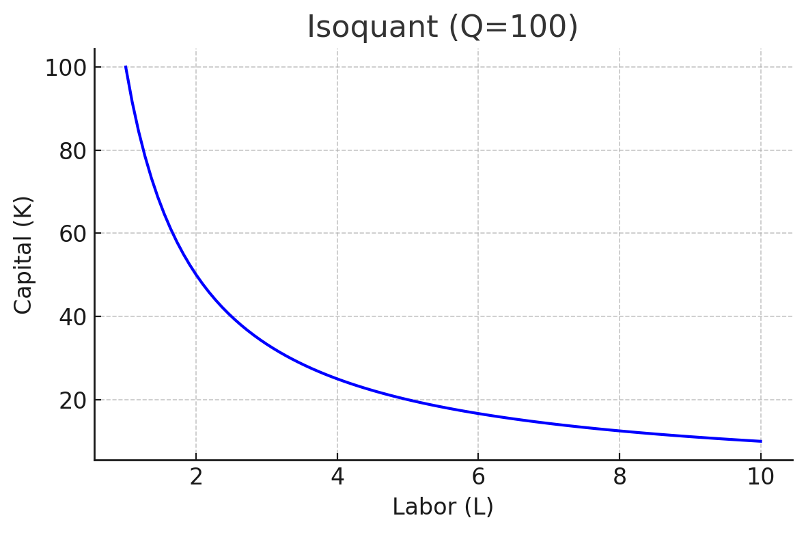

<style>
@media print{
  body, html, .remark-slides-area, .remark-notes-area {
    height: 100% !important;
    width: 100% !important;
    overflow: visible;
    display: inline-block;
    }
</style>

<style type="text/css">
.remark-slide-content {
    font-size: 34px;
    padding: 1em 4em 1em 4em;
}
</style>

<style type="text/css">
.my-one-page-font {
  font-size: 28px;
}
</style>

</style>

<style type="text/css">
.my-one-page-font-table {
  font-size: 24px;
}
</style>


```{r setup, include = FALSE}
library(tidyverse)
library(knitr)

opts_chunk$set(fig.width = 10, 
               message = FALSE, 
               warning = FALSE,
               echo = FALSE)
```

```{r xaringan-themer, include=FALSE, warning=FALSE}
#install.packages("xaringanthemer")
library(xaringanthemer)
style_mono_accent(
  base_color = "#1c5253",
  header_font_google = google_font("Josefin Sans"),
  text_font_google   = google_font("Montserrat", "500", "550i"),
  code_font_google   = google_font("Fira Mono"),
  colors = c(
  red = "#f34213",
  purple = "#3e2f5b",
  orange = "#ff8811",
  green = "#136f63",
  white = "#FFFFFF"
)
)
```

# Why It Matters in Economics & Business

In real economic environments, multiple inputs and variables affect production, utility, and costs. 

Understanding **how sensitive an output is to one specific input** (holding others constant) is key to making efficient decisions.

- Partial elasticities tell us **how responsive** an outcome is to one variable
- Marginal rates (MRCS and MRTS) help understand **trade-offs** in consumption and production
- Euler’s theorem gives a neat characterization of **returns to scale** for homogeneous production functions

This is foundational for microeconomic theory, cost analysis, and optimization problems.

Let's begin!

---


# Agenda  

1.  Functions of Several Variables (5.1)  

2. Class Activity

---

class: inverse, center, middle

# 1. Functions of Several Variables (5.1)

---


# Learning Objectives

- Calculate **partial elasticities**

- Calculate **marginal utilities** and **marginal products**

- Calculate the **marginal rate of commodity substitution** (MRCS)

- Calculate the **marginal rate of technical substitution** (MRTS)

- Understand **Euler's theorem** for homogeneous functions

---

# What is Partial Elasticity?

- **Partial elasticity** measures the percentage change in a function (e.g., output, utility) when **one variable changes**, holding the **other constant**.

### Formula:
If $z = f(x, y)$, then:
$$
E_x = \frac{\partial z}{\partial x} \cdot \frac{x}{z}, \quad E_y = \frac{\partial z}{\partial y} \cdot \frac{y}{z}
$$

---

# Example: Partial Elasticities
Let $Q = x^{0.5} y^{0.5}$

- $\frac{\partial Q}{\partial x} = 0.5x^{-0.5}y^{0.5}$
- $\frac{\partial Q}{\partial y} = 0.5x^{0.5}y^{-0.5}$

Then:
$$
E_x = 0.5x^{-0.5}y^{0.5} \cdot \frac{x}{x^{0.5}y^{0.5}} = 0.5, \quad E_y = 0.5
$$

Interpretation: **1% increase** in $x$ or $y$ increases $Q$ by **0.5%**.

---

# Marginal Utilities

If $U = f(x, y)$ is a utility function:
- $MU_x = \frac{\partial U}{\partial x}$
- $MU_y = \frac{\partial U}{\partial y}$

These represent the **extra utility** from consuming **one more unit** of good $x$ or $y$.

---

# Example: Marginal Utility
Let $U(x, y) = 2x + 3y$.

- $MU_x = 2$
- $MU_y = 3$

Interpretation: Utility increases by **2 units** for each extra unit of $x$, **3 units** for $y$.

---

# Marginal Product

If $Q = f(L, K)$ is a production function:
- $MP_L = \frac{\partial Q}{\partial L}$
- $MP_K = \frac{\partial Q}{\partial K}$

These are used in **firm decisions** about labor and capital inputs.

---

# Example: Marginal Product
Let $Q = 10L^{0.5}K^{0.5}$.
- $MP_L = 5L^{-0.5}K^{0.5}$
- $MP_K = 5L^{0.5}K^{-0.5}$

At $L=4$, $K=9$:
- $MP_L = 5 \cdot \frac{1}{2} \cdot 3 = 7.5$
- $MP_K = 5 \cdot 2 \cdot \frac{1}{3} = 3.33$

---

# Marginal Rate of Commodity Substitution (MRCS)

Rate a consumer substitutes $x$ for $y$ **keeping utility constant**:

$$
MRCS = \left| \frac{MU_x}{MU_y} \right|
$$

---

# Example: MRCS
Let $U(x, y) = x^{0.5}y^{0.5}$
- $MU_x = 0.5x^{-0.5}y^{0.5}$
- $MU_y = 0.5x^{0.5}y^{-0.5}$

Then:
$$
MRCS = \left| \frac{MU_x}{MU_y} \right| = \left| \frac{y}{x} \right|
$$

Interpretation: At $(x, y) = (2, 4)$, $MRCS = 2$. The consumer is willing to give up 2 units of $x$ for 1 more unit of $y$.

---

# Marginal Rate of Technical Substitution (MRTS)

In production:
$$
MRTS = \left| \frac{MP_L}{MP_K} \right|
$$

This tells how much capital can be replaced by labor without changing output.

---

# Visual: Isoquant and MRTS

<div style="text-align:center;">
  
</div>

It shows the **trade-off** between labor and capital while keeping output constant. The slope of the isoquant is the MRTS.
The steeper the slope, the more labor can be substituted for capital.

---

# Euler’s Theorem

Euler’s Theorem states that for a function $f(x, y)$ that is **homogeneous of degree n**:
- If $f(tx, ty) = t^n f(x, y)$ for all $t > 0$, then:
$$
f(x, y) = \frac{\partial f}{\partial x} \cdot x + \frac{\partial f}{\partial y} \cdot y
$$ 

Used in economic models with **returns to scale**.

---

# Practice Problems

1. Let $Q = x^{0.6}y^{0.4}$. Find $E_x$, $E_y$

2. For $U = 3x + 4y$, compute $MU_x$, $MU_y$, and MRCS

3. Let $Q = L^{0.7}K^{0.3}$, compute $MP_L$, $MP_K$, and MRTS at $L=2$, $K=3$

4. Verify Euler's theorem for $f(x, y) = x^2 + y^2$

---

class: my-one-page-font

# Problem # 4

### Verify Euler's theorem for $f(x, y) = x^2 + y^2$

We’ll verify Euler’s Theorem for the function:
$$
f(x, y) = x^2 + y^2
$$

#### Step 1: Homogeneity Check

Substitute $tx$ and $ty$ into $f$:

$$
f(tx, ty) = (tx)^2 + (ty)^2 = t^2x^2 + t^2y^2 = t^2(x^2 + y^2)
$$

So $f(x, y)$ is homogeneous of **degree 2**.

#### Step 2: Euler’s Theorem

Euler’s Theorem states:

If $f$ is homogeneous of degree $n$, then:
$$
f(x, y) = x \cdot f_x + y \cdot f_y
$$
For our case, $n = 2$.


---

class: my-one-page-font

# Problem # 4 (continued)

#### Step 3: Find the Partial Derivatives

$$
\frac{\partial f}{\partial x} = 2x, \quad \frac{\partial f}{\partial y} = 2y
$$

Substitute into Euler's identity:

$$
x \cdot 2x + y \cdot 2y = 2x^2 + 2y^2 = 2(x^2 + y^2) = 2f(x, y)
$$

Verified! Euler’s Theorem holds.

#### Interpretation: Returns to Scale

Since the function is homogeneous of **degree 2**, it exhibits:

**Increasing Returns to Scale**

> Doubling both inputs will **quadruple** the output.

This concept is used widely in:
- Production theory
- Utility and cost functions
- Growth models

???

# ✅ Practice Problem 1

### Let $Q = x^{0.6}y^{0.4}$. Find $E_x$, $E_y$:

**Step 1:**
\[ \frac{\partial Q}{\partial x} = 0.6x^{-0.4}y^{0.4}, \quad \frac{\partial Q}{\partial y} = 0.4x^{0.6}y^{-0.6} \]

**Step 2:**
\[ E_x = \frac{\partial Q}{\partial x} \cdot \frac{x}{Q} = 0.6, \quad E_y = 0.4 \]

✅ **Answer:** $E_x = 0.6$, $E_y = 0.4$


# ✅ Practice Problem 2

### Let $U = 3x + 4y$. Find $MU_x$, $MU_y$, MRCS

**Step 1:**
\[ MU_x = 3, \quad MU_y = 4 \]

**Step 2:**
\[ MRCS = \left| \frac{MU_x}{MU_y} \right| = \frac{3}{4} = 0.75 \]

✅ **Answer:** $MU_x = 3$, $MU_y = 4$, $MRCS = 0.75$


# ✅ Practice Problem 3

### Let $Q = L^{0.7}K^{0.3}$. Find $MP_L$, $MP_K$, MRTS at $L=2, K=3$

**Step 1:**
\[ MP_L = 0.7L^{-0.3}K^{0.3}, \quad MP_K = 0.3L^{0.7}K^{-0.7} \]

**Step 2:** Evaluate:
\[ MP_L \approx 0.789, \quad MP_K \approx 0.226 \]

**Step 3:**
\[ MRTS = \left| \frac{MP_L}{MP_K} \right| \approx 3.49 \]

✅ **Answer:** $MP_L \approx 0.789$, $MP_K \approx 0.226$, $MRTS \approx 3.49$


# ✅ Practice Problem 4

### Verify Euler’s Theorem for $f(x, y) = x^2 + y^2$

**Step 1:**
\[ f_x = 2x, \quad f_y = 2y \]

**Step 2:**
\[ x f_x + y f_y = 2x^2 + 2y^2 \]

**Step 3:**
\[ \text{Function is homogeneous of degree } 2 \Rightarrow 2f(x, y) = 2(x^2 + y^2) \]

✅ Euler’s Theorem holds.


---

# Summary

- Partial elasticities show **percentage responsiveness** to one variable

- Marginal utility/product: **sensitivity of outcome** to small changes

- MRCS and MRTS reflect **substitution** between inputs or goods

- Euler's theorem links **homogeneity and returns to scale**

---

class: inverse, center, middle

# 2. Group Activity: Marginal Thinking in Real Life

---

# Group Activity: Marginal Thinking in Real Life

### Instructions
- Form **4 groups** of **4 students**.

- Each group receives a different scenario.

- Use concepts from **partial elasticity**, **marginal utility/product**, and **MRTS/MRCS** to answer.

- Prepare a **2-minute explanation**.

---

### Group Scenarios

#### Group 1 – Production Line
A factory uses labor and capital to produce widgets:
- $Q = L^{0.6}K^{0.4}$
- Evaluate $MP_L$ and $MP_K$ at $L = 5$, $K = 5$
- What is the MRTS? What does it mean for the factory?

#### Group 2 – Consumer Behavior
A consumer has utility function $U(x, y) = 2x + 3y$
- Find $MU_x$, $MU_y$, and MRCS
- If the consumer gives up 1 unit of $y$, how much $x$ do they need to maintain utility?

---

### Group Scenarios (continued)

#### Group 3 – Elastic Demand
A firm's revenue depends on two prices:
- $R = p_1^{0.7}p_2^{0.3}$
- Compute partial elasticities with respect to $p_1$ and $p_2$
- Which price affects revenue more? How should the firm respond?

#### Group 4 – Policy Maker
A government economist analyzes GDP:
- $Y = C^{0.8}I^{0.2}$
- Compute $E_C$, $E_I$
- If investment falls, can consumption make up for it?

???


# ✅ Group 1 – Production Line

**Function:** \( Q = L^{0.6}K^{0.4} \), with \( L = 5 \), \( K = 5 \)

- \( MP_L = 0.6L^{-0.4}K^{0.4} = 0.6 \)
- \( MP_K = 0.4L^{0.6}K^{-0.6} = 0.4 \)
- \( MRTS = \left| \frac{MP_L}{MP_K} \right| = \frac{0.6}{0.4} = 1.5 \)

**Interpretation:**
The firm can give up 1 unit of labor for 1.5 units of capital while maintaining output.


# ✅ Group 2 – Consumer Behavior

**Utility:** \( U(x, y) = 2x + 3y \)

- \( MU_x = 2, \quad MU_y = 3 \)
- \( MRCS = \left| \frac{MU_x}{MU_y} \right| = \frac{2}{3} \)
- Giving up 1 unit of \( y \) requires \( 1.5 \) units of \( x \) to keep utility constant.


# ✅ Group 3 – Elastic Demand

**Revenue Function:** \( R = p_1^{0.7}p_2^{0.3} \)

- \( E_{p_1} = 0.7 \), \( E_{p_2} = 0.3 \)

**Interpretation:**
Revenue is more sensitive to \( p_1 \) than \( p_2 \). The firm should prioritize pricing strategy around \( p_1 \).

# ✅ Group 4 – Policy Maker

**GDP Function:** \( Y = C^{0.8}I^{0.2} \)

- \( E_C = 0.8 \), \( E_I = 0.2 \)

**Interpretation:**
Consumption drives GDP more than investment. If investment falls, consumption can **partially** compensate but not fully due to elasticity.


---

### Debrief Questions (for all groups)
1. Which input had the largest marginal effect?

2. Were the substitution rates intuitive?

3. How can these results help in **decision-making**?

---

class: inverse, center, middle

# Any QUESTIONS?

## Thank you for your attention!

---

## Next Classes

- (May 7) Comparative Statics (5.3) 


???
1. To print pdf slides
https://stackoverflow.com/questions/54968311/xaringan-export-slides-to-pdf-while-preserving-formatting

pagedown::chrome_print("W1_ME.html") # but not all pictures are visible

2. Option: https://stackoverflow.com/questions/54968311/xaringan-export-slides-to-pdf-while-preserving-formatting

install.packages("remotes")
remotes::install_github("jhelvy/xaringanBuilder")
remotes::install_github("jhelvy/renderthis@v0.0.9")

library(xaringanBuilder)
build_pdf("DVC.html")

3. Option
writeBin(as.raw(c()), "favicon.ico") # create an empty favicon.ico file
install.packages("renderthis")
remotes::install_github('rstudio/chromote')
library(renderthis)

renderthis::to_pdf("W9_2_ME.html")

getwd()
setwd("C:/Users/Iegor/OneDrive - kdis.ac.kr/Documents/GitHub/Sogang/2025/Spring/Mathematical Economics/Week 9_2")
